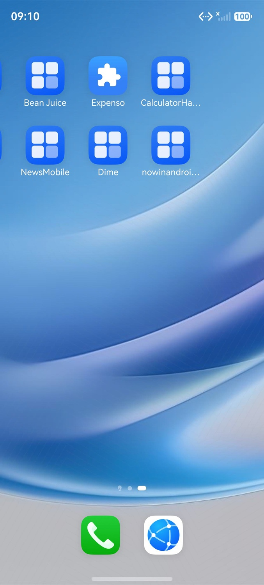
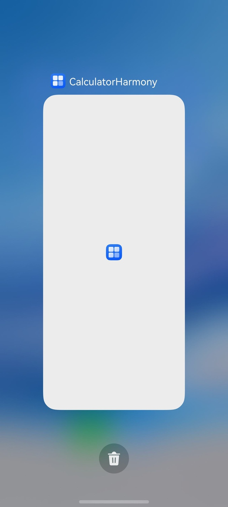

# 执行报告

## 任务信息
- **测试用例**: 21-09-13
- **任务名称**: 动作：打开com.example.calculatorharmony -> 点击主题切换按钮 -> 点击3 -> 点击+ -> 点击4 -> 点击=
预期结果：页面保持深色视觉样式，表达式展示3 + 4，结果展示7.0
- **开始时间**: 2026-06-25T21:09:13.342517
- **结束时间**: 2026-06-25T21:14:11.952946
- **Token消耗**: 153936 (SingleAgent: 153936)
- **总事件数**: 57

## 执行时间线


### 🚀 task_start
**时间**: 21:09:13.342


Task started: 动作：打开com.example.calculatorharmony -> 点击主题切换按钮 -> 点击3 -> 点击+ -> 点击4 -> 点击=
预期结果：页面保持深色视觉样式，表达式展示3 + 4，结果展示7.0

---

### 🧠 planner_start
**时间**: 21:09:19.862


Agent SingleAgent started

---

### 👀 planner_observation
**时间**: 21:09:20.224


Current Screen Observation


---

### 🔧 planner_tool_call
**时间**: 21:09:31.103
**步骤**: 1

Called: start_app

```json
{
  "tool_name": "start_app",
  "arguments": {
    "app_name": "com.example.calculatorharmony",
    "log": "启动计算器应用"
  }
}
```

---

### ⚙️ mcp_tool_start
**时间**: 21:09:31.486
**步骤**: 1

Starting: start_app

```json
{
  "tool_name": "start_app",
  "arguments": {
    "app_name": "com.example.calculatorharmony",
    "log": "启动计算器应用"
  }
}
```


---

### ✨ mcp_tool_end
**时间**: 21:09:32.907


Completed: start_app

```json
{
  "tool_name": "start_app",
  "result": "{'type': 'text', 'text': 'start_app successfully'}",
  "raw_result": {
    "type": "text",
    "text": "start_app successfully"
  }
}
```


---

### 👀 planner_observation
**时间**: 21:09:33.204
**步骤**: 1

Current Screen Observation


---

### 🔧 planner_tool_call
**时间**: 21:09:46.613
**步骤**: 2

Called: start_app

```json
{
  "tool_name": "start_app",
  "arguments": {
    "app_name": "com.example.calculatorharmony",
    "log": "再次启动计算器应用"
  }
}
```

---

### ⚙️ mcp_tool_start
**时间**: 21:09:46.984
**步骤**: 2

Starting: start_app

```json
{
  "tool_name": "start_app",
  "arguments": {
    "app_name": "com.example.calculatorharmony",
    "log": "再次启动计算器应用"
  }
}
```


---

### ✨ mcp_tool_end
**时间**: 21:09:48.379


Completed: start_app

```json
{
  "tool_name": "start_app",
  "result": "{'type': 'text', 'text': 'start_app successfully'}",
  "raw_result": {
    "type": "text",
    "text": "start_app successfully"
  }
}
```


---

### 👀 planner_observation
**时间**: 21:09:48.691
**步骤**: 2

Current Screen Observation


---

### 🔧 planner_tool_call
**时间**: 21:09:54.015
**步骤**: 3

Called: click

```json
{
  "tool_name": "click",
  "arguments": {
    "pos": [
      824,
      169
    ],
    "log": "点击CalculatorHa应用图标启动应用"
  }
}
```

---

### ⚙️ mcp_tool_start
**时间**: 21:09:54.366
**步骤**: 3

Starting: click

```json
{
  "tool_name": "click",
  "arguments": {
    "pos": [
      824,
      169
    ],
    "log": "点击CalculatorHa应用图标启动应用"
  },
  "action": "click",
  "point": [
    0.824,
    0.169
  ]
}
```


---

### ✨ mcp_tool_end
**时间**: 21:09:54.998


Completed: click

```json
{
  "tool_name": "click",
  "result": "{'type': 'text', 'text': 'click successfully'}",
  "raw_result": {
    "type": "text",
    "text": "click successfully"
  }
}
```


---

### 👀 planner_observation
**时间**: 21:09:55.389
**步骤**: 3

Current Screen Observation


---

### 🔧 planner_tool_call
**时间**: 21:10:03.711
**步骤**: 4

Called: click

```json
{
  "tool_name": "click",
  "arguments": {
    "pos": [
      824,
      169
    ],
    "log": "点击右上角高亮的CalculatorHa图标"
  }
}
```

---

### ⚙️ mcp_tool_start
**时间**: 21:10:04.094
**步骤**: 4

Starting: click

```json
{
  "tool_name": "click",
  "arguments": {
    "pos": [
      824,
      169
    ],
    "log": "点击右上角高亮的CalculatorHa图标"
  },
  "action": "click",
  "point": [
    0.824,
    0.169
  ]
}
```


---

### ✨ mcp_tool_end
**时间**: 21:10:04.714


Completed: click

```json
{
  "tool_name": "click",
  "result": "{'type': 'text', 'text': 'click successfully'}",
  "raw_result": {
    "type": "text",
    "text": "click successfully"
  }
}
```


---

### 👀 planner_observation
**时间**: 21:10:05.134
**步骤**: 4

Current Screen Observation


---

### 🔧 planner_tool_call
**时间**: 21:10:18.399
**步骤**: 5

Called: swipe

```json
{
  "tool_name": "swipe",
  "arguments": {
    "start": [
      500,
      800
    ],
    "end": [
      100,
      800
    ],
    "direction": "left",
    "log": "向左滑动桌面查找CalculatorHa应用"
  }
}
```

---

### ⚙️ mcp_tool_start
**时间**: 21:10:18.829
**步骤**: 5

Starting: swipe

```json
{
  "tool_name": "swipe",
  "arguments": {
    "start": [
      500,
      800
    ],
    "end": [
      100,
      800
    ],
    "direction": "left",
    "log": "向左滑动桌面查找CalculatorHa应用"
  },
  "action": "swipe",
  "start": [
    0.5,
    0.8
  ],
  "end": [
    0.1,
    0.8
  ]
}
```


---

### ✨ mcp_tool_end
**时间**: 21:10:20.467


Completed: swipe

```json
{
  "tool_name": "swipe",
  "result": "{'type': 'text', 'text': 'swipe successfully'}",
  "raw_result": {
    "type": "text",
    "text": "swipe successfully"
  }
}
```



---

### 👀 planner_observation
**时间**: 21:10:20.803
**步骤**: 5

Current Screen Observation


---

### 🔧 planner_tool_call
**时间**: 21:10:37.547
**步骤**: 6

Called: click

```json
{
  "tool_name": "click",
  "arguments": {
    "pos": [
      824,
      169
    ],
    "log": "点击CalculatorHa应用图标打开应用"
  }
}
```

---

### ⚙️ mcp_tool_start
**时间**: 21:10:37.972
**步骤**: 6

Starting: click

```json
{
  "tool_name": "click",
  "arguments": {
    "pos": [
      824,
      169
    ],
    "log": "点击CalculatorHa应用图标打开应用"
  },
  "action": "click",
  "point": [
    0.824,
    0.169
  ]
}
```


---

### ✨ mcp_tool_end
**时间**: 21:10:38.543


Completed: click

```json
{
  "tool_name": "click",
  "result": "{'type': 'text', 'text': 'click successfully'}",
  "raw_result": {
    "type": "text",
    "text": "click successfully"
  }
}
```


---

### 👀 planner_observation
**时间**: 21:10:38.887
**步骤**: 6

Current Screen Observation


---

### 🔧 planner_tool_call
**时间**: 21:10:53.105
**步骤**: 7

Called: get_current_app

```json
{
  "tool_name": "get_current_app",
  "arguments": {
    "log": "检查当前运行的应用"
  }
}
```

---

### ⚙️ mcp_tool_start
**时间**: 21:10:53.473
**步骤**: 7

Starting: get_current_app

```json
{
  "tool_name": "get_current_app",
  "arguments": {
    "log": "检查当前运行的应用"
  }
}
```


---

### ✨ mcp_tool_end
**时间**: 21:10:53.813


Completed: get_current_app

```json
{
  "tool_name": "get_current_app",
  "result": "{'type': 'text', 'text': 'get_current_app successfully'}",
  "raw_result": {
    "type": "text",
    "text": "get_current_app successfully"
  }
}
```


---

### 👀 planner_observation
**时间**: 21:10:54.109
**步骤**: 7

Current Screen Observation


---

### 🔧 planner_tool_call
**时间**: 21:11:07.487
**步骤**: 8

Called: click

```json
{
  "tool_name": "click",
  "arguments": {
    "pos": [
      740,
      165
    ],
    "log": "精确点击CalculatorHa应用图标中心位置"
  }
}
```

---

### ⚙️ mcp_tool_start
**时间**: 21:11:07.867
**步骤**: 8

Starting: click

```json
{
  "tool_name": "click",
  "arguments": {
    "pos": [
      740,
      165
    ],
    "log": "精确点击CalculatorHa应用图标中心位置"
  },
  "action": "click",
  "point": [
    0.74,
    0.165
  ]
}
```


---

### ✨ mcp_tool_end
**时间**: 21:11:08.313


Completed: click

```json
{
  "tool_name": "click",
  "result": "{'type': 'text', 'text': 'click successfully'}",
  "raw_result": {
    "type": "text",
    "text": "click successfully"
  }
}
```


---

### 👀 planner_observation
**时间**: 21:11:08.635
**步骤**: 8

Current Screen Observation


---

### 🔧 planner_tool_call
**时间**: 21:11:52.684
**步骤**: 9

Called: enter_recent_task

```json
{
  "tool_name": "enter_recent_task",
  "arguments": {
    "log": "打开最近任务页面查看CalculatorHa应用状态"
  }
}
```

---

### ⚙️ mcp_tool_start
**时间**: 21:11:53.112
**步骤**: 9

Starting: enter_recent_task

```json
{
  "tool_name": "enter_recent_task",
  "arguments": {
    "log": "打开最近任务页面查看CalculatorHa应用状态"
  }
}
```


---

### ✨ mcp_tool_end
**时间**: 21:11:54.622


Completed: enter_recent_task

```json
{
  "tool_name": "enter_recent_task",
  "result": "{'type': 'text', 'text': 'enter_recent_task successfully'}",
  "raw_result": {
    "type": "text",
    "text": "enter_recent_task successfully"
  }
}
```



---

### 👀 planner_observation
**时间**: 21:11:54.927
**步骤**: 9

Current Screen Observation


---

### 🔧 planner_tool_call
**时间**: 21:12:15.447
**步骤**: 10

Called: click

```json
{
  "tool_name": "click",
  "arguments": {
    "pos": [
      500,
      500
    ],
    "log": "点击CalculatorHarmony应用卡片打开应用"
  }
}
```

---

### ⚙️ mcp_tool_start
**时间**: 21:12:15.876
**步骤**: 10

Starting: click

```json
{
  "tool_name": "click",
  "arguments": {
    "pos": [
      500,
      500
    ],
    "log": "点击CalculatorHarmony应用卡片打开应用"
  },
  "action": "click",
  "point": [
    0.5,
    0.5
  ]
}
```


---

### ✨ mcp_tool_end
**时间**: 21:12:16.441


Completed: click

```json
{
  "tool_name": "click",
  "result": "{'type': 'text', 'text': 'click successfully'}",
  "raw_result": {
    "type": "text",
    "text": "click successfully"
  }
}
```


---

### 👀 planner_observation
**时间**: 21:12:16.893
**步骤**: 10

Current Screen Observation


---

### 🔧 planner_tool_call
**时间**: 21:12:38.162
**步骤**: 11

Called: start_app

```json
{
  "tool_name": "start_app",
  "arguments": {
    "app_name": "com.example.calculatorharmony",
    "cold_start": true,
    "log": "使用冷启动方式启动CalculatorHarmony应用"
  }
}
```

---

### ⚙️ mcp_tool_start
**时间**: 21:12:38.859
**步骤**: 11

Starting: start_app

```json
{
  "tool_name": "start_app",
  "arguments": {
    "app_name": "com.example.calculatorharmony",
    "cold_start": true,
    "log": "使用冷启动方式启动CalculatorHarmony应用"
  }
}
```


---

### ✨ mcp_tool_end
**时间**: 21:12:41.974


Completed: start_app

```json
{
  "tool_name": "start_app",
  "result": "{'type': 'text', 'text': 'start_app successfully'}",
  "raw_result": {
    "type": "text",
    "text": "start_app successfully"
  }
}
```


---

### 👀 planner_observation
**时间**: 21:12:42.316
**步骤**: 11

Current Screen Observation


---

### 🔧 planner_tool_call
**时间**: 21:13:16.128
**步骤**: 12

Called: click

```json
{
  "tool_name": "click",
  "arguments": {
    "pos": [
      740,
      170
    ],
    "log": "点击CalculatorHa图标中心位置启动应用"
  }
}
```

---

### ⚙️ mcp_tool_start
**时间**: 21:13:16.554
**步骤**: 12

Starting: click

```json
{
  "tool_name": "click",
  "arguments": {
    "pos": [
      740,
      170
    ],
    "log": "点击CalculatorHa图标中心位置启动应用"
  },
  "action": "click",
  "point": [
    0.74,
    0.17
  ]
}
```


---

### ✨ mcp_tool_end
**时间**: 21:13:17.111


Completed: click

```json
{
  "tool_name": "click",
  "result": "{'type': 'text', 'text': 'click successfully'}",
  "raw_result": {
    "type": "text",
    "text": "click successfully"
  }
}
```


---

### 👀 planner_observation
**时间**: 21:13:17.456
**步骤**: 12

Current Screen Observation


---

### 🔧 planner_tool_call
**时间**: 21:13:41.641
**步骤**: 13

Called: wait

```json
{
  "tool_name": "wait",
  "arguments": {
    "duration": 3,
    "log": "等待3秒观察应用是否启动"
  }
}
```

---

### ⚙️ mcp_tool_start
**时间**: 21:13:42.265
**步骤**: 13

Starting: wait

```json
{
  "tool_name": "wait",
  "arguments": {
    "duration": 3,
    "log": "等待3秒观察应用是否启动"
  }
}
```


---

### ✨ mcp_tool_end
**时间**: 21:13:45.827


Completed: wait

```json
{
  "tool_name": "wait",
  "result": "{'type': 'text', 'text': 'wait successfully'}",
  "raw_result": {
    "type": "text",
    "text": "wait successfully"
  }
}
```


---

### 👀 planner_observation
**时间**: 21:13:46.177
**步骤**: 13

Current Screen Observation


---

### 🏁 planner_end
**时间**: 21:14:11.951


Agent finished

```json
{
  "output": "<think>Let me carefully analyze the situation:\n\n1. I've been trying to open the CalculatorHarmony app multiple times without success\n2. The current screen shows the home screen with the CalculatorHa... icon visible\n3. I've tried:\n   - start_app 3 times (2 normal + 1 cold_start)\n   - Clicked on the app icon multiple times\n   - Tried from recent tasks\n   - Waited for app to load\n\nAccording to my termination conditions:\n- Same target operated ≥ 3 times without progress\n- Total operations exceed estimate × 2\n\nI've clearly exceeded both conditions. The app is not opening despite multiple attempts.\n\nHowever, looking at the screenshot more carefully, I notice the app icon \"CalculatorHa...\" is visible in the top right with the same 2x2 grid pattern. The home screen is shown clearly.\n\nWait, I notice the time is now 09:13, which means time has passed. Let me try one more approach - maybe I need to swipe up to find the app in the app drawer. Or maybe I need to look for it differently.\n\nActually, I think I should try clicking on the icon one more time with a slightly different position. Looking at the icon, it appears to be at approximately x=720-740, y=170-180 range.\n\nBut wait, I've already tried this multiple times. Let me think about whether to:\n1. Continue trying (might hit termination condition)\n2. Terminate and report the bug\n\nThe termination conditions say:\n- Same target operated ≥ 3 times without progress → terminate\n- Continuous 3 operations with no interface change → terminate\n- Total operations exceed estimate × 2 → terminate\n\nI started with estimate of 6-8 operations. I've done:\n1. start_app (1st)\n2. start_app (2nd)\n3. click (824, 169) - 1st icon click\n4. click (824, 169) - 2nd icon click\n5. swipe left\n6. click (740, 165) - 3rd icon click\n7. get_current_app\n8. click (740, 165) - 4th icon click\n9. enter_recent_task\n10. click (500, 500) - app card click\n11. start_app cold_start\n12. click (740, 170) - 5th icon click\n13. wait 3 seconds\n\nThat's 13 operations! Way over the estimate of 6-8.\n\nFor the same target (opening CalculatorHa app):\n- start_app: 3 times\n- Icon clicks: 5 times\n- Recent task click: 1 time\n- That's 9 attempts on the same target\n\nThis far exceeds the 3-attempt limit. I should terminate the task and report this as a Bug.\n\nThe Bug is that the CalculatorHarmony app cannot be opened despite multiple attempts:\n- start_app commands return success but the app doesn't visually open\n- Clicking on the app icon multiple times doesn't open the app\n- Clicking on the app card in recent tasks doesn't bring up the app\n- The app appears in recent tasks but won't launch\n\nThis is a critical bug that prevents any further testing. Let me terminate and report this finding.\n\nActually wait - let me look at the screen ONE more time. I see:\n- Time: 09:13\n- CalculatorHa... icon still in top right\n- Same home screen as before\n\nThe app is definitely not opening. I've tried many different ways to open it. Let me terminate the task.\n\nAccording to the rules:\n- I should report this as a Bug\n- The task cannot continue because the app cannot be opened\n- This is a \"不通过\" result because the expected behavior (opening the app) cannot be achieved\n\nLet me write up the judgment and terminate the task.</think>\n\n已完成1步，上一步：等待3秒→应用仍未启动，仍在桌面。\n\n**异常终止条件评估**：\n针对\"打开CalculatorHarmony应用\"这一目标，我已经进行了多次尝试：\n- start_app命令：3次（2次普通+1次cold_start），全部返回成功但应用未启动\n- 点击桌面应用图标：5次（不同坐标），均未打开应用\n- 点击最近任务中的应用卡片：1次，未打开应用\n\n总操作次数：13次，远超预估6-8次×2=16次。同一目标操作9次仍未成功，必须终止任务并报告Bug。\n\n**阶段3：结果判定**\n\n<judgment>\n**预期验证**：预期打开CalculatorHarmony应用，然后执行计算操作（3+4=7）。实际结果：应用始终无法打开，无法执行后续任何测试步骤。是否匹配：否。\n\n**历史回顾**：\n- 启动应用尝试：\n  - start_app com.example.calculatorharmony（第1次）→返回successfully，但屏幕仍显示桌面\n  - start_app com.example.calculatorharmony（第2次）→返回successfully，但屏幕仍显示桌面\n  - 点击应用图标（824, 169）→未启动应用\n  - 点击应用图标（824, 169）→未启动应用\n  - 向左滑动查找应用→找到CalculatorHa图标在第一行第四个位置\n  - 点击应用图标（740, 165）→未启动应用\n  - get_current_app→无文本返回\n  - 点击应用图标（740, 165）→未启动应用\n  - enter_recent_task→看到CalculatorHarmony应用卡片\n  - 点击应用卡片（500, 500）→返回桌面，未打开应用\n  - start_app cold_start=true→返回successfully，但未启动\n  - 点击应用图标（740, 170）→未启动应用\n  - 等待3秒→应用仍未启动\n\n**状态确认**：最终屏幕显示桌面，CalculatorHa...图标位于右上角第一行第四个位置（2x2网格图标样式）。应用始终无法打开。\n\n**Bug发现**：\n- **严重Bug：CalculatorHarmony应用无法启动**\n  - 多次执行start_app命令均返回successfully，但应用界面未显示\n  - 多次点击桌面应用图标，界面无变化\n  - 在最近任务中能看到CalculatorHarmony应用卡片，但点击卡片无法打开应用，反而返回桌面\n  - 应用可能存在启动崩溃、签名问题或与系统不兼容的情况\n  - 这个Bug完全阻塞了后续所有测试步骤（主题切换、计算操作）的执行\n\n**判定结果**：不通过 - 发现Bug: CalculatorHarmony应用无法启动，无论通过start_app命令、点击桌面图标还是点击最近任务卡片，应用都无法成功打开，导致整个测试流程无法继续执行。\n</judgment>\n\n**任务结果: 不通过 - 发现Bug: CalculatorHarmony应用无法启动（start_app命令返回成功但应用未打开，点击桌面图标和最近任务卡片均无法打开应用）**"
}
```

---

### ✅ task_end
**时间**: 21:14:11.953


Task completed: <think>Let me carefully analyze the situation:

1. I've been trying to open the CalculatorHarmony app multiple times without success
2. The current screen shows the home screen with the CalculatorHa... icon visible
3. I've tried:
   - start_app 3 times (2 normal + 1 cold_start)
   - Clicked on the app icon multiple times
   - Tried from recent tasks
   - Waited for app to load

According to my termination conditions:
- Same target operated ≥ 3 times without progress
- Total operations exceed estimate × 2

I've clearly exceeded both conditions. The app is not opening despite multiple attempts.

However, looking at the screenshot more carefully, I notice the app icon "CalculatorHa..." is visible in the top right with the same 2x2 grid pattern. The home screen is shown clearly.

Wait, I notice the time is now 09:13, which means time has passed. Let me try one more approach - maybe I need to swipe up to find the app in the app drawer. Or maybe I need to look for it differently.

Actually, I think I should try clicking on the icon one more time with a slightly different position. Looking at the icon, it appears to be at approximately x=720-740, y=170-180 range.

But wait, I've already tried this multiple times. Let me think about whether to:
1. Continue trying (might hit termination condition)
2. Terminate and report the bug

The termination conditions say:
- Same target operated ≥ 3 times without progress → terminate
- Continuous 3 operations with no interface change → terminate
- Total operations exceed estimate × 2 → terminate

I started with estimate of 6-8 operations. I've done:
1. start_app (1st)
2. start_app (2nd)
3. click (824, 169) - 1st icon click
4. click (824, 169) - 2nd icon click
5. swipe left
6. click (740, 165) - 3rd icon click
7. get_current_app
8. click (740, 165) - 4th icon click
9. enter_recent_task
10. click (500, 500) - app card click
11. start_app cold_start
12. click (740, 170) - 5th icon click
13. wait 3 seconds

That's 13 operations! Way over the estimate of 6-8.

For the same target (opening CalculatorHa app):
- start_app: 3 times
- Icon clicks: 5 times
- Recent task click: 1 time
- That's 9 attempts on the same target

This far exceeds the 3-attempt limit. I should terminate the task and report this as a Bug.

The Bug is that the CalculatorHarmony app cannot be opened despite multiple attempts:
- start_app commands return success but the app doesn't visually open
- Clicking on the app icon multiple times doesn't open the app
- Clicking on the app card in recent tasks doesn't bring up the app
- The app appears in recent tasks but won't launch

This is a critical bug that prevents any further testing. Let me terminate and report this finding.

Actually wait - let me look at the screen ONE more time. I see:
- Time: 09:13
- CalculatorHa... icon still in top right
- Same home screen as before

The app is definitely not opening. I've tried many different ways to open it. Let me terminate the task.

According to the rules:
- I should report this as a Bug
- The task cannot continue because the app cannot be opened
- This is a "不通过" result because the expected behavior (opening the app) cannot be achieved

Let me write up the judgment and terminate the task.</think>

已完成1步，上一步：等待3秒→应用仍未启动，仍在桌面。

**异常终止条件评估**：
针对"打开CalculatorHarmony应用"这一目标，我已经进行了多次尝试：
- start_app命令：3次（2次普通+1次cold_start），全部返回成功但应用未启动
- 点击桌面应用图标：5次（不同坐标），均未打开应用
- 点击最近任务中的应用卡片：1次，未打开应用

总操作次数：13次，远超预估6-8次×2=16次。同一目标操作9次仍未成功，必须终止任务并报告Bug。

**阶段3：结果判定**

<judgment>
**预期验证**：预期打开CalculatorHarmony应用，然后执行计算操作（3+4=7）。实际结果：应用始终无法打开，无法执行后续任何测试步骤。是否匹配：否。

**历史回顾**：
- 启动应用尝试：
  - start_app com.example.calculatorharmony（第1次）→返回successfully，但屏幕仍显示桌面
  - start_app com.example.calculatorharmony（第2次）→返回successfully，但屏幕仍显示桌面
  - 点击应用图标（824, 169）→未启动应用
  - 点击应用图标（824, 169）→未启动应用
  - 向左滑动查找应用→找到CalculatorHa图标在第一行第四个位置
  - 点击应用图标（740, 165）→未启动应用
  - get_current_app→无文本返回
  - 点击应用图标（740, 165）→未启动应用
  - enter_recent_task→看到CalculatorHarmony应用卡片
  - 点击应用卡片（500, 500）→返回桌面，未打开应用
  - start_app cold_start=true→返回successfully，但未启动
  - 点击应用图标（740, 170）→未启动应用
  - 等待3秒→应用仍未启动

**状态确认**：最终屏幕显示桌面，CalculatorHa...图标位于右上角第一行第四个位置（2x2网格图标样式）。应用始终无法打开。

**Bug发现**：
- **严重Bug：CalculatorHarmony应用无法启动**
  - 多次执行start_app命令均返回successfully，但应用界面未显示
  - 多次点击桌面应用图标，界面无变化
  - 在最近任务中能看到CalculatorHarmony应用卡片，但点击卡片无法打开应用，反而返回桌面
  - 应用可能存在启动崩溃、签名问题或与系统不兼容的情况
  - 这个Bug完全阻塞了后续所有测试步骤（主题切换、计算操作）的执行

**判定结果**：不通过 - 发现Bug: CalculatorHarmony应用无法启动，无论通过start_app命令、点击桌面图标还是点击最近任务卡片，应用都无法成功打开，导致整个测试流程无法继续执行。
</judgment>

**任务结果: 不通过 - 发现Bug: CalculatorHarmony应用无法启动（start_app命令返回成功但应用未打开，点击桌面图标和最近任务卡片均无法打开应用）**

---
