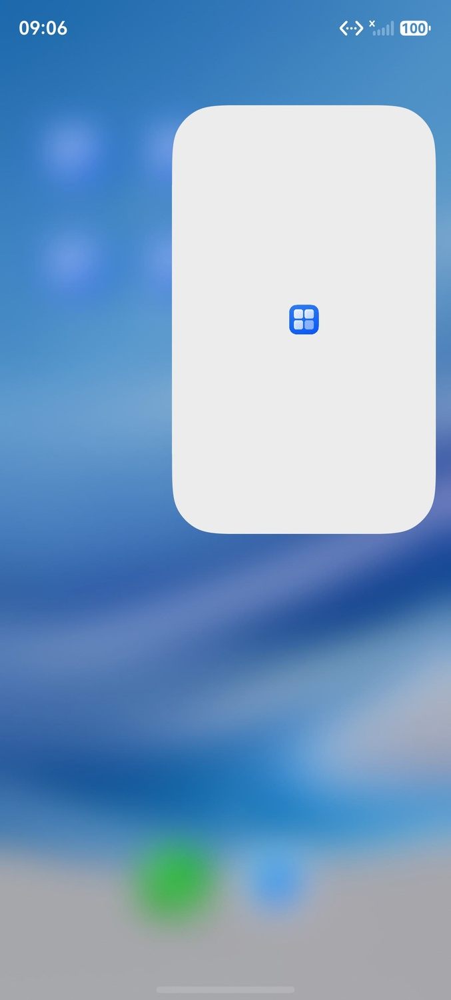
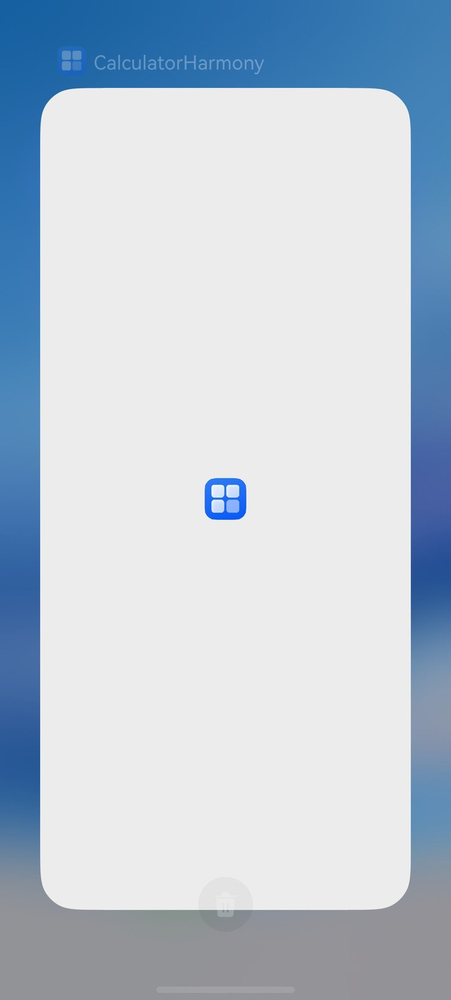
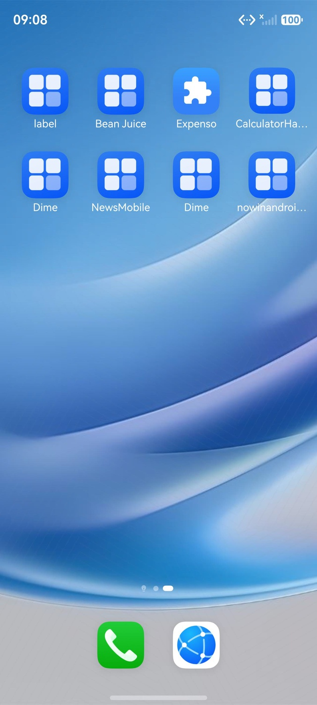

# 执行报告

## 任务信息
- **测试用例**: 21-05-41
- **任务名称**: 动作：打开com.example.calculatorharmony -> 点击7 -> 点击主题切换按钮
预期结果：页面切换为深色视觉样式，当前输入7仍然保留
- **开始时间**: 2026-06-25T21:05:41.781715
- **结束时间**: 2026-06-25T21:09:12.113755
- **Token消耗**: 140400 (SingleAgent: 140400)
- **总事件数**: 45

## 执行时间线


### 🚀 task_start
**时间**: 21:05:41.781


Task started: 动作：打开com.example.calculatorharmony -> 点击7 -> 点击主题切换按钮
预期结果：页面切换为深色视觉样式，当前输入7仍然保留

---

### 🧠 planner_start
**时间**: 21:05:48.319


Agent SingleAgent started

---

### 👀 planner_observation
**时间**: 21:05:48.651


Current Screen Observation


---

### 🔧 planner_tool_call
**时间**: 21:05:54.205
**步骤**: 1

Called: start_app

```json
{
  "tool_name": "start_app",
  "arguments": {
    "app_name": "com.example.calculatorharmony",
    "log": "打开计算器应用"
  }
}
```

---

### ⚙️ mcp_tool_start
**时间**: 21:05:54.550
**步骤**: 1

Starting: start_app

```json
{
  "tool_name": "start_app",
  "arguments": {
    "app_name": "com.example.calculatorharmony",
    "log": "打开计算器应用"
  }
}
```


---

### ✨ mcp_tool_end
**时间**: 21:05:55.994


Completed: start_app

```json
{
  "tool_name": "start_app",
  "result": "{'type': 'text', 'text': 'start_app successfully'}",
  "raw_result": {
    "type": "text",
    "text": "start_app successfully"
  }
}
```


---

### 👀 planner_observation
**时间**: 21:05:56.296
**步骤**: 1

Current Screen Observation


---

### 🔧 planner_tool_call
**时间**: 21:06:02.436
**步骤**: 2

Called: click

```json
{
  "tool_name": "click",
  "arguments": {
    "pos": [
      848,
      133
    ],
    "log": "点击桌面上的CalculatorHa应用图标"
  }
}
```

---

### ⚙️ mcp_tool_start
**时间**: 21:06:02.814
**步骤**: 2

Starting: click

```json
{
  "tool_name": "click",
  "arguments": {
    "pos": [
      848,
      133
    ],
    "log": "点击桌面上的CalculatorHa应用图标"
  },
  "action": "click",
  "point": [
    0.848,
    0.133
  ]
}
```


---

### ✨ mcp_tool_end
**时间**: 21:06:03.406


Completed: click

```json
{
  "tool_name": "click",
  "result": "{'type': 'text', 'text': 'click successfully'}",
  "raw_result": {
    "type": "text",
    "text": "click successfully"
  }
}
```



---

### 👀 planner_observation
**时间**: 21:06:03.759
**步骤**: 2

Current Screen Observation


---

### 🔧 planner_tool_call
**时间**: 21:06:09.124
**步骤**: 3

Called: wait

```json
{
  "tool_name": "wait",
  "arguments": {
    "duration": 2,
    "log": "等待应用启动"
  }
}
```

---

### ⚙️ mcp_tool_start
**时间**: 21:06:09.495
**步骤**: 3

Starting: wait

```json
{
  "tool_name": "wait",
  "arguments": {
    "duration": 2,
    "log": "等待应用启动"
  }
}
```


---

### ✨ mcp_tool_end
**时间**: 21:06:11.817


Completed: wait

```json
{
  "tool_name": "wait",
  "result": "{'type': 'text', 'text': 'wait successfully'}",
  "raw_result": {
    "type": "text",
    "text": "wait successfully"
  }
}
```


---

### 👀 planner_observation
**时间**: 21:06:12.106
**步骤**: 3

Current Screen Observation


---

### 🔧 planner_tool_call
**时间**: 21:06:16.808
**步骤**: 4

Called: click

```json
{
  "tool_name": "click",
  "arguments": {
    "pos": [
      815,
      170
    ],
    "log": "点击桌面上的CalculatorHa应用图标"
  }
}
```

---

### ⚙️ mcp_tool_start
**时间**: 21:06:17.222
**步骤**: 4

Starting: click

```json
{
  "tool_name": "click",
  "arguments": {
    "pos": [
      815,
      170
    ],
    "log": "点击桌面上的CalculatorHa应用图标"
  },
  "action": "click",
  "point": [
    0.815,
    0.17
  ]
}
```


---

### ✨ mcp_tool_end
**时间**: 21:06:17.857


Completed: click

```json
{
  "tool_name": "click",
  "result": "{'type': 'text', 'text': 'click successfully'}",
  "raw_result": {
    "type": "text",
    "text": "click successfully"
  }
}
```


---

### 👀 planner_observation
**时间**: 21:06:18.224
**步骤**: 4

Current Screen Observation


---

### 🔧 planner_tool_call
**时间**: 21:06:28.376
**步骤**: 5

Called: click

```json
{
  "tool_name": "click",
  "arguments": {
    "pos": [
      815,
      145
    ],
    "log": "精确点击CalculatorHa应用图标中心"
  }
}
```

---

### ⚙️ mcp_tool_start
**时间**: 21:06:28.811
**步骤**: 5

Starting: click

```json
{
  "tool_name": "click",
  "arguments": {
    "pos": [
      815,
      145
    ],
    "log": "精确点击CalculatorHa应用图标中心"
  },
  "action": "click",
  "point": [
    0.815,
    0.145
  ]
}
```


---

### ✨ mcp_tool_end
**时间**: 21:06:29.409


Completed: click

```json
{
  "tool_name": "click",
  "result": "{'type': 'text', 'text': 'click successfully'}",
  "raw_result": {
    "type": "text",
    "text": "click successfully"
  }
}
```


---

### 👀 planner_observation
**时间**: 21:06:29.782
**步骤**: 5

Current Screen Observation


---

### 🔧 planner_tool_call
**时间**: 21:06:50.676
**步骤**: 6

Called: get_current_app

```json
{
  "tool_name": "get_current_app",
  "arguments": {
    "log": "检查当前运行的应用"
  }
}
```

---

### ⚙️ mcp_tool_start
**时间**: 21:06:51.102
**步骤**: 6

Starting: get_current_app

```json
{
  "tool_name": "get_current_app",
  "arguments": {
    "log": "检查当前运行的应用"
  }
}
```


---

### ✨ mcp_tool_end
**时间**: 21:06:51.483


Completed: get_current_app

```json
{
  "tool_name": "get_current_app",
  "result": "{'type': 'text', 'text': 'get_current_app successfully'}",
  "raw_result": {
    "type": "text",
    "text": "get_current_app successfully"
  }
}
```


---

### 👀 planner_observation
**时间**: 21:06:51.825
**步骤**: 6

Current Screen Observation


---

### 🔧 planner_tool_call
**时间**: 21:07:59.899
**步骤**: 7

Called: enter_recent_task

```json
{
  "tool_name": "enter_recent_task",
  "arguments": {
    "log": "查看最近任务列表"
  }
}
```

---

### ⚙️ mcp_tool_start
**时间**: 21:08:00.391
**步骤**: 7

Starting: enter_recent_task

```json
{
  "tool_name": "enter_recent_task",
  "arguments": {
    "log": "查看最近任务列表"
  }
}
```


---

### ✨ mcp_tool_end
**时间**: 21:08:01.922


Completed: enter_recent_task

```json
{
  "tool_name": "enter_recent_task",
  "result": "{'type': 'text', 'text': 'enter_recent_task successfully'}",
  "raw_result": {
    "type": "text",
    "text": "enter_recent_task successfully"
  }
}
```


---

### 👀 planner_observation
**时间**: 21:08:02.244
**步骤**: 7

Current Screen Observation


---

### 🔧 planner_tool_call
**时间**: 21:08:10.080
**步骤**: 8

Called: click

```json
{
  "tool_name": "click",
  "arguments": {
    "pos": [
      360,
      500
    ],
    "log": "点击CalculatorHarmony任务卡片进入应用"
  }
}
```

---

### ⚙️ mcp_tool_start
**时间**: 21:08:10.512
**步骤**: 8

Starting: click

```json
{
  "tool_name": "click",
  "arguments": {
    "pos": [
      360,
      500
    ],
    "log": "点击CalculatorHarmony任务卡片进入应用"
  },
  "action": "click",
  "point": [
    0.36,
    0.5
  ]
}
```


---

### ✨ mcp_tool_end
**时间**: 21:08:11.131


Completed: click

```json
{
  "tool_name": "click",
  "result": "{'type': 'text', 'text': 'click successfully'}",
  "raw_result": {
    "type": "text",
    "text": "click successfully"
  }
}
```



---

### 👀 planner_observation
**时间**: 21:08:11.516
**步骤**: 8

Current Screen Observation


---

### 🔧 planner_tool_call
**时间**: 21:08:29.167
**步骤**: 9

Called: click

```json
{
  "tool_name": "click",
  "arguments": {
    "pos": [
      815,
      130
    ],
    "log": "再次点击桌面上的CalculatorHarmony图标"
  }
}
```

---

### ⚙️ mcp_tool_start
**时间**: 21:08:29.673
**步骤**: 9

Starting: click

```json
{
  "tool_name": "click",
  "arguments": {
    "pos": [
      815,
      130
    ],
    "log": "再次点击桌面上的CalculatorHarmony图标"
  },
  "action": "click",
  "point": [
    0.815,
    0.13
  ]
}
```


---

### ✨ mcp_tool_end
**时间**: 21:08:30.232


Completed: click

```json
{
  "tool_name": "click",
  "result": "{'type': 'text', 'text': 'click successfully'}",
  "raw_result": {
    "type": "text",
    "text": "click successfully"
  }
}
```


---

### 👀 planner_observation
**时间**: 21:08:30.592
**步骤**: 9

Current Screen Observation


---

### 🔧 planner_tool_call
**时间**: 21:08:51.446
**步骤**: 10

Called: start_app

```json
{
  "tool_name": "start_app",
  "arguments": {
    "app_name": "com.example.calculatorharmony",
    "cold_start": true,
    "log": "冷启动CalculatorHarmony应用"
  }
}
```

---

### ⚙️ mcp_tool_start
**时间**: 21:08:51.854
**步骤**: 10

Starting: start_app

```json
{
  "tool_name": "start_app",
  "arguments": {
    "app_name": "com.example.calculatorharmony",
    "cold_start": true,
    "log": "冷启动CalculatorHarmony应用"
  }
}
```


---

### ✨ mcp_tool_end
**时间**: 21:08:54.891


Completed: start_app

```json
{
  "tool_name": "start_app",
  "result": "{'type': 'text', 'text': 'start_app successfully'}",
  "raw_result": {
    "type": "text",
    "text": "start_app successfully"
  }
}
```



---

### 👀 planner_observation
**时间**: 21:08:55.204
**步骤**: 10

Current Screen Observation


---

### 🏁 planner_end
**时间**: 21:09:12.113


Agent finished

```json
{
  "output": "<think>\nThe cold start also didn't launch the app. The screen still shows the home screen with the CalculatorHarmony icon highlighted. \n\nLet me count my attempts to launch the app:\n1. start_app (1st time) - returned \"successfully\" but no visible launch\n2. click (848, 133) - icon highlighted, no app launch\n3. click (815, 170) - icon highlighted, no app launch\n4. click (815, 145) - icon highlighted, no app launch\n5. enter_recent_task - saw CalculatorHarmony in recent tasks with blank screen\n6. click (360, 500) on recent task card - went back to home\n7. click (815, 130) - icon highlighted, no app launch\n8. start_app with cold_start=True - returned \"successfully\" but no visible launch\n\nI've tried 4+ times to click on the same icon and 2 times using start_app. This clearly meets the termination condition:\n\"同一目标反复操作 ≥ 3次无进展（不同坐标/方式尝试均计入）\"\n\nThe CalculatorHarmony app is:\n1. Installed (visible on home screen and in recent tasks)\n2. Cannot be launched (clicking the icon highlights it but doesn't open the app)\n3. When in recent tasks, shows a blank/white screen (suggesting it crashed or failed to load main content)\n\nThis is a critical bug. The app cannot be launched from the home screen, and when it does appear in recent tasks, it shows a blank screen.\n\nI need to terminate the test and report this bug. The expected result of the test (page switches to dark visual style, current input 7 is still retained) cannot be verified because the app's main interface cannot be loaded.\n\nLet me write the final judgment.\n</think>\n**已完成2步（任务步骤1-2），上一步：冷启动CalculatorHarmony应用→应用未启动，仍在桌面，当前：终止测试并报告Bug**\n\n**进度判定**：\n- 任务步骤1（打开计算器应用）：**未达成** - 已尝试8次（start_app × 2、点击桌面图标 × 4、最近任务点击 × 1、冷启动 × 1），应用始终无法正常启动\n- 触发异常终止条件：同一目标反复操作 ≥ 3次无进展（不同坐标/方式尝试均计入），必须终止\n\n进入阶段3：结果判定\n\n<judgment>\n**预期验证**：预期结果为\"页面切换为深色视觉样式，当前输入7仍然保留\"。实际结果：无法进入计算器应用主界面，应用持续显示为桌面，无法进行任何后续操作（点击7、点击主题切换按钮）。**是否匹配：否**（根本无法完成测试流程）。\n\n**历史回顾**：（回顾执行过程中观察到的关键元素）\n- 计算器应用状态：\n  - 桌面观察：CalculatorHarmony图标存在于第一行第4位（右上角），点击后图标会被高亮\n  - 最近任务观察：CalculatorHarmony应用确实存在于最近任务列表中，任务卡片显示为**空白白屏**（仅有应用图标居中，无任何计算器界面内容）\n  - 是否一致：否 — 应用\"安装\"但\"无法正常运行\"\n- 操作尝试记录：\n  - start_app命令：返回\"successfully\"（2次），但界面无任何变化\n  - 点击桌面图标：(848,133)、(815,170)、(815,145)、(815,130) — 图标均高亮但应用不启动\n  - 点击最近任务卡片：(360,500) — 直接返回桌面，而非进入应用\n\n**状态确认**：最终屏幕显示桌面，CalculatorHarmony图标处于高亮状态。计算器应用**无法正常启动并加载主界面**。状态符合预期：**否**。\n\n**Bug发现**：\n- **严重Bug 1：计算器应用无法正常启动**\n  - 描述：尽管应用已安装（出现在桌面图标列表和最近任务中），但通过任何方式（start_app API调用、点击桌面图标、点击最近任务卡片）均无法正常启动并加载计算器主界面\n  - 证据：最近任务卡片显示为空白白屏，表明应用进程存在但主界面未能渲染\n- **严重Bug 2：start_app API与实际启动行为不一致**\n  - 描述：start_app命令始终返回\"successfully\"，但应用并未实际启动到前台显示，与API反馈不一致\n\n**判定结果**：不通过 — 发现严重Bug: CalculatorHarmony应用无法正常启动（多次尝试均失败），无法完成主题切换功能的测试流程。\n</judgment>\n\n**任务结果: 不通过 - 发现Bug: CalculatorHarmony应用无法正常启动（通过start_app API和点击桌面图标/最近任务卡片均无法进入应用主界面，最近任务中显示为空白白屏），导致主题切换功能完全无法测试。**"
}
```

---

### ✅ task_end
**时间**: 21:09:12.113


Task completed: <think>
The cold start also didn't launch the app. The screen still shows the home screen with the CalculatorHarmony icon highlighted. 

Let me count my attempts to launch the app:
1. start_app (1st time) - returned "successfully" but no visible launch
2. click (848, 133) - icon highlighted, no app launch
3. click (815, 170) - icon highlighted, no app launch
4. click (815, 145) - icon highlighted, no app launch
5. enter_recent_task - saw CalculatorHarmony in recent tasks with blank screen
6. click (360, 500) on recent task card - went back to home
7. click (815, 130) - icon highlighted, no app launch
8. start_app with cold_start=True - returned "successfully" but no visible launch

I've tried 4+ times to click on the same icon and 2 times using start_app. This clearly meets the termination condition:
"同一目标反复操作 ≥ 3次无进展（不同坐标/方式尝试均计入）"

The CalculatorHarmony app is:
1. Installed (visible on home screen and in recent tasks)
2. Cannot be launched (clicking the icon highlights it but doesn't open the app)
3. When in recent tasks, shows a blank/white screen (suggesting it crashed or failed to load main content)

This is a critical bug. The app cannot be launched from the home screen, and when it does appear in recent tasks, it shows a blank screen.

I need to terminate the test and report this bug. The expected result of the test (page switches to dark visual style, current input 7 is still retained) cannot be verified because the app's main interface cannot be loaded.

Let me write the final judgment.
</think>
**已完成2步（任务步骤1-2），上一步：冷启动CalculatorHarmony应用→应用未启动，仍在桌面，当前：终止测试并报告Bug**

**进度判定**：
- 任务步骤1（打开计算器应用）：**未达成** - 已尝试8次（start_app × 2、点击桌面图标 × 4、最近任务点击 × 1、冷启动 × 1），应用始终无法正常启动
- 触发异常终止条件：同一目标反复操作 ≥ 3次无进展（不同坐标/方式尝试均计入），必须终止

进入阶段3：结果判定

<judgment>
**预期验证**：预期结果为"页面切换为深色视觉样式，当前输入7仍然保留"。实际结果：无法进入计算器应用主界面，应用持续显示为桌面，无法进行任何后续操作（点击7、点击主题切换按钮）。**是否匹配：否**（根本无法完成测试流程）。

**历史回顾**：（回顾执行过程中观察到的关键元素）
- 计算器应用状态：
  - 桌面观察：CalculatorHarmony图标存在于第一行第4位（右上角），点击后图标会被高亮
  - 最近任务观察：CalculatorHarmony应用确实存在于最近任务列表中，任务卡片显示为**空白白屏**（仅有应用图标居中，无任何计算器界面内容）
  - 是否一致：否 — 应用"安装"但"无法正常运行"
- 操作尝试记录：
  - start_app命令：返回"successfully"（2次），但界面无任何变化
  - 点击桌面图标：(848,133)、(815,170)、(815,145)、(815,130) — 图标均高亮但应用不启动
  - 点击最近任务卡片：(360,500) — 直接返回桌面，而非进入应用

**状态确认**：最终屏幕显示桌面，CalculatorHarmony图标处于高亮状态。计算器应用**无法正常启动并加载主界面**。状态符合预期：**否**。

**Bug发现**：
- **严重Bug 1：计算器应用无法正常启动**
  - 描述：尽管应用已安装（出现在桌面图标列表和最近任务中），但通过任何方式（start_app API调用、点击桌面图标、点击最近任务卡片）均无法正常启动并加载计算器主界面
  - 证据：最近任务卡片显示为空白白屏，表明应用进程存在但主界面未能渲染
- **严重Bug 2：start_app API与实际启动行为不一致**
  - 描述：start_app命令始终返回"successfully"，但应用并未实际启动到前台显示，与API反馈不一致

**判定结果**：不通过 — 发现严重Bug: CalculatorHarmony应用无法正常启动（多次尝试均失败），无法完成主题切换功能的测试流程。
</judgment>

**任务结果: 不通过 - 发现Bug: CalculatorHarmony应用无法正常启动（通过start_app API和点击桌面图标/最近任务卡片均无法进入应用主界面，最近任务中显示为空白白屏），导致主题切换功能完全无法测试。**

---
