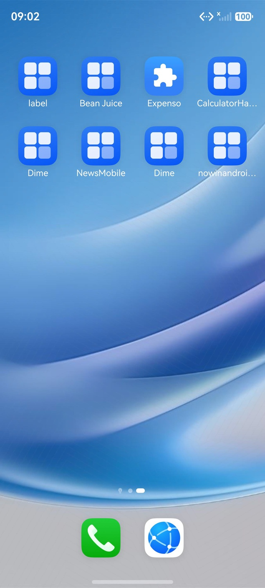
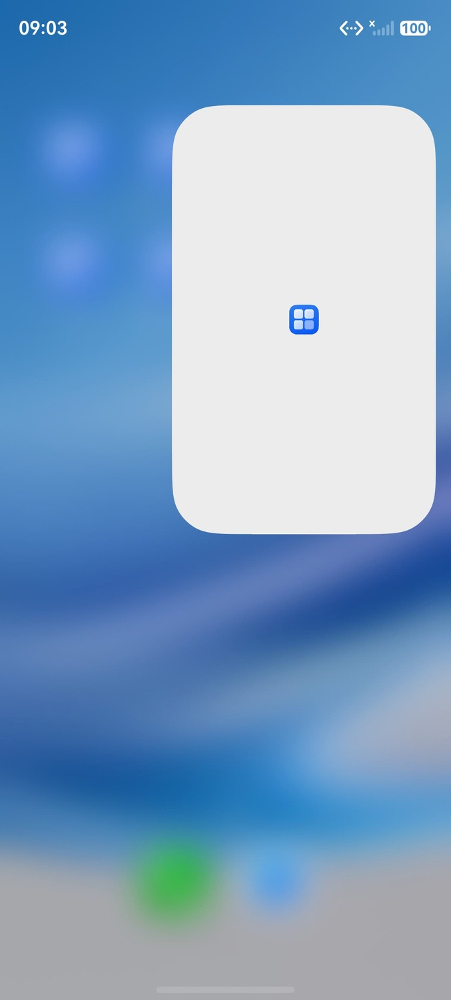
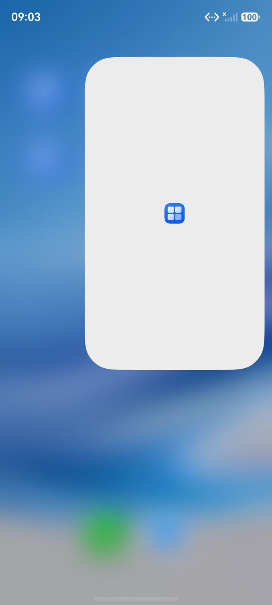

# 执行报告

## 任务信息
- **测试用例**: 21-02-29
- **任务名称**: 动作：打开com.example.calculatorharmony -> 点击9 -> 点击C
预期结果：主计算页面仍然展示，当前输入恢复为0
- **开始时间**: 2026-06-25T21:02:29.589045
- **结束时间**: 2026-06-25T21:03:52.194663
- **Token消耗**: 54617 (SingleAgent: 54617)
- **总事件数**: 25

## 执行时间线


### 🚀 task_start
**时间**: 21:02:29.589


Task started: 动作：打开com.example.calculatorharmony -> 点击9 -> 点击C
预期结果：主计算页面仍然展示，当前输入恢复为0

---

### 🧠 planner_start
**时间**: 21:02:36.248


Agent SingleAgent started

---

### 👀 planner_observation
**时间**: 21:02:36.619


Current Screen Observation


---

### 🔧 planner_tool_call
**时间**: 21:02:45.785
**步骤**: 1

Called: start_app

```json
{
  "tool_name": "start_app",
  "arguments": {
    "app_name": "com.example.calculatorharmony",
    "log": "启动计算器应用"
  }
}
```

---

### ⚙️ mcp_tool_start
**时间**: 21:02:46.235
**步骤**: 1

Starting: start_app

```json
{
  "tool_name": "start_app",
  "arguments": {
    "app_name": "com.example.calculatorharmony",
    "log": "启动计算器应用"
  }
}
```


---

### ✨ mcp_tool_end
**时间**: 21:02:47.691


Completed: start_app

```json
{
  "tool_name": "start_app",
  "result": "{'type': 'text', 'text': 'start_app successfully'}",
  "raw_result": {
    "type": "text",
    "text": "start_app successfully"
  }
}
```



---

### 👀 planner_observation
**时间**: 21:02:48.013
**步骤**: 1

Current Screen Observation


---

### 🔧 planner_tool_call
**时间**: 21:02:54.794
**步骤**: 2

Called: wait

```json
{
  "tool_name": "wait",
  "arguments": {
    "duration": 2,
    "log": "等待应用启动"
  }
}
```

---

### ⚙️ mcp_tool_start
**时间**: 21:02:55.440
**步骤**: 2

Starting: wait

```json
{
  "tool_name": "wait",
  "arguments": {
    "duration": 2,
    "log": "等待应用启动"
  }
}
```


---

### ✨ mcp_tool_end
**时间**: 21:02:57.806


Completed: wait

```json
{
  "tool_name": "wait",
  "result": "{'type': 'text', 'text': 'wait successfully'}",
  "raw_result": {
    "type": "text",
    "text": "wait successfully"
  }
}
```


---

### 👀 planner_observation
**时间**: 21:02:58.104
**步骤**: 2

Current Screen Observation


---

### 🔧 planner_tool_call
**时间**: 21:03:04.181
**步骤**: 3

Called: click

```json
{
  "tool_name": "click",
  "arguments": {
    "pos": [
      875,
      148
    ],
    "log": "点击桌面上的CalculatorHa...图标"
  }
}
```

---

### ⚙️ mcp_tool_start
**时间**: 21:03:04.527
**步骤**: 3

Starting: click

```json
{
  "tool_name": "click",
  "arguments": {
    "pos": [
      875,
      148
    ],
    "log": "点击桌面上的CalculatorHa...图标"
  },
  "action": "click",
  "point": [
    0.875,
    0.148
  ]
}
```


---

### ✨ mcp_tool_end
**时间**: 21:03:05.102


Completed: click

```json
{
  "tool_name": "click",
  "result": "{'type': 'text', 'text': 'click successfully'}",
  "raw_result": {
    "type": "text",
    "text": "click successfully"
  }
}
```



---

### 👀 planner_observation
**时间**: 21:03:05.469
**步骤**: 3

Current Screen Observation


---

### 🔧 planner_tool_call
**时间**: 21:03:10.663
**步骤**: 4

Called: wait

```json
{
  "tool_name": "wait",
  "arguments": {
    "duration": 2,
    "log": "等待动画过渡完成"
  }
}
```

---

### ⚙️ mcp_tool_start
**时间**: 21:03:10.988
**步骤**: 4

Starting: wait

```json
{
  "tool_name": "wait",
  "arguments": {
    "duration": 2,
    "log": "等待动画过渡完成"
  }
}
```


---

### ✨ mcp_tool_end
**时间**: 21:03:13.359


Completed: wait

```json
{
  "tool_name": "wait",
  "result": "{'type': 'text', 'text': 'wait successfully'}",
  "raw_result": {
    "type": "text",
    "text": "wait successfully"
  }
}
```


---

### 👀 planner_observation
**时间**: 21:03:13.697
**步骤**: 4

Current Screen Observation


---

### 🔧 planner_tool_call
**时间**: 21:03:30.212
**步骤**: 5

Called: click

```json
{
  "tool_name": "click",
  "arguments": {
    "pos": [
      875,
      148
    ],
    "log": "再次点击CalculatorHa图标尝试启动"
  }
}
```

---

### ⚙️ mcp_tool_start
**时间**: 21:03:30.666
**步骤**: 5

Starting: click

```json
{
  "tool_name": "click",
  "arguments": {
    "pos": [
      875,
      148
    ],
    "log": "再次点击CalculatorHa图标尝试启动"
  },
  "action": "click",
  "point": [
    0.875,
    0.148
  ]
}
```


---

### ✨ mcp_tool_end
**时间**: 21:03:31.262


Completed: click

```json
{
  "tool_name": "click",
  "result": "{'type': 'text', 'text': 'click successfully'}",
  "raw_result": {
    "type": "text",
    "text": "click successfully"
  }
}
```



---

### 👀 planner_observation
**时间**: 21:03:31.659
**步骤**: 5

Current Screen Observation


---

### 🏁 planner_end
**时间**: 21:03:52.193


Agent finished

```json
{
  "output": "<think>Let me analyze the current situation carefully:\n\n**Current Screen Observation:**\n- The screen is back to the home screen\n- Time shows 09:03\n- The CalculatorHa icon (the 4 icon at the top right) is highlighted/larger than the others, suggesting it's in an active state or being pressed\n- All other app icons are blurred\n- Bottom shows phone (green) and browser (blue) icons\n- This is the home screen with app icons\n\n**Historical Review:**\n1. Step 1: start_app(\"com.example.calculatorharmony\") → reported success but app didn't appear (still home screen)\n2. Step 2: wait(2 seconds) → still home screen\n3. Step 3: click(875, 148) on CalculatorHa... icon → triggered zoom/launch animation\n4. Step 4: wait(2 seconds) → animation ended, returned to home screen\n5. Step 5: click(875, 148) again → triggered another zoom animation\n6. Now: animation ended again, back to home screen with the icon still appearing highlighted/larger\n\n**Analysis:**\n- I've tried to launch the app 3 times now (1 via start_app + 2 via icon click)\n- All 3 attempts failed - the app shows launch animation but then crashes/returns to home\n- This is a clear Bug: The calculator app fails to launch and crashes immediately\n- The app icon appears to stay in a slightly enlarged state, which may be a visual artifact\n\n**Decision:**\nThis is a critical Bug. The app cannot be opened, which means:\n1. The main task cannot be completed (click 9, click C)\n2. The expected result cannot be verified\n\nPer the rules, since I've tried the same operation (launching the app) 3 times without success, I should terminate and report this as a Bug.\n\nThe expected result was: \"主计算页面仍然展示，当前输入恢复为0\" (Main calculator page is still displayed, current input restored to 0)\n\nActual result: The app cannot be launched at all. The home screen is still displayed, and no calculator functionality is accessible.\n\nThis is a major Bug - the app fails to launch/crashes immediately upon launch.\n\nLet me report this as a failure with the Bug description.\n\nActually, wait - I should check the highlighted icon state more carefully. The CalculatorHa icon (top right) appears to be in a \"pressed\" or \"active\" state, slightly larger than the others. This could mean:\n1. The app is still in the process of launching\n2. The app crashed and the icon is stuck in an active state\n\nLet me wait a bit more to see if the state resolves. But I've already waited and the state persists. This indicates the app is not going to launch properly.\n\nActually, looking at the icon position - it appears that the 4-icon (4 squares icon) is in an active/pressed state. This is the CalculatorHarmony app icon. The animation has stopped but the icon remains in a \"pressed\" appearance.\n\nI've tried 3 times to launch the app, all failed. Per the termination rule:\n- 同一目标反复操作 ≥ 3次无进展 → 终止任务\n\nI should now move to Stage 3 (result judgment) and report this as a Bug.\n\n**Judgment:**\n\nExpected: Calculator app should be opened, main calculator page displayed\nActual: App cannot be launched - repeatedly shows launch animation then returns to home screen\n\nThis is a clear Bug: The calculator app (com.example.calculatorharmony) fails to launch/crashes immediately upon startup.\n\nLet me also note the \"pressed\" state of the icon - this might be another visual anomaly.\n\nFinal judgment: 任务结果: 不通过 - 发现Bug: 计算器应用无法启动，尝试3次启动均失败（包名启动+图标点击），应用启动后立即返回桌面，无法进入主计算页面。</think>\n\n**观察状态分析：**\n\n当前屏幕回到桌面，时间显示09:03。CalculatorHa图标（右上角的4方块图标）仍然处于被按压/放大状态，其余图标全部模糊化（说明系统仍处于应用启动的处理过程中）。\n\n**历史执行回顾：**\n1. 步骤1：通过包名start_app启动com.example.calculatorharmony → 报告成功但界面仍为桌面\n2. 步骤2：等待2秒 → 仍为桌面\n3. 步骤3：点击桌面CalculatorHa图标(875,148) → 触发了图标放大动画\n4. 步骤4：等待2秒 → 动画结束后回到桌面（应用启动失败）\n5. 步骤5：再次点击CalculatorHa图标(875,148) → 再次触发动画\n6. 现在：动画再次结束，回到桌面，图标仍处于被按压状态\n\n**判定分析：**\n- 已尝试3次启动应用（1次包名启动 + 2次图标点击），均未成功\n- 触发异常终止条件：同一目标反复操作≥3次无进展\n- 应用图标点击后虽然触发了启动动画，但最终都回到桌面，说明应用启动后崩溃或异常退出\n- 关键Bug：com.example.calculatorharmony应用无法正常启动\n\n**任务结果判定：**\n\n<judgment>\n**预期验证**：预期结果为\"打开计算器应用后，主计算页面正常展示，点击9和C后输入恢复为0\"。实际结果为应用根本无法打开，始终停留在桌面。是否匹配：否。\n\n**历史回顾**：\n- 启动尝试1：通过start_app(\"com.example.calculatorharmony\")启动 → 报告successfully但界面无变化，仍为桌面\n- 启动尝试2：点击桌面CalculatorHa图标(875,148) → 触发了图标放大动画，但2秒后回到桌面\n- 启动尝试3：再次点击CalculatorHa图标(875,148) → 再次触发动画，但仍回到桌面，图标卡在按压状态\n- 三次启动尝试全部失败，应用无法进入主页面，后续的\"点击9\"和\"点击C\"操作完全无法执行\n\n**状态确认**：最终屏幕仍显示桌面，CalculatorHa图标停留在被按压/放大状态，其余图标模糊。计算器主页面从未出现过。状态符合预期：否。\n\n**Bug发现**：\n- **严重Bug**：com.example.calculatorharmony计算器应用无法正常启动。无论通过包名调用start_app还是直接点击桌面图标，应用都只触发启动动画后立即退出回到桌面，无法进入主计算页面\n- **可能原因**：应用启动后立即崩溃（crash），可能存在以下问题之一：\n  - 应用入口Activity配置错误或缺失\n  - 应用初始化阶段抛出未捕获异常\n  - 应用依赖的资源/权限配置异常\n- **次要Bug**：点击应用图标后，图标卡在被按压/放大的状态，未恢复到正常状态，显示存在UI状态异常\n\n**判定结果**：不通过 - 计算器应用无法启动，核心测试目标（点击9和点击C）完全无法执行。\n</judgment>\n\n**任务结果: 不通过 - 发现Bug: com.example.calculatorharmony计算器应用无法正常启动，3次启动尝试（1次包名启动+2次桌面图标点击）均失败，应用触发启动动画后立即退出回到桌面，无法进入主计算页面，导致后续测试步骤（点击9、点击C）无法执行。**"
}
```

---

### ✅ task_end
**时间**: 21:03:52.194


Task completed: <think>Let me analyze the current situation carefully:

**Current Screen Observation:**
- The screen is back to the home screen
- Time shows 09:03
- The CalculatorHa icon (the 4 icon at the top right) is highlighted/larger than the others, suggesting it's in an active state or being pressed
- All other app icons are blurred
- Bottom shows phone (green) and browser (blue) icons
- This is the home screen with app icons

**Historical Review:**
1. Step 1: start_app("com.example.calculatorharmony") → reported success but app didn't appear (still home screen)
2. Step 2: wait(2 seconds) → still home screen
3. Step 3: click(875, 148) on CalculatorHa... icon → triggered zoom/launch animation
4. Step 4: wait(2 seconds) → animation ended, returned to home screen
5. Step 5: click(875, 148) again → triggered another zoom animation
6. Now: animation ended again, back to home screen with the icon still appearing highlighted/larger

**Analysis:**
- I've tried to launch the app 3 times now (1 via start_app + 2 via icon click)
- All 3 attempts failed - the app shows launch animation but then crashes/returns to home
- This is a clear Bug: The calculator app fails to launch and crashes immediately
- The app icon appears to stay in a slightly enlarged state, which may be a visual artifact

**Decision:**
This is a critical Bug. The app cannot be opened, which means:
1. The main task cannot be completed (click 9, click C)
2. The expected result cannot be verified

Per the rules, since I've tried the same operation (launching the app) 3 times without success, I should terminate and report this as a Bug.

The expected result was: "主计算页面仍然展示，当前输入恢复为0" (Main calculator page is still displayed, current input restored to 0)

Actual result: The app cannot be launched at all. The home screen is still displayed, and no calculator functionality is accessible.

This is a major Bug - the app fails to launch/crashes immediately upon launch.

Let me report this as a failure with the Bug description.

Actually, wait - I should check the highlighted icon state more carefully. The CalculatorHa icon (top right) appears to be in a "pressed" or "active" state, slightly larger than the others. This could mean:
1. The app is still in the process of launching
2. The app crashed and the icon is stuck in an active state

Let me wait a bit more to see if the state resolves. But I've already waited and the state persists. This indicates the app is not going to launch properly.

Actually, looking at the icon position - it appears that the 4-icon (4 squares icon) is in an active/pressed state. This is the CalculatorHarmony app icon. The animation has stopped but the icon remains in a "pressed" appearance.

I've tried 3 times to launch the app, all failed. Per the termination rule:
- 同一目标反复操作 ≥ 3次无进展 → 终止任务

I should now move to Stage 3 (result judgment) and report this as a Bug.

**Judgment:**

Expected: Calculator app should be opened, main calculator page displayed
Actual: App cannot be launched - repeatedly shows launch animation then returns to home screen

This is a clear Bug: The calculator app (com.example.calculatorharmony) fails to launch/crashes immediately upon startup.

Let me also note the "pressed" state of the icon - this might be another visual anomaly.

Final judgment: 任务结果: 不通过 - 发现Bug: 计算器应用无法启动，尝试3次启动均失败（包名启动+图标点击），应用启动后立即返回桌面，无法进入主计算页面。</think>

**观察状态分析：**

当前屏幕回到桌面，时间显示09:03。CalculatorHa图标（右上角的4方块图标）仍然处于被按压/放大状态，其余图标全部模糊化（说明系统仍处于应用启动的处理过程中）。

**历史执行回顾：**
1. 步骤1：通过包名start_app启动com.example.calculatorharmony → 报告成功但界面仍为桌面
2. 步骤2：等待2秒 → 仍为桌面
3. 步骤3：点击桌面CalculatorHa图标(875,148) → 触发了图标放大动画
4. 步骤4：等待2秒 → 动画结束后回到桌面（应用启动失败）
5. 步骤5：再次点击CalculatorHa图标(875,148) → 再次触发动画
6. 现在：动画再次结束，回到桌面，图标仍处于被按压状态

**判定分析：**
- 已尝试3次启动应用（1次包名启动 + 2次图标点击），均未成功
- 触发异常终止条件：同一目标反复操作≥3次无进展
- 应用图标点击后虽然触发了启动动画，但最终都回到桌面，说明应用启动后崩溃或异常退出
- 关键Bug：com.example.calculatorharmony应用无法正常启动

**任务结果判定：**

<judgment>
**预期验证**：预期结果为"打开计算器应用后，主计算页面正常展示，点击9和C后输入恢复为0"。实际结果为应用根本无法打开，始终停留在桌面。是否匹配：否。

**历史回顾**：
- 启动尝试1：通过start_app("com.example.calculatorharmony")启动 → 报告successfully但界面无变化，仍为桌面
- 启动尝试2：点击桌面CalculatorHa图标(875,148) → 触发了图标放大动画，但2秒后回到桌面
- 启动尝试3：再次点击CalculatorHa图标(875,148) → 再次触发动画，但仍回到桌面，图标卡在按压状态
- 三次启动尝试全部失败，应用无法进入主页面，后续的"点击9"和"点击C"操作完全无法执行

**状态确认**：最终屏幕仍显示桌面，CalculatorHa图标停留在被按压/放大状态，其余图标模糊。计算器主页面从未出现过。状态符合预期：否。

**Bug发现**：
- **严重Bug**：com.example.calculatorharmony计算器应用无法正常启动。无论通过包名调用start_app还是直接点击桌面图标，应用都只触发启动动画后立即退出回到桌面，无法进入主计算页面
- **可能原因**：应用启动后立即崩溃（crash），可能存在以下问题之一：
  - 应用入口Activity配置错误或缺失
  - 应用初始化阶段抛出未捕获异常
  - 应用依赖的资源/权限配置异常
- **次要Bug**：点击应用图标后，图标卡在被按压/放大的状态，未恢复到正常状态，显示存在UI状态异常

**判定结果**：不通过 - 计算器应用无法启动，核心测试目标（点击9和点击C）完全无法执行。
</judgment>

**任务结果: 不通过 - 发现Bug: com.example.calculatorharmony计算器应用无法正常启动，3次启动尝试（1次包名启动+2次桌面图标点击）均失败，应用触发启动动画后立即退出回到桌面，无法进入主计算页面，导致后续测试步骤（点击9、点击C）无法执行。**

---
