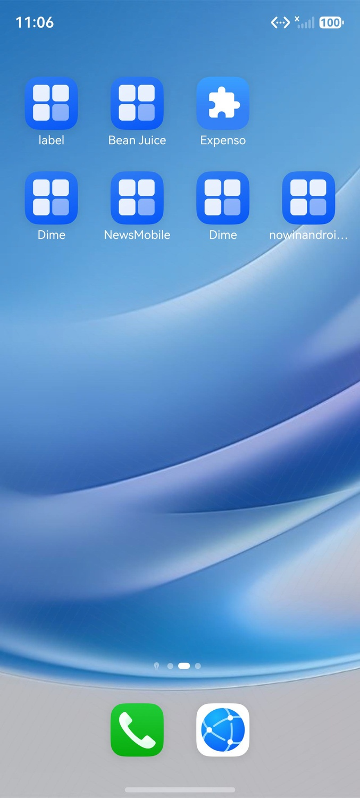
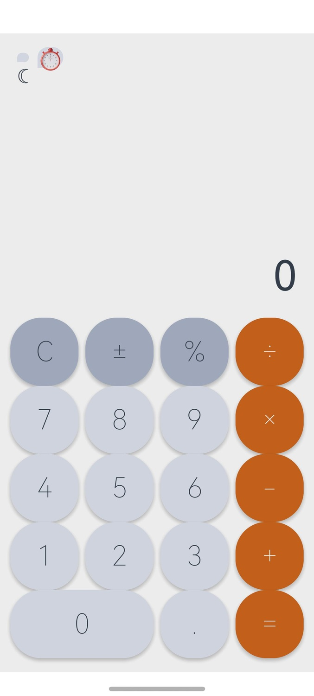
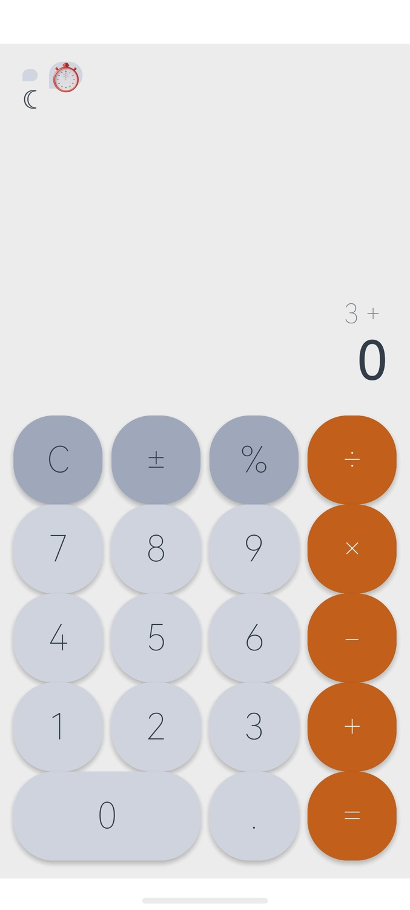
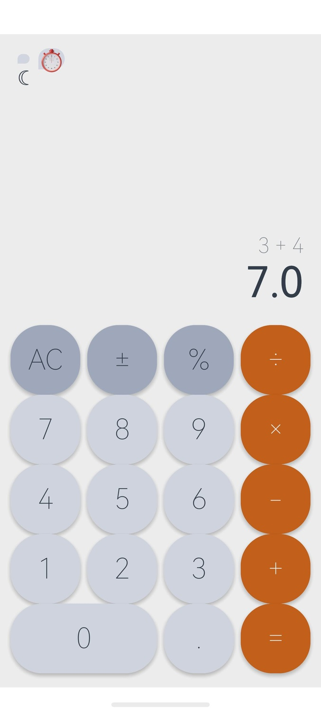

# 执行报告

## 任务信息
- **测试用例**: 11-05-36
- **任务名称**: 动作：打开com.example.calculatorharmony -> 点击主题切换按钮 -> 点击3 -> 点击+ -> 点击4 -> 点击=
预期结果：页面保持深色视觉样式，表达式展示3 + 4，结果展示7.0
- **开始时间**: 2026-06-26T11:05:36.773769
- **结束时间**: 2026-06-26T11:09:48.848737
- **Token消耗**: 79927 (SingleAgent: 79927)
- **总事件数**: 29

## 执行时间线


### 🚀 task_start
**时间**: 11:05:36.773


Task started: 动作：打开com.example.calculatorharmony -> 点击主题切换按钮 -> 点击3 -> 点击+ -> 点击4 -> 点击=
预期结果：页面保持深色视觉样式，表达式展示3 + 4，结果展示7.0

---

### 🧠 planner_start
**时间**: 11:05:43.222


Agent SingleAgent started

---

### 👀 planner_observation
**时间**: 11:05:43.856


Current Screen Observation


---

### 🔧 planner_tool_call
**时间**: 11:06:00.758
**步骤**: 1

Called: start_app

```json
{
  "tool_name": "start_app",
  "arguments": {
    "app_name": "com.example.calculatorharmony",
    "log": "打开计算器应用"
  }
}
```

---

### ⚙️ mcp_tool_start
**时间**: 11:06:01.241
**步骤**: 1

Starting: start_app

```json
{
  "tool_name": "start_app",
  "arguments": {
    "app_name": "com.example.calculatorharmony",
    "log": "打开计算器应用"
  }
}
```



---

### ✨ mcp_tool_end
**时间**: 11:06:02.922


Completed: start_app

```json
{
  "tool_name": "start_app",
  "result": "{'type': 'text', 'text': 'start_app successfully'}",
  "raw_result": {
    "type": "text",
    "text": "start_app successfully"
  }
}
```



---

### 👀 planner_observation
**时间**: 11:06:03.239
**步骤**: 1

Current Screen Observation


---

### 🔧 planner_tool_call
**时间**: 11:06:19.304
**步骤**: 2

Called: click

```json
{
  "tool_name": "click",
  "arguments": {
    "pos": [
      45,
      110
    ],
    "log": "点击主题切换按钮（月亮图标）"
  }
}
```

---

### ⚙️ mcp_tool_start
**时间**: 11:06:19.727
**步骤**: 2

Starting: click

```json
{
  "tool_name": "click",
  "arguments": {
    "pos": [
      45,
      110
    ],
    "log": "点击主题切换按钮（月亮图标）"
  },
  "action": "click",
  "point": [
    0.045,
    0.11
  ]
}
```


---

### ✨ mcp_tool_end
**时间**: 11:06:20.254


Completed: click

```json
{
  "tool_name": "click",
  "result": "{'type': 'text', 'text': 'click successfully'}",
  "raw_result": {
    "type": "text",
    "text": "click successfully"
  }
}
```


---

### 👀 planner_observation
**时间**: 11:06:20.606
**步骤**: 2

Current Screen Observation


---

### 🔧 planner_tool_call
**时间**: 11:08:30.929
**步骤**: 3

Called: click

```json
{
  "tool_name": "click",
  "arguments": {
    "pos": [
      617,
      785
    ],
    "log": "点击数字3"
  }
}
```

---

### ⚙️ mcp_tool_start
**时间**: 11:08:31.373
**步骤**: 3

Starting: click

```json
{
  "tool_name": "click",
  "arguments": {
    "pos": [
      617,
      785
    ],
    "log": "点击数字3"
  },
  "action": "click",
  "point": [
    0.617,
    0.785
  ]
}
```


---

### ✨ mcp_tool_end
**时间**: 11:08:31.806


Completed: click

```json
{
  "tool_name": "click",
  "result": "{'type': 'text', 'text': 'click successfully'}",
  "raw_result": {
    "type": "text",
    "text": "click successfully"
  }
}
```


---

### 👀 planner_observation
**时间**: 11:08:32.111
**步骤**: 3

Current Screen Observation


---

### 🔧 planner_tool_call
**时间**: 11:08:38.823
**步骤**: 4

Called: click

```json
{
  "tool_name": "click",
  "arguments": {
    "pos": [
      880,
      785
    ],
    "log": "点击+号按钮"
  }
}
```

---

### ⚙️ mcp_tool_start
**时间**: 11:08:39.214
**步骤**: 4

Starting: click

```json
{
  "tool_name": "click",
  "arguments": {
    "pos": [
      880,
      785
    ],
    "log": "点击+号按钮"
  },
  "action": "click",
  "point": [
    0.88,
    0.785
  ]
}
```


---

### ✨ mcp_tool_end
**时间**: 11:08:39.654


Completed: click

```json
{
  "tool_name": "click",
  "result": "{'type': 'text', 'text': 'click successfully'}",
  "raw_result": {
    "type": "text",
    "text": "click successfully"
  }
}
```


---

### 👀 planner_observation
**时间**: 11:08:39.937
**步骤**: 4

Current Screen Observation



---

### 🔧 planner_tool_call
**时间**: 11:09:06.842
**步骤**: 5

Called: click

```json
{
  "tool_name": "click",
  "arguments": {
    "pos": [
      125,
      683
    ],
    "log": "点击数字4"
  }
}
```

---

### ⚙️ mcp_tool_start
**时间**: 11:09:07.256
**步骤**: 5

Starting: click

```json
{
  "tool_name": "click",
  "arguments": {
    "pos": [
      125,
      683
    ],
    "log": "点击数字4"
  },
  "action": "click",
  "point": [
    0.125,
    0.683
  ]
}
```


---

### ✨ mcp_tool_end
**时间**: 11:09:07.694


Completed: click

```json
{
  "tool_name": "click",
  "result": "{'type': 'text', 'text': 'click successfully'}",
  "raw_result": {
    "type": "text",
    "text": "click successfully"
  }
}
```


---

### 👀 planner_observation
**时间**: 11:09:07.990
**步骤**: 5

Current Screen Observation


---

### 🔧 planner_tool_call
**时间**: 11:09:19.503
**步骤**: 6

Called: click

```json
{
  "tool_name": "click",
  "arguments": {
    "pos": [
      880,
      889
    ],
    "log": "点击=号按钮"
  }
}
```

---

### ⚙️ mcp_tool_start
**时间**: 11:09:19.974
**步骤**: 6

Starting: click

```json
{
  "tool_name": "click",
  "arguments": {
    "pos": [
      880,
      889
    ],
    "log": "点击=号按钮"
  },
  "action": "click",
  "point": [
    0.88,
    0.889
  ]
}
```


---

### ✨ mcp_tool_end
**时间**: 11:09:20.444


Completed: click

```json
{
  "tool_name": "click",
  "result": "{'type': 'text', 'text': 'click successfully'}",
  "raw_result": {
    "type": "text",
    "text": "click successfully"
  }
}
```


---

### 👀 planner_observation
**时间**: 11:09:20.765
**步骤**: 6

Current Screen Observation



---

### 🏁 planner_end
**时间**: 11:09:48.846


Agent finished

```json
{
  "output": "<think>Now I can see the final state after clicking the = button:\n- Expression: \"3 + 4\" (displayed at top right)\n- Result: \"7.0\" (displayed below the expression)\n- The theme is still LIGHT (light gray background, light buttons, dark text)\n\nSo the calculation is correct (3 + 4 = 7.0), and the expression display is correct (\"3 + 4\").\n\nHowever, the expected result says \"页面保持深色视觉样式\" (the page should maintain dark visual style). But the page is clearly in LIGHT theme, not dark theme.\n\nThis is a significant Bug. The theme switch button was clicked (step 2), but the theme didn't change from light to dark. The expected result is that the page should be in dark theme after the theme switch.\n\nLet me now make my final judgment:\n\n**Expected result verification**:\n1. \"页面保持深色视觉样式\" - Expected: dark theme. Actual: LIGHT theme. **MISMATCH** ❌\n2. \"表达式展示3 + 4\" - Expected: \"3 + 4\". Actual: \"3 + 4\". **MATCH** ✅\n3. \"结果展示7.0\" - Expected: \"7.0\". Actual: \"7.0\". **MATCH** ✅\n\nThe theme is the main issue. The theme switch button didn't switch the theme from light to dark.\n\nThis is a clear Bug. The judgment should be \"不通过\".</think>\n\n## 阶段3：结果判定\n\n<judgment>\n**预期验证**：\n1. 预期：页面保持深色视觉样式。实际：页面仍为**浅色**主题（浅灰色背景、浅色按钮、深色文字）。**不匹配** ❌\n2. 预期：表达式展示\"3 + 4\"。实际：表达式显示\"3 + 4\"。**匹配** ✅\n3. 预期：结果展示\"7.0\"。实际：结果显示\"7.0\"。**匹配** ✅\n\n**历史回顾**：\n- 主题切换按钮：\n  - 应用打开时（浅色主题）：左上角显示月亮图标 🌙\n  - 点击主题切换按钮后：图标变为太阳图标 ☀️（图标有变化），但**主题颜色未发生变化**（仍为浅色背景）\n  - 最终状态：仍为浅色主题\n  - 是否一致：图标切换了，但主题颜色未切换 → **不一致**\n\n- 表达式和结果：\n  - 点击3后：主显示区显示\"3\"\n  - 点击+后：表达式显示\"3 +\"\n  - 点击4后：主显示区显示\"4\"，表达式仍显示\"3 +\"\n  - 点击=后：表达式显示\"3 + 4\"，结果显示\"7.0\"\n  - 是否一致：是 ✅\n\n**状态确认**：最终屏幕显示计算器界面，表达式\"3 + 4\"和结果\"7.0\"正确显示，但整体页面为浅色主题而非预期的深色主题。\n\n**Bug发现**：\n- **预期结果Bug（主要）**：点击主题切换按钮后，页面主题**未从浅色切换为深色**。预期结果明确要求\"页面保持深色视觉样式\"，但实际页面仍为浅色主题。主题切换功能存在明显异常——图标发生了变化（从月亮变为太阳），说明按钮响应了点击事件，但实际的视觉主题样式没有切换。\n\n**判定结果**：不通过\n</judgment>\n\n任务结果: 不通过 - 发现Bug: 点击主题切换按钮后，页面主题未从浅色切换为深色（图标状态从月亮变为太阳，但视觉样式仍保持浅色），与预期\"页面保持深色视觉样式\"不一致。"
}
```

---

### ✅ task_end
**时间**: 11:09:48.849


Task completed: <think>Now I can see the final state after clicking the = button:
- Expression: "3 + 4" (displayed at top right)
- Result: "7.0" (displayed below the expression)
- The theme is still LIGHT (light gray background, light buttons, dark text)

So the calculation is correct (3 + 4 = 7.0), and the expression display is correct ("3 + 4").

However, the expected result says "页面保持深色视觉样式" (the page should maintain dark visual style). But the page is clearly in LIGHT theme, not dark theme.

This is a significant Bug. The theme switch button was clicked (step 2), but the theme didn't change from light to dark. The expected result is that the page should be in dark theme after the theme switch.

Let me now make my final judgment:

**Expected result verification**:
1. "页面保持深色视觉样式" - Expected: dark theme. Actual: LIGHT theme. **MISMATCH** ❌
2. "表达式展示3 + 4" - Expected: "3 + 4". Actual: "3 + 4". **MATCH** ✅
3. "结果展示7.0" - Expected: "7.0". Actual: "7.0". **MATCH** ✅

The theme is the main issue. The theme switch button didn't switch the theme from light to dark.

This is a clear Bug. The judgment should be "不通过".</think>

## 阶段3：结果判定

<judgment>
**预期验证**：
1. 预期：页面保持深色视觉样式。实际：页面仍为**浅色**主题（浅灰色背景、浅色按钮、深色文字）。**不匹配** ❌
2. 预期：表达式展示"3 + 4"。实际：表达式显示"3 + 4"。**匹配** ✅
3. 预期：结果展示"7.0"。实际：结果显示"7.0"。**匹配** ✅

**历史回顾**：
- 主题切换按钮：
  - 应用打开时（浅色主题）：左上角显示月亮图标 🌙
  - 点击主题切换按钮后：图标变为太阳图标 ☀️（图标有变化），但**主题颜色未发生变化**（仍为浅色背景）
  - 最终状态：仍为浅色主题
  - 是否一致：图标切换了，但主题颜色未切换 → **不一致**

- 表达式和结果：
  - 点击3后：主显示区显示"3"
  - 点击+后：表达式显示"3 +"
  - 点击4后：主显示区显示"4"，表达式仍显示"3 +"
  - 点击=后：表达式显示"3 + 4"，结果显示"7.0"
  - 是否一致：是 ✅

**状态确认**：最终屏幕显示计算器界面，表达式"3 + 4"和结果"7.0"正确显示，但整体页面为浅色主题而非预期的深色主题。

**Bug发现**：
- **预期结果Bug（主要）**：点击主题切换按钮后，页面主题**未从浅色切换为深色**。预期结果明确要求"页面保持深色视觉样式"，但实际页面仍为浅色主题。主题切换功能存在明显异常——图标发生了变化（从月亮变为太阳），说明按钮响应了点击事件，但实际的视觉主题样式没有切换。

**判定结果**：不通过
</judgment>

任务结果: 不通过 - 发现Bug: 点击主题切换按钮后，页面主题未从浅色切换为深色（图标状态从月亮变为太阳，但视觉样式仍保持浅色），与预期"页面保持深色视觉样式"不一致。

---
