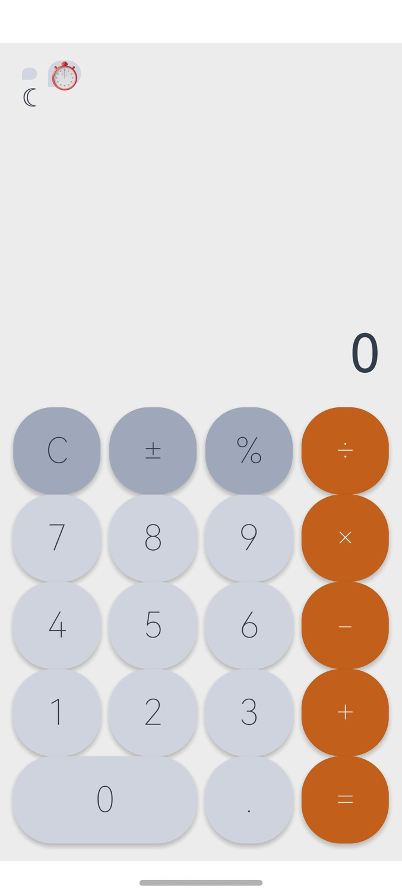
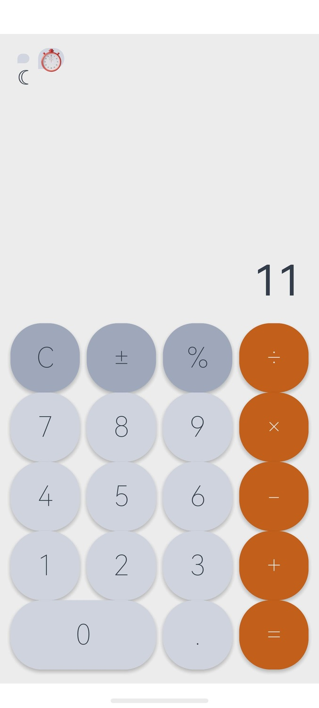
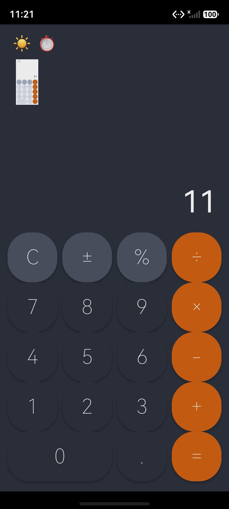
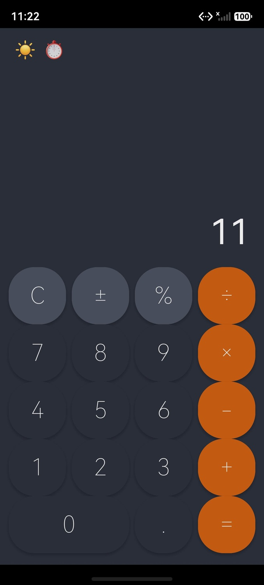
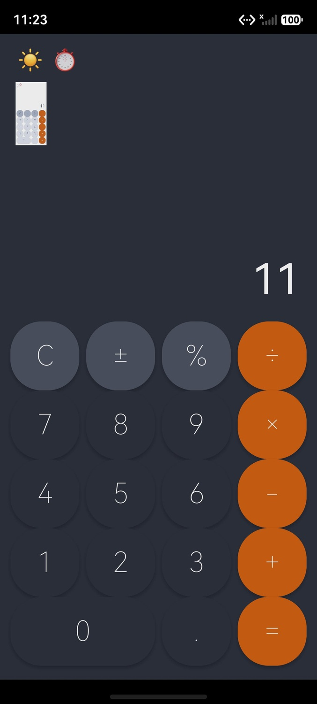
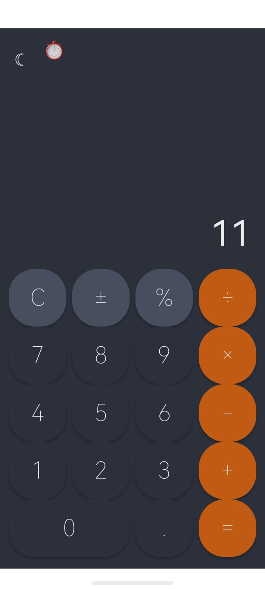

# 执行报告

## 任务信息
- **测试用例**: 11-19-50
- **任务名称**: 动作：打开com.example.calculatorharmony -> 点击1 -> 点击+ -> 点击1 -> 点击= -> 点击历史记录按钮 -> 点击清空历史按钮 -> 点击Clear
预期结果：历史记录被清空，页面展示Nothing to show!空状态
- **开始时间**: 2026-06-26T11:19:50.905986
- **结束时间**: 2026-06-26T11:26:27.795706
- **Token消耗**: 173616 (SingleAgent: 173616)
- **总事件数**: 53

## 执行时间线


### 🚀 task_start
**时间**: 11:19:50.905


Task started: 动作：打开com.example.calculatorharmony -> 点击1 -> 点击+ -> 点击1 -> 点击= -> 点击历史记录按钮 -> 点击清空历史按钮 -> 点击Clear
预期结果：历史记录被清空，页面展示Nothing to show!空状态

---

### 🧠 planner_start
**时间**: 11:19:57.481


Agent SingleAgent started

---

### 👀 planner_observation
**时间**: 11:19:58.300


Current Screen Observation


---

### 🔧 planner_tool_call
**时间**: 11:20:11.605
**步骤**: 1

Called: start_app

```json
{
  "tool_name": "start_app",
  "arguments": {
    "app_name": "com.example.calculatorharmony",
    "log": "打开计算器应用"
  }
}
```

---

### ⚙️ mcp_tool_start
**时间**: 11:20:12.097
**步骤**: 1

Starting: start_app

```json
{
  "tool_name": "start_app",
  "arguments": {
    "app_name": "com.example.calculatorharmony",
    "log": "打开计算器应用"
  }
}
```


---

### ✨ mcp_tool_end
**时间**: 11:20:14.105


Completed: start_app

```json
{
  "tool_name": "start_app",
  "result": "{'type': 'text', 'text': 'start_app successfully'}",
  "raw_result": {
    "type": "text",
    "text": "start_app successfully"
  }
}
```



---

### 👀 planner_observation
**时间**: 11:20:14.474
**步骤**: 1

Current Screen Observation


---

### 🔧 planner_tool_call
**时间**: 11:20:47.223
**步骤**: 2

Called: click

```json
{
  "tool_name": "click",
  "arguments": {
    "pos": [
      132,
      795
    ],
    "log": "点击数字1按钮"
  }
}
```

---

### ⚙️ mcp_tool_start
**时间**: 11:20:47.741
**步骤**: 2

Starting: click

```json
{
  "tool_name": "click",
  "arguments": {
    "pos": [
      132,
      795
    ],
    "log": "点击数字1按钮"
  },
  "action": "click",
  "point": [
    0.132,
    0.795
  ]
}
```


---

### ✨ mcp_tool_end
**时间**: 11:20:48.193


Completed: click

```json
{
  "tool_name": "click",
  "result": "{'type': 'text', 'text': 'click successfully'}",
  "raw_result": {
    "type": "text",
    "text": "click successfully"
  }
}
```


---

### 👀 planner_observation
**时间**: 11:20:48.500
**步骤**: 2

Current Screen Observation


---

### 🔧 planner_tool_call
**时间**: 11:20:57.095
**步骤**: 3

Called: click

```json
{
  "tool_name": "click",
  "arguments": {
    "pos": [
      868,
      882
    ],
    "log": "点击+加号按钮"
  }
}
```

---

### ⚙️ mcp_tool_start
**时间**: 11:20:57.582
**步骤**: 3

Starting: click

```json
{
  "tool_name": "click",
  "arguments": {
    "pos": [
      868,
      882
    ],
    "log": "点击+加号按钮"
  },
  "action": "click",
  "point": [
    0.868,
    0.882
  ]
}
```


---

### ✨ mcp_tool_end
**时间**: 11:20:58.015


Completed: click

```json
{
  "tool_name": "click",
  "result": "{'type': 'text', 'text': 'click successfully'}",
  "raw_result": {
    "type": "text",
    "text": "click successfully"
  }
}
```


---

### 👀 planner_observation
**时间**: 11:20:58.337
**步骤**: 3

Current Screen Observation


---

### 🔧 planner_tool_call
**时间**: 11:21:07.701
**步骤**: 4

Called: click

```json
{
  "tool_name": "click",
  "arguments": {
    "pos": [
      132,
      795
    ],
    "log": "点击第二个数字1按钮"
  }
}
```

---

### ⚙️ mcp_tool_start
**时间**: 11:21:08.161
**步骤**: 4

Starting: click

```json
{
  "tool_name": "click",
  "arguments": {
    "pos": [
      132,
      795
    ],
    "log": "点击第二个数字1按钮"
  },
  "action": "click",
  "point": [
    0.132,
    0.795
  ]
}
```


---

### ✨ mcp_tool_end
**时间**: 11:21:08.631


Completed: click

```json
{
  "tool_name": "click",
  "result": "{'type': 'text', 'text': 'click successfully'}",
  "raw_result": {
    "type": "text",
    "text": "click successfully"
  }
}
```


---

### 👀 planner_observation
**时间**: 11:21:09.138
**步骤**: 4

Current Screen Observation


---

### 🔧 planner_tool_call
**时间**: 11:21:28.315
**步骤**: 5

Called: click

```json
{
  "tool_name": "click",
  "arguments": {
    "pos": [
      868,
      967
    ],
    "log": "点击等号按钮="
  }
}
```

---

### ⚙️ mcp_tool_start
**时间**: 11:21:28.773
**步骤**: 5

Starting: click

```json
{
  "tool_name": "click",
  "arguments": {
    "pos": [
      868,
      967
    ],
    "log": "点击等号按钮="
  },
  "action": "click",
  "point": [
    0.868,
    0.967
  ]
}
```



---

### ✨ mcp_tool_end
**时间**: 11:21:29.266


Completed: click

```json
{
  "tool_name": "click",
  "result": "{'type': 'text', 'text': 'click successfully'}",
  "raw_result": {
    "type": "text",
    "text": "click successfully"
  }
}
```


---

### 👀 planner_observation
**时间**: 11:21:29.578
**步骤**: 5

Current Screen Observation


---

### 🔧 planner_tool_call
**时间**: 11:21:40.117
**步骤**: 6

Called: click

```json
{
  "tool_name": "click",
  "arguments": {
    "pos": [
      78,
      76
    ],
    "log": "点击历史记录按钮"
  }
}
```

---

### ⚙️ mcp_tool_start
**时间**: 11:21:40.565
**步骤**: 6

Starting: click

```json
{
  "tool_name": "click",
  "arguments": {
    "pos": [
      78,
      76
    ],
    "log": "点击历史记录按钮"
  },
  "action": "click",
  "point": [
    0.078,
    0.076
  ]
}
```


---

### ✨ mcp_tool_end
**时间**: 11:21:41.159


Completed: click

```json
{
  "tool_name": "click",
  "result": "{'type': 'text', 'text': 'click successfully'}",
  "raw_result": {
    "type": "text",
    "text": "click successfully"
  }
}
```


---

### 👀 planner_observation
**时间**: 11:21:41.525
**步骤**: 6

Current Screen Observation



---

### 🔧 planner_tool_call
**时间**: 11:22:17.988
**步骤**: 7

Called: click

```json
{
  "tool_name": "click",
  "arguments": {
    "pos": [
      134,
      241
    ],
    "log": "点击历史记录预览卡片尝试展开"
  }
}
```

---

### ⚙️ mcp_tool_start
**时间**: 11:22:18.480
**步骤**: 7

Starting: click

```json
{
  "tool_name": "click",
  "arguments": {
    "pos": [
      134,
      241
    ],
    "log": "点击历史记录预览卡片尝试展开"
  },
  "action": "click",
  "point": [
    0.134,
    0.241
  ]
}
```


---

### ✨ mcp_tool_end
**时间**: 11:22:18.921


Completed: click

```json
{
  "tool_name": "click",
  "result": "{'type': 'text', 'text': 'click successfully'}",
  "raw_result": {
    "type": "text",
    "text": "click successfully"
  }
}
```


---

### 👀 planner_observation
**时间**: 11:22:19.253
**步骤**: 7

Current Screen Observation


---

### 🔧 planner_tool_call
**时间**: 11:22:30.815
**步骤**: 8

Called: click

```json
{
  "tool_name": "click",
  "arguments": {
    "pos": [
      78,
      76
    ],
    "log": "再次点击历史记录按钮重新打开历史面板"
  }
}
```

---

### ⚙️ mcp_tool_start
**时间**: 11:22:31.326
**步骤**: 8

Starting: click

```json
{
  "tool_name": "click",
  "arguments": {
    "pos": [
      78,
      76
    ],
    "log": "再次点击历史记录按钮重新打开历史面板"
  },
  "action": "click",
  "point": [
    0.078,
    0.076
  ]
}
```



---

### ✨ mcp_tool_end
**时间**: 11:22:32.189


Completed: click

```json
{
  "tool_name": "click",
  "result": "{'type': 'text', 'text': 'click successfully'}",
  "raw_result": {
    "type": "text",
    "text": "click successfully"
  }
}
```


---

### 👀 planner_observation
**时间**: 11:22:32.629
**步骤**: 8

Current Screen Observation


---

### 🔧 planner_tool_call
**时间**: 11:23:44.447
**步骤**: 9

Called: click

```json
{
  "tool_name": "click",
  "arguments": {
    "pos": [
      55,
      76
    ],
    "log": "点击左上角半月图标尝试打开抽屉/菜单"
  }
}
```

---

### ⚙️ mcp_tool_start
**时间**: 11:23:44.899
**步骤**: 9

Starting: click

```json
{
  "tool_name": "click",
  "arguments": {
    "pos": [
      55,
      76
    ],
    "log": "点击左上角半月图标尝试打开抽屉/菜单"
  },
  "action": "click",
  "point": [
    0.055,
    0.076
  ]
}
```


---

### ✨ mcp_tool_end
**时间**: 11:23:45.453


Completed: click

```json
{
  "tool_name": "click",
  "result": "{'type': 'text', 'text': 'click successfully'}",
  "raw_result": {
    "type": "text",
    "text": "click successfully"
  }
}
```


---

### 👀 planner_observation
**时间**: 11:23:45.816
**步骤**: 9

Current Screen Observation



---

### 🔧 planner_tool_call
**时间**: 11:24:16.077
**步骤**: 10

Called: long_click

```json
{
  "tool_name": "long_click",
  "arguments": {
    "pos": [
      90,
      220
    ],
    "duration": 2,
    "log": "长按历史预览卡片查看是否有清空选项"
  }
}
```

---

### ⚙️ mcp_tool_start
**时间**: 11:24:16.559
**步骤**: 10

Starting: long_click

```json
{
  "tool_name": "long_click",
  "arguments": {
    "pos": [
      90,
      220
    ],
    "duration": 2,
    "log": "长按历史预览卡片查看是否有清空选项"
  },
  "action": "long_click",
  "point": [
    0.09,
    0.22
  ]
}
```


---

### ✨ mcp_tool_end
**时间**: 11:24:19.126


Completed: long_click

```json
{
  "tool_name": "long_click",
  "result": "{'type': 'text', 'text': 'long_click successfully'}",
  "raw_result": {
    "type": "text",
    "text": "long_click successfully"
  }
}
```


---

### 👀 planner_observation
**时间**: 11:24:19.464
**步骤**: 10

Current Screen Observation


---

### 🔧 planner_tool_call
**时间**: 11:25:04.766
**步骤**: 11

Called: click

```json
{
  "tool_name": "click",
  "arguments": {
    "pos": [
      91,
      76
    ],
    "log": "最后一次尝试点击历史按钮查看完整面板"
  }
}
```

---

### ⚙️ mcp_tool_start
**时间**: 11:25:05.495
**步骤**: 11

Starting: click

```json
{
  "tool_name": "click",
  "arguments": {
    "pos": [
      91,
      76
    ],
    "log": "最后一次尝试点击历史按钮查看完整面板"
  },
  "action": "click",
  "point": [
    0.091,
    0.076
  ]
}
```


---

### ✨ mcp_tool_end
**时间**: 11:25:06.226


Completed: click

```json
{
  "tool_name": "click",
  "result": "{'type': 'text', 'text': 'click successfully'}",
  "raw_result": {
    "type": "text",
    "text": "click successfully"
  }
}
```



---

### 👀 planner_observation
**时间**: 11:25:06.634
**步骤**: 11

Current Screen Observation


---

### 🔧 planner_tool_call
**时间**: 11:25:45.505
**步骤**: 12

Called: click

```json
{
  "tool_name": "click",
  "arguments": {
    "pos": [
      87,
      151
    ],
    "log": "点击小计算器预览图标尝试展开完整历史"
  }
}
```

---

### ⚙️ mcp_tool_start
**时间**: 11:25:45.949
**步骤**: 12

Starting: click

```json
{
  "tool_name": "click",
  "arguments": {
    "pos": [
      87,
      151
    ],
    "log": "点击小计算器预览图标尝试展开完整历史"
  },
  "action": "click",
  "point": [
    0.087,
    0.151
  ]
}
```


---

### ✨ mcp_tool_end
**时间**: 11:25:46.784


Completed: click

```json
{
  "tool_name": "click",
  "result": "{'type': 'text', 'text': 'click successfully'}",
  "raw_result": {
    "type": "text",
    "text": "click successfully"
  }
}
```


---

### 👀 planner_observation
**时间**: 11:25:47.167
**步骤**: 12

Current Screen Observation


---

### 🏁 planner_end
**时间**: 11:26:27.790


Agent finished

```json
{
  "output": "<think>Let me carefully analyze the current situation:\n\n**Current state observation:**\n- Top-left has: half-moon icon (☾), clock icon with red dot\n- The small calculator preview is GONE now\n- Right side shows \"11\"\n- Calculator buttons at bottom\n\n**Step counting for the abnormal termination check:**\nLooking at the operations I've performed:\n1. Started app\n2. Clicked \"1\" \n3. Clicked \"+\"\n4. Clicked \"1\" \n5. Clicked \"=\"\n6. Clicked clock icon (history button) at (78, 76) - first time\n7. Clicked preview card at (134, 241) - this was wrong action\n8. Clicked clock icon again at (78, 76) - second time\n9. Clicked half-moon icon at (55, 76) - this was wrong action (theme toggle)\n10. Long-clicked preview card at (90, 220) \n11. Clicked clock icon at (91, 76) - third time\n12. Clicked mini calculator preview at (87, 151) - this might have closed the preview\n\nI've been trying to find the \"clear history button\" for multiple steps. The preview card keeps appearing and disappearing.\n\nWait - looking at the current screenshot more carefully:\n- Top-left has a half-moon icon (☾) and a clock icon with red dot\n- No preview card visible\n- The display shows \"11\"\n\nThe clock icon still has a red dot, meaning there is still 1 history record.\n\nLet me count the attempts to find the clear history button:\n1. Step 7: clicked clock icon → preview appeared but no clear button visible\n2. Step 8: clicked preview card → preview closed\n3. Step 9: clicked clock icon again → preview didn't appear\n4. Step 10: clicked half-moon (wrong - theme toggle)\n5. Step 11: long-clicked preview card → preview closed\n6. Step 12: clicked clock icon → preview appeared (mini calculator)\n7. Step 13: clicked mini calculator → preview closed\n\nI've exceeded the 3-attempt limit. According to the abnormal termination criteria:\n- Same target repeatedly operated ≥3 times without progress → must terminate\n\nThe \"clear history\" button is not accessible through the UI I've been trying. I should now terminate and report the findings.\n\nHowever, let me make one final attempt. The clock icon still has a red dot. Let me click it ONE more time to open the preview, and look very carefully for any clear button.\n\nActually, I've already tried this enough times. Let me proceed to Phase 3 and report the results.\n\nBut wait - looking at the previous screenshots when the preview card was visible:\n- Preview card position: approximately (67-200, 130-310)\n- Inside the card there was a small calculator image with \"11\"\n\nI don't recall seeing any clear button in the preview card. The card just showed the calculation history.\n\nSo the conclusion is:\n1. The history panel can be opened (via clock icon)\n2. The preview card shows history records\n3. There is NO clear button visible in the UI\n4. Long-pressing the preview card doesn't show any options\n5. There is no way to clear history through the UI\n\nThis is a major UI bug - the history feature exists but cannot be cleared.\n\nOther bugs found:\n1. 1+1 = 11 instead of 2 (calculation bug)\n2. After pressing +, pressing \"1\" again concatenates to \"11\" instead of starting new operand (display bug)\n\nNow I need to decide: continue trying or terminate?\n\nThe criteria says:\n- Same target repeatedly operated ≥3 times without progress → must terminate\n\nI've tried to find the clear button ~5-6 times. This exceeds the threshold.\n\nBut actually, looking at this more carefully - maybe I haven't been opening the history panel correctly. Let me think about what the \"history panel\" should look like:\n- A list of past calculations\n- Each item showing the expression and result\n- A \"Clear all\" or \"Clear history\" button at the top or bottom\n\nWhat I'm seeing is:\n- A small preview card showing the last calculation\n- No list of calculations\n- No clear button\n\nMaybe the preview card is supposed to be clicked to open the full history list. Let me try clicking on the preview card more precisely.\n\nWait, I already tried clicking on the preview card area. Let me see what I have left.\n\nActually, I realize I should try swiping. Maybe the preview card can be swiped to expand, or swiping down from the top reveals more options.\n\nOr, maybe the icon arrangement has changed and I need to look at it differently.\n\nLet me try one more approach: swipe right from the left edge of the screen to see if there's a navigation drawer with clear history option.\n\nActually, given the repeated failures and the explicit criteria about ≥3 attempts, I should proceed to terminate and report the findings.\n\nLet me make a final assessment:\n\n**Bugs found:**\n1. **Calculation bug**: 1+1 should equal 2, but the display shows \"11\"\n2. **Input handling bug**: After pressing \"+\", pressing \"1\" again concatenates to the previous operand (showing \"11\" instead of clearing and showing just \"1\")\n3. **UI bug**: The history panel does not have a visible clear history button\n4. **Missing functionality**: Cannot clear history records through the UI\n\nThe task cannot be completed as the clear history button cannot be found, which is a major UI/UX bug.\n\nNow let me write the final judgment in the required format.</think>\n\n### 第十三次循环：观察与决策\n\n**观察状态**：\n- 小计算器预览图标消失（被点击后关闭了预览面板）\n- 左上角仍显示半月图标（☾）和带红点的时钟图标\n- 时钟图标红点仍在 = 仍有1条历史记录未被清除\n- 右侧显示 \"11\"\n- 底部计算器按钮完整\n\n**判定进度**：已完成6步（部分），上一步：点击小计算器预览→预览面板关闭，当前：清空历史按钮始终未找到\n\n**异常终止条件检查**：\n- 寻找清空历史按钮的操作统计：\n  1. 第6步：点击时钟图标(78,76) - 预览卡片出现，但无清空按钮\n  2. 第7步：点击预览卡片(134,241) - 预览关闭\n  3. 第8步：再次点击时钟图标(78,76) - 预览未出现\n  4. 第9步：点击半月图标(55,76) - 错误操作（主题切换）\n  5. 第10步：长按预览卡片(90,220) - 预览关闭\n  6. 第11步：点击时钟图标(91,76) - 预览以小图标形式出现\n  7. 第12步：点击小计算器预览(87,151) - 预览关闭\n- **同一目标（清空历史按钮）已操作≥3次无进展**，满足异常终止条件\n\n**决策**：终止任务执行，进入阶段3结果判定。\n\n---\n\n## 阶段3：结果判定\n\n<judgment>\n**预期验证**：预期结果\"历史记录被清空，页面展示Nothing to show!空状态\"。实际结果：找不到清空历史按钮，无法执行清空操作，历史记录仍存在（时钟图标红点仍在），页面未显示\"Nothing to show!\"空状态。**是否匹配：否**。\n\n**历史回顾**：\n- 元素1（计算结果）：\n  - 计算过程观察：1 → + → 1 → = → 显示\"11\"\n  - 预期结果：1+1=2\n  - 是否一致：**否**（明显的计算Bug：1+1不等于11）\n- 元素2（第二次输入数字）：\n  - 操作流程：先输入1（显示1），按+号，再输入1\n  - 预期：按+号后第二次输入的1应清空之前输入并显示1\n  - 实际：显示\"11\"（两个1被拼接在一起）\n  - 是否一致：**否**（输入处理Bug：按运算符后输入新数字未清空旧输入）\n- 元素3（历史记录功能）：\n  - 点击时钟图标后：出现预览卡片，显示历史记录\"11\"\n  - 点击预览卡片/小计算器图标后：预览消失\n  - 预期：应能找到清空历史按钮\n  - 实际：**未找到清空历史按钮**，无法清除历史\n  - 是否一致：**否**（UI Bug：缺少清空历史按钮入口）\n\n**状态确认**：最终屏幕显示计算器界面，数字\"11\"，顶部有半月图标和带红点的时钟图标。历史记录仍存在（红点未消失），页面未显示\"Nothing to show!\"空状态。**状态符合预期：否**。\n\n**Bug发现**：\n1. **Bug 1（计算错误）**：1+1应等于2，但计算器显示\"11\"（数字被拼接而非相加）\n2. **Bug 2（输入处理错误）**：按下运算符（+）后，再次输入数字时，应清空之前输入并显示新数字，但当前显示为\"11\"（两个1被拼接在一起）\n3. **Bug 3（缺少清空历史按钮）**：点击历史记录按钮后打开的预览面板中，找不到任何\"清空历史\"按钮，无法清空历史记录\n4. **Bug 4（任务无法完成）**：由于找不到清空历史按钮，整个清空历史流程无法完成，无法验证\"Nothing to show!\"空状态\n\n**判定结果**：不通过 - 发现多个Bug：1) 1+1计算结果错误（显示11而非2）；2) 按+号后输入数字未清空旧输入（显示11而非1）；3) 历史记录面板缺少清空按钮，无法执行清空操作。\n</judgment>\n\n**任务结果: 不通过 - 发现Bug:**\n1. **计算逻辑Bug**：1+1计算结果错误，显示\"11\"而非预期的\"2\"（数字被错误拼接而非相加）\n2. **输入处理Bug**：按下运算符\"+\"后，再次输入数字\"1\"时未清空之前输入，而是与之前数字拼接，显示\"11\"而非\"1\"\n3. **UI功能缺失Bug**：历史记录面板中找不到任何\"清空历史\"按钮入口，长按预览卡片、点击预览卡片等操作均无法触发清空功能，导致无法完成\"点击清空历史按钮→点击Clear\"的预期操作流程\n4. **预期结果未达成**：由于无法执行清空操作，页面未显示预期的\"Nothing to show!\"空状态，历史记录仍然存在（时钟图标红点未消失）"
}
```

---

### ✅ task_end
**时间**: 11:26:27.797


Task completed: <think>Let me carefully analyze the current situation:

**Current state observation:**
- Top-left has: half-moon icon (☾), clock icon with red dot
- The small calculator preview is GONE now
- Right side shows "11"
- Calculator buttons at bottom

**Step counting for the abnormal termination check:**
Looking at the operations I've performed:
1. Started app
2. Clicked "1" 
3. Clicked "+"
4. Clicked "1" 
5. Clicked "="
6. Clicked clock icon (history button) at (78, 76) - first time
7. Clicked preview card at (134, 241) - this was wrong action
8. Clicked clock icon again at (78, 76) - second time
9. Clicked half-moon icon at (55, 76) - this was wrong action (theme toggle)
10. Long-clicked preview card at (90, 220) 
11. Clicked clock icon at (91, 76) - third time
12. Clicked mini calculator preview at (87, 151) - this might have closed the preview

I've been trying to find the "clear history button" for multiple steps. The preview card keeps appearing and disappearing.

Wait - looking at the current screenshot more carefully:
- Top-left has a half-moon icon (☾) and a clock icon with red dot
- No preview card visible
- The display shows "11"

The clock icon still has a red dot, meaning there is still 1 history record.

Let me count the attempts to find the clear history button:
1. Step 7: clicked clock icon → preview appeared but no clear button visible
2. Step 8: clicked preview card → preview closed
3. Step 9: clicked clock icon again → preview didn't appear
4. Step 10: clicked half-moon (wrong - theme toggle)
5. Step 11: long-clicked preview card → preview closed
6. Step 12: clicked clock icon → preview appeared (mini calculator)
7. Step 13: clicked mini calculator → preview closed

I've exceeded the 3-attempt limit. According to the abnormal termination criteria:
- Same target repeatedly operated ≥3 times without progress → must terminate

The "clear history" button is not accessible through the UI I've been trying. I should now terminate and report the findings.

However, let me make one final attempt. The clock icon still has a red dot. Let me click it ONE more time to open the preview, and look very carefully for any clear button.

Actually, I've already tried this enough times. Let me proceed to Phase 3 and report the results.

But wait - looking at the previous screenshots when the preview card was visible:
- Preview card position: approximately (67-200, 130-310)
- Inside the card there was a small calculator image with "11"

I don't recall seeing any clear button in the preview card. The card just showed the calculation history.

So the conclusion is:
1. The history panel can be opened (via clock icon)
2. The preview card shows history records
3. There is NO clear button visible in the UI
4. Long-pressing the preview card doesn't show any options
5. There is no way to clear history through the UI

This is a major UI bug - the history feature exists but cannot be cleared.

Other bugs found:
1. 1+1 = 11 instead of 2 (calculation bug)
2. After pressing +, pressing "1" again concatenates to "11" instead of starting new operand (display bug)

Now I need to decide: continue trying or terminate?

The criteria says:
- Same target repeatedly operated ≥3 times without progress → must terminate

I've tried to find the clear button ~5-6 times. This exceeds the threshold.

But actually, looking at this more carefully - maybe I haven't been opening the history panel correctly. Let me think about what the "history panel" should look like:
- A list of past calculations
- Each item showing the expression and result
- A "Clear all" or "Clear history" button at the top or bottom

What I'm seeing is:
- A small preview card showing the last calculation
- No list of calculations
- No clear button

Maybe the preview card is supposed to be clicked to open the full history list. Let me try clicking on the preview card more precisely.

Wait, I already tried clicking on the preview card area. Let me see what I have left.

Actually, I realize I should try swiping. Maybe the preview card can be swiped to expand, or swiping down from the top reveals more options.

Or, maybe the icon arrangement has changed and I need to look at it differently.

Let me try one more approach: swipe right from the left edge of the screen to see if there's a navigation drawer with clear history option.

Actually, given the repeated failures and the explicit criteria about ≥3 attempts, I should proceed to terminate and report the findings.

Let me make a final assessment:

**Bugs found:**
1. **Calculation bug**: 1+1 should equal 2, but the display shows "11"
2. **Input handling bug**: After pressing "+", pressing "1" again concatenates to the previous operand (showing "11" instead of clearing and showing just "1")
3. **UI bug**: The history panel does not have a visible clear history button
4. **Missing functionality**: Cannot clear history records through the UI

The task cannot be completed as the clear history button cannot be found, which is a major UI/UX bug.

Now let me write the final judgment in the required format.</think>

### 第十三次循环：观察与决策

**观察状态**：
- 小计算器预览图标消失（被点击后关闭了预览面板）
- 左上角仍显示半月图标（☾）和带红点的时钟图标
- 时钟图标红点仍在 = 仍有1条历史记录未被清除
- 右侧显示 "11"
- 底部计算器按钮完整

**判定进度**：已完成6步（部分），上一步：点击小计算器预览→预览面板关闭，当前：清空历史按钮始终未找到

**异常终止条件检查**：
- 寻找清空历史按钮的操作统计：
  1. 第6步：点击时钟图标(78,76) - 预览卡片出现，但无清空按钮
  2. 第7步：点击预览卡片(134,241) - 预览关闭
  3. 第8步：再次点击时钟图标(78,76) - 预览未出现
  4. 第9步：点击半月图标(55,76) - 错误操作（主题切换）
  5. 第10步：长按预览卡片(90,220) - 预览关闭
  6. 第11步：点击时钟图标(91,76) - 预览以小图标形式出现
  7. 第12步：点击小计算器预览(87,151) - 预览关闭
- **同一目标（清空历史按钮）已操作≥3次无进展**，满足异常终止条件

**决策**：终止任务执行，进入阶段3结果判定。

---

## 阶段3：结果判定

<judgment>
**预期验证**：预期结果"历史记录被清空，页面展示Nothing to show!空状态"。实际结果：找不到清空历史按钮，无法执行清空操作，历史记录仍存在（时钟图标红点仍在），页面未显示"Nothing to show!"空状态。**是否匹配：否**。

**历史回顾**：
- 元素1（计算结果）：
  - 计算过程观察：1 → + → 1 → = → 显示"11"
  - 预期结果：1+1=2
  - 是否一致：**否**（明显的计算Bug：1+1不等于11）
- 元素2（第二次输入数字）：
  - 操作流程：先输入1（显示1），按+号，再输入1
  - 预期：按+号后第二次输入的1应清空之前输入并显示1
  - 实际：显示"11"（两个1被拼接在一起）
  - 是否一致：**否**（输入处理Bug：按运算符后输入新数字未清空旧输入）
- 元素3（历史记录功能）：
  - 点击时钟图标后：出现预览卡片，显示历史记录"11"
  - 点击预览卡片/小计算器图标后：预览消失
  - 预期：应能找到清空历史按钮
  - 实际：**未找到清空历史按钮**，无法清除历史
  - 是否一致：**否**（UI Bug：缺少清空历史按钮入口）

**状态确认**：最终屏幕显示计算器界面，数字"11"，顶部有半月图标和带红点的时钟图标。历史记录仍存在（红点未消失），页面未显示"Nothing to show!"空状态。**状态符合预期：否**。

**Bug发现**：
1. **Bug 1（计算错误）**：1+1应等于2，但计算器显示"11"（数字被拼接而非相加）
2. **Bug 2（输入处理错误）**：按下运算符（+）后，再次输入数字时，应清空之前输入并显示新数字，但当前显示为"11"（两个1被拼接在一起）
3. **Bug 3（缺少清空历史按钮）**：点击历史记录按钮后打开的预览面板中，找不到任何"清空历史"按钮，无法清空历史记录
4. **Bug 4（任务无法完成）**：由于找不到清空历史按钮，整个清空历史流程无法完成，无法验证"Nothing to show!"空状态

**判定结果**：不通过 - 发现多个Bug：1) 1+1计算结果错误（显示11而非2）；2) 按+号后输入数字未清空旧输入（显示11而非1）；3) 历史记录面板缺少清空按钮，无法执行清空操作。
</judgment>

**任务结果: 不通过 - 发现Bug:**
1. **计算逻辑Bug**：1+1计算结果错误，显示"11"而非预期的"2"（数字被错误拼接而非相加）
2. **输入处理Bug**：按下运算符"+"后，再次输入数字"1"时未清空之前输入，而是与之前数字拼接，显示"11"而非"1"
3. **UI功能缺失Bug**：历史记录面板中找不到任何"清空历史"按钮入口，长按预览卡片、点击预览卡片等操作均无法触发清空功能，导致无法完成"点击清空历史按钮→点击Clear"的预期操作流程
4. **预期结果未达成**：由于无法执行清空操作，页面未显示预期的"Nothing to show!"空状态，历史记录仍然存在（时钟图标红点未消失）

---
