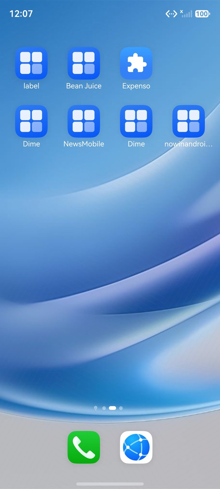
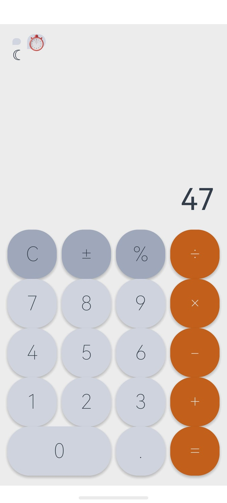
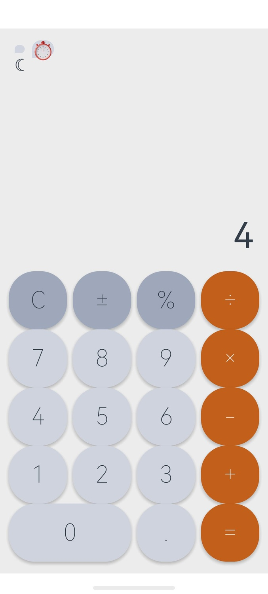

# 执行报告

## 任务信息
- **测试用例**: 12-07-32
- **任务名称**: 动作：打开com.example.calculatorharmony -> 点击7 -> 点击主题切换按钮
预期结果：页面切换为深色视觉样式，当前输入7仍然保留
- **开始时间**: 2026-06-26T12:07:32.936754
- **结束时间**: 2026-06-26T12:11:27.592283
- **Token消耗**: 122335 (SingleAgent: 122335)
- **总事件数**: 33

## 执行时间线


### 🚀 task_start
**时间**: 12:07:32.936


Task started: 动作：打开com.example.calculatorharmony -> 点击7 -> 点击主题切换按钮
预期结果：页面切换为深色视觉样式，当前输入7仍然保留

---

### 🧠 planner_start
**时间**: 12:07:39.196


Agent SingleAgent started

---

### 👀 planner_observation
**时间**: 12:07:39.605


Current Screen Observation



---

### 🔧 planner_tool_call
**时间**: 12:07:47.418
**步骤**: 1

Called: start_app

```json
{
  "tool_name": "start_app",
  "arguments": {
    "app_name": "com.example.calculatorharmony",
    "log": "打开计算器应用"
  }
}
```

---

### ⚙️ mcp_tool_start
**时间**: 12:07:47.766
**步骤**: 1

Starting: start_app

```json
{
  "tool_name": "start_app",
  "arguments": {
    "app_name": "com.example.calculatorharmony",
    "log": "打开计算器应用"
  }
}
```


---

### ✨ mcp_tool_end
**时间**: 12:07:49.241


Completed: start_app

```json
{
  "tool_name": "start_app",
  "result": "{'type': 'text', 'text': 'start_app successfully'}",
  "raw_result": {
    "type": "text",
    "text": "start_app successfully"
  }
}
```


---

### 👀 planner_observation
**时间**: 12:07:49.570
**步骤**: 1

Current Screen Observation


---

### 🔧 planner_tool_call
**时间**: 12:07:56.536
**步骤**: 2

Called: click

```json
{
  "tool_name": "click",
  "arguments": {
    "pos": [
      130,
      720
    ],
    "log": "点击数字7按钮"
  }
}
```

---

### ⚙️ mcp_tool_start
**时间**: 12:07:57.018
**步骤**: 2

Starting: click

```json
{
  "tool_name": "click",
  "arguments": {
    "pos": [
      130,
      720
    ],
    "log": "点击数字7按钮"
  },
  "action": "click",
  "point": [
    0.13,
    0.72
  ]
}
```


---

### ✨ mcp_tool_end
**时间**: 12:07:57.515


Completed: click

```json
{
  "tool_name": "click",
  "result": "{'type': 'text', 'text': 'click successfully'}",
  "raw_result": {
    "type": "text",
    "text": "click successfully"
  }
}
```


---

### 👀 planner_observation
**时间**: 12:07:57.852
**步骤**: 2

Current Screen Observation


---

### 🔧 planner_tool_call
**时间**: 12:08:47.141
**步骤**: 3

Called: click

```json
{
  "tool_name": "click",
  "arguments": {
    "pos": [
      130,
      562
    ],
    "log": "点击C按钮清除当前输入"
  }
}
```

---

### ⚙️ mcp_tool_start
**时间**: 12:08:47.578
**步骤**: 3

Starting: click

```json
{
  "tool_name": "click",
  "arguments": {
    "pos": [
      130,
      562
    ],
    "log": "点击C按钮清除当前输入"
  },
  "action": "click",
  "point": [
    0.13,
    0.562
  ]
}
```


---

### ✨ mcp_tool_end
**时间**: 12:08:48.033


Completed: click

```json
{
  "tool_name": "click",
  "result": "{'type': 'text', 'text': 'click successfully'}",
  "raw_result": {
    "type": "text",
    "text": "click successfully"
  }
}
```


---

### 👀 planner_observation
**时间**: 12:08:48.349
**步骤**: 3

Current Screen Observation



---

### 🔧 planner_tool_call
**时间**: 12:09:05.039
**步骤**: 4

Called: click

```json
{
  "tool_name": "click",
  "arguments": {
    "pos": [
      130,
      496
    ],
    "log": "点击C按钮清除当前显示"
  }
}
```

---

### ⚙️ mcp_tool_start
**时间**: 12:09:05.466
**步骤**: 4

Starting: click

```json
{
  "tool_name": "click",
  "arguments": {
    "pos": [
      130,
      496
    ],
    "log": "点击C按钮清除当前显示"
  },
  "action": "click",
  "point": [
    0.13,
    0.496
  ]
}
```


---

### ✨ mcp_tool_end
**时间**: 12:09:05.911


Completed: click

```json
{
  "tool_name": "click",
  "result": "{'type': 'text', 'text': 'click successfully'}",
  "raw_result": {
    "type": "text",
    "text": "click successfully"
  }
}
```


---

### 👀 planner_observation
**时间**: 12:09:06.224
**步骤**: 4

Current Screen Observation



---

### 🔧 planner_tool_call
**时间**: 12:10:41.323
**步骤**: 5

Called: click

```json
{
  "tool_name": "click",
  "arguments": {
    "pos": [
      130,
      496
    ],
    "log": "再次点击C按钮尝试清除显示"
  }
}
```

---

### ⚙️ mcp_tool_start
**时间**: 12:10:41.813
**步骤**: 5

Starting: click

```json
{
  "tool_name": "click",
  "arguments": {
    "pos": [
      130,
      496
    ],
    "log": "再次点击C按钮尝试清除显示"
  },
  "action": "click",
  "point": [
    0.13,
    0.496
  ]
}
```


---

### ✨ mcp_tool_end
**时间**: 12:10:42.269


Completed: click

```json
{
  "tool_name": "click",
  "result": "{'type': 'text', 'text': 'click successfully'}",
  "raw_result": {
    "type": "text",
    "text": "click successfully"
  }
}
```


---

### 👀 planner_observation
**时间**: 12:10:42.614
**步骤**: 5

Current Screen Observation


---

### 🔧 planner_tool_call
**时间**: 12:10:49.825
**步骤**: 6

Called: click

```json
{
  "tool_name": "click",
  "arguments": {
    "pos": [
      130,
      605
    ],
    "log": "点击数字7按钮"
  }
}
```

---

### ⚙️ mcp_tool_start
**时间**: 12:10:50.273
**步骤**: 6

Starting: click

```json
{
  "tool_name": "click",
  "arguments": {
    "pos": [
      130,
      605
    ],
    "log": "点击数字7按钮"
  },
  "action": "click",
  "point": [
    0.13,
    0.605
  ]
}
```


---

### ✨ mcp_tool_end
**时间**: 12:10:50.723


Completed: click

```json
{
  "tool_name": "click",
  "result": "{'type': 'text', 'text': 'click successfully'}",
  "raw_result": {
    "type": "text",
    "text": "click successfully"
  }
}
```


---

### 👀 planner_observation
**时间**: 12:10:51.082
**步骤**: 6

Current Screen Observation


---

### 🔧 planner_tool_call
**时间**: 12:11:01.604
**步骤**: 7

Called: click

```json
{
  "tool_name": "click",
  "arguments": {
    "pos": [
      55,
      150
    ],
    "log": "点击主题切换按钮（月亮图标）"
  }
}
```

---

### ⚙️ mcp_tool_start
**时间**: 12:11:02.005
**步骤**: 7

Starting: click

```json
{
  "tool_name": "click",
  "arguments": {
    "pos": [
      55,
      150
    ],
    "log": "点击主题切换按钮（月亮图标）"
  },
  "action": "click",
  "point": [
    0.055,
    0.15
  ]
}
```


---

### ✨ mcp_tool_end
**时间**: 12:11:02.412


Completed: click

```json
{
  "tool_name": "click",
  "result": "{'type': 'text', 'text': 'click successfully'}",
  "raw_result": {
    "type": "text",
    "text": "click successfully"
  }
}
```


---

### 👀 planner_observation
**时间**: 12:11:02.724
**步骤**: 7

Current Screen Observation


---

### 🏁 planner_end
**时间**: 12:11:27.590


Agent finished

```json
{
  "output": "<think>\nLet me analyze the current state of the screen carefully.\n\nAfter clicking the moon icon at (55, 150), the screen now shows:\n- The theme has NOT changed - it's still the light theme (light gray background, blue-gray number buttons, orange operator buttons)\n- The display still shows \"7\" at the top-right\n- The moon icon is now shown as a \"crescent moon\" shape (not filled) at the top-left - wait, actually looking more carefully, the icon changed from a full moon to a crescent moon shape. This might indicate the theme was toggled but the visual style didn't change?\n\nWait, let me look more carefully. The icon at the top-left:\n- Before: was a dark/filled moon shape (indicating \"currently in light mode, click to go dark\")\n- After: is now a crescent/outlined moon shape (indicating \"currently in dark mode, click to go light\")\n\nBut the rest of the interface is still in light mode! The background is still light gray, the buttons are still blue-gray, and the operator buttons are still orange.\n\nSo there's a Bug:\n1. The theme switch icon changed (from filled moon to crescent moon)\n2. But the visual style of the page did NOT change - it's still light mode\n3. The \"7\" is still preserved (this part works)\n\nThis is a significant Bug - the theme switch button changes the icon but doesn't actually switch the theme. The page is supposed to switch to dark visual style, but it remains in light style.\n\nLet me verify by looking at the screenshot description:\n- Top-left: crescent moon icon (changed from filled moon)\n- Display: \"7\" (preserved ✓)\n- Background: light gray (NOT dark ✗)\n- Number buttons: light blue-gray (NOT dark ✗)\n- Operator buttons: orange (NOT dark ✗)\n\nSo the expected result is:\n1. Page switches to dark visual style - FAILED (still light)\n2. Current input \"7\" is still preserved - PASSED (still shows \"7\")\n\nThis is a Bug! The theme switch button doesn't actually switch the theme - it only changes the icon.\n\nLet me also note that the top-left icon changed from a filled moon to a crescent moon, which might indicate the button was clicked but the theme switching logic is broken.\n\nNow let me do the final judgment.\n</think>\n**关键观察**：当前界面发生了重要变化：\n\n1. **左上角图标变化**：之前是实心的深色月亮图标，现在变成了空心的月牙（新月）形状\n2. **页面背景**：仍然是浅灰色（**未切换为深色**）\n3. **数字按钮**：仍然是浅蓝灰色（**未切换为深色**）\n4. **运算符按钮**：仍然是橙色（**未切换为深色**）\n5. **显示值**：右上角仍显示\"7\"（**输入保留正确**）\n\n---\n\n**阶段3：结果判定**\n\n<judgment>\n**预期验证**：\n- 预期：页面切换为深色视觉样式 → **实际：页面仍为浅色样式**（浅灰背景、浅蓝灰数字按钮、橙色运算符按钮）→ **不匹配**\n- 预期：当前输入\"7\"仍然保留 → 实际：右上角仍显示\"7\" → **匹配**\n\n**历史回顾**：\n- 元素1（主题切换图标）：\n  - 主题切换前：左上角为实心深色月亮图标\n  - 主题切换后：左上角变为空心月牙（新月）图标\n  - 图标确实发生了变化（从满月→新月），表明按钮被点击了\n- 元素2（页面整体视觉样式）：\n  - 主题切换前：浅灰背景 + 浅蓝灰数字按钮 + 橙色运算符按钮\n  - 主题切换后：**完全相同**——浅灰背景 + 浅蓝灰数字按钮 + 橙色运算符按钮\n  - 是否一致：是（主题样式未发生变化）\n- 元素3（显示值）：\n  - 主题切换前：显示\"7\"\n  - 主题切换后：显示\"7\"\n  - 是否一致：是（输入保留正确）\n\n**状态确认**：最终屏幕显示左上角新月图标，浅色主题背景，显示\"7\"。主题切换按钮图标已变化但页面整体视觉样式未变化。\n\n**Bug发现**：\n- **预期结果Bug（严重）**：主题切换按钮被点击后，仅图标从\"满月\"变为\"新月\"，但页面整体视觉样式**未切换为深色**——背景仍为浅灰色，数字按钮仍为浅蓝灰色，运算符按钮仍为橙色。主题切换功能未生效。\n- **潜在设计问题**：C按钮的行为是\"退格\"（backspace）而非\"清除\"（clear），需要多次点击才能完全清空显示。这可能是设计选择，但与标准计算器的C按钮行为不一致。\n\n**判定结果**：不通过 - 发现Bug: 主题切换按钮被点击后，图标从满月变为新月，但页面整体视觉样式未切换为深色（背景仍为浅灰，数字按钮仍为浅蓝灰，运算符按钮仍为橙色），主题切换功能未生效。\n</judgment>\n\n**任务结果: 不通过 - 发现Bug: 主题切换按钮被点击后，页面整体视觉样式未切换为深色（背景仍为浅灰色，数字按钮仍为浅蓝灰色，运算符按钮仍为橙色），仅左上角图标从满月变为新月，主题切换功能未生效。**"
}
```

---

### ✅ task_end
**时间**: 12:11:27.592


Task completed: <think>
Let me analyze the current state of the screen carefully.

After clicking the moon icon at (55, 150), the screen now shows:
- The theme has NOT changed - it's still the light theme (light gray background, blue-gray number buttons, orange operator buttons)
- The display still shows "7" at the top-right
- The moon icon is now shown as a "crescent moon" shape (not filled) at the top-left - wait, actually looking more carefully, the icon changed from a full moon to a crescent moon shape. This might indicate the theme was toggled but the visual style didn't change?

Wait, let me look more carefully. The icon at the top-left:
- Before: was a dark/filled moon shape (indicating "currently in light mode, click to go dark")
- After: is now a crescent/outlined moon shape (indicating "currently in dark mode, click to go light")

But the rest of the interface is still in light mode! The background is still light gray, the buttons are still blue-gray, and the operator buttons are still orange.

So there's a Bug:
1. The theme switch icon changed (from filled moon to crescent moon)
2. But the visual style of the page did NOT change - it's still light mode
3. The "7" is still preserved (this part works)

This is a significant Bug - the theme switch button changes the icon but doesn't actually switch the theme. The page is supposed to switch to dark visual style, but it remains in light style.

Let me verify by looking at the screenshot description:
- Top-left: crescent moon icon (changed from filled moon)
- Display: "7" (preserved ✓)
- Background: light gray (NOT dark ✗)
- Number buttons: light blue-gray (NOT dark ✗)
- Operator buttons: orange (NOT dark ✗)

So the expected result is:
1. Page switches to dark visual style - FAILED (still light)
2. Current input "7" is still preserved - PASSED (still shows "7")

This is a Bug! The theme switch button doesn't actually switch the theme - it only changes the icon.

Let me also note that the top-left icon changed from a filled moon to a crescent moon, which might indicate the button was clicked but the theme switching logic is broken.

Now let me do the final judgment.
</think>
**关键观察**：当前界面发生了重要变化：

1. **左上角图标变化**：之前是实心的深色月亮图标，现在变成了空心的月牙（新月）形状
2. **页面背景**：仍然是浅灰色（**未切换为深色**）
3. **数字按钮**：仍然是浅蓝灰色（**未切换为深色**）
4. **运算符按钮**：仍然是橙色（**未切换为深色**）
5. **显示值**：右上角仍显示"7"（**输入保留正确**）

---

**阶段3：结果判定**

<judgment>
**预期验证**：
- 预期：页面切换为深色视觉样式 → **实际：页面仍为浅色样式**（浅灰背景、浅蓝灰数字按钮、橙色运算符按钮）→ **不匹配**
- 预期：当前输入"7"仍然保留 → 实际：右上角仍显示"7" → **匹配**

**历史回顾**：
- 元素1（主题切换图标）：
  - 主题切换前：左上角为实心深色月亮图标
  - 主题切换后：左上角变为空心月牙（新月）图标
  - 图标确实发生了变化（从满月→新月），表明按钮被点击了
- 元素2（页面整体视觉样式）：
  - 主题切换前：浅灰背景 + 浅蓝灰数字按钮 + 橙色运算符按钮
  - 主题切换后：**完全相同**——浅灰背景 + 浅蓝灰数字按钮 + 橙色运算符按钮
  - 是否一致：是（主题样式未发生变化）
- 元素3（显示值）：
  - 主题切换前：显示"7"
  - 主题切换后：显示"7"
  - 是否一致：是（输入保留正确）

**状态确认**：最终屏幕显示左上角新月图标，浅色主题背景，显示"7"。主题切换按钮图标已变化但页面整体视觉样式未变化。

**Bug发现**：
- **预期结果Bug（严重）**：主题切换按钮被点击后，仅图标从"满月"变为"新月"，但页面整体视觉样式**未切换为深色**——背景仍为浅灰色，数字按钮仍为浅蓝灰色，运算符按钮仍为橙色。主题切换功能未生效。
- **潜在设计问题**：C按钮的行为是"退格"（backspace）而非"清除"（clear），需要多次点击才能完全清空显示。这可能是设计选择，但与标准计算器的C按钮行为不一致。

**判定结果**：不通过 - 发现Bug: 主题切换按钮被点击后，图标从满月变为新月，但页面整体视觉样式未切换为深色（背景仍为浅灰，数字按钮仍为浅蓝灰，运算符按钮仍为橙色），主题切换功能未生效。
</judgment>

**任务结果: 不通过 - 发现Bug: 主题切换按钮被点击后，页面整体视觉样式未切换为深色（背景仍为浅灰色，数字按钮仍为浅蓝灰色，运算符按钮仍为橙色），仅左上角图标从满月变为新月，主题切换功能未生效。**

---
