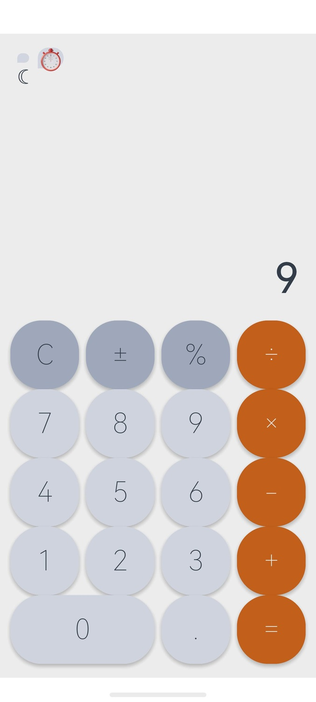

# 执行报告

## 任务信息
- **测试用例**: 11-56-29
- **任务名称**: 动作：打开com.example.calculatorharmony -> 点击9 -> 点击C
预期结果：主计算页面仍然展示，当前输入恢复为0
- **开始时间**: 2026-06-26T11:56:29.726346
- **结束时间**: 2026-06-26T11:57:31.500572
- **Token消耗**: 34163 (SingleAgent: 34163)
- **总事件数**: 17

## 执行时间线


### 🚀 task_start
**时间**: 11:56:29.726


Task started: 动作：打开com.example.calculatorharmony -> 点击9 -> 点击C
预期结果：主计算页面仍然展示，当前输入恢复为0

---

### 🧠 planner_start
**时间**: 11:56:36.474


Agent SingleAgent started

---

### 👀 planner_observation
**时间**: 11:56:36.876


Current Screen Observation


---

### 🔧 planner_tool_call
**时间**: 11:56:47.250
**步骤**: 1

Called: start_app

```json
{
  "tool_name": "start_app",
  "arguments": {
    "app_name": "com.example.calculatorharmony",
    "log": "打开计算器应用"
  }
}
```

---

### ⚙️ mcp_tool_start
**时间**: 11:56:47.712
**步骤**: 1

Starting: start_app

```json
{
  "tool_name": "start_app",
  "arguments": {
    "app_name": "com.example.calculatorharmony",
    "log": "打开计算器应用"
  }
}
```


---

### ✨ mcp_tool_end
**时间**: 11:56:49.317


Completed: start_app

```json
{
  "tool_name": "start_app",
  "result": "{'type': 'text', 'text': 'start_app successfully'}",
  "raw_result": {
    "type": "text",
    "text": "start_app successfully"
  }
}
```


---

### 👀 planner_observation
**时间**: 11:56:49.655
**步骤**: 1

Current Screen Observation


---

### 🔧 planner_tool_call
**时间**: 11:57:00.339
**步骤**: 2

Called: click

```json
{
  "tool_name": "click",
  "arguments": {
    "pos": [
      594,
      600
    ],
    "log": "点击数字9按钮"
  }
}
```

---

### ⚙️ mcp_tool_start
**时间**: 11:57:01.111
**步骤**: 2

Starting: click

```json
{
  "tool_name": "click",
  "arguments": {
    "pos": [
      594,
      600
    ],
    "log": "点击数字9按钮"
  },
  "action": "click",
  "point": [
    0.594,
    0.6
  ]
}
```


---

### ✨ mcp_tool_end
**时间**: 11:57:01.746


Completed: click

```json
{
  "tool_name": "click",
  "result": "{'type': 'text', 'text': 'click successfully'}",
  "raw_result": {
    "type": "text",
    "text": "click successfully"
  }
}
```


---

### 👀 planner_observation
**时间**: 11:57:02.093
**步骤**: 2

Current Screen Observation



---

### 🔧 planner_tool_call
**时间**: 11:57:15.326
**步骤**: 3

Called: click

```json
{
  "tool_name": "click",
  "arguments": {
    "pos": [
      117,
      546
    ],
    "log": "点击C按钮清除输入"
  }
}
```

---

### ⚙️ mcp_tool_start
**时间**: 11:57:15.772
**步骤**: 3

Starting: click

```json
{
  "tool_name": "click",
  "arguments": {
    "pos": [
      117,
      546
    ],
    "log": "点击C按钮清除输入"
  },
  "action": "click",
  "point": [
    0.117,
    0.546
  ]
}
```


---

### ✨ mcp_tool_end
**时间**: 11:57:16.244


Completed: click

```json
{
  "tool_name": "click",
  "result": "{'type': 'text', 'text': 'click successfully'}",
  "raw_result": {
    "type": "text",
    "text": "click successfully"
  }
}
```


---

### 👀 planner_observation
**时间**: 11:57:16.578
**步骤**: 3

Current Screen Observation


---

### 🏁 planner_end
**时间**: 11:57:31.498


Agent finished

```json
{
  "output": "<think>Let me analyze the current state:\n- After clicking C, the display now shows \"0\" (back to the initial state)\n- The main calculator page is still displayed normally\n- All buttons are intact: C, ±, %, ÷, 7, 8, 9, ×, 4, 5, 6, −, 1, 2, 3, +, 0, ., =\n\nComparing with the expected result:\n- 预期结果：主计算页面仍然展示 ✓ (页面正常展示所有按钮)\n- 预期结果：当前输入恢复为0 ✓ (显示区域从\"9\"恢复到\"0\")\n\nAll steps have been completed:\n1. ✓ 打开com.example.calculatorharmony\n2. ✓ 点击9 (显示从0变为9)\n3. ✓ 点击C (显示从9恢复为0)\n\nNow I need to proceed to stage 3: result judgment.</think>\n\n### 第4轮：观察与判定\n\n**观察状态**：\n- 显示区域已恢复为\"0\"（右上角），对比上一步\"9\"→\"0\"，确认C按钮清除成功\n- 主计算页面仍正常展示，所有按钮布局完整：\n  - 第一行：C、±、%、÷\n  - 第二行：7、8、9、×\n  - 第三行：4、5、6、−\n  - 第四行：1、2、3、+\n  - 第五行：0、.、=\n- 左上角箭头图标和右上角闹钟图标正常显示\n- 无弹窗、无异常提示\n\n**已完成3步，上一步：点击C按钮→显示区域从9恢复为0，清除成功，当前：进入结果判定阶段**\n\n所有任务步骤已执行完毕，进入阶段3判定结果。\n\n## 阶段3：结果判定\n\n<judgment>\n**预期验证**：\n- 预期结果1：主计算页面仍然展示。实际结果：主计算页面正常显示，所有按钮完整可点击。是否匹配：是。\n- 预期结果2：当前输入恢复为0。实际结果：显示区域数字从\"9\"恢复为\"0\"。是否匹配：是。\n\n**历史回顾**：\n- 显示区域数字变化：\n  - 应用启动时观察：显示\"0\"（初始状态）\n  - 点击数字9后观察：显示\"9\"（输入成功）\n  - 点击C按钮后观察：显示\"0\"（清除成功，恢复初始状态）\n  - 是否一致：是，三次状态变化符合预期（0→9→0）\n\n- 页面布局：\n  - 启动后观察：C、±、%、÷、7-9、4-6、1-3、0、.、= 按钮完整\n  - 点击9后观察：布局无变化\n  - 点击C后观察：布局仍完整，与启动时一致\n  - 是否一致：是\n\n**状态确认**：最终屏幕显示主计算页面，显示区域为\"0\"，所有按钮布局完整。状态符合预期。\n\n**Bug发现**：\n- 预期结果Bug：无，两项预期结果均匹配。\n- 其他Bug：未发现界面异常、功能异常、性能问题。\n- 按钮显示、颜色（灰色清除按钮、橙色运算符按钮）、布局均正常，无错位、无缺失。\n\n**判定结果**：通过。\n</judgment>\n\n任务结果: 通过"
}
```

---

### ✅ task_end
**时间**: 11:57:31.500


Task completed: <think>Let me analyze the current state:
- After clicking C, the display now shows "0" (back to the initial state)
- The main calculator page is still displayed normally
- All buttons are intact: C, ±, %, ÷, 7, 8, 9, ×, 4, 5, 6, −, 1, 2, 3, +, 0, ., =

Comparing with the expected result:
- 预期结果：主计算页面仍然展示 ✓ (页面正常展示所有按钮)
- 预期结果：当前输入恢复为0 ✓ (显示区域从"9"恢复到"0")

All steps have been completed:
1. ✓ 打开com.example.calculatorharmony
2. ✓ 点击9 (显示从0变为9)
3. ✓ 点击C (显示从9恢复为0)

Now I need to proceed to stage 3: result judgment.</think>

### 第4轮：观察与判定

**观察状态**：
- 显示区域已恢复为"0"（右上角），对比上一步"9"→"0"，确认C按钮清除成功
- 主计算页面仍正常展示，所有按钮布局完整：
  - 第一行：C、±、%、÷
  - 第二行：7、8、9、×
  - 第三行：4、5、6、−
  - 第四行：1、2、3、+
  - 第五行：0、.、=
- 左上角箭头图标和右上角闹钟图标正常显示
- 无弹窗、无异常提示

**已完成3步，上一步：点击C按钮→显示区域从9恢复为0，清除成功，当前：进入结果判定阶段**

所有任务步骤已执行完毕，进入阶段3判定结果。

## 阶段3：结果判定

<judgment>
**预期验证**：
- 预期结果1：主计算页面仍然展示。实际结果：主计算页面正常显示，所有按钮完整可点击。是否匹配：是。
- 预期结果2：当前输入恢复为0。实际结果：显示区域数字从"9"恢复为"0"。是否匹配：是。

**历史回顾**：
- 显示区域数字变化：
  - 应用启动时观察：显示"0"（初始状态）
  - 点击数字9后观察：显示"9"（输入成功）
  - 点击C按钮后观察：显示"0"（清除成功，恢复初始状态）
  - 是否一致：是，三次状态变化符合预期（0→9→0）

- 页面布局：
  - 启动后观察：C、±、%、÷、7-9、4-6、1-3、0、.、= 按钮完整
  - 点击9后观察：布局无变化
  - 点击C后观察：布局仍完整，与启动时一致
  - 是否一致：是

**状态确认**：最终屏幕显示主计算页面，显示区域为"0"，所有按钮布局完整。状态符合预期。

**Bug发现**：
- 预期结果Bug：无，两项预期结果均匹配。
- 其他Bug：未发现界面异常、功能异常、性能问题。
- 按钮显示、颜色（灰色清除按钮、橙色运算符按钮）、布局均正常，无错位、无缺失。

**判定结果**：通过。
</judgment>

任务结果: 通过

---
