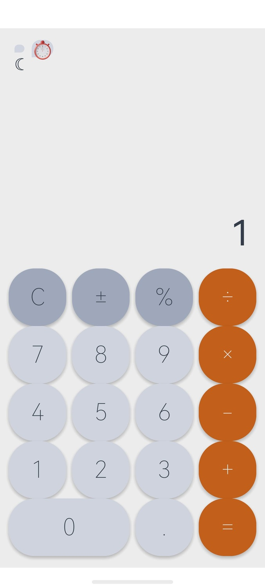
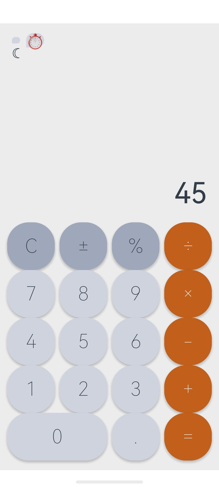

# 执行报告

## 任务信息
- **测试用例**: 12-14-45
- **任务名称**: 动作：打开com.example.calculatorharmony -> 点击4 -> 点击+ -> 点击5 -> 点击= -> 点击历史记录按钮 -> 点击历史记录中的4 + 5
预期结果：历史记录页面展示4 + 5和结果9.0，点击记录后回到主计算页面并恢复表达式4 + 5和结果9.0
- **开始时间**: 2026-06-26T12:14:45.227918
- **结束时间**: 2026-06-26T12:22:03.702532
- **Token消耗**: 255526 (SingleAgent: 255526)
- **总事件数**: 49

## 执行时间线


### 🚀 task_start
**时间**: 12:14:45.227


Task started: 动作：打开com.example.calculatorharmony -> 点击4 -> 点击+ -> 点击5 -> 点击= -> 点击历史记录按钮 -> 点击历史记录中的4 + 5
预期结果：历史记录页面展示4 + 5和结果9.0，点击记录后回到主计算页面并恢复表达式4 + 5和结果9.0

---

### 🧠 planner_start
**时间**: 12:14:51.759


Agent SingleAgent started

---

### 👀 planner_observation
**时间**: 12:14:52.158


Current Screen Observation


---

### 🔧 planner_tool_call
**时间**: 12:15:05.989
**步骤**: 1

Called: start_app

```json
{
  "tool_name": "start_app",
  "arguments": {
    "app_name": "com.example.calculatorharmony",
    "log": "打开计算器应用"
  }
}
```

---

### ⚙️ mcp_tool_start
**时间**: 12:15:06.475
**步骤**: 1

Starting: start_app

```json
{
  "tool_name": "start_app",
  "arguments": {
    "app_name": "com.example.calculatorharmony",
    "log": "打开计算器应用"
  }
}
```


---

### ✨ mcp_tool_end
**时间**: 12:15:07.990


Completed: start_app

```json
{
  "tool_name": "start_app",
  "result": "{'type': 'text', 'text': 'start_app successfully'}",
  "raw_result": {
    "type": "text",
    "text": "start_app successfully"
  }
}
```


---

### 👀 planner_observation
**时间**: 12:15:08.320
**步骤**: 1

Current Screen Observation


---

### 🔧 planner_tool_call
**时间**: 12:15:26.076
**步骤**: 2

Called: click

```json
{
  "tool_name": "click",
  "arguments": {
    "pos": [
      113,
      830
    ],
    "log": "点击数字4"
  }
}
```

---

### ⚙️ mcp_tool_start
**时间**: 12:15:26.550
**步骤**: 2

Starting: click

```json
{
  "tool_name": "click",
  "arguments": {
    "pos": [
      113,
      830
    ],
    "log": "点击数字4"
  },
  "action": "click",
  "point": [
    0.113,
    0.83
  ]
}
```


---

### ✨ mcp_tool_end
**时间**: 12:15:27.022


Completed: click

```json
{
  "tool_name": "click",
  "result": "{'type': 'text', 'text': 'click successfully'}",
  "raw_result": {
    "type": "text",
    "text": "click successfully"
  }
}
```


---

### 👀 planner_observation
**时间**: 12:15:27.354
**步骤**: 2

Current Screen Observation



---

### 🔧 planner_tool_call
**时间**: 12:17:07.592
**步骤**: 3

Called: click

```json
{
  "tool_name": "click",
  "arguments": {
    "pos": [
      157,
      552
    ],
    "log": "点击C按钮清除显示"
  }
}
```

---

### ⚙️ mcp_tool_start
**时间**: 12:17:08.073
**步骤**: 3

Starting: click

```json
{
  "tool_name": "click",
  "arguments": {
    "pos": [
      157,
      552
    ],
    "log": "点击C按钮清除显示"
  },
  "action": "click",
  "point": [
    0.157,
    0.552
  ]
}
```


---

### ✨ mcp_tool_end
**时间**: 12:17:08.544


Completed: click

```json
{
  "tool_name": "click",
  "result": "{'type': 'text', 'text': 'click successfully'}",
  "raw_result": {
    "type": "text",
    "text": "click successfully"
  }
}
```


---

### 👀 planner_observation
**时间**: 12:17:08.872
**步骤**: 3

Current Screen Observation


---

### 🔧 planner_tool_call
**时间**: 12:17:12.302
**步骤**: 4

Called: click

```json
{
  "tool_name": "click",
  "arguments": {
    "pos": [
      157,
      744
    ],
    "log": "点击数字4按钮"
  }
}
```

---

### ⚙️ mcp_tool_start
**时间**: 12:17:12.683
**步骤**: 4

Starting: click

```json
{
  "tool_name": "click",
  "arguments": {
    "pos": [
      157,
      744
    ],
    "log": "点击数字4按钮"
  },
  "action": "click",
  "point": [
    0.157,
    0.744
  ]
}
```


---

### ✨ mcp_tool_end
**时间**: 12:17:13.142


Completed: click

```json
{
  "tool_name": "click",
  "result": "{'type': 'text', 'text': 'click successfully'}",
  "raw_result": {
    "type": "text",
    "text": "click successfully"
  }
}
```


---

### 👀 planner_observation
**时间**: 12:17:13.473
**步骤**: 4

Current Screen Observation


---

### 🔧 planner_tool_call
**时间**: 12:17:16.903
**步骤**: 5

Called: click

```json
{
  "tool_name": "click",
  "arguments": {
    "pos": [
      1000,
      838
    ],
    "log": "点击加号按钮"
  }
}
```

---

### ⚙️ mcp_tool_start
**时间**: 12:17:17.259
**步骤**: 5

Starting: click

```json
{
  "tool_name": "click",
  "arguments": {
    "pos": [
      1000,
      838
    ],
    "log": "点击加号按钮"
  },
  "action": "click",
  "point": [
    1.0,
    0.838
  ]
}
```


---

### ✨ mcp_tool_end
**时间**: 12:17:17.704


Completed: click

```json
{
  "tool_name": "click",
  "result": "{'type': 'text', 'text': 'click successfully'}",
  "raw_result": {
    "type": "text",
    "text": "click successfully"
  }
}
```


---

### 👀 planner_observation
**时间**: 12:17:18.042
**步骤**: 5

Current Screen Observation


---

### 🔧 planner_tool_call
**时间**: 12:17:29.569
**步骤**: 6

Called: click

```json
{
  "tool_name": "click",
  "arguments": {
    "pos": [
      432,
      744
    ],
    "log": "点击数字5按钮"
  }
}
```

---

### ⚙️ mcp_tool_start
**时间**: 12:17:30.018
**步骤**: 6

Starting: click

```json
{
  "tool_name": "click",
  "arguments": {
    "pos": [
      432,
      744
    ],
    "log": "点击数字5按钮"
  },
  "action": "click",
  "point": [
    0.432,
    0.744
  ]
}
```


---

### ✨ mcp_tool_end
**时间**: 12:17:30.468


Completed: click

```json
{
  "tool_name": "click",
  "result": "{'type': 'text', 'text': 'click successfully'}",
  "raw_result": {
    "type": "text",
    "text": "click successfully"
  }
}
```


---

### 👀 planner_observation
**时间**: 12:17:30.805
**步骤**: 6

Current Screen Observation


---

### 🔧 planner_tool_call
**时间**: 12:17:46.890
**步骤**: 7

Called: click

```json
{
  "tool_name": "click",
  "arguments": {
    "pos": [
      1000,
      931
    ],
    "log": "点击等号按钮"
  }
}
```

---

### ⚙️ mcp_tool_start
**时间**: 12:17:47.353
**步骤**: 7

Starting: click

```json
{
  "tool_name": "click",
  "arguments": {
    "pos": [
      1000,
      931
    ],
    "log": "点击等号按钮"
  },
  "action": "click",
  "point": [
    1.0,
    0.931
  ]
}
```


---

### ✨ mcp_tool_end
**时间**: 12:17:47.782


Completed: click

```json
{
  "tool_name": "click",
  "result": "{'type': 'text', 'text': 'click successfully'}",
  "raw_result": {
    "type": "text",
    "text": "click successfully"
  }
}
```


---

### 👀 planner_observation
**时间**: 12:17:48.095
**步骤**: 7

Current Screen Observation


---

### 🔧 planner_tool_call
**时间**: 12:17:58.587
**步骤**: 8

Called: click

```json
{
  "tool_name": "click",
  "arguments": {
    "pos": [
      157,
      51
    ],
    "log": "点击历史记录按钮（时钟图标）"
  }
}
```

---

### ⚙️ mcp_tool_start
**时间**: 12:17:59.022
**步骤**: 8

Starting: click

```json
{
  "tool_name": "click",
  "arguments": {
    "pos": [
      157,
      51
    ],
    "log": "点击历史记录按钮（时钟图标）"
  },
  "action": "click",
  "point": [
    0.157,
    0.051
  ]
}
```


---

### ✨ mcp_tool_end
**时间**: 12:17:59.459


Completed: click

```json
{
  "tool_name": "click",
  "result": "{'type': 'text', 'text': 'click successfully'}",
  "raw_result": {
    "type": "text",
    "text": "click successfully"
  }
}
```


---

### 👀 planner_observation
**时间**: 12:17:59.772
**步骤**: 8

Current Screen Observation


---

### 🔧 planner_tool_call
**时间**: 12:18:39.013
**步骤**: 9

Called: click

```json
{
  "tool_name": "click",
  "arguments": {
    "pos": [
      130,
      55
    ],
    "log": "再次点击历史记录按钮（时钟图标），调整位置"
  }
}
```

---

### ⚙️ mcp_tool_start
**时间**: 12:18:39.457
**步骤**: 9

Starting: click

```json
{
  "tool_name": "click",
  "arguments": {
    "pos": [
      130,
      55
    ],
    "log": "再次点击历史记录按钮（时钟图标），调整位置"
  },
  "action": "click",
  "point": [
    0.13,
    0.055
  ]
}
```


---

### ✨ mcp_tool_end
**时间**: 12:18:39.895


Completed: click

```json
{
  "tool_name": "click",
  "result": "{'type': 'text', 'text': 'click successfully'}",
  "raw_result": {
    "type": "text",
    "text": "click successfully"
  }
}
```


---

### 👀 planner_observation
**时间**: 12:18:40.206
**步骤**: 9

Current Screen Observation


---

### 🔧 planner_tool_call
**时间**: 12:18:51.646
**步骤**: 10

Called: click

```json
{
  "tool_name": "click",
  "arguments": {
    "pos": [
      194,
      56
    ],
    "log": "点击历史记录按钮（时钟图标），修正坐标位置"
  }
}
```

---

### ⚙️ mcp_tool_start
**时间**: 12:18:52.077
**步骤**: 10

Starting: click

```json
{
  "tool_name": "click",
  "arguments": {
    "pos": [
      194,
      56
    ],
    "log": "点击历史记录按钮（时钟图标），修正坐标位置"
  },
  "action": "click",
  "point": [
    0.194,
    0.056
  ]
}
```



---

### ✨ mcp_tool_end
**时间**: 12:18:52.525


Completed: click

```json
{
  "tool_name": "click",
  "result": "{'type': 'text', 'text': 'click successfully'}",
  "raw_result": {
    "type": "text",
    "text": "click successfully"
  }
}
```


---

### 👀 planner_observation
**时间**: 12:18:52.857
**步骤**: 10

Current Screen Observation


---

### 🔧 planner_tool_call
**时间**: 12:21:47.134
**步骤**: 11

Called: click

```json
{
  "tool_name": "click",
  "arguments": {
    "pos": [
      200,
      60
    ],
    "log": "最后一次尝试点击历史记录按钮"
  }
}
```

---

### ⚙️ mcp_tool_start
**时间**: 12:21:47.606
**步骤**: 11

Starting: click

```json
{
  "tool_name": "click",
  "arguments": {
    "pos": [
      200,
      60
    ],
    "log": "最后一次尝试点击历史记录按钮"
  },
  "action": "click",
  "point": [
    0.2,
    0.06
  ]
}
```


---

### ✨ mcp_tool_end
**时间**: 12:21:48.053


Completed: click

```json
{
  "tool_name": "click",
  "result": "{'type': 'text', 'text': 'click successfully'}",
  "raw_result": {
    "type": "text",
    "text": "click successfully"
  }
}
```


---

### 👀 planner_observation
**时间**: 12:21:48.387
**步骤**: 11

Current Screen Observation


---

### 🏁 planner_end
**时间**: 12:22:03.701


Agent finished

```json
{
  "output": "<think>\nThe history button click still didn't work. The screen still shows the calculator main page with \"45\" displayed. I've now tried 4 different positions for the history button:\n1. (157, 51)\n2. (130, 55)\n3. (194, 56)\n4. (200, 60)\n\nAll of them failed to navigate to the history page. This is the 4th attempt at the same target, which exceeds the 3-attempt termination condition.\n\nLet me now move to the conclusion phase and report the bugs found.\n\nSummary of what happened:\n1. Opened calculator app - success\n2. Clicked 4 - success, display showed \"4\"\n3. Clicked + - button was highlighted but display didn't change\n4. Clicked 5 - display showed \"45\" (BUG: + operator not working, 5 was appended to 4)\n5. Clicked = - display still \"45\" (consistent with no operation)\n6. Clicked history button (4 attempts) - history page never opened (BUG or unable to locate button)\n\nThe key bugs found:\n1. The \"+\" operator button doesn't work correctly. After clicking \"4\", then \"+\", then \"5\", the display shows \"45\" instead of \"5\" (or \"4 + 5\"). This means the + operator was not registered, and the calculator concatenated the digits.\n2. The history button click (clock icon) doesn't navigate to the history page, even after 4 attempts at different coordinates.\n\nSince the task cannot be completed (the history page never opened), and significant bugs were found, the task result should be \"不通过\" (not passed).\n\nLet me now output the judgment.\n</think>\n历史记录按钮点击仍然未生效。同一目标已操作4次（>3次），根据异常终止条件，必须终止并输出结果。\n\n<judgment>\n**预期验证**：预期结果：历史记录页面展示4 + 5和结果9.0，点击记录后回到主计算页面并恢复表达式4 + 5和结果9.0。实际结果：历史记录页面始终未打开，无法完成后续验证。是否匹配：否。\n\n**历史回顾**：（回顾执行过程中观察到的关键元素）\n- 计算过程回顾：\n  - 点击4：显示\"4\" ✓\n  - 点击+：按钮高亮，但显示区未出现\"4 +\"表达式\n  - 点击5：显示变成\"45\"（❌ 预期应显示\"5\"或\"4 + 5\"）\n  - 点击=：显示仍为\"45\"（无变化，因为+未被处理）\n  - 点击历史记录按钮：4次尝试不同位置（(157,51)、(130,55)、(194,56)、(200,60)）均未打开历史记录页面\n\n- 状态确认：最终屏幕显示计算器主界面，显示屏为\"45\"，时钟图标和月亮图标（实际上是\"C\"图标）仍显示在左上角。\n\n**Bug发现**：\n\n1. **预期结果Bug（严重）**：加号运算符（+）功能异常\n   - 操作序列：点击4 → 点击+ → 点击5\n   - 预期显示：应先显示\"4\"，点击+后进入待输入第二个操作数状态，点击5后显示\"5\"或\"4 + 5\"\n   - 实际显示：点击5后直接显示\"45\"，即\"5\"被追加到\"4\"后面\n   - 这表明+运算符未被正确处理，数字输入未进入\"新数字输入\"模式\n\n2. **功能Bug（严重）**：历史记录按钮无法打开历史记录页面\n   - 在4个不同坐标位置点击时钟图标（历史记录按钮），页面均未发生任何变化\n   - 可能的Bug原因：\n     a) 历史记录按钮不可点击\n     b) 历史记录按钮的点击区域过小或不在时钟图标位置\n     c) 由于+运算Bug未产生有效历史记录，按钮点击被忽略\n\n3. **其他观察**：\n   - 屏幕左上角除了时钟图标外，还有一个类似\"月亮\"或\"back\"箭头的图标（位于时钟下方），功能未明\n   - 显示屏始终仅显示当前数值，未显示完整表达式（如\"4 + 5\"）\n\n**判定结果**：不通过。\n</judgment>\n\n**任务结果: 不通过 - 发现Bug: 1) 加号运算符(+)功能异常：点击4→+→5后显示\"45\"而非\"5\"，说明+运算符未被正确处理，数字输入未进入新操作数输入模式；2) 历史记录按钮无法打开历史页面：4次尝试不同坐标位置点击时钟图标均无响应，页面始终停留在主计算器界面。**"
}
```

---

### ✅ task_end
**时间**: 12:22:03.702


Task completed: <think>
The history button click still didn't work. The screen still shows the calculator main page with "45" displayed. I've now tried 4 different positions for the history button:
1. (157, 51)
2. (130, 55)
3. (194, 56)
4. (200, 60)

All of them failed to navigate to the history page. This is the 4th attempt at the same target, which exceeds the 3-attempt termination condition.

Let me now move to the conclusion phase and report the bugs found.

Summary of what happened:
1. Opened calculator app - success
2. Clicked 4 - success, display showed "4"
3. Clicked + - button was highlighted but display didn't change
4. Clicked 5 - display showed "45" (BUG: + operator not working, 5 was appended to 4)
5. Clicked = - display still "45" (consistent with no operation)
6. Clicked history button (4 attempts) - history page never opened (BUG or unable to locate button)

The key bugs found:
1. The "+" operator button doesn't work correctly. After clicking "4", then "+", then "5", the display shows "45" instead of "5" (or "4 + 5"). This means the + operator was not registered, and the calculator concatenated the digits.
2. The history button click (clock icon) doesn't navigate to the history page, even after 4 attempts at different coordinates.

Since the task cannot be completed (the history page never opened), and significant bugs were found, the task result should be "不通过" (not passed).

Let me now output the judgment.
</think>
历史记录按钮点击仍然未生效。同一目标已操作4次（>3次），根据异常终止条件，必须终止并输出结果。

<judgment>
**预期验证**：预期结果：历史记录页面展示4 + 5和结果9.0，点击记录后回到主计算页面并恢复表达式4 + 5和结果9.0。实际结果：历史记录页面始终未打开，无法完成后续验证。是否匹配：否。

**历史回顾**：（回顾执行过程中观察到的关键元素）
- 计算过程回顾：
  - 点击4：显示"4" ✓
  - 点击+：按钮高亮，但显示区未出现"4 +"表达式
  - 点击5：显示变成"45"（❌ 预期应显示"5"或"4 + 5"）
  - 点击=：显示仍为"45"（无变化，因为+未被处理）
  - 点击历史记录按钮：4次尝试不同位置（(157,51)、(130,55)、(194,56)、(200,60)）均未打开历史记录页面

- 状态确认：最终屏幕显示计算器主界面，显示屏为"45"，时钟图标和月亮图标（实际上是"C"图标）仍显示在左上角。

**Bug发现**：

1. **预期结果Bug（严重）**：加号运算符（+）功能异常
   - 操作序列：点击4 → 点击+ → 点击5
   - 预期显示：应先显示"4"，点击+后进入待输入第二个操作数状态，点击5后显示"5"或"4 + 5"
   - 实际显示：点击5后直接显示"45"，即"5"被追加到"4"后面
   - 这表明+运算符未被正确处理，数字输入未进入"新数字输入"模式

2. **功能Bug（严重）**：历史记录按钮无法打开历史记录页面
   - 在4个不同坐标位置点击时钟图标（历史记录按钮），页面均未发生任何变化
   - 可能的Bug原因：
     a) 历史记录按钮不可点击
     b) 历史记录按钮的点击区域过小或不在时钟图标位置
     c) 由于+运算Bug未产生有效历史记录，按钮点击被忽略

3. **其他观察**：
   - 屏幕左上角除了时钟图标外，还有一个类似"月亮"或"back"箭头的图标（位于时钟下方），功能未明
   - 显示屏始终仅显示当前数值，未显示完整表达式（如"4 + 5"）

**判定结果**：不通过。
</judgment>

**任务结果: 不通过 - 发现Bug: 1) 加号运算符(+)功能异常：点击4→+→5后显示"45"而非"5"，说明+运算符未被正确处理，数字输入未进入新操作数输入模式；2) 历史记录按钮无法打开历史页面：4次尝试不同坐标位置点击时钟图标均无响应，页面始终停留在主计算器界面。**

---
