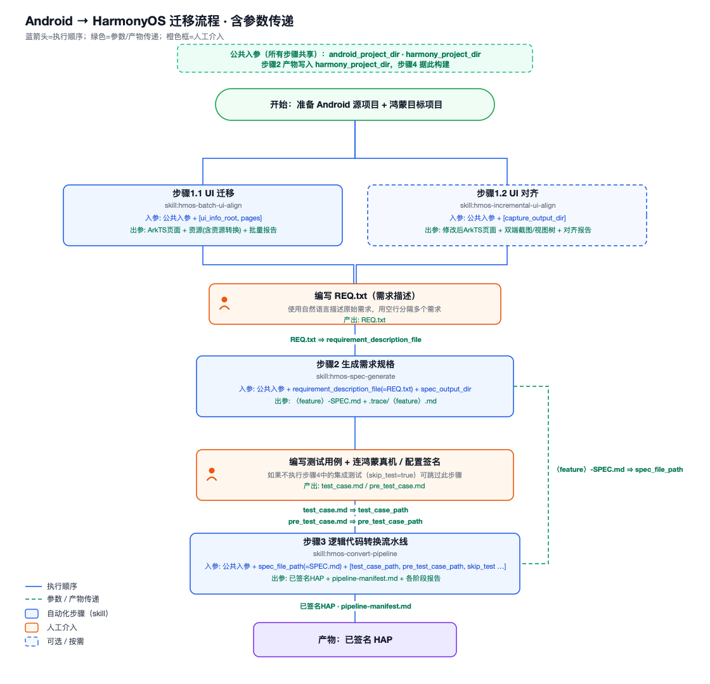

# HomeTrans 迁移流程总结

## 1.HomeTrans 到底是什么

HomeTrans 是一套迁移工作台。它通过 `ht init` 把 skills、agents、tools、MCP 配置安装到 Codex、OpenCode 等编程 Agent 环境里。真正执行迁移工作的，不是 `ht` 这个命令本身，而是这些 Agent 根据 HomeTrans 提供的流程和技能一步步完成。一句话概括：

```text
ht 负责安装和配置迁移能力；Codex/OpenCode 这类 Agent 负责真正执行迁移。
```

需要重点说明这几个边界：

| 问题 | 说明 |
|---|---|
| `ht` 是不是一个迁移 Agent？ | 不是。它是 skills、agents、tools 的安装和配置入口。 |
| 迁移是谁执行的？ | Codex、OpenCode 等编程 Agent。 |
| HomeTrans 提供什么？ | 迁移流程、阶段说明、子 Agent、构建/测试工具、AutoTest 接入。 |
| 人还需要做什么？ | 准备 Android 工程、Harmony 模板、需求、测试用例，并做最终验收。 |

HomeTrans 的流程不是单步转换，而是从 UI、SPEC、逻辑、构建、评审、自测、修复组成的一条链路。

## 2. 工程里有哪些角色

### 2.1 CLI：入口层

`ht init` 主要做三件事：

1. 检测本机环境。
2. 写入 HomeTrans 配置。
3. 把 skills、agents、tools 安装到目标编辑器或 Agent 环境。

### 2.2 Skills：流程入口

skills 是用户或 Agent 调用的迁移阶段入口。

这里主要整理主流程中的几个核心 skill：

| Skill | 在流程里的位置 | 作用说明 |
|---|---|---|
| `hmos-batch-ui-align` | UI 初迁移 | 从 Android 页面快照和资源生成 HarmonyOS 初版 UI |
| `hmos-incremental-ui-align` | UI 对齐 | 对比 Android/HarmonyOS 截图和 view tree，做增量修正 |
| `hmos-spec-generate` | 规格生成 | 把人工需求和 Android 代码行为转成迁移 SPEC |
| `hmos-convert-pipeline` | 主流水线 | 逻辑迁移、构建、评审、修复、自测都在这里串起来 |
| `hmos-resources-convert` | 资源转换 | 把 Android 资源（strings、colors、images 等）转成 HarmonyOS 格式；也被 `hmos-batch-ui-align` 内部调用 |
| `hmos-integration-test` | 自测能力单独调用 | 只跑 HAP + test_case 的设备端验收 |
| `hmos-fix-build-errors` | 独立构建修复 | 当 Harmony 工程编译失败时单独使用 |

### 2.3 Agents

pipeline 里真正做事的是一组子 Agent。可以按阶段理解：

| 阶段 | Agent | 做什么 |
|---|---|---|
| 需求理解 | `spec-generator` | 从需求和 Android 代码生成 SPEC |
| 方案收敛 | `logic-context-builder` | 把 SPEC 收敛成可执行的 ArkTS 修改计划 |
| 代码实现 | `logic-coder` | 按计划写 HarmonyOS 逻辑代码 |
| 构建修复 | `build-fixer` | 构建 HAP，解析错误，循环修复 |
| 代码评审 | `code-reviewer` | 对照 SPEC 检查实现是否覆盖需求 |
| 评审修复 | `review-fixer` | 修复评审中确认的问题 |
| 设备自测 | `self-tester` | 把测试用例转成结构化输入，安装 HAP，跑 AutoTest |
| 自测修复 | `self-test-fixer` | 根据自测失败报告，从代码角度确认并修复问题 |

### 2.4 Tools：确定性执行层

这些工具都是确定性 Python 脚本，按迁移流程的先后顺序排列：

#### ① UI 采集工具（batch-ui-align / incremental-ui-align 阶段）

| 工具 | 用途 | 在哪一步调用 |
|---|---|---|
| `android_parse_fast.py` | 连接 Android 模拟器，BFS 遍历 App 所有可达页面，每页生成 `screenshot.png` + `view.xml` + `meta.json`。纯 ADB + XML 解析，不涉及 AI | batch-ui-align **Step 3**（页面探索） |
| `app_feature_verify.py` | 用 phone_agent 按自然语言描述导航到目标页面，支持 Android（ADB）和 HarmonyOS（HDC）双端。phone_agent 导航过程中也会截图，但目的是发给模型判断"下一步点哪里"，用完即丢 | incremental-ui-align **Step 1.2**（双端页面导航） |
| `page_capture.py` | 到达目标页后负责正式采集：dump view tree + 截图 + 滚动采集，产物保存下来用于后续 UI 对比 | incremental-ui-align **Step 1.2**（页面采集） |

#### ② 逻辑迁移辅助工具（convert-pipeline Stage 1a 阶段）

| 工具 | 用途 | 在哪一步调用 |
|---|---|---|
| `platform_context_query.py` | 调 DeepWiki API 查询 Android → HarmonyOS 平台差异上下文（API 映射、迁移注意事项），为 logic-coder 提供平台特定的迁移建议 | logic-coder **内部调用**（Stage 1a 逻辑编码阶段） |

#### ③ AutoTest 工具链（convert-pipeline Stage 4 / integration-test 阶段）

| 工具 | 用途 | 在哪一步调用 |
|---|---|---|
| `testcases_tool.py` | 把 self-tester 从 test_case.md 提取的 `_extracted.json` 转成 AutoTest 可执行的 `testcases.json`，并校验格式（检查 app_name 是否已替换为 bundle_name、[PRE] 前缀是否连续等） | self-tester **S5 步骤**（仅 Round 1） |
| `self_test_runner.py` | 三合一工具：① `run` 子命令读取配置 → 安装 HAP → 启动 AutoTest.batch 后台进程并返回 PID；② `status` 子命令轮询测试进度，返回已完成用例数、状态（RUNNING/COMPLETED/CRASHED）；③ `kill` 子命令终止超时的测试进程 | self-tester **T6 步骤**（启动）和 **T7 步骤**（轮询） |
| `report_tool.py` | 根据 AutoTest 产出的 `task_results.jsonl` 渲染成人类可读的 `self-test-report.md`，包含通过率统计、每个用例的 PASS/FAIL/UNKNOWN 状态、失败原因、AutoTest 任务路径 | self-tester **T9 步骤**（每轮结束后） |
| `AutoTest.batch` | 真正的测试执行引擎。每个用例的流程：读测试步骤 → 启动 App → 截图 → 调多模态模型理解界面 → 执行点击/输入/滑动 → 再截图 → 调模型判断结果 → 产出 PASS/FAIL/UNKNOWN | 由 `self_test_runner.py run` 在 **T6 步骤**启动为后台进程 |

AutoTest 工具链的数据流：

```text
test_case.md
  ↓ self-tester S4 步骤（LLM 提取）
_extracted.json
  ↓ testcases_tool.py（S5 步骤）
testcases.json
  ↓ self_test_runner.py run（T6 步骤）
AutoTest.batch 后台执行
  ↓ 每个用例：截图 + 多模态模型判断
task_results.jsonl
  ↓ report_tool.py（T9 步骤）
self-test-report.md
```

### 2.5 MCP 服务：Agent 的外部能力

HomeTrans 是迁移流程和工具集合；MCP 是其中被 Agent 调用的外部能力。这里不要把 `hometrans` 这个 MCP 名字和 HomeTrans 整个工程混在一起。

| MCP | 谁在用 | 作用 | 调用时机 |
|---|---|---|---|
| `gitnexus` | `spec-generator` | 作为代码分析服务读取 Android 源工程，建立代码索引；用于把人工需求对应到真实入口、调用链、状态和数据流，支撑 SPEC 生成 | spec-generate 阶段（Step 2 建索引 + Step 3 逐个 REQ 查代码） |
| `hometrans` MCP | `code-reviewer` | 对 logic-coder 提交的 commit 做 git diff，提取改动的文件和行号区间，告诉 reviewer 只看这些改动，避免读整个工程 | pipeline Stage 3 代码审查 **Round 1**，传入 logic-coder 的 commit_id（不用 build-fixer 的）；Round 2+ 不调用，改为整体审查因为 review-fixer 改动已超出原始 commit 范围 |

`hometrans` MCP 的具体流程：

```text
logic-coder 改完代码 → git commit（commitId: abc123）
  ↓
code-reviewer 启动，传 commit_id = abc123
  ↓
extract_commit_context 做 git diff（abc123 vs parent）
  ↓
返回改动索引：pages/Index.ets 第 25-40 行改了，viewmodel/xxx.ets 第 80-95 行改了
  ↓
code-reviewer 只读这些行号区间，对照 SPEC 检查
```

只注册了一个工具 `extract_commit_context`，代码在 `HomeTrans/src/cli/mcp.ts`，通过 `ht mcp` 命令以 stdio 方式启动。

注意：

```text
HomeTrans：迁移框架，提供 skills、agents、tools、流程说明和配置。
代码分析服务：HomeTrans 在生成 SPEC 时会调用它读取 Android 源码；文档和命令里常见名字是 gitnexus / homegraph。
hometrans MCP：HomeTrans 里的一个辅助 MCP，主要服务 pipeline 的代码评审阶段。
```

所以前后关系是：HomeTrans 调度迁移流程，代码分析服务帮它理解 Android 源码，`hometrans` MCP 帮它在评审阶段缩小 HarmonyOS 改动检查范围。不是 GitNexus 和 HomeTrans 两个同级系统互相替代。

## 3. 环境依赖

| 依赖 | 为什么需要 | 缺失后影响 |
|---|---|---|
| DevEco Studio | 提供 HarmonyOS SDK、hvigor、ohpm、hdc、ArkTS 构建环境 | 无法稳定构建 HAP；UI 对齐和测试也会受影响 |
| hdc | 安装 HAP、启动应用、连接 HarmonyOS 设备 | 不能做设备端运行和测试 |
| Android Studio / adb | 连接 Android 设备、抓取 Android 页面快照、辅助 UI 对齐 | 不能自动采集 Android 页面 |
| Python >= 3.10 | 执行页面采集、解析、自测辅助脚本 | UI 迁移和 UI 对齐脚本无法运行 |
| uv | 创建 AutoTest Python 环境，安装本地 whl 依赖 | 自测 / 集成测试无法运行 |
| 代码分析服务（gitnexus / homegraph） | 分析 Android 代码结构，支撑 SPEC 生成 | `hmos-spec-generate` 不能正常工作 |
| 多模态模型 API | AutoTest 看图、理解界面、判断结果 | 设备端自然语言 UI 验收无法运行 |


```text
依赖多，不是因为 HomeTrans 本身复杂，而是迁移链路跨越了 Android 构建、HarmonyOS 构建、双端设备、代码分析和多模态测试。
```

## 4. 标准迁移流程

README 中的迁移流程图：



```text
步骤 0：环境准备
步骤 1.1：UI 迁移 hmos-batch-ui-align
步骤 1.2：UI 对齐 hmos-incremental-ui-align
步骤 2：生成需求规格 hmos-spec-generate
步骤 3：逻辑代码转换流水线 hmos-convert-pipeline
步骤 4：人工验收
```

README 里还列了两个可独立调用的能力。它们不是额外主流程，而是主流程里的能力可以拆出来单独跑：

```text
资源转换 hmos-resources-convert（主流程里属于 hmos-batch-ui-align 的内部步骤）
集成测试 hmos-integration-test
```

### 4.1 环境和项目准备

README中该步骤分成三件事：

1. 安装依赖并连接设备。
2. 安装 HomeTrans 并执行 `ht init`。
3. 准备 Android 源项目和 HarmonyOS 目标项目目录。

需要准备的东西：

```text
Android 源工程
HarmonyOS 空模板工程
需求描述文件 requirements.txt
测试用例文件 test_case.md
HomeTrans 配置 ~/.hometrans/config.json
Android / HarmonyOS 设备或模拟器
```

`ht init` 会写入配置，核心配置在：

```text
~/.hometrans/config.json
```

### 4.2 hmos-batch-ui-align：批量 UI 初迁移

`hmos-batch-ui-align` 的作用是把多个 Android 页面快照批量转换成 HarmonyOS ArkTS 页面。它解决的是“先把页面搬过去”的问题，目标是生成一版能构建的 HarmonyOS UI，而不是一次做到完全一致。

README 中的命令格式：

```text
/hmos-batch-ui-align android_project_dir=<安卓项目路径> harmony_project_dir=<鸿蒙项目路径> ui_info_root=<页面快照目录>
```

参数：

| 参数 | 类型 | 说明 |
|---|---|---|
| `android_project_dir` | 必选 | Android 项目根目录 |
| `harmony_project_dir` | 必选 | HarmonyOS 目标工程目录，会被写入 ArkTS 页面和资源 |
| `ui_info_root` | 必选 | 页面快照目录；可以是已有 `page_*` 快照的目录，也可以是空目录，空目录会通过 adb 自动抓取 |
| `pages` | 可选 | 只处理指定页面；不提供则处理所有页面 |

每一步做什么：

| 步骤 | 做什么 | 执行方式/调用能力 | 主要产物 |
|---|---|---|---|
| 0 | 检查 `DEVECO_HOME` 或 `DEVECO_SDK_HOME`，后面统一构建要用 | Agent 按 skill workflow 检查环境和配置 | 环境是否可继续 |
| 1 | 从命令里解析 Android 工程、Harmony 工程、页面快照目录 | Agent 按 skill workflow 解析用户输入 | 明确输入路径 |
| 2 | 内部调用 `hmos-resources-convert`，把 Android 资源转到 HarmonyOS | 调用 `hmos-resources-convert` skill | HarmonyOS `resources/`、`harmony_project_dir/resource_mapping.md`、资源转换报告 |
| 3 | 检查 `ui_info_root`：如果里面已有 `page_*` 目录就复用；如果没有，就连接 Android 设备自动遍历并生成页面快照 | 脚本 `android_parse_fast.py`；底层用 ADB、uiautomator dump、screencap | `page_NNNN_*/screenshot.png`、`view.xml`、`meta.json`、`index.json`、`report.html` |
| 4 | 扫描 `ui_info_root` 下的 `page_*_*` 目录，确定要迁移哪些页面 | Agent 按 skill workflow 扫目录 | 页面任务列表 |
| 5 | 每个页面交给子 Agent 转换，按 Android view tree、截图和映射规则生成 ArkTS | 子 Agent + `conversion-procedure.md` + UI/MVVM 映射参考文档 | `entry/src/main/ets/pages/*`、`components/*`、`viewmodel/*` 等 |
| 6 | 所有页面转换完后，只统一调用一次构建修复 | 调用 `hmos-fix-build-errors` skill | 可构建的 HarmonyOS 工程 |
| 7 | 汇总页面转换结果和遗留 TODO | Agent 按 skill workflow 写总结 | batch 转换总结 |

页面快照里的三个核心文件：

```text
screenshot.png   当前页面截图
view.xml         当前页面的 Android UI 控件树
meta.json        页面名称、Activity、包名等元信息
```

`view.xml` 来自 Android `uiautomator dump`，记录的是当前屏幕的控件层级、文字、坐标、是否可点击等信息。页面采集命令：

```text
ADB + uiautomator dump + screencap
```

这一阶段可以拆成两段理解：

```text
Android App
  ↓
ADB 连接设备
  ↓
uiautomator dump 读取 view.xml
  ↓
从 view.xml 找可点击控件
  ↓
BFS 遍历点击 / 返回 / 滚动
  ↓
screencap 截图
  ↓
生成 page_xxxx 目录
  ├─ screenshot.png
  ├─ view.xml
  └─ meta.json
  ↓
逐页交给当前 CLI 的编程 Agent 转 ArkTS
  ↓
写入 HarmonyOS 页面 / 组件 / ViewModel
```

- 页面探索和截图采集不使用多模态模型，也不把第一张截图发给模型决定下一步点击哪里。
- 探索方式更像“结构化页面爬虫”：脚本读取 `view.xml`，按 BFS 遍历可点击控件，类似受控版 monkey，但不是随机点击。
- 截图使用 ADB 命令完成：优先 `adb exec-out screencap -p`，兜底 `adb shell screencap -p` 后再 `adb pull`。
- `view.xml` 使用 `adb shell uiautomator dump` 导出。
- 后续逐页转换时，`page_xxxx` 目录会作为输入交给当前 CLI 的编程 Agent。Agent 会被要求读取 `screenshot.png` 做视觉复核，但它用的是当前 CLI/Agent 的模型，多模态模型。

这一阶段的典型产物：

```text
index.json、page_0001_*/screenshot.png、page_0001_*/view.xml、harmony_project_dir/resource_mapping.md、resource_conversion_report.md
```

资源转换由 `hmos-batch-ui-align` 内部调用。按 skill 约定，`resource_mapping.md` 写到 Harmony 工程目录下，不一定出现在 UI 输出目录里；如果只想单独迁移资源，也可以直接使用 `hmos-resources-convert`，见第 5.1 节。

### 4.3 hmos-incremental-ui-align：增量 UI 对齐

在已经有 HarmonyOS 页面之后，拿 Android 和 HarmonyOS 两端页面做截图和 view tree 对比，再按差异修 ArkTS。它解决的是“搬过去以后不像”的问题。

命令格式：

```text
/hmos-incremental-ui-align android_project_dir=<安卓工程路径> harmony_project_dir=<鸿蒙工程路径>
```

这里的“双端采集”不是简单地把 4.2 里 Android 的截图拷过来。它会重新操作 Android 和 HarmonyOS 两端应用，因为此时要比较的是同一目标页面在两个运行中 App 里的真实状态。

页面导航依赖 `phone_agent`。它不是手机端模型，也不会把模型安装到模拟器里；它是电脑上的 Python 自动化框架，通过 `adb` / `hdc` 控制设备。

```text
任务描述 / 页面路径
  ↓
HomeTrans app_feature_verify.py
  ↓
phone_agent（电脑端 Python 包）
  ↓
adb / hdc 截图 + 获取当前 App 状态
  ↓
截图 + 文本任务发送给多模态模型
  ↓
模型返回 do(...) / finish(...)
  ↓
phone_agent 通过 adb / hdc 执行点击、滑动、输入
  ↓
到达目标页后保存 Android / HarmonyOS 截图和页面信息
```

模型配置的关系：

- 正常流程仍然走 `phone_agent` 做设备操作。
- `phone_agent` 本身不是智谱专属模型，而是使用 OpenAI-compatible 的多模态模型接口。
- HomeTrans 新版优先读取 `HOMETRANS_MODEL_*` 或 `~/.hometrans/config.json` 里的 `autotest.unified_model`。
- `GLM_API_KEY` 只是旧版本兼容兜底；前面的统一模型配置不存在时，才回退到智谱 `autoglm-phone`。
- 第三方多模态模型要能稳定看图，并按 `phone_agent` 要求输出 `do(...)` / `finish(...)`，否则导航会不稳定。

每一步做什么：

| 步骤 | 做什么 | 执行方式/调用能力 | 主要产物 |
|---|---|---|---|
| 0 | 读取 `android_project_dir`、`harmony_project_dir`、`capture_output_dir`，检查 SDK 路径 | Agent 按 `hmos-incremental-ui-align` skill workflow 检查 | 输入和环境确认 |
| 0.1 | 从 Android/HarmonyOS 工程自动解析 app label 和 package/bundleName | Agent 读取工程配置文件 | 两端启动信息 |
| 1.1 | 根据用户描述确定要采集的页面路径 | Agent 按 skill workflow 生成 capture plan | capture plan |
| 1.2 | 操作 Android 和 HarmonyOS 设备进入页面并截图、抓 view tree | `phone_agent` + 多模态模型 + ADB/HDC | `android_page_*`、`hmos_page_*` |
| 1.3 | 发现 tab、弹窗、下拉、展开收起等交互状态并继续采集 | `phone_agent` 继续导航和采集 | 更多页面状态目录 |
| 2.1 | 分析 Android 页面组件、坐标、颜色、文字、图标、尺寸 | Agent 读取截图、view tree 和页面信息 | `android_page_*/UI_Analysis.md` |
| 2.2 | 分析 HarmonyOS 页面；采不到时改读 ArkTS 源码分析 | Agent 读取截图/view tree；失败时读 ArkTS 源码 | `hmos_page_*/UI_Analysis.md` 或 `UI_Analysis_from_code.md` |
| 2.3 | 对比两端组件差异 | Agent 按 skill workflow 对比分析 | `hmos_page_*/UI_comparison.md` |
| 2.4 | 检查分析文件和对比表是否齐全 | Agent 按 skill workflow 校验产物 | 输出完整性确认 |
| 3 | 把所有差异汇总成修复清单并修改代码 | Agent 修改 ArkTS 代码 | `fix_checklist.md`、ArkTS 改动 |
| 4 | 调用构建修复验证工程可编译 | 调用 `hmos-fix-build-errors` skill | 构建结果 |

batch 和 incremental 的区别：

| 维度 | hmos-batch-ui-align | hmos-incremental-ui-align |
|---|---|---|
| 目标 | 生成第一版 HarmonyOS UI | 修正双端视觉差异 |
| 输入重点 | Android 页面快照、资源、HarmonyOS 工程 | Android 工程、HarmonyOS 工程、页面路径 |
| 输出重点 | ArkTS 页面、组件、资源映射、batch 报告 | 双端截图、UI 分析、差异表、修复清单 |
| 设备依赖 | 主要依赖 Android 页面采集 | 同时依赖 Android 和 HarmonyOS 页面运行 |

输出：

```text
android_page_*/screenshot.png、hmos_page_*/screenshot.jpeg、hmos_page_*/UI_comparison.md、fix_checklist.md
```

### 4.4 hmos-spec-generate：需求到 SPEC

把人工写的需求 `.txt` 转成可执行的迁移规格 SPEC。它不是简单改写需求，也不是扫描整个 App 自动补全所有页面；它会以每个 REQ 为起点，查 Android 代码里的真实入口、状态、数据流和边界，先写代码证据文件，再从证据文件生成原子场景规格。

命令格式：

```text
/hmos-spec-generate requirement_description_file=<需求描述文件路径> android_project_dir=<安卓项目路径> spec_output_dir=<规格输出目录>
```

第 1 步要求 Android 工程在 Git 仓库里，不是为了提交代码，而是为了给这份源码建立稳定身份，后面查询符号、文件和行号时不会串到别的工程。

第 2 步会让 GitNexus / homegraph 扫描 Android 工程，生成代码索引。后面“根据需求找入口、查调用链、定位数据流”都依赖这个索引；如果源码变过，索引也要刷新。

它的产物关系是：

```text
requirements.txt
  ↓ 按空行拆分
REQ block 1
  ↓
代码证据文件 .trace/<feature-1>.md
  ↓
<feature-1>-SPEC.md

REQ block 2
  ↓
代码证据文件 .trace/<feature-2>.md
  ↓
<feature-2>-SPEC.md

最后生成 spec_generation_report.md
```

`spec_generation_report.md` 是汇总报告，不是迁移规格本身。

从人工需求到 SPEC 的转换过程：

```text
人工 REQ
  ↓
提取页面、动作、实体、边界条件
  ↓
GitNexus 查询 Android 代码
  ↓
找到入口（Entry）：需求相关的用户入口
  ↓
追踪点击事件、状态变化、数据读写、事件消费等
  ↓
写代码证据文件
  ↓
检查证据是否充分、是否遗漏
  ↓
生成平台无关 SPEC
```

这里的“入口（Entry）”不是代码块，而是“这个需求从哪里被用户触发”。例如“收藏菜谱”可能有多个入口：

```text
首页卡片收藏按钮
搜索结果卡片收藏按钮
菜谱详情页收藏按钮
收藏页取消收藏入口
```

复杂应用里，如果人工需求只写了 1 个页面，skill 不会自动把整个 App 的其他独立页面都生成 SPEC。它只会围绕当前 REQ 追踪相关入口。若代码里发现其他页面共享同一个功能或状态，这些相关入口必须纳入代码证据和 SPEC；如果其他页面是独立功能，且需求没有给出锚点，就不保证覆盖。

每一步做什么：

| 步骤 | 做什么 | 执行方式/调用能力 | 主要产物 |
|---|---|---|---|
| 0 | 读取 `requirements.txt`，按空行拆成多个 REQ，并给每个 REQ 起一个输出文件名 | Agent 按 `hmos-spec-generate` skill workflow 解析 | REQ 列表 |
| 1 | 检查 Android 工程是否能建立稳定的源码身份 | Agent 检查 Git 仓库和工程路径 | 可追踪的源码对象 |
| 2 | 调用 GitNexus / homegraph 扫描 Android 源码，建立或刷新后续查询用的代码索引 | GitNexus / homegraph 代码分析能力 | 可查询的代码知识库 |
| 3.1 | 读取单个 REQ，提取页面、用户动作、业务对象、边界条件 | Agent 按 skill workflow 分析需求 | 需求要点 |
| 3.2 | 顺着需求关键词和调用关系，找到用户触发这个需求的入口 | GitNexus 查询 + Agent 判断 | 入口候选 |
| 3.3 | 继续查入口背后的点击事件、状态变化、数据读写 | GitNexus 查询 + Agent 追踪代码 | 代码证据文件 |
| 3.4 | 检查证据文件是否有遗漏，文件行号是否真实可查 | Agent 按 skill workflow 审查 trace | 可信的代码证据 |
| 3.5 | 根据代码证据生成平台无关 SPEC | Agent 从 trace 合成 SPEC | `<feature>-SPEC.md` |
| 4 | 汇总生成成功、跳过、失败的 REQ | Agent 写汇总报告 | `spec_generation_report.md` |

关键规则：

- 一个有效 REQ block 对应一个代码证据文件和一个 SPEC 文件。
- 一个 SPEC 文件里可以包含多个原子场景。
- 人工需求是起点，代码查询用于补齐相关入口和边界，不会无锚点扫描整个 App。
- 代码证据文件可以包含 Android 文件、行号和实现细节；最终 SPEC 要去掉 Android 平台细节。
- 如果人工需求和 Android 代码冲突，SPEC 正文按人工需求写，差异放到“差异说明”里。

输入和输出：

| 输入/输出 | 路径 |
|---|---|
| 输入需求 | `requirements.txt` |
| 输入 Android 工程 | `android_project_dir` |
| 输出 SPEC | `spec_output_dir/<feature>-SPEC.md` |
| 输出代码证据 | `spec_output_dir/.trace/<feature>.md` |

输出：

```text
Calculator-Main-SPEC.md、Calculator-DarkMode-SPEC.md、Calculator-History-SPEC.md、.trace/*.md
```

### 4.5 hmos-convert-pipeline：主转换流水线

接收已有 HarmonyOS 工程和 SPEC，完成业务逻辑实现、构建、代码评审、设备自测和失败修复。它不负责从零做 UI 初迁移；UI 初版通常已经由 `hmos-batch-ui-align` 和 `hmos-incremental-ui-align` 处理过。

命令格式：

```text
/hmos-convert-pipeline android_project_dir=<安卓项目路径> harmony_project_dir=<鸿蒙项目路径> spec_file_path=<需求规格文档路径>
```

可以把它理解成两段循环：

```text
代码评审循环：
code-review-report.md
  ↓
review-fix-report.md
  ↓
重新构建
  ↓
通过 / 全是误报 / 达到最大轮数

设备自测循环：
self-test-report.md
  ↓
self-test-fix-report.md
  ↓
重新构建新 HAP
  ↓
下一轮用新 HAP 测试
  ↓
通过 / 全是误报 / 达到最大轮数
```

参数：

| 参数 | 类型 | 说明 |
|---|---|---|
| `android_project_dir` | 必选 | Android 项目根目录 |
| `harmony_project_dir` | 必选 | HarmonyOS 工程根目录 |
| `spec_file_path` | 必选 | SPEC 文档路径 |
| `assets_output_path` | 可选 | 输出和报告目录，默认 `<harmony_project_dir>/.hometrans` |
| `test_case_path` | 可选 | 自测用例；不存在则跳过自测 |
| `pre_test_case_path` | 可选 | 前置用例，比如授权、登录、跳过引导 |
| `max_rounds_review` | 可选 | 评审修复最大轮数，默认 2 |
| `max_rounds_test` | 可选 | 自测修复最大轮数，默认 2 |
| `skip_test` | 可选 | `true` 时跳过设备自测 |


每一步做什么：

| 阶段 | Agent/能力 | 做什么 | 执行方式/调用能力 | 主要产物 |
|---|---|---|---|---|
| Stage 1 | `logic-context-builder` | 读 SPEC + 读现有鸿蒙代码 → 逐个功能点对照找差距（bug、mock 数据、缺失功能、行为不对）→ 按因果链追踪数据归属和访问路径 → 产出确定的修改计划，不留选择给 coder | pipeline 内置 Agent；可调 DeepWiki 查平台 API | `logic/plan.md` |
| Stage 1a | `logic-coder` | 按计划写 ArkTS 业务逻辑 | pipeline 内置 Agent 修改代码 | ArkTS 代码、`commit-info.md` |
| Stage 2 | `build-fixer` | 构建 signed HAP，循环修复编译错误 | `hmos-fix-build-errors` / build-fixer 能力 | `build-fix-report.md`、`.hap` |
| Stage 3 | `code-reviewer` | 对照 SPEC 检查实现是否覆盖需求 | pipeline 内置 Agent；首轮可用 `hometrans` MCP 做改动切片 | `review-round-N/code-review-report.md` |
| Stage 3a | `review-fixer` | 从代码角度确认评审问题并修复 | pipeline 内置 Agent 修改代码 | `review-fix-report.md` |
| Stage 3b | `build-fixer` | 评审修复后重新构建 | `hmos-fix-build-errors` / build-fixer 能力 | 新 HAP、构建报告 |
| Stage 4 | `self-tester` | 安装 HAP，解析用例，跑 AutoTest | self-test runner + AutoTest.batch + HDC/Hypium + 多模态模型 | `self-test-report.md`、`testcases.json`、`task/` |
| Stage 4a | `self-test-fixer` | 根据自测失败报告，从代码角度确认并修复 | pipeline 内置 Agent 修改代码 | `self-test-fix-report.md` |
| Stage 4b | `build-fixer` | 自测修复后重新构建，下一轮测试用新 HAP | `hmos-fix-build-errors` / build-fixer 能力 | 新 HAP、构建报告 |

Stage 3 的停止条件：

```text
all_passed：代码评审全部通过
no_confirmed_defects：评审问题被确认都是误报
max_rounds_reached：达到最大评审轮数
```

Stage 4 的停止条件：

```text
all_passed：所有设备自测通过
no_confirmed_defects：自测失败被确认都是 AutoTest / 环境误报
max_rounds_reached：达到最大自测轮数
```

流水线会持续更新：

```text
pipeline-manifest.md
```

里面记录阶段耗时、轮数、缺陷统计、停止原因和产物清单。Stage 3/4 每一轮都会把缺陷数量、修复数量、未修复数量写进去。

`hmos-convert-pipeline` 和 `hmos-integration-test` 的边界：

```text
hmos-convert-pipeline Stage 4：流水线内部自测阶段，失败后还能继续修复和重建
hmos-integration-test：单独测试某个 HAP，用于独立验收或重跑测试
```

给人工确认的重点产物：

```text
pipeline-manifest.md、migration-final-report.md、code-review-report.md、review-fix-report.md、build-fix-report.md、self-test-report.md、self-test-fix-report.md、entry-default-*.hap
```

这些产物会进入下一步人工验收，具体检查项见 4.6。

### 4.6 人工验收

README 中最后一步是人工验收。这里不是继续让 HomeTrans 自动改代码，而是拿 pipeline 产物确认“能不能作为发布候选”。

输入：

| 输入 | 说明 |
|---|---|
| `pipeline-manifest.md` | 流水线清单与缺陷统计 |
| 自测报告 | integration-test 或 pipeline 自测阶段产出的测试报告 |
| 已签名 HAP | pipeline 产出的最终包 |

输出：

| 产物 | 说明 |
|---|---|
| 可发布的 HarmonyOS 应用 | 处理遗留缺陷/TODO 后，通过核心场景走查 |

人工验收主要看这些：

| 检查项 | 看什么 |
|---|---|
| 流水线状态 | `pipeline-manifest.md` / `migration-final-report.md` 里各阶段是否完成，是否有跳过或失败 |
| 阶段耗时和轮数 | 每个阶段耗时、代码评审轮数、自测轮数是否正常 |
| 代码评审结果 | `code-review-report.md` 是否还有 FAIL / PARTIAL / UNABLE TO VERIFY |
| 修复结果 | `review-fix-report.md`、`self-test-fix-report.md` 里是否还有确认但未修复的问题 |
| 构建结果 | `build-fix-report.md` 是否最终 BUILD SUCCESSFUL |
| 自测结果 | `self-test-report.md` 的总用例数、通过数、失败数、通过率和失败原因 |
| 最终 HAP | `entry-default-*.hap` 是否存在，能否安装到目标设备 |
| 遗留事项 | 报告里的 TODO、环境限制、误报说明、推荐下一步是否可接受 |

最后还需要人工真机走查核心场景：

```text
安装最终 HAP
  ↓
按核心业务路径操作一遍
  ↓
核对自测失败是否真实影响发布
  ↓
确认遗留缺陷/TODO 是否已处理或可接受
  ↓
决定是否作为发布候选
```

## 5. 可单独调用的能力

README 里的主流程到人工验收结束。除此之外，HomeTrans 还有一些能力可以单独调用，用于补跑、重跑或只处理某个局部任务。

### 5.1 hmos-resources-convert：资源转换

`hmos-resources-convert` 的作用是把 Android 资源转换成 HarmonyOS 资源格式。它包含在 `hmos-batch-ui-align` 里，所以如果已经跑了 UI 初迁移，一般不需要再单独跑；只有想单独处理资源，或者补资源转换结果时，才单独调用。

命令格式：

```text
/hmos-resources-convert android_project_dir=<安卓项目路径> harmony_project_dir=<鸿蒙项目路径> resource_mapping_path=<资源映射文档路径>
```

每一步做什么：

| 步骤 | 做什么 | 主要产物 |
|---|---|---|
| 1 | 确认 Android 工程、HarmonyOS 工程和资源映射输出路径 | 输入确认 |
| 2 | 尝试构建或直接使用已有 Android APK | APK 或源码资源兜底 |
| 3 | 有 APK 时用 apktool 反编译，拿到合并后的完整资源 | `decompiled_apk/res/` |
| 4 | 转换字符串、颜色、尺寸、图片、raw、font 等资源 | `resources/`、`rawfile/` |
| 5 | 检查资源引用关系，标出缺失或占位资源 | 依赖检查结果 |
| 6 | 写资源映射和转换报告 | `resource_mapping.md`、`resource_conversion_report.md` |

资源来源有两种：

| 来源 | 什么时候用 | 特点 |
|---|---|---|
| 反编译 APK 的 `res/` | 能构建 APK，或提供了 `apk_path` | 资源更完整，包含依赖库和生成资源 |
| 源码 `res/` | 没有可用 APK | 能继续转换，但可能缺少依赖库资源 |

典型输出：

```text
resources/、rawfile/、resource_mapping.md、resource_conversion_report.md
```

### 5.2 hmos-integration-test：设备自测能力的单独入口

拿 `test_case.md` 和已经构建好的 signed HAP，在 HarmonyOS 设备上跑 AutoTest，并可选进入“测试 → 修复 → 构建 → 重测”循环。它不是设备自测本身，而是设备自测能力的一个单独入口。

它和 `hmos-convert-pipeline` Stage 4 的区别：

```text
hmos-convert-pipeline Stage 4：主流水线内部自测，前面已经完成逻辑迁移和构建
hmos-integration-test：单独验证某个 HAP，适合重跑测试或独立验收
```

命令格式：

```text
/hmos-integration-test test_case_path=<测试用例路径> hap_path=<签名HAP路径>
```

测试修复循环：

```text
self-test-report.md
  ↓
失败用例
  ↓
self-test-fix-report.md
  ↓
entry-default-signed.hap
  ↓
下一轮测试
  ↓
通过 / 全是误报 / 达到最大轮数 / 环境问题退出
```

注意：修复循环是可选的。用户没有明确说“自动修复”时，skill 会先询问是否启用；如果不启用，只跑一轮测试。

参数：

| 参数 | 类型 | 说明 |
|---|---|---|
| `test_case_path` | 必选 | 测试用例文档 |
| `hap_path` | 必选 | 已签名 HAP；设备测试需要能安装 |
| `output_path` | 可选 | 输出目录；默认是 `test_case.md` 所在目录 |
| `pre_test_case_path` | 可选 | 前置用例，例如授权、登录、跳过引导 |
| `android_project_dir` | 可选 | 修复阶段参考 Android 源码 |
| `max_rounds` | 可选 | 自动修复最大轮数，默认 3 |

环境检查：

| 环境变量 | 用途 |
|---|---|
| `TEST_API_KEY` | AutoTest 调用模型执行用例 |
| `HOMETRANS_TOOL_PATH` | AutoTest 工具目录，默认 `~/.hometrans/tools` |

每一步做什么：

| 步骤 | 做什么 | 主要产物 |
|---|---|---|
| 0 | 检查模型 API key 和 AutoTest 工具目录 | 自测环境可用性 |
| 1 | 校验 `test_case.md` 和 signed HAP 路径 | 输入确认 |
| 2A | 调用 `self-tester`，解析用例、安装 HAP、运行 AutoTest | `self-test-report.md`、`testcases.json`、`task/` |
| 2B | 如果失败且启用修复，调用 `self-test-fixer` | `round-N/self-test-fix-report.md` |
| 2C | 修复后调用 `build-fixer` 构建 signed HAP | `round-N/entry-default-signed.hap` |
| 2D | 如果未通过且没达到最大轮数，用新 HAP 进入下一轮 | `round-N/` |
| 3 | 读取报告前 80 行，给出通过率和失败概览 | 测试结果摘要 |

停止条件：

```text
all_passed：所有用例通过
no_confirmed_defects：失败都被判定为误报
max_rounds_reached：达到最大轮数
no_signed_hap：修复后没有产出 signed HAP
no_testcases：解析后没有测试用例
agent_early_exit：设备、配置、AutoTest 环境等问题导致提前退出
```

产物关系：

```text
test_case.md
  ↓
testcases.json
  ↓
self-test-report.md
  ↓
round-N/self-test-fix-report.md
  ↓
round-N/entry-default-signed.hap
```

关键约束：

- skill 本身不直接执行 `hdc`、`self_test_runner.py` 或 `AutoTest.batch`，测试工作统一委托给 `self-tester`。
- 每轮测试后会把根目录最新产物快照到 `round-N/`，根目录保留最新结果。
- 修复后必须先重新构建，再用新 HAP 重测，不能拿旧 HAP 继续测。
- 前置用例失败通常是环境或准备问题，不直接算应用缺陷。

## 6. 自动化执行机制

### 6.1 测试用例和 AutoTest

这一节说明：测试用例不是 HomeTrans 自动想出来的，而是人工验收意图的结构化执行。

人工输入是 `test_case.md`：

```markdown
### Scenario: 完成一次加法计算
- 动作：打开应用 -> 点击1 -> 点击+ -> 点击2 -> 点击=
- 预期结果：主计算页面仍然展示，表达式展示1 + 2，结果展示3.0
```

HomeTrans 会把它转成 `testcases.json`：

```json
{
  "case_name": "完成一次加法计算",
  "bundle_name": "com.example.calculatorharmony",
  "app_name": "calculatorHarmony",
  "test_steps": "动作：打开com.example.calculatorharmony -> 点击1 -> 点击+ -> 点击2 -> 点击=\n预期结果：主计算页面仍然展示，表达式展示1 + 2，结果展示3.0"
}
```

然后进入 AutoTest：

```text
test_case.md
→ _extracted.json
→ testcases.json
→ testcases.jsonl
→ AutoTest.batch
→ task_results.jsonl
→ summary.json
→ self-test-report.md
```

这里有两层角色：

| 角色 | 做什么 | 运行位置 | 模型 |
|---|---|---|---|
| `self-tester` | 编排测试流程：解析用例、安装 HAP、启动 AutoTest、轮询状态、生成报告 | opencode 子 Agent | 跟随当前 Agent 模型 |
| `AutoTest.batch` | 真正在设备上执行用例：看图、点击、输入、滑动、判断结果 | 本机 Python + HarmonyOS 设备 | 多模态模型 |

`self-tester` 更像指挥层，主要做这些事：

```text
校验输入
→ 读取 app.json5 获取 bundle name
→ 解析 test_case.md
→ 生成 _extracted.json / testcases.json
→ 检查设备连接和 AutoTest 工具
→ 调 self_test_runner.py 安装 HAP 并启动 AutoTest.batch
→ 轮询等待 AutoTest 完成
→ 调 report_tool.py 生成 self-test-report.md
```

`AutoTest.batch` 是执行层，每个用例大致这样跑：

```text
读取测试步骤
→ 启动 App
→ 截图
→ 多模态模型理解当前界面
→ 执行点击 / 输入 / 滑动
→ 再截图
→ 多模态模型判断是否符合预期
→ 输出 PASS / FAIL / UNKNOWN
```

这里需要重点解释几个点：

1. `AutoTest.batch` 是 Python 程序入口，连接多模态模型和 HarmonyOS 设备。
2. 它慢的主要原因不是点击慢，而是每一步都要截图、发给模型、等待模型判断下一步。
3. `self-tester` 本身不直接操作手机，它通过 `self_test_runner.py` 调起 AutoTest，然后轮询状态。
4. 如果用例很多、单个用例链路长，轮询和多模态判断都会放大时间和 Token 成本。
5. AutoTest 的判断依赖视觉结果，所以按钮高亮、Switch 颜色、选中态这类视觉反馈问题，也可能导致用例失败。

### 6.2 phone_agent

`phone_agent` 是电脑端的手机自动化框架，不是在手机里安装一个端侧模型。它运行在本机 Python 环境里，通过 `adb` 或 `hdc` 操作 Android / HarmonyOS 设备。

它主要服务 `hmos-incremental-ui-align` 的页面导航：

```text
任务描述 / 页面路径
  ↓
phone_agent 截取当前屏幕
  ↓
截图 + 文本任务发送给多模态模型
  ↓
模型返回下一步动作 do(...) / finish(...)
  ↓
phone_agent 通过 adb / hdc 执行点击、滑动、输入
  ↓
循环直到到达目标页面
```

模型并不固定是智谱。`phone_agent` 使用 OpenAI-compatible 的多模态模型接口，HomeTrans 新版优先读取 `HOMETRANS_MODEL_*` 或 `~/.hometrans/config.json` 里的 `autotest.unified_model`；`GLM_API_KEY` 只是旧版本兼容兜底。

和 AutoTest 的区别：

| 能力 | 用在哪里 | 主要作用 |
|---|---|---|
| `phone_agent` | UI 对齐阶段 | 操作 Android / HarmonyOS 设备到达目标页面，采集截图和页面状态 |
| `AutoTest.batch` | 设备自测阶段 | 按 `test_case.md` 执行验收用例，并判断实际界面是否符合预期 |
