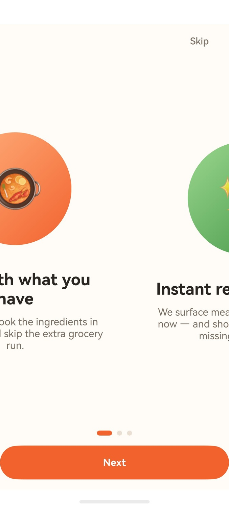

# 执行报告

## 任务信息
- **测试用例**: 05-55-42
- **任务名称**: 动作：点击 Next。
预期结果：页码指示器切换到第二页，页面标题变为 Instant recipe matches。
- **开始时间**: 2026-06-26T05:55:42.693113
- **结束时间**: 2026-06-26T05:57:02.498794
- **Token消耗**: 92496 (SingleAgent: 92496)
- **总事件数**: 41

## 执行时间线


### 🚀 task_start
**时间**: 05:55:42.693


Task started: 动作：点击 Next。
预期结果：页码指示器切换到第二页，页面标题变为 Instant recipe matches。

---

### 🧠 planner_start
**时间**: 05:55:49.199


Agent SingleAgent started

---

### 👀 planner_observation
**时间**: 05:55:49.570


Current Screen Observation


---

### 🔧 planner_tool_call
**时间**: 05:55:57.721
**步骤**: 1

Called: swipe

```json
{
  "tool_name": "swipe",
  "arguments": {
    "start": [
      500,
      800
    ],
    "end": [
      500,
      200
    ],
    "direction": "up",
    "log": "Swipe up to open app drawer"
  }
}
```

---

### ⚙️ mcp_tool_start
**时间**: 05:55:58.151
**步骤**: 1

Starting: swipe

```json
{
  "tool_name": "swipe",
  "arguments": {
    "start": [
      500,
      800
    ],
    "end": [
      500,
      200
    ],
    "direction": "up",
    "log": "Swipe up to open app drawer"
  },
  "action": "swipe",
  "start": [
    0.5,
    0.8
  ],
  "end": [
    0.5,
    0.2
  ]
}
```


---

### ✨ mcp_tool_end
**时间**: 05:55:59.422


Completed: swipe

```json
{
  "tool_name": "swipe",
  "result": "{'type': 'text', 'text': 'swipe successfully'}",
  "raw_result": {
    "type": "text",
    "text": "swipe successfully"
  }
}
```


---

### 👀 planner_observation
**时间**: 05:55:59.749
**步骤**: 1

Current Screen Observation


---

### 🔧 planner_tool_call
**时间**: 05:56:04.654
**步骤**: 2

Called: swipe

```json
{
  "tool_name": "swipe",
  "arguments": {
    "start": [
      100,
      500
    ],
    "end": [
      900,
      500
    ],
    "direction": "left",
    "log": "Swipe left to check other home pages"
  }
}
```

---

### ⚙️ mcp_tool_start
**时间**: 05:56:05.044
**步骤**: 2

Starting: swipe

```json
{
  "tool_name": "swipe",
  "arguments": {
    "start": [
      100,
      500
    ],
    "end": [
      900,
      500
    ],
    "direction": "left",
    "log": "Swipe left to check other home pages"
  },
  "action": "swipe",
  "start": [
    0.1,
    0.5
  ],
  "end": [
    0.9,
    0.5
  ]
}
```


---

### ✨ mcp_tool_end
**时间**: 05:56:06.439


Completed: swipe

```json
{
  "tool_name": "swipe",
  "result": "{'type': 'text', 'text': 'swipe successfully'}",
  "raw_result": {
    "type": "text",
    "text": "swipe successfully"
  }
}
```


---

### 👀 planner_observation
**时间**: 05:56:06.801
**步骤**: 2

Current Screen Observation


---

### 🔧 planner_tool_call
**时间**: 05:56:11.679
**步骤**: 3

Called: click

```json
{
  "tool_name": "click",
  "arguments": {
    "pos": [
      117,
      189
    ],
    "log": "Open the WhatCanICook recipe app"
  }
}
```

---

### ⚙️ mcp_tool_start
**时间**: 05:56:12.043
**步骤**: 3

Starting: click

```json
{
  "tool_name": "click",
  "arguments": {
    "pos": [
      117,
      189
    ],
    "log": "Open the WhatCanICook recipe app"
  },
  "action": "click",
  "point": [
    0.117,
    0.189
  ]
}
```


---

### ✨ mcp_tool_end
**时间**: 05:56:12.494


Completed: click

```json
{
  "tool_name": "click",
  "result": "{'type': 'text', 'text': 'click successfully'}",
  "raw_result": {
    "type": "text",
    "text": "click successfully"
  }
}
```


---

### 👀 planner_observation
**时间**: 05:56:12.812
**步骤**: 3

Current Screen Observation


---

### 🔧 planner_tool_call
**时间**: 05:56:15.718
**步骤**: 4

Called: wait

```json
{
  "tool_name": "wait",
  "arguments": {
    "duration": 2,
    "log": "Wait for app to load"
  }
}
```

---

### ⚙️ mcp_tool_start
**时间**: 05:56:16.040
**步骤**: 4

Starting: wait

```json
{
  "tool_name": "wait",
  "arguments": {
    "duration": 2,
    "log": "Wait for app to load"
  }
}
```


---

### ✨ mcp_tool_end
**时间**: 05:56:18.399


Completed: wait

```json
{
  "tool_name": "wait",
  "result": "{'type': 'text', 'text': 'wait successfully'}",
  "raw_result": {
    "type": "text",
    "text": "wait successfully"
  }
}
```


---

### 👀 planner_observation
**时间**: 05:56:18.713
**步骤**: 4

Current Screen Observation


---

### 🔧 planner_tool_call
**时间**: 05:56:21.201
**步骤**: 5

Called: wait

```json
{
  "tool_name": "wait",
  "arguments": {
    "duration": 2,
    "log": "Wait for app to fully load"
  }
}
```

---

### ⚙️ mcp_tool_start
**时间**: 05:56:21.535
**步骤**: 5

Starting: wait

```json
{
  "tool_name": "wait",
  "arguments": {
    "duration": 2,
    "log": "Wait for app to fully load"
  }
}
```


---

### ✨ mcp_tool_end
**时间**: 05:56:23.903


Completed: wait

```json
{
  "tool_name": "wait",
  "result": "{'type': 'text', 'text': 'wait successfully'}",
  "raw_result": {
    "type": "text",
    "text": "wait successfully"
  }
}
```


---

### 👀 planner_observation
**时间**: 05:56:24.218
**步骤**: 5

Current Screen Observation


---

### 🔧 planner_tool_call
**时间**: 05:56:28.283
**步骤**: 6

Called: click

```json
{
  "tool_name": "click",
  "arguments": {
    "pos": [
      117,
      189
    ],
    "log": "Click the WhatCanICook app icon again"
  }
}
```

---

### ⚙️ mcp_tool_start
**时间**: 05:56:28.595
**步骤**: 6

Starting: click

```json
{
  "tool_name": "click",
  "arguments": {
    "pos": [
      117,
      189
    ],
    "log": "Click the WhatCanICook app icon again"
  },
  "action": "click",
  "point": [
    0.117,
    0.189
  ]
}
```


---

### ✨ mcp_tool_end
**时间**: 05:56:29.022


Completed: click

```json
{
  "tool_name": "click",
  "result": "{'type': 'text', 'text': 'click successfully'}",
  "raw_result": {
    "type": "text",
    "text": "click successfully"
  }
}
```


---

### 👀 planner_observation
**时间**: 05:56:29.332
**步骤**: 6

Current Screen Observation


---

### 🔧 planner_tool_call
**时间**: 05:56:33.204
**步骤**: 7

Called: get_current_app

```json
{
  "tool_name": "get_current_app",
  "arguments": {
    "log": "Check current app"
  }
}
```

---

### ⚙️ mcp_tool_start
**时间**: 05:56:33.559
**步骤**: 7

Starting: get_current_app

```json
{
  "tool_name": "get_current_app",
  "arguments": {
    "log": "Check current app"
  }
}
```


---

### ✨ mcp_tool_end
**时间**: 05:56:33.934


Completed: get_current_app

```json
{
  "tool_name": "get_current_app",
  "result": "{'type': 'text', 'text': 'get_current_app successfully'}",
  "raw_result": {
    "type": "text",
    "text": "get_current_app successfully"
  }
}
```


---

### 👀 planner_observation
**时间**: 05:56:34.272
**步骤**: 7

Current Screen Observation


---

### 🔧 planner_tool_call
**时间**: 05:56:37.813
**步骤**: 8

Called: click

```json
{
  "tool_name": "click",
  "arguments": {
    "pos": [
      115,
      165
    ],
    "log": "Click app icon center precisely"
  }
}
```

---

### ⚙️ mcp_tool_start
**时间**: 05:56:38.178
**步骤**: 8

Starting: click

```json
{
  "tool_name": "click",
  "arguments": {
    "pos": [
      115,
      165
    ],
    "log": "Click app icon center precisely"
  },
  "action": "click",
  "point": [
    0.115,
    0.165
  ]
}
```


---

### ✨ mcp_tool_end
**时间**: 05:56:38.815


Completed: click

```json
{
  "tool_name": "click",
  "result": "{'type': 'text', 'text': 'click successfully'}",
  "raw_result": {
    "type": "text",
    "text": "click successfully"
  }
}
```


---

### 👀 planner_observation
**时间**: 05:56:39.192
**步骤**: 8

Current Screen Observation


---

### 🔧 planner_tool_call
**时间**: 05:56:46.623
**步骤**: 9

Called: click

```json
{
  "tool_name": "click",
  "arguments": {
    "pos": [
      500,
      945
    ],
    "log": "Click Next button to go to page 2"
  }
}
```

---

### ⚙️ mcp_tool_start
**时间**: 05:56:46.977
**步骤**: 9

Starting: click

```json
{
  "tool_name": "click",
  "arguments": {
    "pos": [
      500,
      945
    ],
    "log": "Click Next button to go to page 2"
  },
  "action": "click",
  "point": [
    0.5,
    0.945
  ]
}
```


---

### ✨ mcp_tool_end
**时间**: 05:56:47.668


Completed: click

```json
{
  "tool_name": "click",
  "result": "{'type': 'text', 'text': 'click successfully'}",
  "raw_result": {
    "type": "text",
    "text": "click successfully"
  }
}
```



---

### 👀 planner_observation
**时间**: 05:56:47.990
**步骤**: 9

Current Screen Observation


---

### 🏁 planner_end
**时间**: 05:57:02.497


Agent finished

```json
{
  "output": "<think>\nThe user is reminding me to carefully observe and describe the interface content, and to make decisions based on the task decomposition and historical execution records.\n\nLooking at the current screenshot:\n\n**Current Screen State (After clicking Next):**\n- **Top right**: \"Skip\" button\n- **Center**: A green circular icon with yellow sparkle stars\n- **Title**: \"Instant recipe matches\" ✅ (matches expected)\n- **Subtitle**: \"We surface meals you can make right now — and show exactly what you're missing for the rest.\"\n- **Page indicator**: 3 dots, with the SECOND dot (middle) now being active/selected (orange/red)\n- **Bottom**: \"Next\" button (orange)\n\n**Task Analysis:**\n\nThe task is to verify two things after clicking Next:\n1. ✅ Page indicator switches to the second page - The middle dot is now active (orange), and the first dot is now gray\n2. ✅ Page title changes to \"Instant recipe matches\" - The title is now \"Instant recipe matches\"\n\n**Historical Review:**\n- Before clicking Next (first page): Title was \"Cook with what you have\", first dot (leftmost) was active (orange)\n- After clicking Next (second page): Title is \"Instant recipe matches\", second dot (middle) is now active (orange)\n\nBoth expected results are met! The test passes.\n\nLet me output the judgment in the required format.\n\n**Phase 3: Result Judgment**\n\n预期验证：\n- 预期结果1: 页码指示器切换到第二页\n- 实际结果1: 页码指示器显示3个点，中间那个点（第二页）现在是橙色激活状态，第一个点变为灰色\n- 是否匹配: 是\n\n- 预期结果2: 页面标题变为 Instant recipe matches\n- 实际结果2: 页面标题显示为 \"Instant recipe matches\"\n- 是否匹配: 是\n\n历史回顾：\n- 第一页观察: 标题\"Cook with what you have\"，第一个点（最左）激活（橙色）\n- 第二页观察: 标题\"Instant recipe matches\"，第二个点（中间）激活（橙色）\n- 是否一致: 不一致（已正确切换）\n\n状态确认: 第二页正确显示，标题\"Instant recipe matches\"与页码指示器第二点激活一致。\n\nBug发现: 无明显Bug\n\n判定结果: 通过\n</think>\n<judgment>\n**预期验证**：\n- 预期结果1：页码指示器切换到第二页。实际结果：3个圆点中，第二个（中间）变为橙色激活状态，第一个变为灰色。**是否匹配：是**\n- 预期结果2：页面标题变为 \"Instant recipe matches\"。实际结果：页面标题显示为 \"Instant recipe matches\"。**是否匹配：是**\n\n**历史回顾**：\n- 元素1（页码指示器激活点）：\n  - 第一页观察：第一个点（最左）激活（橙色），其余两个为灰色\n  - 第二页观察：第二个点（中间）激活（橙色），第一个点变为灰色\n  - 是否一致：否（已正确从第一页切换到第二页）\n- 元素2（页面标题）：\n  - 第一页观察：\"Cook with what you have\"（配橙色圆形+厨具图标）\n  - 第二页观察：\"Instant recipe matches\"（配绿色圆形+黄色闪光图标）\n  - 是否一致：否（标题已正确切换）\n- 元素3（副标题）：\n  - 第二页观察：\"We surface meals you can make right now — and show exactly what you're missing for the rest.\"\n\n**状态确认**：最终屏幕显示WhatCanICook应用第二页。关键元素：标题\"Instant recipe matches\"、页码指示器中间点激活。状态符合预期：是。\n\n**Bug发现**：\n- 预期结果Bug：无，两项预期均达成\n- 其他Bug：\n  - 界面显示正常，无元素缺失/错位\n  - 图标颜色、按钮位置、页码指示器状态均符合预期\n  - 未发现明显Bug\n\n**判定结果**：通过\n</judgment>\n\n任务结果: 通过\n\n**测试执行总结**：\n- **任务拆分**：1. 打开WhatCanICook应用 2. 点击Next按钮 3. 验证页码指示器切换到第二页，页面标题变为\"Instant recipe matches\"\n- **预估操作次数**：约3~4次操作\n- **实际执行**：打开应用（约3次点击尝试）→ 点击Next按钮（1次）→ 验证结果\n- **验证结果**：\n  1. ✅ 页码指示器已从第一个点切换到第二个点（中间圆点变为橙色激活状态）\n  2. ✅ 页面标题已从\"Cook with what you have\"切换为\"Instant recipe matches\"\n  3. ✅ 图标同步从橙色厨具图标切换为绿色闪光图标，与第二页主题\"Instant recipe matches\"呼应\n  4. ✅ Next按钮和Skip按钮保持正常显示，无界面异常"
}
```

---

### ✅ task_end
**时间**: 05:57:02.499


Task completed: <think>
The user is reminding me to carefully observe and describe the interface content, and to make decisions based on the task decomposition and historical execution records.

Looking at the current screenshot:

**Current Screen State (After clicking Next):**
- **Top right**: "Skip" button
- **Center**: A green circular icon with yellow sparkle stars
- **Title**: "Instant recipe matches" ✅ (matches expected)
- **Subtitle**: "We surface meals you can make right now — and show exactly what you're missing for the rest."
- **Page indicator**: 3 dots, with the SECOND dot (middle) now being active/selected (orange/red)
- **Bottom**: "Next" button (orange)

**Task Analysis:**

The task is to verify two things after clicking Next:
1. ✅ Page indicator switches to the second page - The middle dot is now active (orange), and the first dot is now gray
2. ✅ Page title changes to "Instant recipe matches" - The title is now "Instant recipe matches"

**Historical Review:**
- Before clicking Next (first page): Title was "Cook with what you have", first dot (leftmost) was active (orange)
- After clicking Next (second page): Title is "Instant recipe matches", second dot (middle) is now active (orange)

Both expected results are met! The test passes.

Let me output the judgment in the required format.

**Phase 3: Result Judgment**

预期验证：
- 预期结果1: 页码指示器切换到第二页
- 实际结果1: 页码指示器显示3个点，中间那个点（第二页）现在是橙色激活状态，第一个点变为灰色
- 是否匹配: 是

- 预期结果2: 页面标题变为 Instant recipe matches
- 实际结果2: 页面标题显示为 "Instant recipe matches"
- 是否匹配: 是

历史回顾：
- 第一页观察: 标题"Cook with what you have"，第一个点（最左）激活（橙色）
- 第二页观察: 标题"Instant recipe matches"，第二个点（中间）激活（橙色）
- 是否一致: 不一致（已正确切换）

状态确认: 第二页正确显示，标题"Instant recipe matches"与页码指示器第二点激活一致。

Bug发现: 无明显Bug

判定结果: 通过
</think>
<judgment>
**预期验证**：
- 预期结果1：页码指示器切换到第二页。实际结果：3个圆点中，第二个（中间）变为橙色激活状态，第一个变为灰色。**是否匹配：是**
- 预期结果2：页面标题变为 "Instant recipe matches"。实际结果：页面标题显示为 "Instant recipe matches"。**是否匹配：是**

**历史回顾**：
- 元素1（页码指示器激活点）：
  - 第一页观察：第一个点（最左）激活（橙色），其余两个为灰色
  - 第二页观察：第二个点（中间）激活（橙色），第一个点变为灰色
  - 是否一致：否（已正确从第一页切换到第二页）
- 元素2（页面标题）：
  - 第一页观察："Cook with what you have"（配橙色圆形+厨具图标）
  - 第二页观察："Instant recipe matches"（配绿色圆形+黄色闪光图标）
  - 是否一致：否（标题已正确切换）
- 元素3（副标题）：
  - 第二页观察："We surface meals you can make right now — and show exactly what you're missing for the rest."

**状态确认**：最终屏幕显示WhatCanICook应用第二页。关键元素：标题"Instant recipe matches"、页码指示器中间点激活。状态符合预期：是。

**Bug发现**：
- 预期结果Bug：无，两项预期均达成
- 其他Bug：
  - 界面显示正常，无元素缺失/错位
  - 图标颜色、按钮位置、页码指示器状态均符合预期
  - 未发现明显Bug

**判定结果**：通过
</judgment>

任务结果: 通过

**测试执行总结**：
- **任务拆分**：1. 打开WhatCanICook应用 2. 点击Next按钮 3. 验证页码指示器切换到第二页，页面标题变为"Instant recipe matches"
- **预估操作次数**：约3~4次操作
- **实际执行**：打开应用（约3次点击尝试）→ 点击Next按钮（1次）→ 验证结果
- **验证结果**：
  1. ✅ 页码指示器已从第一个点切换到第二个点（中间圆点变为橙色激活状态）
  2. ✅ 页面标题已从"Cook with what you have"切换为"Instant recipe matches"
  3. ✅ 图标同步从橙色厨具图标切换为绿色闪光图标，与第二页主题"Instant recipe matches"呼应
  4. ✅ Next按钮和Skip按钮保持正常显示，无界面异常

---
