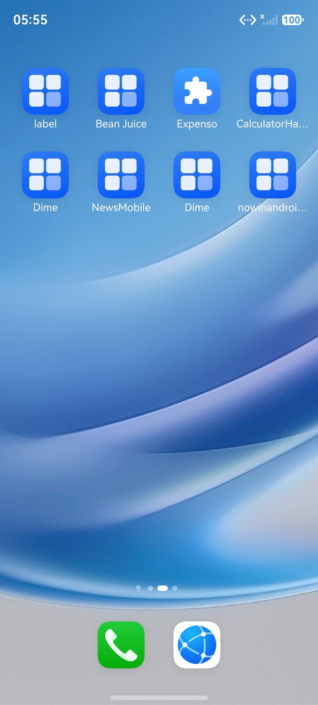
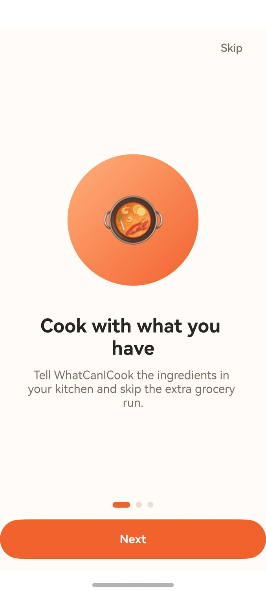

# 执行报告

## 任务信息
- **测试用例**: 05-55-01
- **任务名称**: 动作：打开应用。
预期结果：展示 Onboarding 首屏，包含 Skip、Next、页码指示器、标题 Cook with what you have，以及说明 Tell com.example.whaticancookharmony the ingredients in your kitchen and skip the extra grocery run。
- **开始时间**: 2026-06-26T05:55:01.297699
- **结束时间**: 2026-06-26T05:55:41.492061
- **Token消耗**: 17251 (SingleAgent: 17251)
- **总事件数**: 9

## 执行时间线


### 🚀 task_start
**时间**: 05:55:01.297


Task started: 动作：打开应用。
预期结果：展示 Onboarding 首屏，包含 Skip、Next、页码指示器、标题 Cook with what you have，以及说明 Tell com.example.whaticancookharmony the ingredients in your kitchen and skip the extra grocery run。

---

### 🧠 planner_start
**时间**: 05:55:11.567


Agent SingleAgent started

---

### 👀 planner_observation
**时间**: 05:55:12.036


Current Screen Observation


---

### 🔧 planner_tool_call
**时间**: 05:55:23.053
**步骤**: 1

Called: start_app

```json
{
  "tool_name": "start_app",
  "arguments": {
    "app_name": "com.example.whaticancookharmony",
    "log": "启动WhatICanCook应用"
  }
}
```

---

### ⚙️ mcp_tool_start
**时间**: 05:55:23.436
**步骤**: 1

Starting: start_app

```json
{
  "tool_name": "start_app",
  "arguments": {
    "app_name": "com.example.whaticancookharmony",
    "log": "启动WhatICanCook应用"
  }
}
```



---

### ✨ mcp_tool_end
**时间**: 05:55:24.960


Completed: start_app

```json
{
  "tool_name": "start_app",
  "result": "{'type': 'text', 'text': 'start_app successfully'}",
  "raw_result": {
    "type": "text",
    "text": "start_app successfully"
  }
}
```


---

### 👀 planner_observation
**时间**: 05:55:25.276
**步骤**: 1

Current Screen Observation



---

### 🏁 planner_end
**时间**: 05:55:41.490


Agent finished

```json
{
  "output": "<think>The app has been launched and I can see the Onboarding first screen. Let me carefully observe and verify all expected elements:\n\n1. **Skip button**: ✅ Visible at top right - \"Skip\"\n2. **Next button**: ✅ Visible at bottom in orange rounded button - \"Next\"\n3. **Page indicator**: ✅ Visible at bottom showing 3 dots, with the first one in orange (active) and the other two in gray\n4. **Title**: ✅ \"Cook with what you have\" - displayed in bold black text\n5. **Description**: ⚠️ The actual text is \"Tell WhatCanICook the ingredients in your kitchen and skip the extra grocery run.\" \n\nThe expected text was \"Tell com.example.whaticancookharmony the ingredients in your kitchen and skip the extra grocery run.\" \n\nThe difference is:\n- Expected: \"com.example.whaticancookharmony\" \n- Actual: \"WhatCanICook\"\n\nThe description text uses the display name \"WhatCanICook\" instead of the package name \"com.example.whaticancookharmony\". This is a discrepancy between the expected and actual results.\n\nWait, let me re-read the expected text more carefully:\n\"Tell com.example.whaticancookharmony the ingredients in your kitchen and skip the extra grocery run.\"\n\nAnd the actual text is:\n\"Tell WhatCanICook the ingredients in your kitchen and skip the extra grocery run.\"\n\nThe difference is the app name. The expected uses the package name (com.example.whaticancookharmony) while the actual uses the display name (WhatCanICook).\n\nThis is a clear discrepancy - the expected text doesn't match the actual displayed text. This should be flagged as a Bug.\n\nLet me also check other elements:\n- There's an orange circular illustration with a cooking pot containing ingredients (looks like vegetables - carrot, tomato, etc.)\n- The layout is clean and well-organized\n- The orange theme color is consistent throughout\n\nAll other elements (Skip, Next, page indicator, title) are present and correct. Only the description text has the discrepancy.\n\nNow let me make the final judgment.</think>\n\n## 阶段2：继续观察\n\n已完成1步，上一步：启动应用com.example.whaticancookharmony→成功，显示Onboarding首屏，当前：验证所有预期元素\n\n### 当前界面详细观察\n\n界面顶部：\n- ✅ 右上角显示 **\"Skip\"** 文字按钮（灰色）\n\n界面中央：\n- 一个**橙色圆形插图**，内部是锅具图片，锅内含有食材（胡萝卜、番茄等）\n\n界面中部文字：\n- ✅ **标题**：\"Cook with what you have\"（黑色粗体，分两行显示）\n- ⚠️ **说明文本**：\"Tell **WhatCanICook** the ingredients in your kitchen and skip the extra grocery run.\"\n\n界面底部：\n- ✅ **页码指示器**：3个圆点，第1个橙色（当前页），第2、3个灰色\n- ✅ **Next按钮**：橙色圆角按钮，文字\"Next\"（白色）\n\n---\n\n## 阶段3：结果判定\n\n<judgment>\n**预期验证**：\n- Skip按钮：预期存在，实际存在 ✅\n- Next按钮：预期存在，实际存在 ✅\n- 页码指示器：预期存在，实际存在（3个点，当前第1页）✅\n- 标题\"Cook with what you have\"：预期一致，实际一致 ✅\n- 说明文本\"Tell com.example.whaticancookharmony the ingredients in your kitchen and skip the extra grocery run.\"：预期使用包名\"com.example.whaticancookharmony\"，实际显示的是应用显示名\"WhatCanICook\" ❌ **不一致**\n\n**历史回顾**：\n- 仅一步操作，无历史对比需要\n\n**状态确认**：最终屏幕显示Onboarding首屏。Skip按钮、Next按钮、页码指示器（3个圆点，当前第1页）均正确显示。标题\"Cook with what you have\"正确。但说明文本中的应用名称与预期不符。\n\n**Bug发现**：\n- **预期结果Bug**：说明文本中的应用名称不正确。预期为\"Tell **com.example.whaticancookharmony** the ingredients...\"，实际显示为\"Tell **WhatCanICook** the ingredients...\"。说明文本中使用了应用显示名\"WhatCanICook\"，而预期是使用包名\"com.example.whaticancookharmony\"。这属于与预期结果不一致的Bug。\n\n**判定结果**：不通过\n</judgment>\n\n任务结果: 不通过 - 发现Bug: 说明文本中应用名称不一致，预期为\"com.example.whaticancookharmony\"，实际显示为\"WhatCanICook\"。说明文本内容为\"Tell WhatCanICook the ingredients in your kitchen and skip the extra grocery run.\"，与预期\"Tell com.example.whaticancookharmony the ingredients in your kitchen and skip the extra grocery run.\"不匹配。"
}
```

---

### ✅ task_end
**时间**: 05:55:41.492


Task completed: <think>The app has been launched and I can see the Onboarding first screen. Let me carefully observe and verify all expected elements:

1. **Skip button**: ✅ Visible at top right - "Skip"
2. **Next button**: ✅ Visible at bottom in orange rounded button - "Next"
3. **Page indicator**: ✅ Visible at bottom showing 3 dots, with the first one in orange (active) and the other two in gray
4. **Title**: ✅ "Cook with what you have" - displayed in bold black text
5. **Description**: ⚠️ The actual text is "Tell WhatCanICook the ingredients in your kitchen and skip the extra grocery run." 

The expected text was "Tell com.example.whaticancookharmony the ingredients in your kitchen and skip the extra grocery run." 

The difference is:
- Expected: "com.example.whaticancookharmony" 
- Actual: "WhatCanICook"

The description text uses the display name "WhatCanICook" instead of the package name "com.example.whaticancookharmony". This is a discrepancy between the expected and actual results.

Wait, let me re-read the expected text more carefully:
"Tell com.example.whaticancookharmony the ingredients in your kitchen and skip the extra grocery run."

And the actual text is:
"Tell WhatCanICook the ingredients in your kitchen and skip the extra grocery run."

The difference is the app name. The expected uses the package name (com.example.whaticancookharmony) while the actual uses the display name (WhatCanICook).

This is a clear discrepancy - the expected text doesn't match the actual displayed text. This should be flagged as a Bug.

Let me also check other elements:
- There's an orange circular illustration with a cooking pot containing ingredients (looks like vegetables - carrot, tomato, etc.)
- The layout is clean and well-organized
- The orange theme color is consistent throughout

All other elements (Skip, Next, page indicator, title) are present and correct. Only the description text has the discrepancy.

Now let me make the final judgment.</think>

## 阶段2：继续观察

已完成1步，上一步：启动应用com.example.whaticancookharmony→成功，显示Onboarding首屏，当前：验证所有预期元素

### 当前界面详细观察

界面顶部：
- ✅ 右上角显示 **"Skip"** 文字按钮（灰色）

界面中央：
- 一个**橙色圆形插图**，内部是锅具图片，锅内含有食材（胡萝卜、番茄等）

界面中部文字：
- ✅ **标题**："Cook with what you have"（黑色粗体，分两行显示）
- ⚠️ **说明文本**："Tell **WhatCanICook** the ingredients in your kitchen and skip the extra grocery run."

界面底部：
- ✅ **页码指示器**：3个圆点，第1个橙色（当前页），第2、3个灰色
- ✅ **Next按钮**：橙色圆角按钮，文字"Next"（白色）

---

## 阶段3：结果判定

<judgment>
**预期验证**：
- Skip按钮：预期存在，实际存在 ✅
- Next按钮：预期存在，实际存在 ✅
- 页码指示器：预期存在，实际存在（3个点，当前第1页）✅
- 标题"Cook with what you have"：预期一致，实际一致 ✅
- 说明文本"Tell com.example.whaticancookharmony the ingredients in your kitchen and skip the extra grocery run."：预期使用包名"com.example.whaticancookharmony"，实际显示的是应用显示名"WhatCanICook" ❌ **不一致**

**历史回顾**：
- 仅一步操作，无历史对比需要

**状态确认**：最终屏幕显示Onboarding首屏。Skip按钮、Next按钮、页码指示器（3个圆点，当前第1页）均正确显示。标题"Cook with what you have"正确。但说明文本中的应用名称与预期不符。

**Bug发现**：
- **预期结果Bug**：说明文本中的应用名称不正确。预期为"Tell **com.example.whaticancookharmony** the ingredients..."，实际显示为"Tell **WhatCanICook** the ingredients..."。说明文本中使用了应用显示名"WhatCanICook"，而预期是使用包名"com.example.whaticancookharmony"。这属于与预期结果不一致的Bug。

**判定结果**：不通过
</judgment>

任务结果: 不通过 - 发现Bug: 说明文本中应用名称不一致，预期为"com.example.whaticancookharmony"，实际显示为"WhatCanICook"。说明文本内容为"Tell WhatCanICook the ingredients in your kitchen and skip the extra grocery run."，与预期"Tell com.example.whaticancookharmony the ingredients in your kitchen and skip the extra grocery run."不匹配。

---
