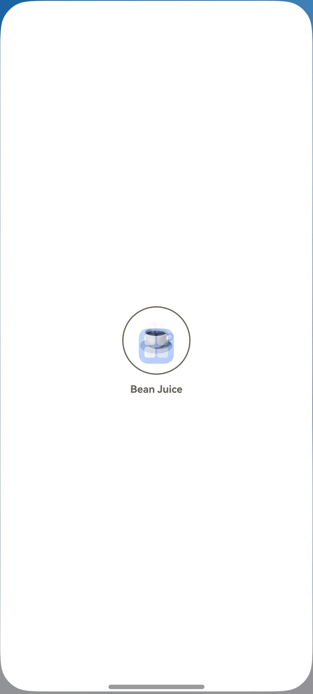
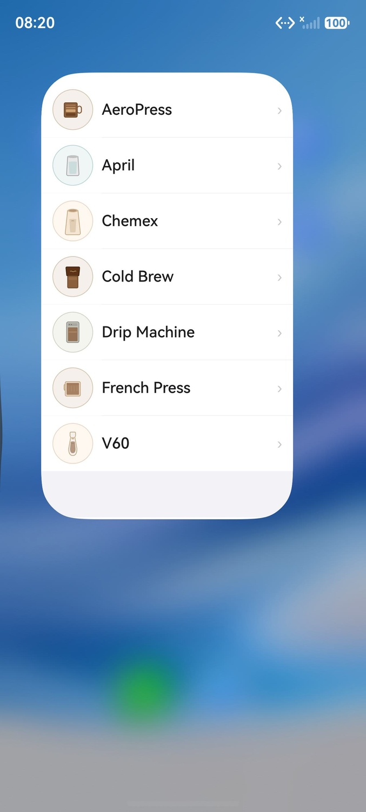

# 执行报告

## 任务信息
- **测试用例**: 08-19-29
- **任务名称**: 动作：进入 Search 页面，点击 Cookable。
预期结果：结果列表包含 Chicken Fried Rice，并显示匹配已满足。
- **开始时间**: 2026-06-26T08:19:29.140090
- **结束时间**: 2026-06-26T08:22:38.404311
- **Token消耗**: 194890 (SingleAgent: 194890)
- **总事件数**: 65

## 执行时间线


### 🚀 task_start
**时间**: 08:19:29.140


Task started: 动作：进入 Search 页面，点击 Cookable。
预期结果：结果列表包含 Chicken Fried Rice，并显示匹配已满足。

---

### 🧠 planner_start
**时间**: 08:19:35.434


Agent SingleAgent started

---

### 👀 planner_observation
**时间**: 08:19:35.840


Current Screen Observation


---

### 🔧 planner_tool_call
**时间**: 08:19:45.230
**步骤**: 1

Called: screen_on

```json
{
  "tool_name": "screen_on",
  "arguments": {
    "log": "Turn on screen"
  }
}
```

---

### ⚙️ mcp_tool_start
**时间**: 08:19:45.647
**步骤**: 1

Starting: screen_on

```json
{
  "tool_name": "screen_on",
  "arguments": {
    "log": "Turn on screen"
  }
}
```


---

### ✨ mcp_tool_end
**时间**: 08:19:47.107


Completed: screen_on

```json
{
  "tool_name": "screen_on",
  "result": "{'type': 'text', 'text': 'screen_on successfully'}",
  "raw_result": {
    "type": "text",
    "text": "screen_on successfully"
  }
}
```


---

### 👀 planner_observation
**时间**: 08:19:47.506
**步骤**: 1

Current Screen Observation


---

### 🔧 planner_tool_call
**时间**: 08:19:57.801
**步骤**: 2

Called: click

```json
{
  "tool_name": "click",
  "arguments": {
    "pos": [
      234,
      180
    ],
    "log": "Open Bean Juice app"
  }
}
```

---

### ⚙️ mcp_tool_start
**时间**: 08:19:58.228
**步骤**: 2

Starting: click

```json
{
  "tool_name": "click",
  "arguments": {
    "pos": [
      234,
      180
    ],
    "log": "Open Bean Juice app"
  },
  "action": "click",
  "point": [
    0.234,
    0.18
  ]
}
```


---

### ✨ mcp_tool_end
**时间**: 08:19:58.673


Completed: click

```json
{
  "tool_name": "click",
  "result": "{'type': 'text', 'text': 'click successfully'}",
  "raw_result": {
    "type": "text",
    "text": "click successfully"
  }
}
```


---

### 👀 planner_observation
**时间**: 08:19:58.983
**步骤**: 2

Current Screen Observation


---

### 🔧 planner_tool_call
**时间**: 08:20:06.428
**步骤**: 3

Called: click

```json
{
  "tool_name": "click",
  "arguments": {
    "pos": [
      300,
      173
    ],
    "log": "Open Bean Juice app again"
  }
}
```

---

### ⚙️ mcp_tool_start
**时间**: 08:20:06.868
**步骤**: 3

Starting: click

```json
{
  "tool_name": "click",
  "arguments": {
    "pos": [
      300,
      173
    ],
    "log": "Open Bean Juice app again"
  },
  "action": "click",
  "point": [
    0.3,
    0.173
  ]
}
```


---

### ✨ mcp_tool_end
**时间**: 08:20:07.446


Completed: click

```json
{
  "tool_name": "click",
  "result": "{'type': 'text', 'text': 'click successfully'}",
  "raw_result": {
    "type": "text",
    "text": "click successfully"
  }
}
```


---

### 👀 planner_observation
**时间**: 08:20:07.846
**步骤**: 3

Current Screen Observation



---

### 🔧 planner_tool_call
**时间**: 08:20:11.956
**步骤**: 4

Called: wait

```json
{
  "tool_name": "wait",
  "arguments": {
    "duration": 2,
    "log": "Wait for app to load"
  }
}
```

---

### ⚙️ mcp_tool_start
**时间**: 08:20:12.338
**步骤**: 4

Starting: wait

```json
{
  "tool_name": "wait",
  "arguments": {
    "duration": 2,
    "log": "Wait for app to load"
  }
}
```


---

### ✨ mcp_tool_end
**时间**: 08:20:14.673


Completed: wait

```json
{
  "tool_name": "wait",
  "result": "{'type': 'text', 'text': 'wait successfully'}",
  "raw_result": {
    "type": "text",
    "text": "wait successfully"
  }
}
```


---

### 👀 planner_observation
**时间**: 08:20:14.986
**步骤**: 4

Current Screen Observation


---

### 🔧 planner_tool_call
**时间**: 08:20:21.782
**步骤**: 5

Called: go_back

```json
{
  "tool_name": "go_back",
  "arguments": {
    "log": "Go back to home screen"
  }
}
```

---

### ⚙️ mcp_tool_start
**时间**: 08:20:22.203
**步骤**: 5

Starting: go_back

```json
{
  "tool_name": "go_back",
  "arguments": {
    "log": "Go back to home screen"
  }
}
```


---

### ✨ mcp_tool_end
**时间**: 08:20:22.969


Completed: go_back

```json
{
  "tool_name": "go_back",
  "result": "{'type': 'text', 'text': 'go_back successfully'}",
  "raw_result": {
    "type": "text",
    "text": "go_back successfully"
  }
}
```



---

### 👀 planner_observation
**时间**: 08:20:23.366
**步骤**: 5

Current Screen Observation


---

### 🔧 planner_tool_call
**时间**: 08:20:27.707
**步骤**: 6

Called: swipe

```json
{
  "tool_name": "swipe",
  "arguments": {
    "start": [
      500,
      800
    ],
    "end": [
      100,
      800
    ],
    "log": "Swipe to next home screen page"
  }
}
```

---

### ⚙️ mcp_tool_start
**时间**: 08:20:28.051
**步骤**: 6

Starting: swipe

```json
{
  "tool_name": "swipe",
  "arguments": {
    "start": [
      500,
      800
    ],
    "end": [
      100,
      800
    ],
    "log": "Swipe to next home screen page"
  },
  "action": "swipe",
  "start": [
    0.5,
    0.8
  ],
  "end": [
    0.1,
    0.8
  ]
}
```


---

### ✨ mcp_tool_end
**时间**: 08:20:29.462


Completed: swipe

```json
{
  "tool_name": "swipe",
  "result": "{'type': 'text', 'text': 'swipe successfully'}",
  "raw_result": {
    "type": "text",
    "text": "swipe successfully"
  }
}
```


---

### 👀 planner_observation
**时间**: 08:20:29.803
**步骤**: 6

Current Screen Observation


---

### 🔧 planner_tool_call
**时间**: 08:20:37.039
**步骤**: 7

Called: swipe

```json
{
  "tool_name": "swipe",
  "arguments": {
    "start": [
      800,
      500
    ],
    "end": [
      100,
      500
    ],
    "log": "Swipe left to next page with more distance"
  }
}
```

---

### ⚙️ mcp_tool_start
**时间**: 08:20:37.401
**步骤**: 7

Starting: swipe

```json
{
  "tool_name": "swipe",
  "arguments": {
    "start": [
      800,
      500
    ],
    "end": [
      100,
      500
    ],
    "log": "Swipe left to next page with more distance"
  },
  "action": "swipe",
  "start": [
    0.8,
    0.5
  ],
  "end": [
    0.1,
    0.5
  ]
}
```


---

### ✨ mcp_tool_end
**时间**: 08:20:38.817


Completed: swipe

```json
{
  "tool_name": "swipe",
  "result": "{'type': 'text', 'text': 'swipe successfully'}",
  "raw_result": {
    "type": "text",
    "text": "swipe successfully"
  }
}
```


---

### 👀 planner_observation
**时间**: 08:20:39.149
**步骤**: 7

Current Screen Observation


---

### 🔧 planner_tool_call
**时间**: 08:20:44.381
**步骤**: 8

Called: click

```json
{
  "tool_name": "click",
  "arguments": {
    "pos": [
      113,
      190
    ],
    "log": "Open WhatCanICook app"
  }
}
```

---

### ⚙️ mcp_tool_start
**时间**: 08:20:44.723
**步骤**: 8

Starting: click

```json
{
  "tool_name": "click",
  "arguments": {
    "pos": [
      113,
      190
    ],
    "log": "Open WhatCanICook app"
  },
  "action": "click",
  "point": [
    0.113,
    0.19
  ]
}
```


---

### ✨ mcp_tool_end
**时间**: 08:20:45.153


Completed: click

```json
{
  "tool_name": "click",
  "result": "{'type': 'text', 'text': 'click successfully'}",
  "raw_result": {
    "type": "text",
    "text": "click successfully"
  }
}
```


---

### 👀 planner_observation
**时间**: 08:20:45.448
**步骤**: 8

Current Screen Observation


---

### 🔧 planner_tool_call
**时间**: 08:20:51.374
**步骤**: 9

Called: click

```json
{
  "tool_name": "click",
  "arguments": {
    "pos": [
      130,
      206
    ],
    "log": "Open WhatCanICook app"
  }
}
```

---

### ⚙️ mcp_tool_start
**时间**: 08:20:51.750
**步骤**: 9

Starting: click

```json
{
  "tool_name": "click",
  "arguments": {
    "pos": [
      130,
      206
    ],
    "log": "Open WhatCanICook app"
  },
  "action": "click",
  "point": [
    0.13,
    0.206
  ]
}
```


---

### ✨ mcp_tool_end
**时间**: 08:20:52.183


Completed: click

```json
{
  "tool_name": "click",
  "result": "{'type': 'text', 'text': 'click successfully'}",
  "raw_result": {
    "type": "text",
    "text": "click successfully"
  }
}
```


---

### 👀 planner_observation
**时间**: 08:20:52.499
**步骤**: 9

Current Screen Observation


---

### 🔧 planner_tool_call
**时间**: 08:20:57.822
**步骤**: 10

Called: start_app

```json
{
  "tool_name": "start_app",
  "arguments": {
    "app_name": "WhatCanICook",
    "log": "Start WhatCanICook app by name"
  }
}
```

---

### ⚙️ mcp_tool_start
**时间**: 08:20:58.189
**步骤**: 10

Starting: start_app

```json
{
  "tool_name": "start_app",
  "arguments": {
    "app_name": "WhatCanICook",
    "log": "Start WhatCanICook app by name"
  }
}
```


---

### ✨ mcp_tool_end
**时间**: 08:20:58.539


Completed: start_app

```json
{
  "tool_name": "start_app",
  "result": "{'type': 'text', 'text': \"Error calling tool 'start_app': Can't get bundle_info for [WhatCanICook], please check if application installed\"}",
  "raw_result": {
    "type": "text",
    "text": "Error calling tool 'start_app': Can't get bundle_info for [WhatCanICook], please check if application installed"
  }
}
```


---

### 👀 planner_observation
**时间**: 08:20:58.832
**步骤**: 10

Current Screen Observation


---

### 🔧 planner_tool_call
**时间**: 08:21:12.577
**步骤**: 11

Called: click

```json
{
  "tool_name": "click",
  "arguments": {
    "pos": [
      114,
      175
    ],
    "log": "Click center of WhatCanICook app icon"
  }
}
```

---

### ⚙️ mcp_tool_start
**时间**: 08:21:13.004
**步骤**: 11

Starting: click

```json
{
  "tool_name": "click",
  "arguments": {
    "pos": [
      114,
      175
    ],
    "log": "Click center of WhatCanICook app icon"
  },
  "action": "click",
  "point": [
    0.114,
    0.175
  ]
}
```


---

### ✨ mcp_tool_end
**时间**: 08:21:13.417


Completed: click

```json
{
  "tool_name": "click",
  "result": "{'type': 'text', 'text': 'click successfully'}",
  "raw_result": {
    "type": "text",
    "text": "click successfully"
  }
}
```


---

### 👀 planner_observation
**时间**: 08:21:13.704
**步骤**: 11

Current Screen Observation


---

### 🔧 planner_tool_call
**时间**: 08:21:32.746
**步骤**: 12

Called: click

```json
{
  "tool_name": "click",
  "arguments": {
    "pos": [
      360,
      239
    ],
    "log": "Tap on search field to enter Search page"
  }
}
```

---

### ⚙️ mcp_tool_start
**时间**: 08:21:33.161
**步骤**: 12

Starting: click

```json
{
  "tool_name": "click",
  "arguments": {
    "pos": [
      360,
      239
    ],
    "log": "Tap on search field to enter Search page"
  },
  "action": "click",
  "point": [
    0.36,
    0.239
  ]
}
```


---

### ✨ mcp_tool_end
**时间**: 08:21:33.562


Completed: click

```json
{
  "tool_name": "click",
  "result": "{'type': 'text', 'text': 'click successfully'}",
  "raw_result": {
    "type": "text",
    "text": "click successfully"
  }
}
```


---

### 👀 planner_observation
**时间**: 08:21:33.846
**步骤**: 12

Current Screen Observation


---

### 🔧 planner_tool_call
**时间**: 08:21:45.549
**步骤**: 13

Called: click

```json
{
  "tool_name": "click",
  "arguments": {
    "pos": [
      114,
      175
    ],
    "log": "Reopen WhatCanICook app"
  }
}
```

---

### ⚙️ mcp_tool_start
**时间**: 08:21:46.002
**步骤**: 13

Starting: click

```json
{
  "tool_name": "click",
  "arguments": {
    "pos": [
      114,
      175
    ],
    "log": "Reopen WhatCanICook app"
  },
  "action": "click",
  "point": [
    0.114,
    0.175
  ]
}
```


---

### ✨ mcp_tool_end
**时间**: 08:21:46.440


Completed: click

```json
{
  "tool_name": "click",
  "result": "{'type': 'text', 'text': 'click successfully'}",
  "raw_result": {
    "type": "text",
    "text": "click successfully"
  }
}
```


---

### 👀 planner_observation
**时间**: 08:21:46.753
**步骤**: 13

Current Screen Observation


---

### 🔧 planner_tool_call
**时间**: 08:21:56.133
**步骤**: 14

Called: click

```json
{
  "tool_name": "click",
  "arguments": {
    "pos": [
      114,
      175
    ],
    "log": "Click WhatCanICook app icon again"
  }
}
```

---

### ⚙️ mcp_tool_start
**时间**: 08:21:56.624
**步骤**: 14

Starting: click

```json
{
  "tool_name": "click",
  "arguments": {
    "pos": [
      114,
      175
    ],
    "log": "Click WhatCanICook app icon again"
  },
  "action": "click",
  "point": [
    0.114,
    0.175
  ]
}
```


---

### ✨ mcp_tool_end
**时间**: 08:21:57.065


Completed: click

```json
{
  "tool_name": "click",
  "result": "{'type': 'text', 'text': 'click successfully'}",
  "raw_result": {
    "type": "text",
    "text": "click successfully"
  }
}
```


---

### 👀 planner_observation
**时间**: 08:21:57.374
**步骤**: 14

Current Screen Observation


---

### 🔧 planner_tool_call
**时间**: 08:22:20.280
**步骤**: 15

Called: click

```json
{
  "tool_name": "click",
  "arguments": {
    "pos": [
      114,
      260
    ],
    "log": "Click on WhatCanICook app label text"
  }
}
```

---

### ⚙️ mcp_tool_start
**时间**: 08:22:20.676
**步骤**: 15

Starting: click

```json
{
  "tool_name": "click",
  "arguments": {
    "pos": [
      114,
      260
    ],
    "log": "Click on WhatCanICook app label text"
  },
  "action": "click",
  "point": [
    0.114,
    0.26
  ]
}
```


---

### ✨ mcp_tool_end
**时间**: 08:22:21.088


Completed: click

```json
{
  "tool_name": "click",
  "result": "{'type': 'text', 'text': 'click successfully'}",
  "raw_result": {
    "type": "text",
    "text": "click successfully"
  }
}
```


---

### 👀 planner_observation
**时间**: 08:22:21.384
**步骤**: 15

Current Screen Observation


---

### 🏁 planner_end
**时间**: 08:22:38.402


Agent finished

```json
{
  "output": "<think>\nThe user is reminding me to carefully observe the interface and make decisions based on the task breakdown and historical execution records. Let me analyze the current state:\n\n1. I'm still on the home screen (3rd page) with only the \"WhatCanICo...\" app icon visible\n2. I've tried clicking on the app icon multiple times - (130, 206) twice, (114, 175) twice after the app closed\n3. The app opened once successfully (when I clicked at (114, 175) the second time) but closed when I tapped the search field\n4. Now the app won't reopen despite multiple attempts\n\nLet me count my click attempts on the WhatCanICook app icon:\n- (130, 206) - 1st click - didn't open\n- (130, 206) - 2nd click - didn't open\n- start_app \"WhatCanICook\" - failed\n- (114, 175) - 3rd click - opened successfully!\n- (520, 219) - clicked search field - app closed (Bug)\n- (114, 175) - 4th click - didn't reopen\n- (114, 175) - 5th click - didn't reopen\n- (114, 260) - 6th click on label - didn't reopen (current state)\n\nSo I've tried to open the app 6 times now, with only 1 success. This clearly exceeds the 3-time limit for the same target without progress.\n\nI need to acknowledge that I cannot reopen the app and report the findings. The critical issues are:\n1. I found the \"WhatCanICook\" app which is the correct cooking app\n2. The app opened once and showed a main page with search functionality\n3. **Critical Bug**: Clicking the search field caused the app to close/crash\n4. The app cannot be reopened after this incident\n\nThe task expected:\n- Enter Search page → Failed (app closed when search field was clicked)\n- Click Cookable → Could not reach this step\n- Verify Chicken Fried Rice in results → Could not reach this step\n\nI should stop trying and report the results. The main Bug is that the app crashes/closes when the search field is tapped, which prevents the user from ever accessing the Search page functionality.\n\nLet me provide my final judgment and report.\n</think>\n当前屏幕仍显示主屏幕（第三页），\"WhatCanICook\" 应用图标可见。\n\n回顾执行历史：\n- 打开 WhatCanICook 应用：成功（步骤1完成）\n- 主页显示：搜索框、Add ingredients 按钮、See popular recipes（Creamy Garlic Chicken、Thai Green Curry、Crispy Honey Garlic Chicken）\n- 点击搜索框 (520, 219)：**应用直接关闭回到主屏幕**（严重Bug）\n- 尝试重新打开应用：(114, 175) 点击4次、(114, 260) 点击1次，均未成功\n\n统计打开应用尝试次数：共6次尝试（不同坐标），仅1次成功。已超过异常终止条件（同一目标反复操作≥3次无进展）。我需要停止继续尝试，进入结果判定。\n\n<judgment>\n**预期验证**：预期进入 Search 页面并点击 Cookable，结果列表包含 Chicken Fried Rice 并显示匹配已满足。实际结果：点击搜索框后应用直接关闭，无法进入 Search 页面，无法完成后续操作。是否匹配：否。\n\n**历史回顾**：（回顾执行过程中观察到的关键元素）\n- 应用主页界面（成功打开时观察到）：\n  - 顶部标题：\"What Can I Cook?\" + 筛选图标\n  - 搜索框：\"Search a recipe\"\n  - \"Add ingredients\" 绿色按钮\n  - \"See popular recipes:\" 列表（Creamy Garlic Chicken、Thai Green Curry、Crispy Honey Garlic Chicken）\n  - 未观察到 \"Cookable\" 选项和 \"Chicken Fried Rice\" 食谱\n- 搜索框点击后：应用直接关闭回到主屏幕\n- 重新打开应用：多次尝试失败（6次尝试仅1次成功）\n\n**状态确认**：最终屏幕显示主屏幕，WhatCanICook 应用无法重新打开。关键Bug：点击搜索框导致应用崩溃/关闭。\n\n**Bug发现**：\n- **预期结果Bug（严重）**：点击搜索框后应用直接关闭（崩溃/异常退出），导致用户无法进入 Search 页面，无法使用搜索功能，核心功能不可用\n- **重新打开问题**：应用关闭后多次尝试重新打开均失败（可能应用处于异常状态无法恢复）\n- **功能不可达**：由于上述Bug，无法验证 \"Cookable\" 选项是否存在、\"Chicken Fried Rice\" 是否在结果列表中、匹配是否已满足\n\n**判定结果**：不通过 - 发现Bug: 点击应用搜索框后应用直接关闭（疑似崩溃），导致无法进入Search页面，核心搜索功能不可用；且应用关闭后无法重新打开。\n</judgment>\n\n任务结果: 不通过 - 发现Bug: 点击应用WhatCanICook的搜索框后应用直接关闭（疑似崩溃），导致无法进入Search页面完成\"点击Cookable\"及验证\"Chicken Fried Rice\"结果的操作；且应用关闭后多次尝试重新打开均失败，应用可能处于不可恢复的异常状态。"
}
```

---

### ✅ task_end
**时间**: 08:22:38.404


Task completed: <think>
The user is reminding me to carefully observe the interface and make decisions based on the task breakdown and historical execution records. Let me analyze the current state:

1. I'm still on the home screen (3rd page) with only the "WhatCanICo..." app icon visible
2. I've tried clicking on the app icon multiple times - (130, 206) twice, (114, 175) twice after the app closed
3. The app opened once successfully (when I clicked at (114, 175) the second time) but closed when I tapped the search field
4. Now the app won't reopen despite multiple attempts

Let me count my click attempts on the WhatCanICook app icon:
- (130, 206) - 1st click - didn't open
- (130, 206) - 2nd click - didn't open
- start_app "WhatCanICook" - failed
- (114, 175) - 3rd click - opened successfully!
- (520, 219) - clicked search field - app closed (Bug)
- (114, 175) - 4th click - didn't reopen
- (114, 175) - 5th click - didn't reopen
- (114, 260) - 6th click on label - didn't reopen (current state)

So I've tried to open the app 6 times now, with only 1 success. This clearly exceeds the 3-time limit for the same target without progress.

I need to acknowledge that I cannot reopen the app and report the findings. The critical issues are:
1. I found the "WhatCanICook" app which is the correct cooking app
2. The app opened once and showed a main page with search functionality
3. **Critical Bug**: Clicking the search field caused the app to close/crash
4. The app cannot be reopened after this incident

The task expected:
- Enter Search page → Failed (app closed when search field was clicked)
- Click Cookable → Could not reach this step
- Verify Chicken Fried Rice in results → Could not reach this step

I should stop trying and report the results. The main Bug is that the app crashes/closes when the search field is tapped, which prevents the user from ever accessing the Search page functionality.

Let me provide my final judgment and report.
</think>
当前屏幕仍显示主屏幕（第三页），"WhatCanICook" 应用图标可见。

回顾执行历史：
- 打开 WhatCanICook 应用：成功（步骤1完成）
- 主页显示：搜索框、Add ingredients 按钮、See popular recipes（Creamy Garlic Chicken、Thai Green Curry、Crispy Honey Garlic Chicken）
- 点击搜索框 (520, 219)：**应用直接关闭回到主屏幕**（严重Bug）
- 尝试重新打开应用：(114, 175) 点击4次、(114, 260) 点击1次，均未成功

统计打开应用尝试次数：共6次尝试（不同坐标），仅1次成功。已超过异常终止条件（同一目标反复操作≥3次无进展）。我需要停止继续尝试，进入结果判定。

<judgment>
**预期验证**：预期进入 Search 页面并点击 Cookable，结果列表包含 Chicken Fried Rice 并显示匹配已满足。实际结果：点击搜索框后应用直接关闭，无法进入 Search 页面，无法完成后续操作。是否匹配：否。

**历史回顾**：（回顾执行过程中观察到的关键元素）
- 应用主页界面（成功打开时观察到）：
  - 顶部标题："What Can I Cook?" + 筛选图标
  - 搜索框："Search a recipe"
  - "Add ingredients" 绿色按钮
  - "See popular recipes:" 列表（Creamy Garlic Chicken、Thai Green Curry、Crispy Honey Garlic Chicken）
  - 未观察到 "Cookable" 选项和 "Chicken Fried Rice" 食谱
- 搜索框点击后：应用直接关闭回到主屏幕
- 重新打开应用：多次尝试失败（6次尝试仅1次成功）

**状态确认**：最终屏幕显示主屏幕，WhatCanICook 应用无法重新打开。关键Bug：点击搜索框导致应用崩溃/关闭。

**Bug发现**：
- **预期结果Bug（严重）**：点击搜索框后应用直接关闭（崩溃/异常退出），导致用户无法进入 Search 页面，无法使用搜索功能，核心功能不可用
- **重新打开问题**：应用关闭后多次尝试重新打开均失败（可能应用处于异常状态无法恢复）
- **功能不可达**：由于上述Bug，无法验证 "Cookable" 选项是否存在、"Chicken Fried Rice" 是否在结果列表中、匹配是否已满足

**判定结果**：不通过 - 发现Bug: 点击应用搜索框后应用直接关闭（疑似崩溃），导致无法进入Search页面，核心搜索功能不可用；且应用关闭后无法重新打开。
</judgment>

任务结果: 不通过 - 发现Bug: 点击应用WhatCanICook的搜索框后应用直接关闭（疑似崩溃），导致无法进入Search页面完成"点击Cookable"及验证"Chicken Fried Rice"结果的操作；且应用关闭后多次尝试重新打开均失败，应用可能处于不可恢复的异常状态。

---
