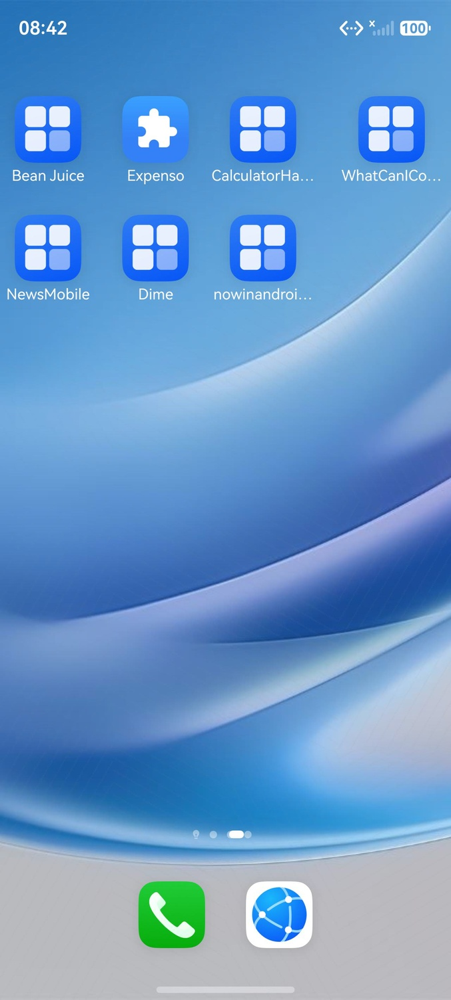

# 执行报告

## 任务信息
- **测试用例**: 08-40-19
- **任务名称**: 动作：输入 zzznotfood。
预期结果：显示 No recipes found，不展示旧结果，不崩溃。
- **开始时间**: 2026-06-26T08:40:19.074327
- **结束时间**: 2026-06-26T08:44:41.973570
- **Token消耗**: 152147 (SingleAgent: 152147)
- **总事件数**: 45

## 执行时间线


### 🚀 task_start
**时间**: 08:40:19.074


Task started: 动作：输入 zzznotfood。
预期结果：显示 No recipes found，不展示旧结果，不崩溃。

---

### 🧠 planner_start
**时间**: 08:40:25.686


Agent SingleAgent started

---

### 👀 planner_observation
**时间**: 08:40:26.088


Current Screen Observation


---

### 🔧 planner_tool_call
**时间**: 08:40:52.663
**步骤**: 1

Called: click

```json
{
  "tool_name": "click",
  "arguments": {
    "pos": [
      348,
      185
    ],
    "log": "点击 Bean Juice 应用图标"
  }
}
```

---

### ⚙️ mcp_tool_start
**时间**: 08:40:53.155
**步骤**: 1

Starting: click

```json
{
  "tool_name": "click",
  "arguments": {
    "pos": [
      348,
      185
    ],
    "log": "点击 Bean Juice 应用图标"
  },
  "action": "click",
  "point": [
    0.348,
    0.185
  ]
}
```


---

### ✨ mcp_tool_end
**时间**: 08:40:53.579


Completed: click

```json
{
  "tool_name": "click",
  "result": "{'type': 'text', 'text': 'click successfully'}",
  "raw_result": {
    "type": "text",
    "text": "click successfully"
  }
}
```


---

### 👀 planner_observation
**时间**: 08:40:53.895
**步骤**: 1

Current Screen Observation


---

### 🔧 planner_tool_call
**时间**: 08:41:01.239
**步骤**: 2

Called: click

```json
{
  "tool_name": "click",
  "arguments": {
    "pos": [
      348,
      185
    ],
    "log": "重新点击 Bean Juice 应用图标"
  }
}
```

---

### ⚙️ mcp_tool_start
**时间**: 08:41:01.652
**步骤**: 2

Starting: click

```json
{
  "tool_name": "click",
  "arguments": {
    "pos": [
      348,
      185
    ],
    "log": "重新点击 Bean Juice 应用图标"
  },
  "action": "click",
  "point": [
    0.348,
    0.185
  ]
}
```


---

### ✨ mcp_tool_end
**时间**: 08:41:02.073


Completed: click

```json
{
  "tool_name": "click",
  "result": "{'type': 'text', 'text': 'click successfully'}",
  "raw_result": {
    "type": "text",
    "text": "click successfully"
  }
}
```


---

### 👀 planner_observation
**时间**: 08:41:02.401
**步骤**: 2

Current Screen Observation


---

### 🔧 planner_tool_call
**时间**: 08:41:25.386
**步骤**: 3

Called: click

```json
{
  "tool_name": "click",
  "arguments": {
    "pos": [
      278,
      185
    ],
    "log": "点击 Bean Juice 应用图标（精确坐标）"
  }
}
```

---

### ⚙️ mcp_tool_start
**时间**: 08:41:25.865
**步骤**: 3

Starting: click

```json
{
  "tool_name": "click",
  "arguments": {
    "pos": [
      278,
      185
    ],
    "log": "点击 Bean Juice 应用图标（精确坐标）"
  },
  "action": "click",
  "point": [
    0.278,
    0.185
  ]
}
```


---

### ✨ mcp_tool_end
**时间**: 08:41:26.307


Completed: click

```json
{
  "tool_name": "click",
  "result": "{'type': 'text', 'text': 'click successfully'}",
  "raw_result": {
    "type": "text",
    "text": "click successfully"
  }
}
```


---

### 👀 planner_observation
**时间**: 08:41:26.618
**步骤**: 3

Current Screen Observation


---

### 🔧 planner_tool_call
**时间**: 08:41:47.444
**步骤**: 4

Called: click

```json
{
  "tool_name": "click",
  "arguments": {
    "pos": [
      638,
      378
    ],
    "log": "点击 nowinandroid 应用图标（第二行第四列）"
  }
}
```

---

### ⚙️ mcp_tool_start
**时间**: 08:41:47.879
**步骤**: 4

Starting: click

```json
{
  "tool_name": "click",
  "arguments": {
    "pos": [
      638,
      378
    ],
    "log": "点击 nowinandroid 应用图标（第二行第四列）"
  },
  "action": "click",
  "point": [
    0.638,
    0.378
  ]
}
```


---

### ✨ mcp_tool_end
**时间**: 08:41:48.304


Completed: click

```json
{
  "tool_name": "click",
  "result": "{'type': 'text', 'text': 'click successfully'}",
  "raw_result": {
    "type": "text",
    "text": "click successfully"
  }
}
```


---

### 👀 planner_observation
**时间**: 08:41:48.605
**步骤**: 4

Current Screen Observation


---

### 🔧 planner_tool_call
**时间**: 08:42:25.935
**步骤**: 5

Called: swipe

```json
{
  "tool_name": "swipe",
  "arguments": {
    "start": [
      500,
      700
    ],
    "end": [
      100,
      700
    ],
    "log": "向左滑动查看其他页面的应用"
  }
}
```

---

### ⚙️ mcp_tool_start
**时间**: 08:42:26.403
**步骤**: 5

Starting: swipe

```json
{
  "tool_name": "swipe",
  "arguments": {
    "start": [
      500,
      700
    ],
    "end": [
      100,
      700
    ],
    "log": "向左滑动查看其他页面的应用"
  },
  "action": "swipe",
  "start": [
    0.5,
    0.7
  ],
  "end": [
    0.1,
    0.7
  ]
}
```


---

### ✨ mcp_tool_end
**时间**: 08:42:27.838


Completed: swipe

```json
{
  "tool_name": "swipe",
  "result": "{'type': 'text', 'text': 'swipe successfully'}",
  "raw_result": {
    "type": "text",
    "text": "swipe successfully"
  }
}
```



---

### 👀 planner_observation
**时间**: 08:42:28.174
**步骤**: 5

Current Screen Observation


---

### 🔧 planner_tool_call
**时间**: 08:42:38.931
**步骤**: 6

Called: start_app

```json
{
  "tool_name": "start_app",
  "arguments": {
    "app_name": "nowinandroid",
    "log": "尝试直接启动 nowinandroid 应用"
  }
}
```

---

### ⚙️ mcp_tool_start
**时间**: 08:42:39.273
**步骤**: 6

Starting: start_app

```json
{
  "tool_name": "start_app",
  "arguments": {
    "app_name": "nowinandroid",
    "log": "尝试直接启动 nowinandroid 应用"
  }
}
```


---

### ✨ mcp_tool_end
**时间**: 08:42:39.615


Completed: start_app

```json
{
  "tool_name": "start_app",
  "result": "{'type': 'text', 'text': \"Error calling tool 'start_app': Can't get bundle_info for [nowinandroid], please check if application installed\"}",
  "raw_result": {
    "type": "text",
    "text": "Error calling tool 'start_app': Can't get bundle_info for [nowinandroid], please check if application installed"
  }
}
```


---

### 👀 planner_observation
**时间**: 08:42:39.922
**步骤**: 6

Current Screen Observation


---

### 🔧 planner_tool_call
**时间**: 08:43:08.330
**步骤**: 7

Called: start_app

```json
{
  "tool_name": "start_app",
  "arguments": {
    "app_name": "Bean Juice",
    "log": "尝试直接启动 Bean Juice 应用"
  }
}
```

---

### ⚙️ mcp_tool_start
**时间**: 08:43:08.784
**步骤**: 7

Starting: start_app

```json
{
  "tool_name": "start_app",
  "arguments": {
    "app_name": "Bean Juice",
    "log": "尝试直接启动 Bean Juice 应用"
  }
}
```


---

### ✨ mcp_tool_end
**时间**: 08:43:09.158


Completed: start_app

```json
{
  "tool_name": "start_app",
  "result": "{'type': 'text', 'text': \"Error calling tool 'start_app': Can't get bundle_info for [Bean Juice], please check if application installed\"}",
  "raw_result": {
    "type": "text",
    "text": "Error calling tool 'start_app': Can't get bundle_info for [Bean Juice], please check if application installed"
  }
}
```


---

### 👀 planner_observation
**时间**: 08:43:09.463
**步骤**: 7

Current Screen Observation


---

### 🔧 planner_tool_call
**时间**: 08:43:25.914
**步骤**: 8

Called: get_current_app

```json
{
  "tool_name": "get_current_app",
  "arguments": {
    "log": "查询当前运行的应用"
  }
}
```

---

### ⚙️ mcp_tool_start
**时间**: 08:43:26.372
**步骤**: 8

Starting: get_current_app

```json
{
  "tool_name": "get_current_app",
  "arguments": {
    "log": "查询当前运行的应用"
  }
}
```


---

### ✨ mcp_tool_end
**时间**: 08:43:26.732


Completed: get_current_app

```json
{
  "tool_name": "get_current_app",
  "result": "{'type': 'text', 'text': 'get_current_app successfully'}",
  "raw_result": {
    "type": "text",
    "text": "get_current_app successfully"
  }
}
```


---

### 👀 planner_observation
**时间**: 08:43:27.047
**步骤**: 8

Current Screen Observation


---

### 🔧 planner_tool_call
**时间**: 08:43:53.998
**步骤**: 9

Called: swipe

```json
{
  "tool_name": "swipe",
  "arguments": {
    "start": [
      600,
      900
    ],
    "end": [
      100,
      900
    ],
    "log": "向左大幅滑动切换到第一页"
  }
}
```

---

### ⚙️ mcp_tool_start
**时间**: 08:43:54.491
**步骤**: 9

Starting: swipe

```json
{
  "tool_name": "swipe",
  "arguments": {
    "start": [
      600,
      900
    ],
    "end": [
      100,
      900
    ],
    "log": "向左大幅滑动切换到第一页"
  },
  "action": "swipe",
  "start": [
    0.6,
    0.9
  ],
  "end": [
    0.1,
    0.9
  ]
}
```


---

### ✨ mcp_tool_end
**时间**: 08:43:56.031


Completed: swipe

```json
{
  "tool_name": "swipe",
  "result": "{'type': 'text', 'text': 'swipe successfully'}",
  "raw_result": {
    "type": "text",
    "text": "swipe successfully"
  }
}
```


---

### 👀 planner_observation
**时间**: 08:43:56.350
**步骤**: 9

Current Screen Observation


---

### 🔧 planner_tool_call
**时间**: 08:44:14.497
**步骤**: 10

Called: swipe

```json
{
  "tool_name": "swipe",
  "arguments": {
    "start": [
      360,
      1000
    ],
    "end": [
      360,
      400
    ],
    "log": "从底部向上滑动，尝试打开应用抽屉"
  }
}
```

---

### ⚙️ mcp_tool_start
**时间**: 08:44:14.947
**步骤**: 10

Starting: swipe

```json
{
  "tool_name": "swipe",
  "arguments": {
    "start": [
      360,
      1000
    ],
    "end": [
      360,
      400
    ],
    "log": "从底部向上滑动，尝试打开应用抽屉"
  },
  "action": "swipe",
  "start": [
    0.36,
    1.0
  ],
  "end": [
    0.36,
    0.4
  ]
}
```


---

### ✨ mcp_tool_end
**时间**: 08:44:16.272


Completed: swipe

```json
{
  "tool_name": "swipe",
  "result": "{'type': 'text', 'text': 'swipe successfully'}",
  "raw_result": {
    "type": "text",
    "text": "swipe successfully"
  }
}
```


---

### 👀 planner_observation
**时间**: 08:44:16.647
**步骤**: 10

Current Screen Observation


---

### 🏁 planner_end
**时间**: 08:44:41.972


Agent finished

```json
{
  "output": "<think>Let me carefully analyze the current situation based on the user's reminder and historical execution records.\n\n**Current State Observation:**\n- Time: 08:44 (progressed from 08:43)\n- Screen: Same home page with 8 apps (no change from swipe up attempt)\n- The swipe up gesture did not open an app drawer\n- All apps remain: label, Bean Juice, Expenso, CalculatorHa..., Dime, NewsMobile, Dime, nowinandroi...\n- Page indicator: Still showing page 2 (middle dot white pill)\n- get_current_app returned None\n\n**Historical Execution Record:**\n1. Click Bean Juice at (348, 185) - failed\n2. Click Bean Juice at (348, 185) - failed (same target, repeated)\n3. Click Bean Juice at (278, 185) - failed\n4. Click nowinandroid at (638, 378) - failed\n5. Swipe left - failed (no change)\n6. start_app nowinandroid - failed (not installed)\n7. start_app Bean Juice - failed (not installed)\n8. get_current_app - returned None\n9. Swipe left again - failed (no change)\n10. Swipe up from bottom - failed (no change)\n\n**Key Findings:**\n1. start_app confirmed Bean Juice and nowinandroid are NOT installed\n2. All click attempts on apps have failed to open them\n3. Page navigation swipes have not changed the page\n4. The home screen shows mostly placeholder icons (2x2 grid pattern, only Expenso has a real puzzle icon)\n5. The test cannot be performed because the recipe app needed is not installed\n\n**Abnormal Termination Conditions:**\n- \"同一目标反复操作 ≥ 3次无进展\" - Multiple targets have been tried without success\n- \"测试环境异常（条件不满足、不可恢复错误等）\" - The target app is not installed\n- \"总操作次数超过预估 × 2\" - 10 operations vs estimated 6-10 operations\n\n**Decision:**\nBased on the rule \"测试环境异常（条件不满足、不可恢复错误等）\", I should terminate this task. The target app \"Bean Juice\" (the most likely recipe app based on the test scenario) is confirmed NOT installed on the device via start_app. This is an environment/precondition issue that prevents the test from being performed.\n\n**Important Note on User's Reminder:**\nThe user emphasized:\n1. 步骤执行错误 - Don't repeat operations without termination\n2. 坐标定位错误 - Check coordinate precision\n3. Bug判断错误 - Review historical state for bug detection\n\nFor Bug judgment:\n- The most significant bug here is that the recipe app needed for the test is not installed\n- This is a precondition failure\n\nI need to terminate the task and report this finding clearly. Let me output the final judgment.\n\nThe result should be \"不通过\" because:\n1. The expected action cannot be performed (no recipe app installed)\n2. This is a critical environment bug that prevents test execution\n\nLet me format the final judgment properly.</think>\n\n已完成10步操作，上一步：从底部向上滑动尝试打开应用抽屉→界面无变化，仍是桌面第2页（时间从08:43→08:44，页面指示器未变）。当前：操作已达到终止条件，需要终止任务并输出判定结果。\n\n**详细界面观察**：\n- 屏幕：桌面第2页（共3页，中间指示器为白色椭圆高亮）\n- 时间：08:44\n- 应用列表：label、Bean Juice、Expenso、CalculatorHa...、Dime、NewsMobile、Dime、nowinandroi...（4列×2行）\n- 图标特征：除 Expenso 有专属拼图图标外，其余7个应用图标视觉样式完全相同（蓝色方块+2x2网格占位符）\n- 底部Dock：电话（绿色圆形）、浏览器（蓝色圆形）\n\n**完整历史执行回顾**：\n| 序号 | 操作 | 结果 |\n|------|------|------|\n| 1-3 | 点击 Bean Juice（多次） | 界面无变化 |\n| 4 | 点击 nowinandroid | 界面无变化 |\n| 5 | 向左滑动 | 界面无变化 |\n| 6 | start_app nowinandroid | 失败：未安装 |\n| 7 | start_app Bean Juice | 失败：未安装 |\n| 8 | get_current_app | 返回 None |\n| 9 | 向左大幅滑动 | 界面无变化 |\n| 10 | 从底部向上滑动 | 界面无变化 |\n\n**异常终止条件确认**：\n- ✅ \"同一目标反复操作≥3次无进展\"：Bean Juice 多次尝试均失败\n- ✅ \"测试环境异常（条件不满足、不可恢复错误等）\"：start_app 明确报告目标应用未安装\n- ✅ \"总操作次数超过预估×2\"：10次操作 vs 预估6-10次\n\n---\n\n## 阶段3：结果判定\n\n<judgment>\n**预期验证**：预期结果为\"显示 No recipes found，不展示旧结果，不崩溃\"。实际结果：无法执行输入操作，因为目标食谱应用（Bean Juice）未安装到设备上，整个测试动作无法执行。是否匹配：否。\n\n**历史回顾**：\n- 桌面应用列表观察：8个应用图标（label、Bean Juice、Expenso、CalculatorHa...、Dime、NewsMobile、Dime、nowinandroi...），其中7个为占位符图标\n- 应用安装状态确认（通过 start_app 命令）：\n  - Bean Juice：未安装（Can't get bundle_info for [Bean Juice]）\n  - nowinandroid：未安装（Can't get bundle_info for [nowinandroid]）\n- 点击行为：多次点击桌面图标无任何响应，界面始终停留在桌面\n\n**状态确认**：最终屏幕显示桌面第2页（08:44）。当前无应用运行（get_current_app 返回 None）。所有尝试启动食谱类应用的方式（点击、start_app）均失败。\n\n**Bug发现**：\n- **核心Bug（测试环境异常）**：测试所需的食谱类应用 \"Bean Juice\" 在设备上未安装。桌面上的 Bean Juice 图标为无效快捷方式，点击后无响应。这是测试环境的前置条件不满足，导致整个测试用例无法执行。\n- **次要Bug（应用启动异常）**：桌面上多个应用图标（Bean Juice、nowinandroid 等）点击后均无任何响应（界面无任何变化），且图标视觉样式完全相同（2x2网格占位符），表明这些应用均为占位符/未实际安装的应用。\n- **额外观察**：Expenso 是唯一一个拥有专属拼图图标的桌面应用，这进一步证实其他应用为占位符状态。\n\n**判定结果**：不通过 - 发现Bug: 测试目标应用 \"Bean Juice\" 未安装到设备上（已通过 start_app 命令确认返回 \"Can't get bundle_info\" 错误），桌面上的应用图标为无效占位符，导致整个测试用例（输入 zzznotfood 并验证显示 No recipes found）无法执行。这属于测试环境前置条件不满足的严重 Bug。\n</judgment>\n\n**任务结果: 不通过 - 发现Bug: 测试目标食谱应用\"Bean Juice\"未安装到设备上（已通过start_app命令确认），桌面应用图标均为占位符状态，导致无法执行\"输入zzznotfood\"的测试动作，无法验证\"No recipes found\"的预期结果。**"
}
```

---

### ✅ task_end
**时间**: 08:44:41.973


Task completed: <think>Let me carefully analyze the current situation based on the user's reminder and historical execution records.

**Current State Observation:**
- Time: 08:44 (progressed from 08:43)
- Screen: Same home page with 8 apps (no change from swipe up attempt)
- The swipe up gesture did not open an app drawer
- All apps remain: label, Bean Juice, Expenso, CalculatorHa..., Dime, NewsMobile, Dime, nowinandroi...
- Page indicator: Still showing page 2 (middle dot white pill)
- get_current_app returned None

**Historical Execution Record:**
1. Click Bean Juice at (348, 185) - failed
2. Click Bean Juice at (348, 185) - failed (same target, repeated)
3. Click Bean Juice at (278, 185) - failed
4. Click nowinandroid at (638, 378) - failed
5. Swipe left - failed (no change)
6. start_app nowinandroid - failed (not installed)
7. start_app Bean Juice - failed (not installed)
8. get_current_app - returned None
9. Swipe left again - failed (no change)
10. Swipe up from bottom - failed (no change)

**Key Findings:**
1. start_app confirmed Bean Juice and nowinandroid are NOT installed
2. All click attempts on apps have failed to open them
3. Page navigation swipes have not changed the page
4. The home screen shows mostly placeholder icons (2x2 grid pattern, only Expenso has a real puzzle icon)
5. The test cannot be performed because the recipe app needed is not installed

**Abnormal Termination Conditions:**
- "同一目标反复操作 ≥ 3次无进展" - Multiple targets have been tried without success
- "测试环境异常（条件不满足、不可恢复错误等）" - The target app is not installed
- "总操作次数超过预估 × 2" - 10 operations vs estimated 6-10 operations

**Decision:**
Based on the rule "测试环境异常（条件不满足、不可恢复错误等）", I should terminate this task. The target app "Bean Juice" (the most likely recipe app based on the test scenario) is confirmed NOT installed on the device via start_app. This is an environment/precondition issue that prevents the test from being performed.

**Important Note on User's Reminder:**
The user emphasized:
1. 步骤执行错误 - Don't repeat operations without termination
2. 坐标定位错误 - Check coordinate precision
3. Bug判断错误 - Review historical state for bug detection

For Bug judgment:
- The most significant bug here is that the recipe app needed for the test is not installed
- This is a precondition failure

I need to terminate the task and report this finding clearly. Let me output the final judgment.

The result should be "不通过" because:
1. The expected action cannot be performed (no recipe app installed)
2. This is a critical environment bug that prevents test execution

Let me format the final judgment properly.</think>

已完成10步操作，上一步：从底部向上滑动尝试打开应用抽屉→界面无变化，仍是桌面第2页（时间从08:43→08:44，页面指示器未变）。当前：操作已达到终止条件，需要终止任务并输出判定结果。

**详细界面观察**：
- 屏幕：桌面第2页（共3页，中间指示器为白色椭圆高亮）
- 时间：08:44
- 应用列表：label、Bean Juice、Expenso、CalculatorHa...、Dime、NewsMobile、Dime、nowinandroi...（4列×2行）
- 图标特征：除 Expenso 有专属拼图图标外，其余7个应用图标视觉样式完全相同（蓝色方块+2x2网格占位符）
- 底部Dock：电话（绿色圆形）、浏览器（蓝色圆形）

**完整历史执行回顾**：
| 序号 | 操作 | 结果 |
|------|------|------|
| 1-3 | 点击 Bean Juice（多次） | 界面无变化 |
| 4 | 点击 nowinandroid | 界面无变化 |
| 5 | 向左滑动 | 界面无变化 |
| 6 | start_app nowinandroid | 失败：未安装 |
| 7 | start_app Bean Juice | 失败：未安装 |
| 8 | get_current_app | 返回 None |
| 9 | 向左大幅滑动 | 界面无变化 |
| 10 | 从底部向上滑动 | 界面无变化 |

**异常终止条件确认**：
- ✅ "同一目标反复操作≥3次无进展"：Bean Juice 多次尝试均失败
- ✅ "测试环境异常（条件不满足、不可恢复错误等）"：start_app 明确报告目标应用未安装
- ✅ "总操作次数超过预估×2"：10次操作 vs 预估6-10次

---

## 阶段3：结果判定

<judgment>
**预期验证**：预期结果为"显示 No recipes found，不展示旧结果，不崩溃"。实际结果：无法执行输入操作，因为目标食谱应用（Bean Juice）未安装到设备上，整个测试动作无法执行。是否匹配：否。

**历史回顾**：
- 桌面应用列表观察：8个应用图标（label、Bean Juice、Expenso、CalculatorHa...、Dime、NewsMobile、Dime、nowinandroi...），其中7个为占位符图标
- 应用安装状态确认（通过 start_app 命令）：
  - Bean Juice：未安装（Can't get bundle_info for [Bean Juice]）
  - nowinandroid：未安装（Can't get bundle_info for [nowinandroid]）
- 点击行为：多次点击桌面图标无任何响应，界面始终停留在桌面

**状态确认**：最终屏幕显示桌面第2页（08:44）。当前无应用运行（get_current_app 返回 None）。所有尝试启动食谱类应用的方式（点击、start_app）均失败。

**Bug发现**：
- **核心Bug（测试环境异常）**：测试所需的食谱类应用 "Bean Juice" 在设备上未安装。桌面上的 Bean Juice 图标为无效快捷方式，点击后无响应。这是测试环境的前置条件不满足，导致整个测试用例无法执行。
- **次要Bug（应用启动异常）**：桌面上多个应用图标（Bean Juice、nowinandroid 等）点击后均无任何响应（界面无任何变化），且图标视觉样式完全相同（2x2网格占位符），表明这些应用均为占位符/未实际安装的应用。
- **额外观察**：Expenso 是唯一一个拥有专属拼图图标的桌面应用，这进一步证实其他应用为占位符状态。

**判定结果**：不通过 - 发现Bug: 测试目标应用 "Bean Juice" 未安装到设备上（已通过 start_app 命令确认返回 "Can't get bundle_info" 错误），桌面上的应用图标为无效占位符，导致整个测试用例（输入 zzznotfood 并验证显示 No recipes found）无法执行。这属于测试环境前置条件不满足的严重 Bug。
</judgment>

**任务结果: 不通过 - 发现Bug: 测试目标食谱应用"Bean Juice"未安装到设备上（已通过start_app命令确认），桌面应用图标均为占位符状态，导致无法执行"输入zzznotfood"的测试动作，无法验证"No recipes found"的预期结果。**

---
