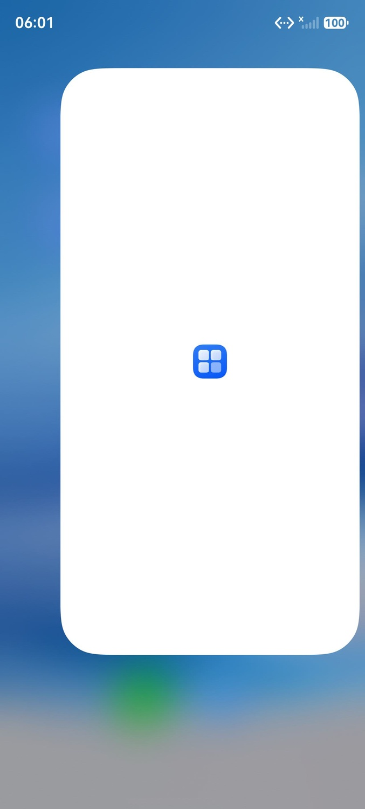
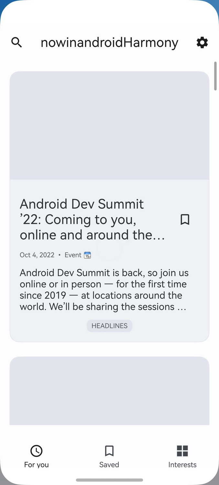
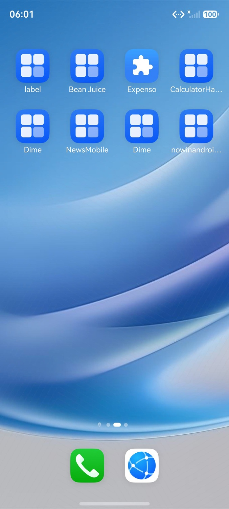
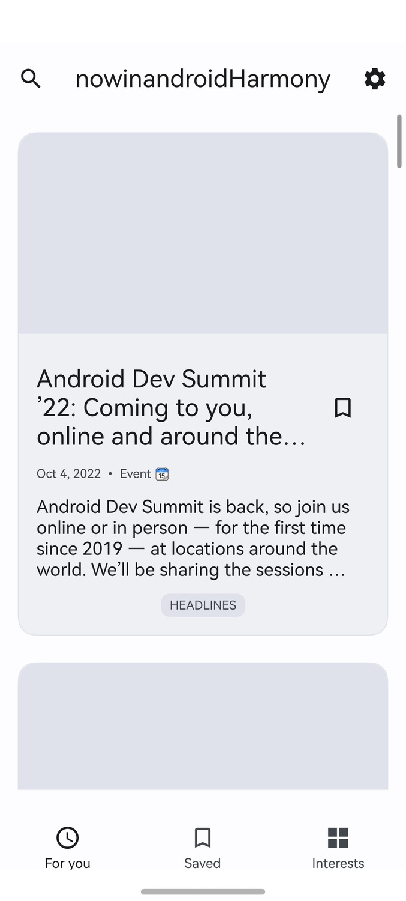

# 执行报告

## 任务信息
- **测试用例**: 05-59-13
- **任务名称**: 动作：关闭并重新打开应用。
预期结果：直接进入 Discover 首页，不再展示 Onboarding。
- **开始时间**: 2026-06-26T05:59:13.559005
- **结束时间**: 2026-06-26T06:02:12.096685
- **Token消耗**: 163654 (SingleAgent: 163654)
- **总事件数**: 49

## 执行时间线


### 🚀 task_start
**时间**: 05:59:13.559


Task started: 动作：关闭并重新打开应用。
预期结果：直接进入 Discover 首页，不再展示 Onboarding。

---

### 🧠 planner_start
**时间**: 05:59:21.163


Agent SingleAgent started

---

### 👀 planner_observation
**时间**: 05:59:21.511


Current Screen Observation


---

### 🔧 planner_tool_call
**时间**: 05:59:31.196
**步骤**: 1

Called: click

```json
{
  "tool_name": "click",
  "arguments": {
    "pos": [
      863,
      340
    ],
    "log": "点击nowinandroidi应用图标"
  }
}
```

---

### ⚙️ mcp_tool_start
**时间**: 05:59:31.587
**步骤**: 1

Starting: click

```json
{
  "tool_name": "click",
  "arguments": {
    "pos": [
      863,
      340
    ],
    "log": "点击nowinandroidi应用图标"
  },
  "action": "click",
  "point": [
    0.863,
    0.34
  ]
}
```


---

### ✨ mcp_tool_end
**时间**: 05:59:32.037


Completed: click

```json
{
  "tool_name": "click",
  "result": "{'type': 'text', 'text': 'click successfully'}",
  "raw_result": {
    "type": "text",
    "text": "click successfully"
  }
}
```


---

### 👀 planner_observation
**时间**: 05:59:32.371
**步骤**: 1

Current Screen Observation


---

### 🔧 planner_tool_call
**时间**: 05:59:34.972
**步骤**: 2

Called: click

```json
{
  "tool_name": "click",
  "arguments": {
    "pos": [
      863,
      386
    ],
    "log": "再次点击nowinandroidi应用图标（更精确位置）"
  }
}
```

---

### ⚙️ mcp_tool_start
**时间**: 05:59:35.355
**步骤**: 2

Starting: click

```json
{
  "tool_name": "click",
  "arguments": {
    "pos": [
      863,
      386
    ],
    "log": "再次点击nowinandroidi应用图标（更精确位置）"
  },
  "action": "click",
  "point": [
    0.863,
    0.386
  ]
}
```


---

### ✨ mcp_tool_end
**时间**: 05:59:35.789


Completed: click

```json
{
  "tool_name": "click",
  "result": "{'type': 'text', 'text': 'click successfully'}",
  "raw_result": {
    "type": "text",
    "text": "click successfully"
  }
}
```


---

### 👀 planner_observation
**时间**: 05:59:36.113
**步骤**: 2

Current Screen Observation


---

### 🔧 planner_tool_call
**时间**: 05:59:41.677
**步骤**: 3

Called: click

```json
{
  "tool_name": "click",
  "arguments": {
    "pos": [
      694,
      340
    ],
    "log": "点击nowinandroidi应用文本位置"
  }
}
```

---

### ⚙️ mcp_tool_start
**时间**: 05:59:42.023
**步骤**: 3

Starting: click

```json
{
  "tool_name": "click",
  "arguments": {
    "pos": [
      694,
      340
    ],
    "log": "点击nowinandroidi应用文本位置"
  },
  "action": "click",
  "point": [
    0.694,
    0.34
  ]
}
```


---

### ✨ mcp_tool_end
**时间**: 05:59:42.460


Completed: click

```json
{
  "tool_name": "click",
  "result": "{'type': 'text', 'text': 'click successfully'}",
  "raw_result": {
    "type": "text",
    "text": "click successfully"
  }
}
```


---

### 👀 planner_observation
**时间**: 05:59:42.761
**步骤**: 3

Current Screen Observation


---

### 🔧 planner_tool_call
**时间**: 05:59:46.207
**步骤**: 4

Called: start_app

```json
{
  "tool_name": "start_app",
  "arguments": {
    "app_name": "nowinandroidi",
    "log": "启动nowinandroidi应用"
  }
}
```

---

### ⚙️ mcp_tool_start
**时间**: 05:59:46.540
**步骤**: 4

Starting: start_app

```json
{
  "tool_name": "start_app",
  "arguments": {
    "app_name": "nowinandroidi",
    "log": "启动nowinandroidi应用"
  }
}
```


---

### ✨ mcp_tool_end
**时间**: 05:59:46.891


Completed: start_app

```json
{
  "tool_name": "start_app",
  "result": "{'type': 'text', 'text': \"Error calling tool 'start_app': Can't get bundle_info for [nowinandroidi], please check if application installed\"}",
  "raw_result": {
    "type": "text",
    "text": "Error calling tool 'start_app': Can't get bundle_info for [nowinandroidi], please check if application installed"
  }
}
```


---

### 👀 planner_observation
**时间**: 05:59:47.193
**步骤**: 4

Current Screen Observation


---

### 🔧 planner_tool_call
**时间**: 06:00:10.210
**步骤**: 5

Called: click

```json
{
  "tool_name": "click",
  "arguments": {
    "pos": [
      840,
      180
    ],
    "log": "点击nowinandroidi图标实际位置"
  }
}
```

---

### ⚙️ mcp_tool_start
**时间**: 06:00:10.681
**步骤**: 5

Starting: click

```json
{
  "tool_name": "click",
  "arguments": {
    "pos": [
      840,
      180
    ],
    "log": "点击nowinandroidi图标实际位置"
  },
  "action": "click",
  "point": [
    0.84,
    0.18
  ]
}
```


---

### ✨ mcp_tool_end
**时间**: 06:00:11.132


Completed: click

```json
{
  "tool_name": "click",
  "result": "{'type': 'text', 'text': 'click successfully'}",
  "raw_result": {
    "type": "text",
    "text": "click successfully"
  }
}
```


---

### 👀 planner_observation
**时间**: 06:00:11.514
**步骤**: 5

Current Screen Observation


---

### 🔧 planner_tool_call
**时间**: 06:00:22.981
**步骤**: 6

Called: start_app

```json
{
  "tool_name": "start_app",
  "arguments": {
    "app_name": "Now in Android",
    "log": "尝试启动Now in Android应用"
  }
}
```

---

### ⚙️ mcp_tool_start
**时间**: 06:00:23.339
**步骤**: 6

Starting: start_app

```json
{
  "tool_name": "start_app",
  "arguments": {
    "app_name": "Now in Android",
    "log": "尝试启动Now in Android应用"
  }
}
```


---

### ✨ mcp_tool_end
**时间**: 06:00:23.712


Completed: start_app

```json
{
  "tool_name": "start_app",
  "result": "{'type': 'text', 'text': \"Error calling tool 'start_app': Can't get bundle_info for [Now in Android], please check if application installed\"}",
  "raw_result": {
    "type": "text",
    "text": "Error calling tool 'start_app': Can't get bundle_info for [Now in Android], please check if application installed"
  }
}
```


---

### 👀 planner_observation
**时间**: 06:00:24.041
**步骤**: 6

Current Screen Observation


---

### 🔧 planner_tool_call
**时间**: 06:01:15.648
**步骤**: 7

Called: click

```json
{
  "tool_name": "click",
  "arguments": {
    "pos": [
      840,
      234
    ],
    "log": "点击nowinandroidi图标精确中心位置"
  }
}
```

---

### ⚙️ mcp_tool_start
**时间**: 06:01:16.112
**步骤**: 7

Starting: click

```json
{
  "tool_name": "click",
  "arguments": {
    "pos": [
      840,
      234
    ],
    "log": "点击nowinandroidi图标精确中心位置"
  },
  "action": "click",
  "point": [
    0.84,
    0.234
  ]
}
```


---

### ✨ mcp_tool_end
**时间**: 06:01:16.782


Completed: click

```json
{
  "tool_name": "click",
  "result": "{'type': 'text', 'text': 'click successfully'}",
  "raw_result": {
    "type": "text",
    "text": "click successfully"
  }
}
```



---

### 👀 planner_observation
**时间**: 06:01:17.143
**步骤**: 7

Current Screen Observation



---

### 🔧 planner_tool_call
**时间**: 06:01:28.273
**步骤**: 8

Called: stop_app

```json
{
  "tool_name": "stop_app",
  "arguments": {
    "app_name": "nowinandroidHarmony",
    "log": "关闭nowinandroidHarmony应用"
  }
}
```

---

### ⚙️ mcp_tool_start
**时间**: 06:01:28.666
**步骤**: 8

Starting: stop_app

```json
{
  "tool_name": "stop_app",
  "arguments": {
    "app_name": "nowinandroidHarmony",
    "log": "关闭nowinandroidHarmony应用"
  }
}
```


---

### ✨ mcp_tool_end
**时间**: 06:01:29.301


Completed: stop_app

```json
{
  "tool_name": "stop_app",
  "result": "{'type': 'text', 'text': \"Error calling tool 'stop_app': [Script-0203002] error: failed to force stop process.\\nError Code:10104002  Error Message:Failed to retrieve specified package information.\\nEr",
  "raw_result": {
    "type": "text",
    "text": "Error calling tool 'stop_app': [Script-0203002] error: failed to force stop process.\nError Code:10104002  Error Message:Failed to retrieve specified package information.\nError cause: The application corresponding to the specified package name is not installed.\n  Try the following:\n  > Check if the bundleName is correct\n  > Check whether the application corresponding to the specified bundleName is installed\n\n请检查 nowinandroidHarmony 是否已安装"
  }
}
```


---

### 👀 planner_observation
**时间**: 06:01:29.621
**步骤**: 8

Current Screen Observation


---

### 🔧 planner_tool_call
**时间**: 06:01:40.412
**步骤**: 9

Called: get_current_app

```json
{
  "tool_name": "get_current_app",
  "arguments": {
    "log": "获取当前运行应用的包名"
  }
}
```

---

### ⚙️ mcp_tool_start
**时间**: 06:01:40.813
**步骤**: 9

Starting: get_current_app

```json
{
  "tool_name": "get_current_app",
  "arguments": {
    "log": "获取当前运行应用的包名"
  }
}
```


---

### ✨ mcp_tool_end
**时间**: 06:01:41.193


Completed: get_current_app

```json
{
  "tool_name": "get_current_app",
  "result": "{'type': 'text', 'text': 'com.example.nowinandroidharmony'}",
  "raw_result": {
    "type": "text",
    "text": "com.example.nowinandroidharmony"
  }
}
```


---

### 👀 planner_observation
**时间**: 06:01:41.526
**步骤**: 9

Current Screen Observation


---

### 🔧 planner_tool_call
**时间**: 06:01:47.837
**步骤**: 10

Called: stop_app

```json
{
  "tool_name": "stop_app",
  "arguments": {
    "app_name": "com.example.nowinandroidharmony",
    "log": "使用正确包名关闭应用"
  }
}
```

---

### ⚙️ mcp_tool_start
**时间**: 06:01:48.205
**步骤**: 10

Starting: stop_app

```json
{
  "tool_name": "stop_app",
  "arguments": {
    "app_name": "com.example.nowinandroidharmony",
    "log": "使用正确包名关闭应用"
  }
}
```


---

### ✨ mcp_tool_end
**时间**: 06:01:49.270


Completed: stop_app

```json
{
  "tool_name": "stop_app",
  "result": "{'type': 'text', 'text': 'stop_app successfully'}",
  "raw_result": {
    "type": "text",
    "text": "stop_app successfully"
  }
}
```


---

### 👀 planner_observation
**时间**: 06:01:49.613
**步骤**: 10

Current Screen Observation


---

### 🔧 planner_tool_call
**时间**: 06:01:55.671
**步骤**: 11

Called: start_app

```json
{
  "tool_name": "start_app",
  "arguments": {
    "app_name": "com.example.nowinandroidharmony",
    "log": "重新打开应用验证"
  }
}
```

---

### ⚙️ mcp_tool_start
**时间**: 06:01:56.068
**步骤**: 11

Starting: start_app

```json
{
  "tool_name": "start_app",
  "arguments": {
    "app_name": "com.example.nowinandroidharmony",
    "log": "重新打开应用验证"
  }
}
```



---

### ✨ mcp_tool_end
**时间**: 06:01:57.521


Completed: start_app

```json
{
  "tool_name": "start_app",
  "result": "{'type': 'text', 'text': 'start_app successfully'}",
  "raw_result": {
    "type": "text",
    "text": "start_app successfully"
  }
}
```



---

### 👀 planner_observation
**时间**: 06:01:57.826
**步骤**: 11

Current Screen Observation


---

### 🏁 planner_end
**时间**: 06:02:12.095


Agent finished

```json
{
  "output": "<think>\n应用已成功重新打开，当前直接显示在 \"For you\" 页面（Discover 首页），没有出现 Onboarding 界面。\n\n让我详细观察并对比：\n\n**重新打开后的界面**：\n- 顶部：搜索图标、标题 \"nowinandroidHarmony\"、设置图标\n- 主内容区：显示新闻文章卡片 \"Android Dev Summit '22: Coming to you, online and around the...\"\n- 文章详情：Oct 4, 2022 • Event 📅，文章描述 \"Android Dev Summit is back, so join us online or in person...\"\n- 标签：HEADLINES\n- 底部导航：For you（选中）、Saved、Interests\n\n**历史回顾对比**：\n1. **首次打开应用时**：直接进入 \"For you\" 页面，显示相同的文章内容\n2. **关闭应用后重新打开**：再次直接进入 \"For you\" 页面，显示相同的文章内容\n3. **两次都没有出现 Onboarding 界面**\n\n**预期验证**：\n- 预期结果：直接进入 Discover 首页，不再展示 Onboarding\n- 实际结果：重新打开应用后，直接进入 \"For you\" 页面（Discover 首页），没有显示 Onboarding\n- 是否匹配：是 ✅\n\n**Bug 发现**：\n- 没有发现明显的 Bug\n- 应用启动正常\n- 页面显示正常\n- 导航功能正常\n\n现在进入阶段3进行结果判定。\n\n任务已全部完成，所有步骤都按预期执行：\n1. ✅ 打开应用 - 成功\n2. ✅ 关闭应用 - 成功\n3. ✅ 重新打开应用 - 成功\n4. ✅ 验证是否直接进入主页面 - 成功（直接进入 For you 页面，无 Onboarding）\n</think>\n应用已成功重新打开，当前直接显示 \"For you\" 页面（Discover 首页），未出现 Onboarding 界面。\n\n**任务进度确认**：所有步骤已执行完毕，进入阶段3结果判定。\n\n---\n\n<judgment>\n**预期验证**：预期结果为\"直接进入 Discover 首页，不再展示 Onboarding\"。实际结果：重新打开应用后，直接进入 \"For you\" 页面（Discover 首页），未显示 Onboarding 界面。**是否匹配：是** ✅\n\n**历史回顾**：\n- **首次打开应用时**（第1步）：\n  - 应用名称：nowinandroidHarmony\n  - 当前页面：For you 页面（Discover 首页）\n  - 显示内容：Android Dev Summit '22 新闻文章\n  - 底部 Tab：For you（选中）、Saved、Interests\n  - 是否有 Onboarding：无 ✅\n- **关闭后重新打开**（第3步）：\n  - 应用名称：nowinandroidHarmony（一致）\n  - 当前页面：For you 页面（Discover 首页）（一致）\n  - 显示内容：Android Dev Summit '22 新闻文章（一致）\n  - 底部 Tab：For you（选中）、Saved、Interests（一致）\n  - 是否有 Onboarding：无 ✅\n- **两次启动对比**：\n  - 页面状态一致：均直接进入 For you 页面\n  - 内容一致：显示相同新闻文章\n  - 导航一致：底部 Tab 状态相同\n  - **是否一致：是** ✅\n\n**状态确认**：\n- 最终屏幕显示：nowinandroidHarmony 应用的 For you 页面\n- 关键元素：For you Tab 处于选中状态（带时钟图标），显示新闻文章 \"Android Dev Summit '22: Coming to you, online and around the...\"\n- 顶部导航：搜索图标、设置图标\n- **状态符合预期：是** ✅\n\n**Bug 发现**：\n- **预期结果 Bug**：无，预期与实际一致\n- **其他 Bug**：\n  - 界面异常：无\n  - 功能异常：无\n  - 性能问题：无（应用启动流畅）\n  - 用户体验问题：无\n- **未发现其他明显 Bug** ✅\n\n**判定结果**：通过 ✅\n</judgment>\n\n**任务结果: 通过**\n\n应用在关闭后重新打开时，直接进入 Discover 首页（For you 页面），未展示 Onboarding 界面，符合预期结果。两次启动的页面状态、内容、导航均保持一致，应用启动行为正常。"
}
```

---

### ✅ task_end
**时间**: 06:02:12.097


Task completed: <think>
应用已成功重新打开，当前直接显示在 "For you" 页面（Discover 首页），没有出现 Onboarding 界面。

让我详细观察并对比：

**重新打开后的界面**：
- 顶部：搜索图标、标题 "nowinandroidHarmony"、设置图标
- 主内容区：显示新闻文章卡片 "Android Dev Summit '22: Coming to you, online and around the..."
- 文章详情：Oct 4, 2022 • Event 📅，文章描述 "Android Dev Summit is back, so join us online or in person..."
- 标签：HEADLINES
- 底部导航：For you（选中）、Saved、Interests

**历史回顾对比**：
1. **首次打开应用时**：直接进入 "For you" 页面，显示相同的文章内容
2. **关闭应用后重新打开**：再次直接进入 "For you" 页面，显示相同的文章内容
3. **两次都没有出现 Onboarding 界面**

**预期验证**：
- 预期结果：直接进入 Discover 首页，不再展示 Onboarding
- 实际结果：重新打开应用后，直接进入 "For you" 页面（Discover 首页），没有显示 Onboarding
- 是否匹配：是 ✅

**Bug 发现**：
- 没有发现明显的 Bug
- 应用启动正常
- 页面显示正常
- 导航功能正常

现在进入阶段3进行结果判定。

任务已全部完成，所有步骤都按预期执行：
1. ✅ 打开应用 - 成功
2. ✅ 关闭应用 - 成功
3. ✅ 重新打开应用 - 成功
4. ✅ 验证是否直接进入主页面 - 成功（直接进入 For you 页面，无 Onboarding）
</think>
应用已成功重新打开，当前直接显示 "For you" 页面（Discover 首页），未出现 Onboarding 界面。

**任务进度确认**：所有步骤已执行完毕，进入阶段3结果判定。

---

<judgment>
**预期验证**：预期结果为"直接进入 Discover 首页，不再展示 Onboarding"。实际结果：重新打开应用后，直接进入 "For you" 页面（Discover 首页），未显示 Onboarding 界面。**是否匹配：是** ✅

**历史回顾**：
- **首次打开应用时**（第1步）：
  - 应用名称：nowinandroidHarmony
  - 当前页面：For you 页面（Discover 首页）
  - 显示内容：Android Dev Summit '22 新闻文章
  - 底部 Tab：For you（选中）、Saved、Interests
  - 是否有 Onboarding：无 ✅
- **关闭后重新打开**（第3步）：
  - 应用名称：nowinandroidHarmony（一致）
  - 当前页面：For you 页面（Discover 首页）（一致）
  - 显示内容：Android Dev Summit '22 新闻文章（一致）
  - 底部 Tab：For you（选中）、Saved、Interests（一致）
  - 是否有 Onboarding：无 ✅
- **两次启动对比**：
  - 页面状态一致：均直接进入 For you 页面
  - 内容一致：显示相同新闻文章
  - 导航一致：底部 Tab 状态相同
  - **是否一致：是** ✅

**状态确认**：
- 最终屏幕显示：nowinandroidHarmony 应用的 For you 页面
- 关键元素：For you Tab 处于选中状态（带时钟图标），显示新闻文章 "Android Dev Summit '22: Coming to you, online and around the..."
- 顶部导航：搜索图标、设置图标
- **状态符合预期：是** ✅

**Bug 发现**：
- **预期结果 Bug**：无，预期与实际一致
- **其他 Bug**：
  - 界面异常：无
  - 功能异常：无
  - 性能问题：无（应用启动流畅）
  - 用户体验问题：无
- **未发现其他明显 Bug** ✅

**判定结果**：通过 ✅
</judgment>

**任务结果: 通过**

应用在关闭后重新打开时，直接进入 Discover 首页（For you 页面），未展示 Onboarding 界面，符合预期结果。两次启动的页面状态、内容、导航均保持一致，应用启动行为正常。

---
