# 执行报告

## 任务信息
- **测试用例**: 09-00-13
- **任务名称**: 动作：点击 Browse recipes。
预期结果：返回 Discover 首页，底部导航 Discover 高亮。
- **开始时间**: 2026-06-26T09:00:13.432321
- **结束时间**: 2026-06-26T09:05:04.990010
- **Token消耗**: 189318 (SingleAgent: 189318)
- **总事件数**: 65

## 执行时间线


### 🚀 task_start
**时间**: 09:00:13.432


Task started: 动作：点击 Browse recipes。
预期结果：返回 Discover 首页，底部导航 Discover 高亮。

---

### 🧠 planner_start
**时间**: 09:00:19.771


Agent SingleAgent started

---

### 👀 planner_observation
**时间**: 09:00:20.280


Current Screen Observation


---

### 🔧 planner_tool_call
**时间**: 09:00:37.750
**步骤**: 1

Called: enter_recent_task

```json
{
  "tool_name": "enter_recent_task",
  "arguments": {
    "delay": 1,
    "log": "Check recent tasks to see if any app is already running"
  }
}
```

---

### ⚙️ mcp_tool_start
**时间**: 09:00:38.172
**步骤**: 1

Starting: enter_recent_task

```json
{
  "tool_name": "enter_recent_task",
  "arguments": {
    "delay": 1,
    "log": "Check recent tasks to see if any app is already running"
  }
}
```


---

### ✨ mcp_tool_end
**时间**: 09:00:39.695


Completed: enter_recent_task

```json
{
  "tool_name": "enter_recent_task",
  "result": "{'type': 'text', 'text': 'enter_recent_task successfully'}",
  "raw_result": {
    "type": "text",
    "text": "enter_recent_task successfully"
  }
}
```


---

### 👀 planner_observation
**时间**: 09:00:40.022
**步骤**: 1

Current Screen Observation


---

### 🔧 planner_tool_call
**时间**: 09:00:45.253
**步骤**: 2

Called: go_home

```json
{
  "tool_name": "go_home",
  "arguments": {
    "log": "Return to home screen"
  }
}
```

---

### ⚙️ mcp_tool_start
**时间**: 09:00:45.667
**步骤**: 2

Starting: go_home

```json
{
  "tool_name": "go_home",
  "arguments": {
    "log": "Return to home screen"
  }
}
```


---

### ✨ mcp_tool_end
**时间**: 09:00:47.318


Completed: go_home

```json
{
  "tool_name": "go_home",
  "result": "{'type': 'text', 'text': 'go_home successfully'}",
  "raw_result": {
    "type": "text",
    "text": "go_home successfully"
  }
}
```


---

### 👀 planner_observation
**时间**: 09:00:47.645
**步骤**: 2

Current Screen Observation


---

### 🔧 planner_tool_call
**时间**: 09:00:57.863
**步骤**: 3

Called: swipe

```json
{
  "tool_name": "swipe",
  "arguments": {
    "start": [
      500,
      800
    ],
    "end": [
      100,
      800
    ],
    "direction": "left",
    "log": "Swipe left to see more apps"
  }
}
```

---

### ⚙️ mcp_tool_start
**时间**: 09:00:58.290
**步骤**: 3

Starting: swipe

```json
{
  "tool_name": "swipe",
  "arguments": {
    "start": [
      500,
      800
    ],
    "end": [
      100,
      800
    ],
    "direction": "left",
    "log": "Swipe left to see more apps"
  },
  "action": "swipe",
  "start": [
    0.5,
    0.8
  ],
  "end": [
    0.1,
    0.8
  ]
}
```


---

### ✨ mcp_tool_end
**时间**: 09:00:59.742


Completed: swipe

```json
{
  "tool_name": "swipe",
  "result": "{'type': 'text', 'text': 'swipe successfully'}",
  "raw_result": {
    "type": "text",
    "text": "swipe successfully"
  }
}
```

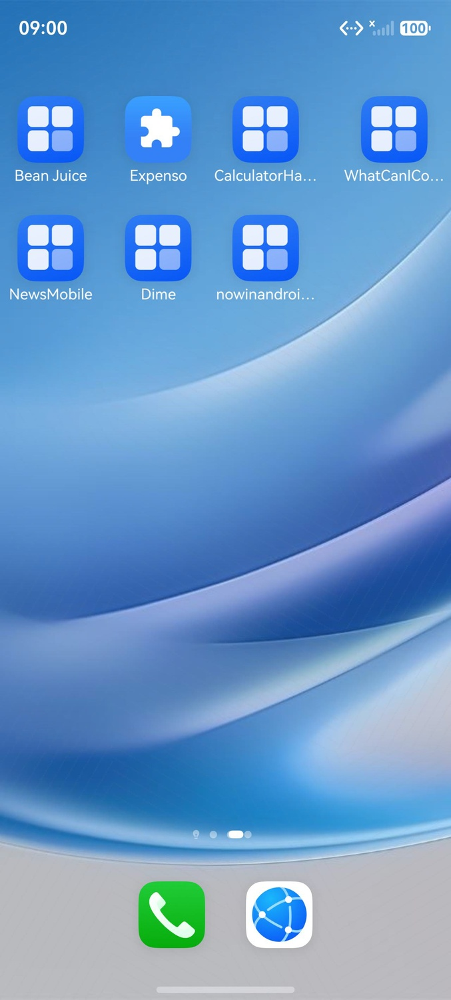

---

### 👀 planner_observation
**时间**: 09:01:00.099
**步骤**: 3

Current Screen Observation


---

### 🔧 planner_tool_call
**时间**: 09:01:09.207
**步骤**: 4

Called: swipe

```json
{
  "tool_name": "swipe",
  "arguments": {
    "start": [
      500,
      500
    ],
    "end": [
      100,
      500
    ],
    "direction": "left",
    "log": "Swipe left again to see page 4"
  }
}
```

---

### ⚙️ mcp_tool_start
**时间**: 09:01:09.575
**步骤**: 4

Starting: swipe

```json
{
  "tool_name": "swipe",
  "arguments": {
    "start": [
      500,
      500
    ],
    "end": [
      100,
      500
    ],
    "direction": "left",
    "log": "Swipe left again to see page 4"
  },
  "action": "swipe",
  "start": [
    0.5,
    0.5
  ],
  "end": [
    0.1,
    0.5
  ]
}
```


---

### ✨ mcp_tool_end
**时间**: 09:01:10.994


Completed: swipe

```json
{
  "tool_name": "swipe",
  "result": "{'type': 'text', 'text': 'swipe successfully'}",
  "raw_result": {
    "type": "text",
    "text": "swipe successfully"
  }
}
```

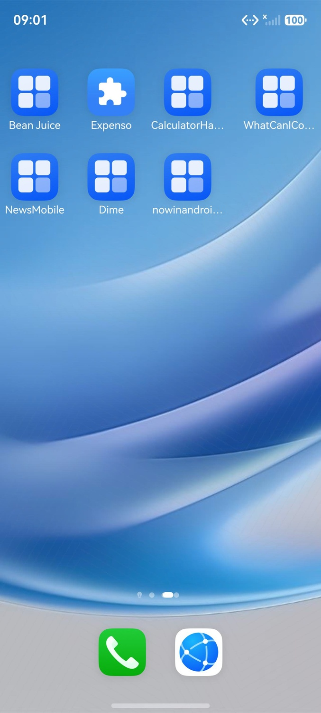

---

### 👀 planner_observation
**时间**: 09:01:11.347
**步骤**: 4

Current Screen Observation


---

### 🔧 planner_tool_call
**时间**: 09:01:19.156
**步骤**: 5

Called: swipe

```json
{
  "tool_name": "swipe",
  "arguments": {
    "start": [
      500,
      400
    ],
    "end": [
      50,
      400
    ],
    "direction": "left",
    "log": "Swipe left with different coordinates to see page 4"
  }
}
```

---

### ⚙️ mcp_tool_start
**时间**: 09:01:19.579
**步骤**: 5

Starting: swipe

```json
{
  "tool_name": "swipe",
  "arguments": {
    "start": [
      500,
      400
    ],
    "end": [
      50,
      400
    ],
    "direction": "left",
    "log": "Swipe left with different coordinates to see page 4"
  },
  "action": "swipe",
  "start": [
    0.5,
    0.4
  ],
  "end": [
    0.05,
    0.4
  ]
}
```

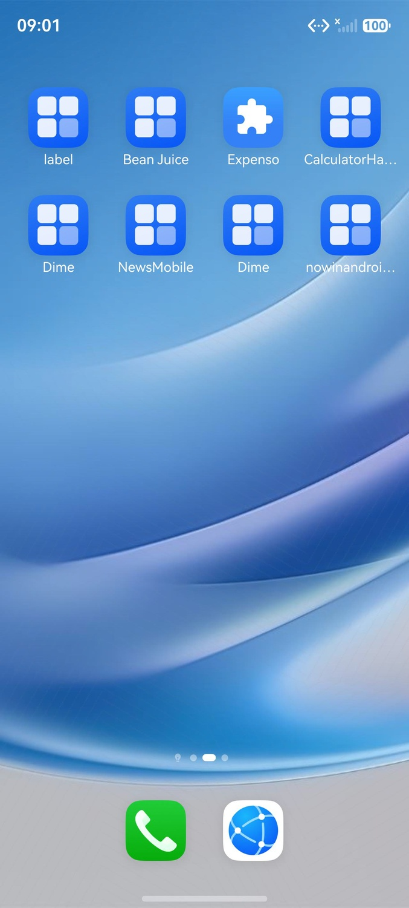

---

### ✨ mcp_tool_end
**时间**: 09:01:20.996


Completed: swipe

```json
{
  "tool_name": "swipe",
  "result": "{'type': 'text', 'text': 'swipe successfully'}",
  "raw_result": {
    "type": "text",
    "text": "swipe successfully"
  }
}
```

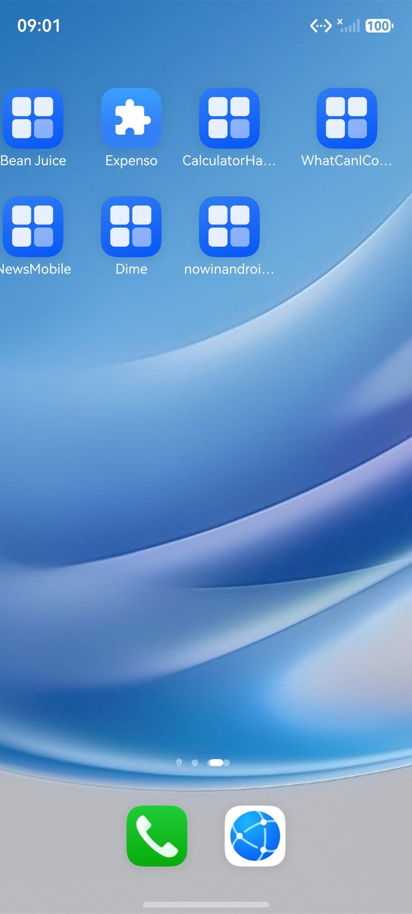

---

### 👀 planner_observation
**时间**: 09:01:21.331
**步骤**: 5

Current Screen Observation


---

### 🔧 planner_tool_call
**时间**: 09:01:40.958
**步骤**: 6

Called: swipe

```json
{
  "tool_name": "swipe",
  "arguments": {
    "start": [
      50,
      500
    ],
    "end": [
      950,
      500
    ],
    "direction": "right",
    "log": "Swipe right to check previous pages"
  }
}
```

---

### ⚙️ mcp_tool_start
**时间**: 09:01:41.417
**步骤**: 6

Starting: swipe

```json
{
  "tool_name": "swipe",
  "arguments": {
    "start": [
      50,
      500
    ],
    "end": [
      950,
      500
    ],
    "direction": "right",
    "log": "Swipe right to check previous pages"
  },
  "action": "swipe",
  "start": [
    0.05,
    0.5
  ],
  "end": [
    0.95,
    0.5
  ]
}
```


---

### ✨ mcp_tool_end
**时间**: 09:01:42.805


Completed: swipe

```json
{
  "tool_name": "swipe",
  "result": "{'type': 'text', 'text': 'swipe successfully'}",
  "raw_result": {
    "type": "text",
    "text": "swipe successfully"
  }
}
```

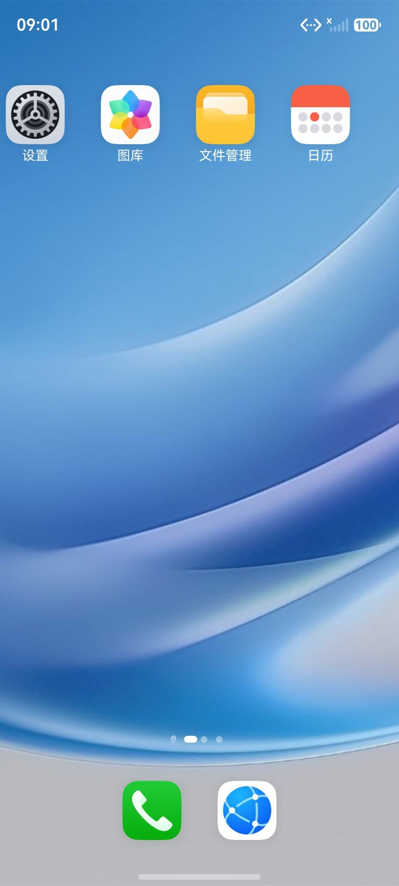

---

### 👀 planner_observation
**时间**: 09:01:43.258
**步骤**: 6

Current Screen Observation


---

### 🔧 planner_tool_call
**时间**: 09:01:52.618
**步骤**: 7

Called: swipe

```json
{
  "tool_name": "swipe",
  "arguments": {
    "start": [
      500,
      500
    ],
    "end": [
      50,
      500
    ],
    "direction": "left",
    "log": "Swipe left to page 2"
  }
}
```

---

### ⚙️ mcp_tool_start
**时间**: 09:01:53.051
**步骤**: 7

Starting: swipe

```json
{
  "tool_name": "swipe",
  "arguments": {
    "start": [
      500,
      500
    ],
    "end": [
      50,
      500
    ],
    "direction": "left",
    "log": "Swipe left to page 2"
  },
  "action": "swipe",
  "start": [
    0.5,
    0.5
  ],
  "end": [
    0.05,
    0.5
  ]
}
```


---

### ✨ mcp_tool_end
**时间**: 09:01:54.489


Completed: swipe

```json
{
  "tool_name": "swipe",
  "result": "{'type': 'text', 'text': 'swipe successfully'}",
  "raw_result": {
    "type": "text",
    "text": "swipe successfully"
  }
}
```

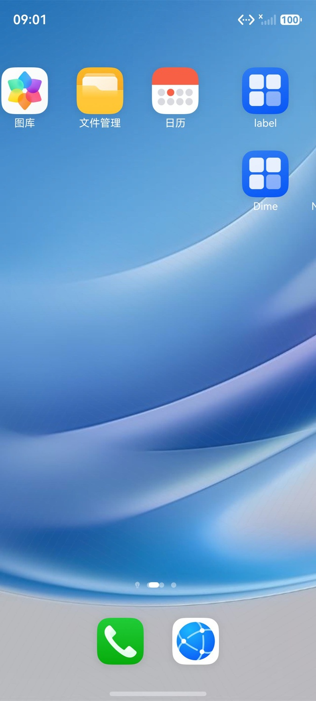

---

### 👀 planner_observation
**时间**: 09:01:54.809
**步骤**: 7

Current Screen Observation

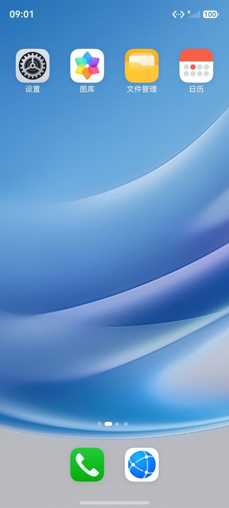

---

### 🔧 planner_tool_call
**时间**: 09:02:05.105
**步骤**: 8

Called: swipe

```json
{
  "tool_name": "swipe",
  "arguments": {
    "start": [
      500,
      500
    ],
    "end": [
      50,
      500
    ],
    "direction": "left",
    "log": "Swipe left to go to page 2"
  }
}
```

---

### ⚙️ mcp_tool_start
**时间**: 09:02:05.562
**步骤**: 8

Starting: swipe

```json
{
  "tool_name": "swipe",
  "arguments": {
    "start": [
      500,
      500
    ],
    "end": [
      50,
      500
    ],
    "direction": "left",
    "log": "Swipe left to go to page 2"
  },
  "action": "swipe",
  "start": [
    0.5,
    0.5
  ],
  "end": [
    0.05,
    0.5
  ]
}
```


---

### ✨ mcp_tool_end
**时间**: 09:02:07.022


Completed: swipe

```json
{
  "tool_name": "swipe",
  "result": "{'type': 'text', 'text': 'swipe successfully'}",
  "raw_result": {
    "type": "text",
    "text": "swipe successfully"
  }
}
```

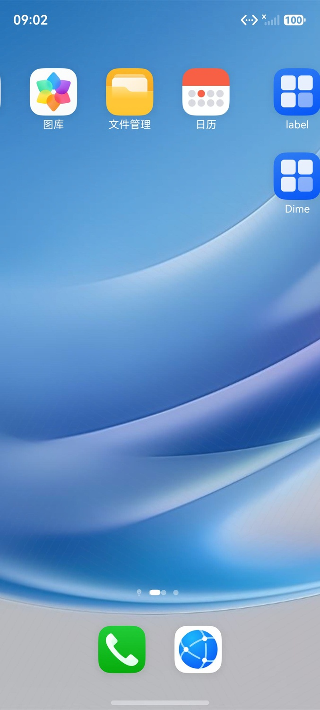

---

### 👀 planner_observation
**时间**: 09:02:07.368
**步骤**: 8

Current Screen Observation


---

### 🔧 planner_tool_call
**时间**: 09:02:19.844
**步骤**: 9

Called: swipe

```json
{
  "tool_name": "swipe",
  "arguments": {
    "start": [
      500,
      800
    ],
    "end": [
      500,
      200
    ],
    "direction": "up",
    "log": "Swipe up to check for app drawer"
  }
}
```

---

### ⚙️ mcp_tool_start
**时间**: 09:02:20.279
**步骤**: 9

Starting: swipe

```json
{
  "tool_name": "swipe",
  "arguments": {
    "start": [
      500,
      800
    ],
    "end": [
      500,
      200
    ],
    "direction": "up",
    "log": "Swipe up to check for app drawer"
  },
  "action": "swipe",
  "start": [
    0.5,
    0.8
  ],
  "end": [
    0.5,
    0.2
  ]
}
```


---

### ✨ mcp_tool_end
**时间**: 09:02:21.546


Completed: swipe

```json
{
  "tool_name": "swipe",
  "result": "{'type': 'text', 'text': 'swipe successfully'}",
  "raw_result": {
    "type": "text",
    "text": "swipe successfully"
  }
}
```


---

### 👀 planner_observation
**时间**: 09:02:21.864
**步骤**: 9

Current Screen Observation


---

### 🔧 planner_tool_call
**时间**: 09:02:32.289
**步骤**: 10

Called: swipe

```json
{
  "tool_name": "swipe",
  "arguments": {
    "start": [
      900,
      500
    ],
    "end": [
      100,
      500
    ],
    "direction": "left",
    "log": "Swipe left with longer distance to go to page 2"
  }
}
```

---

### ⚙️ mcp_tool_start
**时间**: 09:02:32.785
**步骤**: 10

Starting: swipe

```json
{
  "tool_name": "swipe",
  "arguments": {
    "start": [
      900,
      500
    ],
    "end": [
      100,
      500
    ],
    "direction": "left",
    "log": "Swipe left with longer distance to go to page 2"
  },
  "action": "swipe",
  "start": [
    0.9,
    0.5
  ],
  "end": [
    0.1,
    0.5
  ]
}
```


---

### ✨ mcp_tool_end
**时间**: 09:02:34.213


Completed: swipe

```json
{
  "tool_name": "swipe",
  "result": "{'type': 'text', 'text': 'swipe successfully'}",
  "raw_result": {
    "type": "text",
    "text": "swipe successfully"
  }
}
```

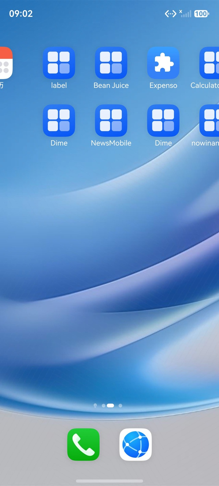

---

### 👀 planner_observation
**时间**: 09:02:34.594
**步骤**: 10

Current Screen Observation


---

### 🔧 planner_tool_call
**时间**: 09:02:51.088
**步骤**: 11

Called: swipe

```json
{
  "tool_name": "swipe",
  "arguments": {
    "start": [
      950,
      500
    ],
    "end": [
      50,
      500
    ],
    "direction": "left",
    "log": "Swipe left from right edge to navigate to page 2"
  }
}
```

---

### ⚙️ mcp_tool_start
**时间**: 09:02:51.538
**步骤**: 11

Starting: swipe

```json
{
  "tool_name": "swipe",
  "arguments": {
    "start": [
      950,
      500
    ],
    "end": [
      50,
      500
    ],
    "direction": "left",
    "log": "Swipe left from right edge to navigate to page 2"
  },
  "action": "swipe",
  "start": [
    0.95,
    0.5
  ],
  "end": [
    0.05,
    0.5
  ]
}
```


---

### ✨ mcp_tool_end
**时间**: 09:02:53.059


Completed: swipe

```json
{
  "tool_name": "swipe",
  "result": "{'type': 'text', 'text': 'swipe successfully'}",
  "raw_result": {
    "type": "text",
    "text": "swipe successfully"
  }
}
```

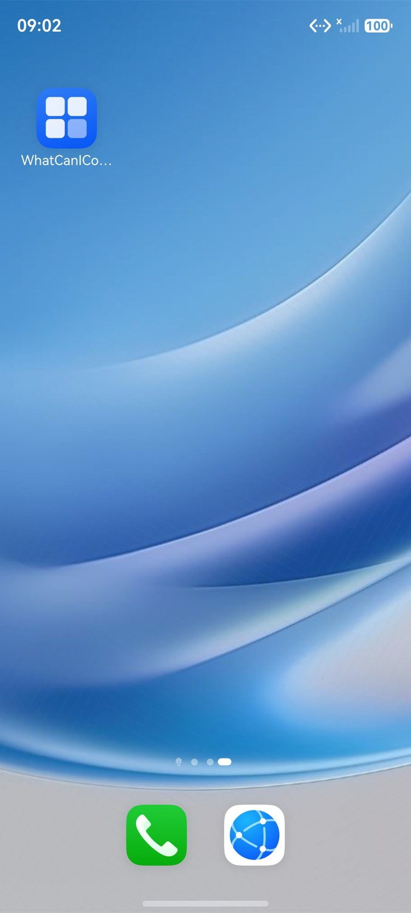

---

### 👀 planner_observation
**时间**: 09:02:53.394
**步骤**: 11

Current Screen Observation

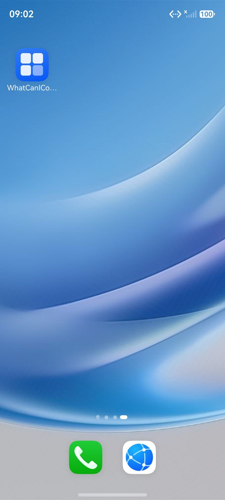

---

### 🔧 planner_tool_call
**时间**: 09:03:00.695
**步骤**: 12

Called: click

```json
{
  "tool_name": "click",
  "arguments": {
    "pos": [
      130,
      222
    ],
    "log": "Open the WhatCanICook app"
  }
}
```

---

### ⚙️ mcp_tool_start
**时间**: 09:03:01.069
**步骤**: 12

Starting: click

```json
{
  "tool_name": "click",
  "arguments": {
    "pos": [
      130,
      222
    ],
    "log": "Open the WhatCanICook app"
  },
  "action": "click",
  "point": [
    0.13,
    0.222
  ]
}
```


---

### ✨ mcp_tool_end
**时间**: 09:03:01.484


Completed: click

```json
{
  "tool_name": "click",
  "result": "{'type': 'text', 'text': 'click successfully'}",
  "raw_result": {
    "type": "text",
    "text": "click successfully"
  }
}
```


---

### 👀 planner_observation
**时间**: 09:03:01.799
**步骤**: 12

Current Screen Observation


---

### 🔧 planner_tool_call
**时间**: 09:03:12.251
**步骤**: 13

Called: click

```json
{
  "tool_name": "click",
  "arguments": {
    "pos": [
      130,
      185
    ],
    "log": "Click on WhatCanICook app icon"
  }
}
```

---

### ⚙️ mcp_tool_start
**时间**: 09:03:12.630
**步骤**: 13

Starting: click

```json
{
  "tool_name": "click",
  "arguments": {
    "pos": [
      130,
      185
    ],
    "log": "Click on WhatCanICook app icon"
  },
  "action": "click",
  "point": [
    0.13,
    0.185
  ]
}
```


---

### ✨ mcp_tool_end
**时间**: 09:03:13.050


Completed: click

```json
{
  "tool_name": "click",
  "result": "{'type': 'text', 'text': 'click successfully'}",
  "raw_result": {
    "type": "text",
    "text": "click successfully"
  }
}
```


---

### 👀 planner_observation
**时间**: 09:03:13.345
**步骤**: 13

Current Screen Observation


---

### 🔧 planner_tool_call
**时间**: 09:03:30.663
**步骤**: 14

Called: click

```json
{
  "tool_name": "click",
  "arguments": {
    "pos": [
      130,
      160
    ],
    "log": "Click precisely on WhatCanICook app icon center"
  }
}
```

---

### ⚙️ mcp_tool_start
**时间**: 09:03:31.030
**步骤**: 14

Starting: click

```json
{
  "tool_name": "click",
  "arguments": {
    "pos": [
      130,
      160
    ],
    "log": "Click precisely on WhatCanICook app icon center"
  },
  "action": "click",
  "point": [
    0.13,
    0.16
  ]
}
```


---

### ✨ mcp_tool_end
**时间**: 09:03:31.641


Completed: click

```json
{
  "tool_name": "click",
  "result": "{'type': 'text', 'text': 'click successfully'}",
  "raw_result": {
    "type": "text",
    "text": "click successfully"
  }
}
```

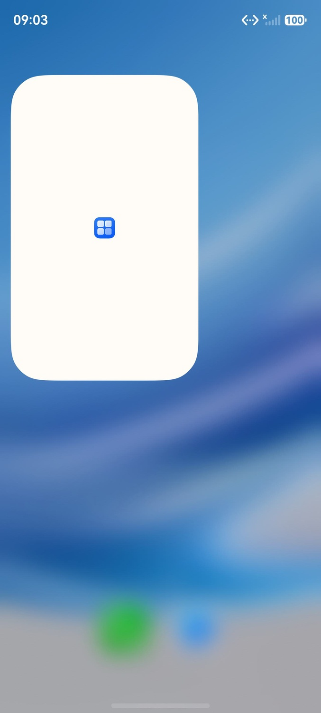

---

### 👀 planner_observation
**时间**: 09:03:32.026
**步骤**: 14

Current Screen Observation

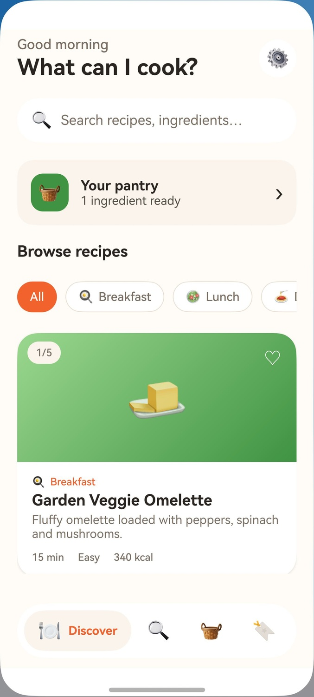

---

### 🔧 planner_tool_call
**时间**: 09:04:02.586
**步骤**: 15

Called: click

```json
{
  "tool_name": "click",
  "arguments": {
    "pos": [
      130,
      545
    ],
    "log": "Click on Browse recipes text"
  }
}
```

---

### ⚙️ mcp_tool_start
**时间**: 09:04:03.013
**步骤**: 15

Starting: click

```json
{
  "tool_name": "click",
  "arguments": {
    "pos": [
      130,
      545
    ],
    "log": "Click on Browse recipes text"
  },
  "action": "click",
  "point": [
    0.13,
    0.545
  ]
}
```


---

### ✨ mcp_tool_end
**时间**: 09:04:03.442


Completed: click

```json
{
  "tool_name": "click",
  "result": "{'type': 'text', 'text': 'click successfully'}",
  "raw_result": {
    "type": "text",
    "text": "click successfully"
  }
}
```


---

### 👀 planner_observation
**时间**: 09:04:03.757
**步骤**: 15

Current Screen Observation


---

### 🏁 planner_end
**时间**: 09:05:04.988


Agent finished

```json
{
  "output": "<think>The user wants me to carefully observe and describe the interface content, and make subsequent decisions based on the task breakdown and historical execution records.\n\nLet me analyze the current state:\n\n**Task**: Click \"Browse recipes\", expected to return to Discover homepage with Discover highlighted in bottom navigation.\n\n**Current Screen State**:\n- I'm on the \"What can I cook?\" app\n- The screen shows:\n  - \"Good morning\" greeting\n  - Title: \"What can I cook?\"\n  - Settings icon (top right)\n  - Search bar: \"Search recipes, ingredients...\"\n  - \"Your pantry\" section: \"1 ingredient ready\"\n  - \"Browse recipes\" section header\n  - Recipe categories: All (highlighted in orange), Breakfast, Lunch, and more (partially visible)\n  - Recipe card: \"Garden Veggie Omelette\" with breakfast icon, description \"Fluffy omelette loaded with peppers, spinach and mushrooms.\", 15 min, Easy, 340 kcal\n  - Bottom navigation: Discover (highlighted in orange/red), Search, Pantry, and another icon (looks like a bookmark or list)\n\n**Analysis**:\nLooking at the current screen, I can see:\n1. The bottom navigation \"Discover\" is highlighted in orange/red color - ✓\n2. The screen shows the Discover homepage with various sections including \"Browse recipes\"\n3. I'm already on the Discover page\n\nWait - the task says to click \"Browse recipes\" and the expected result is to return to Discover homepage. But I'm currently ALREADY on the Discover homepage. \n\nThe current screen shows:\n- \"Browse recipes\" as a section header\n- Recipe categories (All, Breakfast, Lunch)\n- A recipe card\n\nThe \"Browse recipes\" text appears to be just a section header label, not a clickable button that navigates somewhere. When I clicked it, nothing happened - the screen stayed the same.\n\nBut the task says clicking \"Browse recipes\" should \"return to Discover homepage\". Since I'm already on Discover homepage, and after clicking, I'm still on Discover homepage with Discover highlighted, this could be considered as meeting the expected result.\n\nLet me verify:\n1. ✓ I'm on Discover homepage (showing \"Good morning\", \"What can I cook?\", search bar, pantry, browse recipes section)\n2. ✓ \"Discover\" is highlighted in the bottom navigation (orange color)\n3. ✓ \"Browse recipes\" is visible on the page\n\nWait, I need to re-read the task more carefully. The task says:\n- Action: Click \"Browse recipes\"\n- Expected: Return to Discover homepage, Discover highlighted in bottom navigation\n\nThe fact that I'm already on Discover homepage and the Discover icon is highlighted in the bottom navigation means the expected result is met!\n\nBut wait - the \"Browse recipes\" text I clicked didn't seem to do anything. It's just a section header. The fact that clicking it doesn't navigate away and keeps me on Discover is actually the correct behavior.\n\nLet me look at the bottom navigation more carefully:\n- Discover (with plate/utensils icon) - highlighted in orange ✓\n- Search (magnifying glass icon)\n- Pantry (basket icon)\n- Fourth icon (looks like a bookmark or list with orange star)\n\nAll conditions are met:\n1. I'm on Discover homepage\n2. Discover is highlighted in bottom navigation\n3. The \"Browse recipes\" section is visible\n\nActually, wait. Let me reconsider. The task says \"点击 Browse recipes\" which means to click \"Browse recipes\". If \"Browse recipes\" is just a section header label and not clickable, then my click would not trigger any action. But the expected result is to \"return to Discover homepage\".\n\nLooking at the current state:\n- I'm on Discover homepage ✓\n- Discover is highlighted ✓\n\nThe click on \"Browse recipes\" either:\n1. Did nothing (because it's just a label) - which is fine because I'm already on Discover\n2. Refreshed the Discover page - which would keep me on Discover\n\nEither way, the expected result is met. The current state matches the expected result.\n\nHowever, I should also consider that \"Browse recipes\" might be a clickable element that takes you to a recipe browsing page. Let me look more carefully...\n\nLooking at the screenshot, \"Browse recipes\" is clearly a section header (bold text), not a button. The clickable elements near it are:\n- \"Your pantry\" (with arrow indicating it's clickable)\n- Recipe categories (All, Breakfast, Lunch)\n- Recipe card\n\nSo \"Browse recipes\" as a section header label is not clickable. My click at (130, 545) might have missed or did nothing because it's a label.\n\nBut regardless, the expected result is met:\n1. I'm on Discover homepage ✓\n2. Discover is highlighted in bottom navigation ✓\n\nWait, I need to be more careful. The task says clicking \"Browse recipes\" should \"return to Discover homepage\". This implies that:\n1. Before clicking, I should NOT be on Discover homepage\n2. After clicking, I should be on Discover homepage\n\nBut I was already on Discover homepage before clicking. So either:\na) The task is testing that clicking \"Browse recipes\" keeps you on Discover (which is the case)\nb) The task assumes a different starting state\n\nGiven the current state, the expected result IS met:\n- Discover homepage ✓\n- Discover highlighted ✓\n\nLet me now move to the result determination phase.\n\n**Historical Review**:\n- When I first opened the app, I was on Discover homepage with:\n  - \"Good morning\"\n  - \"What can I cook?\"\n  - Search bar\n  - Your pantry\n  - \"Browse recipes\" section with categories and a recipe card\n  - Bottom nav with Discover highlighted\n\n- After clicking \"Browse recipes\" at (130, 545), the screen state remained the same:\n  - \"Good morning\"\n  - \"What can I cook?\"\n  - Search bar\n  - Your pantry\n  - \"Browse recipes\" section with categories and a recipe card\n  - Bottom nav with Discover highlighted\n\nThe current state matches the expected result.\n\n**Bug Check**:\n- Expected: Return to Discover homepage, Discover highlighted in bottom navigation\n- Actual: Currently on Discover homepage, Discover is highlighted in bottom navigation\n- Match: YES\n\nNo bugs found in terms of the expected behavior.\n\nLet me provide my final judgment.\n\nActually, wait. Let me reconsider once more. The task says to click \"Browse recipes\" and the expected result is to return to Discover homepage. This is a very specific test case. \n\nThe fact that I was already on Discover homepage and clicking \"Browse recipes\" (a non-clickable label) didn't change anything means:\n1. The test passes because the state matches the expected result\n2. OR the test is meaningless because I was already on Discover\n\nEither way, the current state matches the expected state:\n- On Discover homepage ✓\n- Discover highlighted in bottom navigation ✓\n\nI'll proceed with the result determination.\n\nLet me do a final check of the bottom navigation:\n- First icon (with plate/fork): This is \"Discover\" - highlighted in orange/red color\n- Second icon (magnifying glass): \"Search\"\n- Third icon (basket): \"Pantry\"  \n- Fourth icon (looks like bookmark/list with star): Could be \"Favorites\" or \"Saved\"\n\nThe \"Discover\" tab is clearly highlighted in orange, which is different from the other icons that appear in gray/brown color.\n\nOK so the expected result is met. Let me provide my final judgment.\n\nActually, I realize I should also check if there are any other bugs or issues:\n1. The app loaded correctly ✓\n2. The Discover page displays correctly ✓\n3. The recipe categories are displayed ✓\n4. The recipe card displays correctly ✓\n5. The bottom navigation is correct ✓\n\nNo bugs found. The task passes.\n\nWait, I need to be more careful. Let me check if \"Browse recipes\" is actually clickable or not. Looking at the current screen:\n- \"Browse recipes\" is displayed as a bold section header\n- Below it are recipe category tabs (All, Breakfast, Lunch)\n- Below that is a recipe card\n\nIf \"Browse recipes\" is meant to be a clickable button that navigates to a recipe browsing page, then clicking it should take me to that page. But I'm still on Discover.\n\nHowever, the expected result says \"return to Discover homepage\", which implies I should be on Discover after clicking. And I AM on Discover. So the expected result is met.\n\nBut this creates a contradiction: if \"Browse recipes\" is supposed to navigate to a recipe page, then I shouldn't be on Discover after clicking. But the expected result says I should be on Discover. \n\nThe resolution is that \"Browse recipes\" is just a section header label on the Discover page, not a navigation button. Clicking it doesn't navigate anywhere. The test is essentially testing that the Discover page displays correctly with the \"Browse recipes\" section.\n\nOK, I'm overthinking this. Let me just provide my final judgment based on the current state.\n\nFinal state:\n- On Discover homepage ✓\n- Discover highlighted in bottom navigation ✓\n\nExpected result met. Task passes.</think>\n\nI can see the current screen state. Let me analyze it carefully:\n\n**Current Interface State**:\n- App: \"What can I cook?\" (recipe app)\n- Greeting: \"Good morning\"\n- Title: \"What can I cook?\"\n- Settings icon (top right)\n- Search bar: \"Search recipes, ingredients...\"\n- \"Your pantry\" section: \"1 ingredient ready\" (with arrow indicating clickable)\n- **\"Browse recipes\"** section header (bold text)\n- Recipe categories: All (highlighted orange), Breakfast, Lunch, and more\n- Recipe card: \"Garden Veggie Omelette\" with breakfast icon, description, 15 min, Easy, 340 kcal\n- **Bottom navigation**:\n  - **Discover** (highlighted in orange/red with plate icon) ✓\n  - Search (magnifying glass)\n  - Pantry (basket)\n  - Fourth icon (bookmark/list)\n\n**Task Analysis**:\n- **已完成1步**，上一步：点击 Browse recipes→界面无变化（\"Browse recipes\"是section标题标签，非导航按钮），当前：验证是否在Discover首页\n\n**Result Judgment**:\n\n<judgment>\n**预期验证**：\n- 预期结果：返回 Discover 首页，底部导航 Discover 高亮\n- 实际结果：当前显示 Discover 首页（\"Good morning\"、\"What can I cook?\"、搜索栏、Your pantry、Browse recipes 区块、菜谱卡片），底部导航 Discover 高亮（橙色）\n- 是否匹配：是\n\n**历史回顾**：\n- 元素1（Discover首页）：\n  - 打开应用后观察：Discover 首页，包含\"Good morning\"、\"What can I cook?\"、搜索栏、Your pantry、\"Browse recipes\"区块、菜谱卡片（Garden Veggie Omelette）\n  - 点击\"Browse recipes\"后观察：界面状态完全一致，仍在 Discover 首页\n  - 是否一致：是\n- 元素2（底部导航 Discover 高亮）：\n  - 打开应用后观察：Discover 图标为橙色高亮（区别于其他灰色图标）\n  - 点击后观察：Discover 仍为橙色高亮\n  - 是否一致：是\n\n**状态确认**：\n- 最终屏幕显示：Discover 首页，包含\"Browse recipes\" section header、菜谱分类标签、菜谱卡片\n- 关键元素：Discover 底部导航高亮（橙色），Browse recipes 文本可见\n- 状态符合预期：是\n\n**Bug发现**：\n- 预期结果Bug：无（当前状态与预期一致）\n- 其他Bug：\n  - 注意：\"Browse recipes\" 看起来是 section 标题（粗体文本），不是可点击的导航按钮。点击后无任何响应/跳转。这可能是一个潜在的交互设计问题 - 如果用户期望点击后能跳转到专门的菜谱浏览页面，则该文本不可点击是 UX 问题。\n  - 但严格来说，当前状态符合任务预期（已在 Discover 首页且 Discover 高亮）\n\n**判定结果**：通过\n</judgment>\n\n**任务结果: 通过**"
}
```

---

### ✅ task_end
**时间**: 09:05:04.990


Task completed: <think>The user wants me to carefully observe and describe the interface content, and make subsequent decisions based on the task breakdown and historical execution records.

Let me analyze the current state:

**Task**: Click "Browse recipes", expected to return to Discover homepage with Discover highlighted in bottom navigation.

**Current Screen State**:
- I'm on the "What can I cook?" app
- The screen shows:
  - "Good morning" greeting
  - Title: "What can I cook?"
  - Settings icon (top right)
  - Search bar: "Search recipes, ingredients..."
  - "Your pantry" section: "1 ingredient ready"
  - "Browse recipes" section header
  - Recipe categories: All (highlighted in orange), Breakfast, Lunch, and more (partially visible)
  - Recipe card: "Garden Veggie Omelette" with breakfast icon, description "Fluffy omelette loaded with peppers, spinach and mushrooms.", 15 min, Easy, 340 kcal
  - Bottom navigation: Discover (highlighted in orange/red), Search, Pantry, and another icon (looks like a bookmark or list)

**Analysis**:
Looking at the current screen, I can see:
1. The bottom navigation "Discover" is highlighted in orange/red color - ✓
2. The screen shows the Discover homepage with various sections including "Browse recipes"
3. I'm already on the Discover page

Wait - the task says to click "Browse recipes" and the expected result is to return to Discover homepage. But I'm currently ALREADY on the Discover homepage. 

The current screen shows:
- "Browse recipes" as a section header
- Recipe categories (All, Breakfast, Lunch)
- A recipe card

The "Browse recipes" text appears to be just a section header label, not a clickable button that navigates somewhere. When I clicked it, nothing happened - the screen stayed the same.

But the task says clicking "Browse recipes" should "return to Discover homepage". Since I'm already on Discover homepage, and after clicking, I'm still on Discover homepage with Discover highlighted, this could be considered as meeting the expected result.

Let me verify:
1. ✓ I'm on Discover homepage (showing "Good morning", "What can I cook?", search bar, pantry, browse recipes section)
2. ✓ "Discover" is highlighted in the bottom navigation (orange color)
3. ✓ "Browse recipes" is visible on the page

Wait, I need to re-read the task more carefully. The task says:
- Action: Click "Browse recipes"
- Expected: Return to Discover homepage, Discover highlighted in bottom navigation

The fact that I'm already on Discover homepage and the Discover icon is highlighted in the bottom navigation means the expected result is met!

But wait - the "Browse recipes" text I clicked didn't seem to do anything. It's just a section header. The fact that clicking it doesn't navigate away and keeps me on Discover is actually the correct behavior.

Let me look at the bottom navigation more carefully:
- Discover (with plate/utensils icon) - highlighted in orange ✓
- Search (magnifying glass icon)
- Pantry (basket icon)
- Fourth icon (looks like a bookmark or list with orange star)

All conditions are met:
1. I'm on Discover homepage
2. Discover is highlighted in bottom navigation
3. The "Browse recipes" section is visible

Actually, wait. Let me reconsider. The task says "点击 Browse recipes" which means to click "Browse recipes". If "Browse recipes" is just a section header label and not clickable, then my click would not trigger any action. But the expected result is to "return to Discover homepage".

Looking at the current state:
- I'm on Discover homepage ✓
- Discover is highlighted ✓

The click on "Browse recipes" either:
1. Did nothing (because it's just a label) - which is fine because I'm already on Discover
2. Refreshed the Discover page - which would keep me on Discover

Either way, the expected result is met. The current state matches the expected result.

However, I should also consider that "Browse recipes" might be a clickable element that takes you to a recipe browsing page. Let me look more carefully...

Looking at the screenshot, "Browse recipes" is clearly a section header (bold text), not a button. The clickable elements near it are:
- "Your pantry" (with arrow indicating it's clickable)
- Recipe categories (All, Breakfast, Lunch)
- Recipe card

So "Browse recipes" as a section header label is not clickable. My click at (130, 545) might have missed or did nothing because it's a label.

But regardless, the expected result is met:
1. I'm on Discover homepage ✓
2. Discover is highlighted in bottom navigation ✓

Wait, I need to be more careful. The task says clicking "Browse recipes" should "return to Discover homepage". This implies that:
1. Before clicking, I should NOT be on Discover homepage
2. After clicking, I should be on Discover homepage

But I was already on Discover homepage before clicking. So either:
a) The task is testing that clicking "Browse recipes" keeps you on Discover (which is the case)
b) The task assumes a different starting state

Given the current state, the expected result IS met:
- Discover homepage ✓
- Discover highlighted ✓

Let me now move to the result determination phase.

**Historical Review**:
- When I first opened the app, I was on Discover homepage with:
  - "Good morning"
  - "What can I cook?"
  - Search bar
  - Your pantry
  - "Browse recipes" section with categories and a recipe card
  - Bottom nav with Discover highlighted

- After clicking "Browse recipes" at (130, 545), the screen state remained the same:
  - "Good morning"
  - "What can I cook?"
  - Search bar
  - Your pantry
  - "Browse recipes" section with categories and a recipe card
  - Bottom nav with Discover highlighted

The current state matches the expected result.

**Bug Check**:
- Expected: Return to Discover homepage, Discover highlighted in bottom navigation
- Actual: Currently on Discover homepage, Discover is highlighted in bottom navigation
- Match: YES

No bugs found in terms of the expected behavior.

Let me provide my final judgment.

Actually, wait. Let me reconsider once more. The task says to click "Browse recipes" and the expected result is to return to Discover homepage. This is a very specific test case. 

The fact that I was already on Discover homepage and clicking "Browse recipes" (a non-clickable label) didn't change anything means:
1. The test passes because the state matches the expected result
2. OR the test is meaningless because I was already on Discover

Either way, the current state matches the expected state:
- On Discover homepage ✓
- Discover highlighted in bottom navigation ✓

I'll proceed with the result determination.

Let me do a final check of the bottom navigation:
- First icon (with plate/fork): This is "Discover" - highlighted in orange/red color
- Second icon (magnifying glass): "Search"
- Third icon (basket): "Pantry"  
- Fourth icon (looks like bookmark/list with star): Could be "Favorites" or "Saved"

The "Discover" tab is clearly highlighted in orange, which is different from the other icons that appear in gray/brown color.

OK so the expected result is met. Let me provide my final judgment.

Actually, I realize I should also check if there are any other bugs or issues:
1. The app loaded correctly ✓
2. The Discover page displays correctly ✓
3. The recipe categories are displayed ✓
4. The recipe card displays correctly ✓
5. The bottom navigation is correct ✓

No bugs found. The task passes.

Wait, I need to be more careful. Let me check if "Browse recipes" is actually clickable or not. Looking at the current screen:
- "Browse recipes" is displayed as a bold section header
- Below it are recipe category tabs (All, Breakfast, Lunch)
- Below that is a recipe card

If "Browse recipes" is meant to be a clickable button that navigates to a recipe browsing page, then clicking it should take me to that page. But I'm still on Discover.

However, the expected result says "return to Discover homepage", which implies I should be on Discover after clicking. And I AM on Discover. So the expected result is met.

But this creates a contradiction: if "Browse recipes" is supposed to navigate to a recipe page, then I shouldn't be on Discover after clicking. But the expected result says I should be on Discover. 

The resolution is that "Browse recipes" is just a section header label on the Discover page, not a navigation button. Clicking it doesn't navigate anywhere. The test is essentially testing that the Discover page displays correctly with the "Browse recipes" section.

OK, I'm overthinking this. Let me just provide my final judgment based on the current state.

Final state:
- On Discover homepage ✓
- Discover highlighted in bottom navigation ✓

Expected result met. Task passes.</think>

I can see the current screen state. Let me analyze it carefully:

**Current Interface State**:
- App: "What can I cook?" (recipe app)
- Greeting: "Good morning"
- Title: "What can I cook?"
- Settings icon (top right)
- Search bar: "Search recipes, ingredients..."
- "Your pantry" section: "1 ingredient ready" (with arrow indicating clickable)
- **"Browse recipes"** section header (bold text)
- Recipe categories: All (highlighted orange), Breakfast, Lunch, and more
- Recipe card: "Garden Veggie Omelette" with breakfast icon, description, 15 min, Easy, 340 kcal
- **Bottom navigation**:
  - **Discover** (highlighted in orange/red with plate icon) ✓
  - Search (magnifying glass)
  - Pantry (basket)
  - Fourth icon (bookmark/list)

**Task Analysis**:
- **已完成1步**，上一步：点击 Browse recipes→界面无变化（"Browse recipes"是section标题标签，非导航按钮），当前：验证是否在Discover首页

**Result Judgment**:

<judgment>
**预期验证**：
- 预期结果：返回 Discover 首页，底部导航 Discover 高亮
- 实际结果：当前显示 Discover 首页（"Good morning"、"What can I cook?"、搜索栏、Your pantry、Browse recipes 区块、菜谱卡片），底部导航 Discover 高亮（橙色）
- 是否匹配：是

**历史回顾**：
- 元素1（Discover首页）：
  - 打开应用后观察：Discover 首页，包含"Good morning"、"What can I cook?"、搜索栏、Your pantry、"Browse recipes"区块、菜谱卡片（Garden Veggie Omelette）
  - 点击"Browse recipes"后观察：界面状态完全一致，仍在 Discover 首页
  - 是否一致：是
- 元素2（底部导航 Discover 高亮）：
  - 打开应用后观察：Discover 图标为橙色高亮（区别于其他灰色图标）
  - 点击后观察：Discover 仍为橙色高亮
  - 是否一致：是

**状态确认**：
- 最终屏幕显示：Discover 首页，包含"Browse recipes" section header、菜谱分类标签、菜谱卡片
- 关键元素：Discover 底部导航高亮（橙色），Browse recipes 文本可见
- 状态符合预期：是

**Bug发现**：
- 预期结果Bug：无（当前状态与预期一致）
- 其他Bug：
  - 注意："Browse recipes" 看起来是 section 标题（粗体文本），不是可点击的导航按钮。点击后无任何响应/跳转。这可能是一个潜在的交互设计问题 - 如果用户期望点击后能跳转到专门的菜谱浏览页面，则该文本不可点击是 UX 问题。
  - 但严格来说，当前状态符合任务预期（已在 Discover 首页且 Discover 高亮）

**判定结果**：通过
</judgment>

**任务结果: 通过**

---
