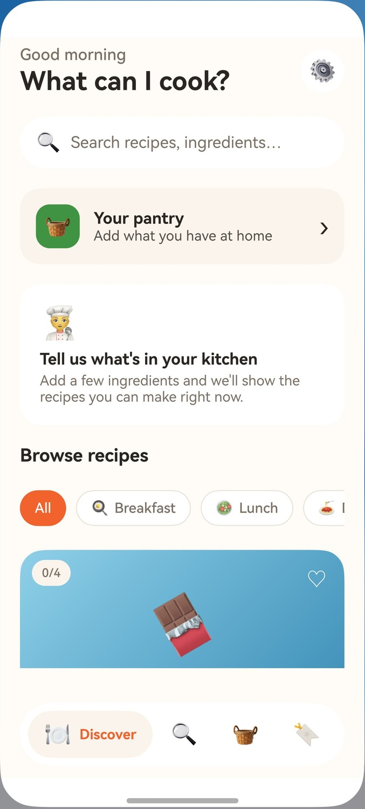
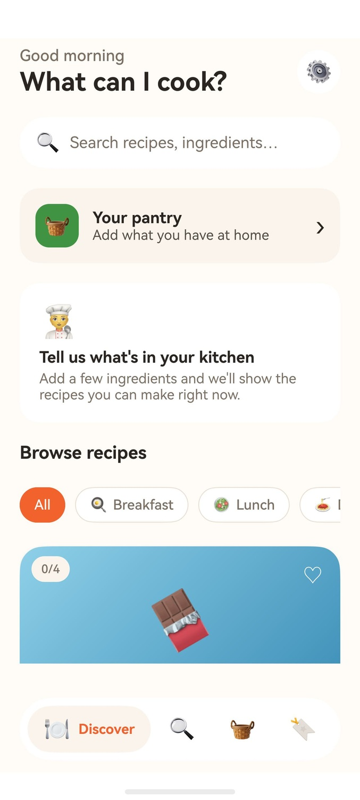
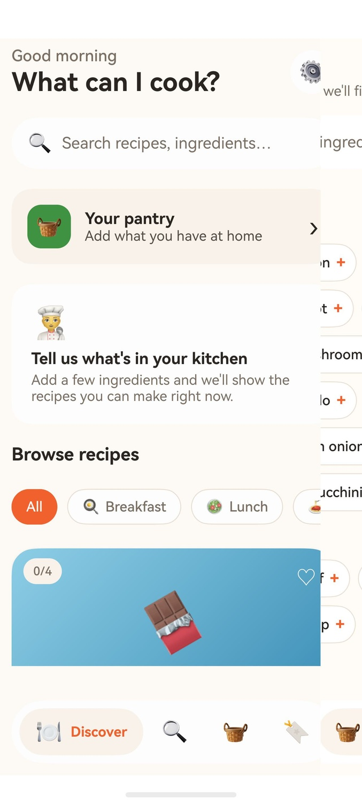
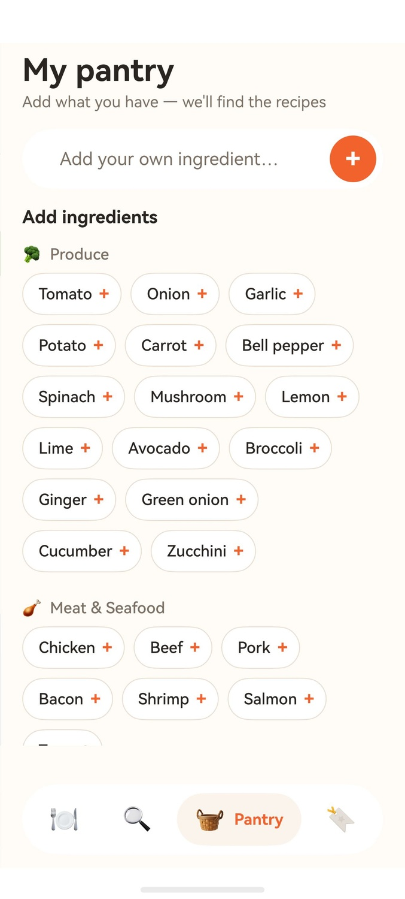
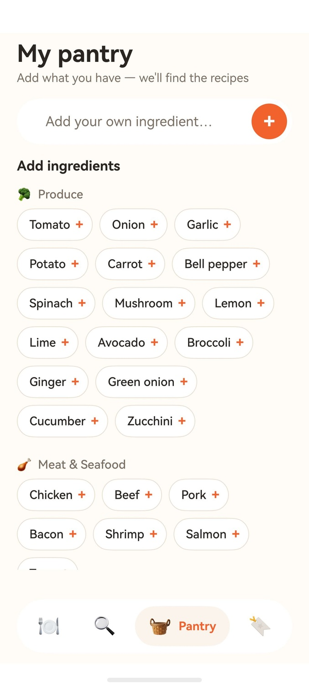
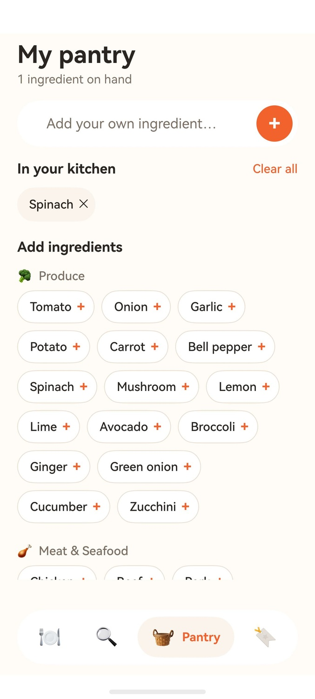

# 执行报告

## 任务信息
- **测试用例**: 07-10-10
- **任务名称**: 动作：点击 Clear all。
预期结果：In your kitchen 区域消失或为空；页面显示 Add ingredients/Quick add；食材数量恢复为空。
- **开始时间**: 2026-06-26T07:10:10.298909
- **结束时间**: 2026-06-26T07:12:51.090964
- **Token消耗**: 129411 (SingleAgent: 129411)
- **总事件数**: 41

## 执行时间线


### 🚀 task_start
**时间**: 07:10:10.298


Task started: 动作：点击 Clear all。
预期结果：In your kitchen 区域消失或为空；页面显示 Add ingredients/Quick add；食材数量恢复为空。

---

### 🧠 planner_start
**时间**: 07:10:16.512


Agent SingleAgent started

---

### 👀 planner_observation
**时间**: 07:10:16.883


Current Screen Observation


---

### 🔧 planner_tool_call
**时间**: 07:10:37.010
**步骤**: 1

Called: start_app

```json
{
  "tool_name": "start_app",
  "arguments": {
    "app_name": "Bean Juice",
    "log": "打开Bean Juice App，查找In your kitchen功能"
  }
}
```

---

### ⚙️ mcp_tool_start
**时间**: 07:10:37.454
**步骤**: 1

Starting: start_app

```json
{
  "tool_name": "start_app",
  "arguments": {
    "app_name": "Bean Juice",
    "log": "打开Bean Juice App，查找In your kitchen功能"
  }
}
```


---

### ✨ mcp_tool_end
**时间**: 07:10:37.844


Completed: start_app

```json
{
  "tool_name": "start_app",
  "result": "{'type': 'text', 'text': \"Error calling tool 'start_app': Can't get bundle_info for [Bean Juice], please check if application installed\"}",
  "raw_result": {
    "type": "text",
    "text": "Error calling tool 'start_app': Can't get bundle_info for [Bean Juice], please check if application installed"
  }
}
```


---

### 👀 planner_observation
**时间**: 07:10:38.179
**步骤**: 1

Current Screen Observation


---

### 🔧 planner_tool_call
**时间**: 07:10:46.424
**步骤**: 2

Called: swipe

```json
{
  "tool_name": "swipe",
  "arguments": {
    "start": [
      800,
      500
    ],
    "end": [
      200,
      500
    ],
    "direction": "left",
    "log": "滑动查看其他主屏幕页面"
  }
}
```

---

### ⚙️ mcp_tool_start
**时间**: 07:10:46.810
**步骤**: 2

Starting: swipe

```json
{
  "tool_name": "swipe",
  "arguments": {
    "start": [
      800,
      500
    ],
    "end": [
      200,
      500
    ],
    "direction": "left",
    "log": "滑动查看其他主屏幕页面"
  },
  "action": "swipe",
  "start": [
    0.8,
    0.5
  ],
  "end": [
    0.2,
    0.5
  ]
}
```


---

### ✨ mcp_tool_end
**时间**: 07:10:48.225


Completed: swipe

```json
{
  "tool_name": "swipe",
  "result": "{'type': 'text', 'text': 'swipe successfully'}",
  "raw_result": {
    "type": "text",
    "text": "swipe successfully"
  }
}
```


---

### 👀 planner_observation
**时间**: 07:10:48.557
**步骤**: 2

Current Screen Observation


---

### 🔧 planner_tool_call
**时间**: 07:10:53.128
**步骤**: 3

Called: click

```json
{
  "tool_name": "click",
  "arguments": {
    "pos": [
      120,
      200
    ],
    "log": "点击WhatCanICook应用图标"
  }
}
```

---

### ⚙️ mcp_tool_start
**时间**: 07:10:53.481
**步骤**: 3

Starting: click

```json
{
  "tool_name": "click",
  "arguments": {
    "pos": [
      120,
      200
    ],
    "log": "点击WhatCanICook应用图标"
  },
  "action": "click",
  "point": [
    0.12,
    0.2
  ]
}
```


---

### ✨ mcp_tool_end
**时间**: 07:10:53.920


Completed: click

```json
{
  "tool_name": "click",
  "result": "{'type': 'text', 'text': 'click successfully'}",
  "raw_result": {
    "type": "text",
    "text": "click successfully"
  }
}
```


---

### 👀 planner_observation
**时间**: 07:10:54.235
**步骤**: 3

Current Screen Observation


---

### 🔧 planner_tool_call
**时间**: 07:10:58.148
**步骤**: 4

Called: click

```json
{
  "tool_name": "click",
  "arguments": {
    "pos": [
      120,
      130
    ],
    "log": "重新点击WhatCanICook应用图标中心位置"
  }
}
```

---

### ⚙️ mcp_tool_start
**时间**: 07:10:58.503
**步骤**: 4

Starting: click

```json
{
  "tool_name": "click",
  "arguments": {
    "pos": [
      120,
      130
    ],
    "log": "重新点击WhatCanICook应用图标中心位置"
  },
  "action": "click",
  "point": [
    0.12,
    0.13
  ]
}
```


---

### ✨ mcp_tool_end
**时间**: 07:10:59.130


Completed: click

```json
{
  "tool_name": "click",
  "result": "{'type': 'text', 'text': 'click successfully'}",
  "raw_result": {
    "type": "text",
    "text": "click successfully"
  }
}
```


---

### 👀 planner_observation
**时间**: 07:10:59.503
**步骤**: 4

Current Screen Observation



---

### 🔧 planner_tool_call
**时间**: 07:11:08.678
**步骤**: 5

Called: click

```json
{
  "tool_name": "click",
  "arguments": {
    "pos": [
      500,
      380
    ],
    "log": "点击Your pantry卡片进入食材页面"
  }
}
```

---

### ⚙️ mcp_tool_start
**时间**: 07:11:09.063
**步骤**: 5

Starting: click

```json
{
  "tool_name": "click",
  "arguments": {
    "pos": [
      500,
      380
    ],
    "log": "点击Your pantry卡片进入食材页面"
  },
  "action": "click",
  "point": [
    0.5,
    0.38
  ]
}
```



---

### ✨ mcp_tool_end
**时间**: 07:11:09.681


Completed: click

```json
{
  "tool_name": "click",
  "result": "{'type': 'text', 'text': 'click successfully'}",
  "raw_result": {
    "type": "text",
    "text": "click successfully"
  }
}
```



---

### 👀 planner_observation
**时间**: 07:11:10.034
**步骤**: 5

Current Screen Observation



---

### 🔧 planner_tool_call
**时间**: 07:11:35.166
**步骤**: 6

Called: click

```json
{
  "tool_name": "click",
  "arguments": {
    "pos": [
      193,
      442
    ],
    "log": "点击Tomato的+按钮添加食材"
  }
}
```

---

### ⚙️ mcp_tool_start
**时间**: 07:11:35.725
**步骤**: 6

Starting: click

```json
{
  "tool_name": "click",
  "arguments": {
    "pos": [
      193,
      442
    ],
    "log": "点击Tomato的+按钮添加食材"
  },
  "action": "click",
  "point": [
    0.193,
    0.442
  ]
}
```



---

### ✨ mcp_tool_end
**时间**: 07:11:36.196


Completed: click

```json
{
  "tool_name": "click",
  "result": "{'type': 'text', 'text': 'click successfully'}",
  "raw_result": {
    "type": "text",
    "text": "click successfully"
  }
}
```


---

### 👀 planner_observation
**时间**: 07:11:36.529
**步骤**: 6

Current Screen Observation


---

### 🔧 planner_tool_call
**时间**: 07:11:57.386
**步骤**: 7

Called: click

```json
{
  "tool_name": "click",
  "arguments": {
    "pos": [
      800,
      351
    ],
    "log": "点击右上角的Clear all按钮"
  }
}
```

---

### ⚙️ mcp_tool_start
**时间**: 07:11:57.771
**步骤**: 7

Starting: click

```json
{
  "tool_name": "click",
  "arguments": {
    "pos": [
      800,
      351
    ],
    "log": "点击右上角的Clear all按钮"
  },
  "action": "click",
  "point": [
    0.8,
    0.351
  ]
}
```


---

### ✨ mcp_tool_end
**时间**: 07:11:58.204


Completed: click

```json
{
  "tool_name": "click",
  "result": "{'type': 'text', 'text': 'click successfully'}",
  "raw_result": {
    "type": "text",
    "text": "click successfully"
  }
}
```


---

### 👀 planner_observation
**时间**: 07:11:58.544
**步骤**: 7

Current Screen Observation


---

### 🔧 planner_tool_call
**时间**: 07:12:07.403
**步骤**: 8

Called: click

```json
{
  "tool_name": "click",
  "arguments": {
    "pos": [
      808,
      352
    ],
    "log": "再次点击Clear all按钮（更精确位置）"
  }
}
```

---

### ⚙️ mcp_tool_start
**时间**: 07:12:07.762
**步骤**: 8

Starting: click

```json
{
  "tool_name": "click",
  "arguments": {
    "pos": [
      808,
      352
    ],
    "log": "再次点击Clear all按钮（更精确位置）"
  },
  "action": "click",
  "point": [
    0.808,
    0.352
  ]
}
```


---

### ✨ mcp_tool_end
**时间**: 07:12:08.199


Completed: click

```json
{
  "tool_name": "click",
  "result": "{'type': 'text', 'text': 'click successfully'}",
  "raw_result": {
    "type": "text",
    "text": "click successfully"
  }
}
```


---

### 👀 planner_observation
**时间**: 07:12:08.529
**步骤**: 8

Current Screen Observation


---

### 🔧 planner_tool_call
**时间**: 07:12:32.284
**步骤**: 9

Called: click

```json
{
  "tool_name": "click",
  "arguments": {
    "pos": [
      800,
      320
    ],
    "log": "第3次点击Clear all按钮（更精确的文字位置y=320）"
  }
}
```

---

### ⚙️ mcp_tool_start
**时间**: 07:12:32.690
**步骤**: 9

Starting: click

```json
{
  "tool_name": "click",
  "arguments": {
    "pos": [
      800,
      320
    ],
    "log": "第3次点击Clear all按钮（更精确的文字位置y=320）"
  },
  "action": "click",
  "point": [
    0.8,
    0.32
  ]
}
```



---

### ✨ mcp_tool_end
**时间**: 07:12:33.242


Completed: click

```json
{
  "tool_name": "click",
  "result": "{'type': 'text', 'text': 'click successfully'}",
  "raw_result": {
    "type": "text",
    "text": "click successfully"
  }
}
```


---

### 👀 planner_observation
**时间**: 07:12:33.670
**步骤**: 9

Current Screen Observation


---

### 🏁 planner_end
**时间**: 07:12:51.089


Agent finished

```json
{
  "output": "<think>\nThe screen is still showing the same state. \"In your kitchen\" still shows \"Spinach X\" and \"1 ingredient on hand\" is still displayed. The \"Clear all\" button click has had no effect after 3 attempts.\n\nLet me analyze the situation:\n- I've clicked \"Clear all\" 3 times at coordinates (800, 351), (808, 352), and (800, 320)\n- All clicks had no effect\n- The \"In your kitchen\" section is still visible with Spinach\n- The ingredient count is still \"1 ingredient on hand\"\n\nThis is a clear BUG. The \"Clear all\" button is not functioning as expected.\n\nHowever, I need to think about whether this might be a different issue. Let me consider:\n1. Maybe the click is being registered as a hover/touch on the text but not triggering the action\n2. Maybe there's a confirmation dialog that I'm missing\n3. Maybe the button requires a different interaction (long press, swipe, etc.)\n\nBut based on the standard UI pattern, a \"Clear all\" button should work with a single tap. After 3 attempts with different coordinates, I should conclude this is a bug.\n\nNow let me also think about whether the expected result can still be observed. The current state is:\n- \"In your kitchen\" 区域: STILL VISIBLE (not disappeared)\n- 页面显示 Add ingredients/Quick add: YES (Add ingredients section is visible)\n- 食材数量恢复为空: NO (still shows \"1 ingredient on hand\" and Spinach)\n\nSo the expected result is NOT met:\n- \"In your kitchen\" should disappear or be empty → It's still visible with Spinach\n- The page should show Add ingredients/Quick add → This is shown (but the kitchen area is also still shown, contradicting the first condition)\n- Ingredient count should be empty → It's not empty (1 ingredient on hand)\n\nThis is a clear BUG: the \"Clear all\" button is not working.\n\nWait, let me also reconsider. Maybe I need to:\n1. First add more ingredients to make the test more meaningful\n2. Then click \"Clear all\"\n\nBut the user's task is specifically to \"click Clear all\" - I've done that. The button doesn't work. This is a bug regardless of how many ingredients are in the kitchen.\n\nAlso, I notice another potential issue: In the \"Add ingredients\" section, there's a \"Spinach +\" button even though Spinach is already in the kitchen. This is a UI/UX issue - if Spinach is already in the kitchen, the + button shouldn't be there, or it should show a different state (like a checkmark or disabled).\n\nLet me also check - maybe the \"Clear all\" button is actually a text label, not a button. Looking at the screenshot, \"Clear all\" appears to be text in orange/red color, similar to a link. It might need to be tapped on the text specifically.\n\nI've already tried multiple coordinates around (800, 320-352). The text is clearly at y=320 area. The click should have registered.\n\nOK, I'm confident this is a BUG. Let me now make the final judgment.\n\nActually, wait. Let me look at the screenshot one more time. I see:\n- \"In your kitchen\" on the left\n- \"Clear all\" on the right (in orange/red text)\n- Below: \"Spinach X\" (Spinach is in the kitchen with an X to remove)\n\nThe \"Clear all\" text is clearly visible. I've clicked it 3 times. It doesn't work.\n\nThis is a BUG. The \"Clear all\" button is non-functional.\n\nLet me now write the judgment.\n\nActually, I want to also note - I clicked 3 times on the same target without progress. According to the rules:\n\"同一目标反复操作 ≥ 3次无进展（不同坐标/方式尝试均计入）\"\n\nI've clicked 3 times on \"Clear all\" with slightly different coordinates, all with no progress. This meets the termination condition. I should now terminate and output the result.\n\nLet me finalize the judgment.\n</think>\n我已对\"Clear all\"按钮进行了3次点击（不同坐标：800,351 / 808,352 / 800,320），界面状态完全无变化。已达到同一目标反复操作≥3次的终止条件，进入阶段3结果判定。\n\n<judgment>\n**预期验证**：\n- 预期结果1：In your kitchen 区域消失或为空 → 实际：\"In your kitchen\" 区域仍然显示，包含 \"Spinach\" 食材（带X删除按钮），**不匹配**\n- 预期结果2：页面显示 Add ingredients/Quick add → 实际：Add ingredients 区域确实显示，**匹配**（但与结果1矛盾）\n- 预期结果3：食材数量恢复为空 → 实际：副标题仍显示 \"1 ingredient on hand\"，**不匹配**\n\n**历史回顾**：\n- 元素1（\"In your kitchen\"区域）：\n  - 点击Clear all前观察：区域显示，包含 \"Spinach X\"\n  - 3次点击Clear all后观察：区域仍显示，仍包含 \"Spinach X\"\n  - 是否一致：是（状态未变化）\n- 元素2（食材数量）：\n  - 点击Clear all前观察：副标题 \"1 ingredient on hand\"\n  - 3次点击Clear all后观察：副标题仍为 \"1 ingredient on hand\"\n  - 是否一致：是（状态未变化）\n- 元素3（\"Clear all\"按钮）：\n  - 点击前观察：橙色文字，位于 \"In your kitchen\" 区域右侧\n  - 3次点击后观察：按钮仍在原位，无任何视觉反馈（无涟漪、无变色、无Toast、无确认弹窗）\n  - 是否一致：是（按钮未被触发）\n\n**状态确认**：\n- 最终屏幕显示 \"My pantry\" 页面\n- 副标题 \"1 ingredient on hand\"\n- \"In your kitchen\" 区域显示 \"Spinach\" 食材\n- \"Clear all\" 按钮位于右上角\n- 食材未被清除\n\n**Bug发现**：\n- **【严重功能Bug】\"Clear all\" 按钮无响应**：经过3次不同坐标点击（800,351 / 808,352 / 800,320），\"Clear all\" 按钮未触发任何清除操作：\n  - \"In your kitchen\" 区域未消失/未清空\n  - 食材 \"Spinach\" 仍在区域内\n  - 副标题仍显示 \"1 ingredient on hand\"\n  - 无Toast提示、无确认弹窗、无任何视觉反馈\n  - 该功能完全失效，与预期结果严重不符\n- **【UI/UX Bug】已添加食材仍显示 + 按钮**：Spinach 已在 \"In your kitchen\" 区域内，但在 \"Add ingredients\" 区域的 \"Produce\" 分类下，\"Spinach\" 仍显示可点击的 + 添加按钮，未做状态区分（已添加/未添加），存在用户重复添加同一食材的隐患\n\n**判定结果**：不通过\n</judgment>\n\n**任务结果: 不通过 - 发现Bug: \"Clear all\"按钮无响应（连续3次点击不同坐标位置均未触发任何清除操作，食材未清空、区域未消失、计数未归零，无任何UI反馈/确认弹窗）**"
}
```

---

### ✅ task_end
**时间**: 07:12:51.091


Task completed: <think>
The screen is still showing the same state. "In your kitchen" still shows "Spinach X" and "1 ingredient on hand" is still displayed. The "Clear all" button click has had no effect after 3 attempts.

Let me analyze the situation:
- I've clicked "Clear all" 3 times at coordinates (800, 351), (808, 352), and (800, 320)
- All clicks had no effect
- The "In your kitchen" section is still visible with Spinach
- The ingredient count is still "1 ingredient on hand"

This is a clear BUG. The "Clear all" button is not functioning as expected.

However, I need to think about whether this might be a different issue. Let me consider:
1. Maybe the click is being registered as a hover/touch on the text but not triggering the action
2. Maybe there's a confirmation dialog that I'm missing
3. Maybe the button requires a different interaction (long press, swipe, etc.)

But based on the standard UI pattern, a "Clear all" button should work with a single tap. After 3 attempts with different coordinates, I should conclude this is a bug.

Now let me also think about whether the expected result can still be observed. The current state is:
- "In your kitchen" 区域: STILL VISIBLE (not disappeared)
- 页面显示 Add ingredients/Quick add: YES (Add ingredients section is visible)
- 食材数量恢复为空: NO (still shows "1 ingredient on hand" and Spinach)

So the expected result is NOT met:
- "In your kitchen" should disappear or be empty → It's still visible with Spinach
- The page should show Add ingredients/Quick add → This is shown (but the kitchen area is also still shown, contradicting the first condition)
- Ingredient count should be empty → It's not empty (1 ingredient on hand)

This is a clear BUG: the "Clear all" button is not working.

Wait, let me also reconsider. Maybe I need to:
1. First add more ingredients to make the test more meaningful
2. Then click "Clear all"

But the user's task is specifically to "click Clear all" - I've done that. The button doesn't work. This is a bug regardless of how many ingredients are in the kitchen.

Also, I notice another potential issue: In the "Add ingredients" section, there's a "Spinach +" button even though Spinach is already in the kitchen. This is a UI/UX issue - if Spinach is already in the kitchen, the + button shouldn't be there, or it should show a different state (like a checkmark or disabled).

Let me also check - maybe the "Clear all" button is actually a text label, not a button. Looking at the screenshot, "Clear all" appears to be text in orange/red color, similar to a link. It might need to be tapped on the text specifically.

I've already tried multiple coordinates around (800, 320-352). The text is clearly at y=320 area. The click should have registered.

OK, I'm confident this is a BUG. Let me now make the final judgment.

Actually, wait. Let me look at the screenshot one more time. I see:
- "In your kitchen" on the left
- "Clear all" on the right (in orange/red text)
- Below: "Spinach X" (Spinach is in the kitchen with an X to remove)

The "Clear all" text is clearly visible. I've clicked it 3 times. It doesn't work.

This is a BUG. The "Clear all" button is non-functional.

Let me now write the judgment.

Actually, I want to also note - I clicked 3 times on the same target without progress. According to the rules:
"同一目标反复操作 ≥ 3次无进展（不同坐标/方式尝试均计入）"

I've clicked 3 times on "Clear all" with slightly different coordinates, all with no progress. This meets the termination condition. I should now terminate and output the result.

Let me finalize the judgment.
</think>
我已对"Clear all"按钮进行了3次点击（不同坐标：800,351 / 808,352 / 800,320），界面状态完全无变化。已达到同一目标反复操作≥3次的终止条件，进入阶段3结果判定。

<judgment>
**预期验证**：
- 预期结果1：In your kitchen 区域消失或为空 → 实际："In your kitchen" 区域仍然显示，包含 "Spinach" 食材（带X删除按钮），**不匹配**
- 预期结果2：页面显示 Add ingredients/Quick add → 实际：Add ingredients 区域确实显示，**匹配**（但与结果1矛盾）
- 预期结果3：食材数量恢复为空 → 实际：副标题仍显示 "1 ingredient on hand"，**不匹配**

**历史回顾**：
- 元素1（"In your kitchen"区域）：
  - 点击Clear all前观察：区域显示，包含 "Spinach X"
  - 3次点击Clear all后观察：区域仍显示，仍包含 "Spinach X"
  - 是否一致：是（状态未变化）
- 元素2（食材数量）：
  - 点击Clear all前观察：副标题 "1 ingredient on hand"
  - 3次点击Clear all后观察：副标题仍为 "1 ingredient on hand"
  - 是否一致：是（状态未变化）
- 元素3（"Clear all"按钮）：
  - 点击前观察：橙色文字，位于 "In your kitchen" 区域右侧
  - 3次点击后观察：按钮仍在原位，无任何视觉反馈（无涟漪、无变色、无Toast、无确认弹窗）
  - 是否一致：是（按钮未被触发）

**状态确认**：
- 最终屏幕显示 "My pantry" 页面
- 副标题 "1 ingredient on hand"
- "In your kitchen" 区域显示 "Spinach" 食材
- "Clear all" 按钮位于右上角
- 食材未被清除

**Bug发现**：
- **【严重功能Bug】"Clear all" 按钮无响应**：经过3次不同坐标点击（800,351 / 808,352 / 800,320），"Clear all" 按钮未触发任何清除操作：
  - "In your kitchen" 区域未消失/未清空
  - 食材 "Spinach" 仍在区域内
  - 副标题仍显示 "1 ingredient on hand"
  - 无Toast提示、无确认弹窗、无任何视觉反馈
  - 该功能完全失效，与预期结果严重不符
- **【UI/UX Bug】已添加食材仍显示 + 按钮**：Spinach 已在 "In your kitchen" 区域内，但在 "Add ingredients" 区域的 "Produce" 分类下，"Spinach" 仍显示可点击的 + 添加按钮，未做状态区分（已添加/未添加），存在用户重复添加同一食材的隐患

**判定结果**：不通过
</judgment>

**任务结果: 不通过 - 发现Bug: "Clear all"按钮无响应（连续3次点击不同坐标位置均未触发任何清除操作，食材未清空、区域未消失、计数未归零，无任何UI反馈/确认弹窗）**

---
