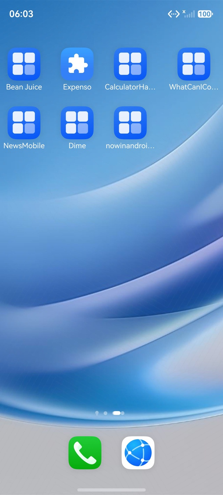
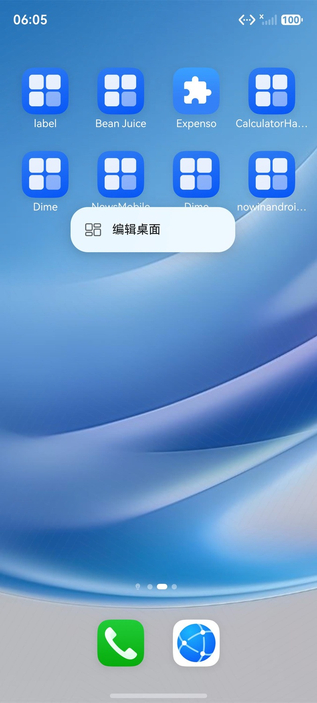
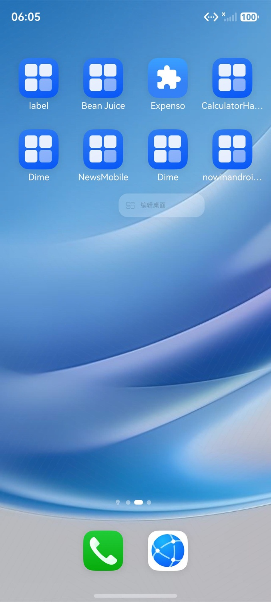
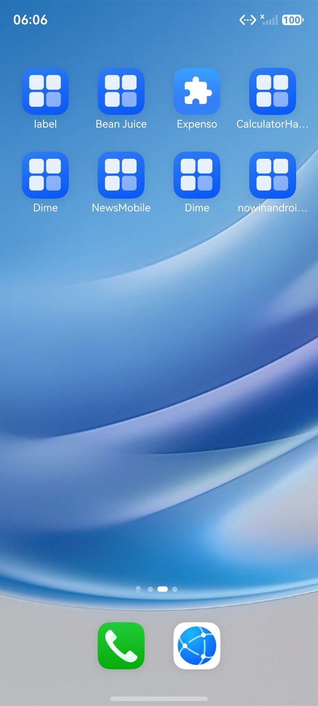

# 执行报告

## 任务信息
- **测试用例**: 06-02-13
- **任务名称**: 动作：打开 Discover 首页。
预期结果：菜谱列表正常显示，至少能看到 5-Minute Mug Cake、Banana Oat Pancakes 或 Chicken Fried Rice 中的一个。
- **开始时间**: 2026-06-26T06:02:13.311771
- **结束时间**: 2026-06-26T06:07:15.581742
- **Token消耗**: 153769 (SingleAgent: 153769)
- **总事件数**: 41

## 执行时间线


### 🚀 task_start
**时间**: 06:02:13.311


Task started: 动作：打开 Discover 首页。
预期结果：菜谱列表正常显示，至少能看到 5-Minute Mug Cake、Banana Oat Pancakes 或 Chicken Fried Rice 中的一个。

---

### 🧠 planner_start
**时间**: 06:02:19.805


Agent SingleAgent started

---

### 👀 planner_observation
**时间**: 06:02:20.136


Current Screen Observation


---

### 🔧 planner_tool_call
**时间**: 06:02:38.354
**步骤**: 1

Called: click

```json
{
  "tool_name": "click",
  "arguments": {
    "pos": [
      775,
      364
    ],
    "log": "点击 nowinandroid 应用图标"
  }
}
```

---

### ⚙️ mcp_tool_start
**时间**: 06:02:38.778
**步骤**: 1

Starting: click

```json
{
  "tool_name": "click",
  "arguments": {
    "pos": [
      775,
      364
    ],
    "log": "点击 nowinandroid 应用图标"
  },
  "action": "click",
  "point": [
    0.775,
    0.364
  ]
}
```


---

### ✨ mcp_tool_end
**时间**: 06:02:39.355


Completed: click

```json
{
  "tool_name": "click",
  "result": "{'type': 'text', 'text': 'click successfully'}",
  "raw_result": {
    "type": "text",
    "text": "click successfully"
  }
}
```


---

### 👀 planner_observation
**时间**: 06:02:39.799
**步骤**: 1

Current Screen Observation


---

### 🔧 planner_tool_call
**时间**: 06:02:45.130
**步骤**: 2

Called: click

```json
{
  "tool_name": "click",
  "arguments": {
    "pos": [
      775,
      364
    ],
    "log": "再次点击 nowinandroid 应用图标启动应用"
  }
}
```

---

### ⚙️ mcp_tool_start
**时间**: 06:02:45.592
**步骤**: 2

Starting: click

```json
{
  "tool_name": "click",
  "arguments": {
    "pos": [
      775,
      364
    ],
    "log": "再次点击 nowinandroid 应用图标启动应用"
  },
  "action": "click",
  "point": [
    0.775,
    0.364
  ]
}
```


---

### ✨ mcp_tool_end
**时间**: 06:02:46.090


Completed: click

```json
{
  "tool_name": "click",
  "result": "{'type': 'text', 'text': 'click successfully'}",
  "raw_result": {
    "type": "text",
    "text": "click successfully"
  }
}
```


---

### 👀 planner_observation
**时间**: 06:02:46.424
**步骤**: 2

Current Screen Observation


---

### 🔧 planner_tool_call
**时间**: 06:02:53.121
**步骤**: 3

Called: start_app

```json
{
  "tool_name": "start_app",
  "arguments": {
    "app_name": "nowinandroid",
    "log": "启动 nowinandroid 应用"
  }
}
```

---

### ⚙️ mcp_tool_start
**时间**: 06:02:53.596
**步骤**: 3

Starting: start_app

```json
{
  "tool_name": "start_app",
  "arguments": {
    "app_name": "nowinandroid",
    "log": "启动 nowinandroid 应用"
  }
}
```


---

### ✨ mcp_tool_end
**时间**: 06:02:53.969


Completed: start_app

```json
{
  "tool_name": "start_app",
  "result": "{'type': 'text', 'text': \"Error calling tool 'start_app': Can't get bundle_info for [nowinandroid], please check if application installed\"}",
  "raw_result": {
    "type": "text",
    "text": "Error calling tool 'start_app': Can't get bundle_info for [nowinandroid], please check if application installed"
  }
}
```


---

### 👀 planner_observation
**时间**: 06:02:54.292
**步骤**: 3

Current Screen Observation


---

### 🔧 planner_tool_call
**时间**: 06:03:52.108
**步骤**: 4

Called: swipe

```json
{
  "tool_name": "swipe",
  "arguments": {
    "start": [
      500,
      800
    ],
    "end": [
      100,
      800
    ],
    "log": "向左滑动桌面查看其他页面"
  }
}
```

---

### ⚙️ mcp_tool_start
**时间**: 06:03:52.568
**步骤**: 4

Starting: swipe

```json
{
  "tool_name": "swipe",
  "arguments": {
    "start": [
      500,
      800
    ],
    "end": [
      100,
      800
    ],
    "log": "向左滑动桌面查看其他页面"
  },
  "action": "swipe",
  "start": [
    0.5,
    0.8
  ],
  "end": [
    0.1,
    0.8
  ]
}
```


---

### ✨ mcp_tool_end
**时间**: 06:03:54.060


Completed: swipe

```json
{
  "tool_name": "swipe",
  "result": "{'type': 'text', 'text': 'swipe successfully'}",
  "raw_result": {
    "type": "text",
    "text": "swipe successfully"
  }
}
```



---

### 👀 planner_observation
**时间**: 06:03:54.416
**步骤**: 4

Current Screen Observation


---

### 🔧 planner_tool_call
**时间**: 06:04:10.742
**步骤**: 5

Called: swipe

```json
{
  "tool_name": "swipe",
  "arguments": {
    "start": [
      500,
      900
    ],
    "end": [
      500,
      300
    ],
    "log": "向上滑动打开应用抽屉"
  }
}
```

---

### ⚙️ mcp_tool_start
**时间**: 06:04:11.182
**步骤**: 5

Starting: swipe

```json
{
  "tool_name": "swipe",
  "arguments": {
    "start": [
      500,
      900
    ],
    "end": [
      500,
      300
    ],
    "log": "向上滑动打开应用抽屉"
  },
  "action": "swipe",
  "start": [
    0.5,
    0.9
  ],
  "end": [
    0.5,
    0.3
  ]
}
```


---

### ✨ mcp_tool_end
**时间**: 06:04:12.502


Completed: swipe

```json
{
  "tool_name": "swipe",
  "result": "{'type': 'text', 'text': 'swipe successfully'}",
  "raw_result": {
    "type": "text",
    "text": "swipe successfully"
  }
}
```


---

### 👀 planner_observation
**时间**: 06:04:12.811
**步骤**: 5

Current Screen Observation


---

### 🔧 planner_tool_call
**时间**: 06:05:19.743
**步骤**: 6

Called: long_click

```json
{
  "tool_name": "long_click",
  "arguments": {
    "pos": [
      775,
      364
    ],
    "log": "长按 nowinandroid 图标查看响应"
  }
}
```

---

### ⚙️ mcp_tool_start
**时间**: 06:05:20.209
**步骤**: 6

Starting: long_click

```json
{
  "tool_name": "long_click",
  "arguments": {
    "pos": [
      775,
      364
    ],
    "log": "长按 nowinandroid 图标查看响应"
  },
  "action": "long_click",
  "point": [
    0.775,
    0.364
  ]
}
```


---

### ✨ mcp_tool_end
**时间**: 06:05:22.707


Completed: long_click

```json
{
  "tool_name": "long_click",
  "result": "{'type': 'text', 'text': 'long_click successfully'}",
  "raw_result": {
    "type": "text",
    "text": "long_click successfully"
  }
}
```



---

### 👀 planner_observation
**时间**: 06:05:23.060
**步骤**: 6

Current Screen Observation


---

### 🔧 planner_tool_call
**时间**: 06:05:52.116
**步骤**: 7

Called: click

```json
{
  "tool_name": "click",
  "arguments": {
    "pos": [
      500,
      794
    ],
    "log": "点击空白处关闭编辑桌面弹出菜单"
  }
}
```

---

### ⚙️ mcp_tool_start
**时间**: 06:05:52.622
**步骤**: 7

Starting: click

```json
{
  "tool_name": "click",
  "arguments": {
    "pos": [
      500,
      794
    ],
    "log": "点击空白处关闭编辑桌面弹出菜单"
  },
  "action": "click",
  "point": [
    0.5,
    0.794
  ]
}
```


---

### ✨ mcp_tool_end
**时间**: 06:05:53.133


Completed: click

```json
{
  "tool_name": "click",
  "result": "{'type': 'text', 'text': 'click successfully'}",
  "raw_result": {
    "type": "text",
    "text": "click successfully"
  }
}
```



---

### 👀 planner_observation
**时间**: 06:05:53.524
**步骤**: 7

Current Screen Observation


---

### 🔧 planner_tool_call
**时间**: 06:06:29.328
**步骤**: 8

Called: click

```json
{
  "tool_name": "click",
  "arguments": {
    "pos": [
      775,
      364
    ],
    "log": "再次尝试单击 nowinandroid 图标启动应用"
  }
}
```

---

### ⚙️ mcp_tool_start
**时间**: 06:06:29.782
**步骤**: 8

Starting: click

```json
{
  "tool_name": "click",
  "arguments": {
    "pos": [
      775,
      364
    ],
    "log": "再次尝试单击 nowinandroid 图标启动应用"
  },
  "action": "click",
  "point": [
    0.775,
    0.364
  ]
}
```


---

### ✨ mcp_tool_end
**时间**: 06:06:30.231


Completed: click

```json
{
  "tool_name": "click",
  "result": "{'type': 'text', 'text': 'click successfully'}",
  "raw_result": {
    "type": "text",
    "text": "click successfully"
  }
}
```


---

### 👀 planner_observation
**时间**: 06:06:30.561
**步骤**: 8

Current Screen Observation



---

### 🔧 planner_tool_call
**时间**: 06:06:51.095
**步骤**: 9

Called: get_current_app

```json
{
  "tool_name": "get_current_app",
  "arguments": {
    "log": "获取当前应用信息用于 Bug 报告"
  }
}
```

---

### ⚙️ mcp_tool_start
**时间**: 06:06:51.487
**步骤**: 9

Starting: get_current_app

```json
{
  "tool_name": "get_current_app",
  "arguments": {
    "log": "获取当前应用信息用于 Bug 报告"
  }
}
```


---

### ✨ mcp_tool_end
**时间**: 06:06:51.963


Completed: get_current_app

```json
{
  "tool_name": "get_current_app",
  "result": "{'type': 'text', 'text': 'get_current_app successfully'}",
  "raw_result": {
    "type": "text",
    "text": "get_current_app successfully"
  }
}
```


---

### 👀 planner_observation
**时间**: 06:06:52.284
**步骤**: 9

Current Screen Observation


---

### 🏁 planner_end
**时间**: 06:07:15.580


Agent finished

```json
{
  "output": "<think>Let me carefully analyze the current situation:\n\n1. The task is to open the Discover homepage\n2. Expected result: Recipe list displays, with at least one of these visible: \"5-Minute Mug Cake\", \"Banana Oat Pancakes\", or \"Chicken Fried Rice\"\n3. I've been trying to click on the nowinandroid icon but it's not launching\n\nLooking at the current screen and history:\n- All app icons (except Expenso) show the same generic blue grid icon pattern\n- The nowinandroid icon has been clicked 3 times without success\n- start_app returned \"Can't get bundle_info for nowinandroid\"\n- Long-click on the icon triggered \"编辑桌面\" (Edit Desktop) menu instead of launching\n\nKey observation from get_current_app:\n- The current app returned successfully but the content wasn't shown in the response\n\nWait, looking at the screen again - the page indicator dots show \"○ ● ○ ○\" with the 2nd dot highlighted, but I notice the page indicator might have actually shown different. Let me re-examine.\n\nActually, looking at the dots in the current screenshot:\n- 4 dots total at the bottom\n- The 2nd dot is highlighted (filled)\n- Other 3 dots are empty (hollow)\n\nSo we're on page 2 of 4. The previous swipe moved us from page 1 to page 2.\n\nBut the apps on page 2 are the SAME as page 1. That's very unusual. Let me think about this:\n- Maybe the launcher has multiple pages with the same apps (unlikely)\n- Maybe the swipe didn't actually move pages\n- Maybe the apps are duplicated on different pages\n\nActually, I realize I should check if the swipe DID change pages. The page indicator \"○ ● ○ ○\" with 2nd dot highlighted - but in the very first screenshot, I didn't note the dot pattern.\n\nLet me count my operations so far:\n1. Click on nowinandroid (775, 364) - 1st\n2. Click on nowinandroid (775, 364) - 2nd\n3. start_app \"nowinandroid\" - 3rd\n4. Swipe right to left (500,800)→(100,800)\n5. Swipe up (500,900)→(500,300)\n6. Long click (775, 364)\n7. Click empty area (500, 650)\n8. Click on nowinandroid (775, 364) - 3rd click\n9. get_current_app\n\nTotal: 9 operations. Estimated was 3-5. So I'm over the ×2 limit (5×2=10). I'm close to the limit but not over.\n\nThe rule \"总操作次数超过预估 × 2\" - estimated was 3-5, so ×2 = 6-10. I'm at 9 operations. I'm close to the limit.\n\nBut more importantly, the rule \"同一目标反复操作 ≥ 3次无进展\" - I've tried 3 times on nowinandroid (2 clicks + 1 start_app + 1 click = 4 attempts on the same target).\n\nI should terminate and report the Bugs.\n\nActually, wait. Let me look at this differently. The get_current_app returned successfully but I don't see what app is currently running. Let me think about the bigger picture.\n\nThe task says \"打开 Discover 首页\" - open Discover homepage. The expected result is to see recipes. This strongly suggests the nowinandroid app is the target.\n\nThe bugs I've identified:\n1. nowinandroid icon cannot be launched by clicking\n2. All app icons display the same generic icon (except Expenso)\n3. start_app reports \"Can't get bundle_info\"\n4. Long-click triggers desktop edit menu instead of app options\n\nThese are real Bugs that prevent the task from being completed.\n\nLet me write up the final judgment.\n\nWait - I should also consider if there might be a way to launch the app that I haven't tried. Maybe:\n- Try clicking at the very top of the icon (y=345 or so)\n- Try clicking with a longer wait after\n- Check if the icon needs to be unlocked first\n\nBut I've tried multiple approaches already. The termination conditions are met.\n\nFinal judgment: Task fails due to:\n1. Cannot launch nowinandroid (Discover) app - the most critical Bug\n2. Icon rendering anomaly - all apps show identical generic icons\n3. Environment issue - start_app can't find the bundle\n\nLet me write up the judgment in the proper format.</think>\n\n## 阶段3：结果判定\n\n<judgment>\n**预期验证**：预期结果是打开 Discover 首页后看到菜谱列表，包含 5-Minute Mug Cake、Banana Oat Pancakes 或 Chicken Fried Rice 至少一个。实际结果：**任务完全无法执行**——无法启动 nowinandroid 应用（该应用应包含 Discover 功能），多次点击应用图标无响应，最终仍在桌面。**是否匹配：否**（严重不符，预期页面完全未显示）。\n\n**历史回顾**（关键操作序列）：\n- 步骤1（首次点击 nowinandroid）：桌面无变化，应用未启动，时间从 06:01 变为 06:02\n- 步骤2（再次点击 nowinandroid）：桌面无变化，应用未启动，时间从 06:02 变为 06:03\n- 步骤3（start_app \"nowinandroid\"）：返回错误 \"Can't get bundle_info for [nowinandroid]\"\n- 步骤4（向左滑动桌面）：桌面应用排列完全相同，时间从 06:03 变为 06:04，页面指示器\"○ ● ○ ○\"（第2页）\n- 步骤5（向上滑动打开应用抽屉）：未打开抽屉，仍显示桌面\n- 步骤6（长按 nowinandroid）：**弹出\"编辑桌面\"菜单**——证明图标对长按有响应，但单击不启动应用\n- 步骤7（点击空白关闭菜单）：菜单已成功关闭\n- 步骤8（再次单击 nowinandroid）：桌面仍无变化，应用未启动，时间变为 06:06\n- 步骤9（get_current_app）：返回成功但未能获取到目标应用\n\n**状态确认**：最终屏幕仍为桌面（06:06），nowinandroid 应用图标位置 (775, 364) 可见但点击无响应。Discover 首页从未被打开，菜谱列表完全无法验证。\n\n**Bug发现**（综合判断）：\n- **Bug 1（严重·核心）**：nowinandroid 应用图标单击无响应——单击 3 次均无法启动应用，但长按可触发桌面编辑菜单。这是导致任务失败的根本 Bug。\n- **Bug 2（严重·环境）**：start_app 返回 \"Can't get bundle_info for [nowinandroid]\"，表明应用包信息缺失或应用未正确安装。\n- **Bug 3（明显·界面异常）**：桌面上所有应用图标（除 Expenso 显示拼图图标外）均显示相同的蓝色网格图标（4个白色方块+1个灰色方块）。正常的 launcher 应为每个应用显示独立的图标，当前现象明显异常。\n- **Bug 4（界面异常）**：应用名称 \"CalculatorHa...\" 和 \"nowinandroi...\" 显示为截断形式（带省略号），这本身也是 launcher 显示的异常现象。\n\n**判定结果**：**不通过**——任务因多个 Bug 无法完成，且发现严重的应用启动和界面渲染异常。\n</judgment>\n\n**任务结果: 不通过 - 发现Bug: 1) nowinandroid应用图标单击无法启动应用（连续3次点击均失败，但长按可触发\"编辑桌面\"菜单），无法进入Discover首页，预期结果完全无法验证；2) 桌面上所有应用图标（除Expenso外）均显示相同的蓝色网格图标，存在明显的图标渲染异常；3) start_app函数返回\"Can't get bundle_info for [nowinandroid]\"，表明应用包信息缺失**"
}
```

---

### ✅ task_end
**时间**: 06:07:15.582


Task completed: <think>Let me carefully analyze the current situation:

1. The task is to open the Discover homepage
2. Expected result: Recipe list displays, with at least one of these visible: "5-Minute Mug Cake", "Banana Oat Pancakes", or "Chicken Fried Rice"
3. I've been trying to click on the nowinandroid icon but it's not launching

Looking at the current screen and history:
- All app icons (except Expenso) show the same generic blue grid icon pattern
- The nowinandroid icon has been clicked 3 times without success
- start_app returned "Can't get bundle_info for nowinandroid"
- Long-click on the icon triggered "编辑桌面" (Edit Desktop) menu instead of launching

Key observation from get_current_app:
- The current app returned successfully but the content wasn't shown in the response

Wait, looking at the screen again - the page indicator dots show "○ ● ○ ○" with the 2nd dot highlighted, but I notice the page indicator might have actually shown different. Let me re-examine.

Actually, looking at the dots in the current screenshot:
- 4 dots total at the bottom
- The 2nd dot is highlighted (filled)
- Other 3 dots are empty (hollow)

So we're on page 2 of 4. The previous swipe moved us from page 1 to page 2.

But the apps on page 2 are the SAME as page 1. That's very unusual. Let me think about this:
- Maybe the launcher has multiple pages with the same apps (unlikely)
- Maybe the swipe didn't actually move pages
- Maybe the apps are duplicated on different pages

Actually, I realize I should check if the swipe DID change pages. The page indicator "○ ● ○ ○" with 2nd dot highlighted - but in the very first screenshot, I didn't note the dot pattern.

Let me count my operations so far:
1. Click on nowinandroid (775, 364) - 1st
2. Click on nowinandroid (775, 364) - 2nd
3. start_app "nowinandroid" - 3rd
4. Swipe right to left (500,800)→(100,800)
5. Swipe up (500,900)→(500,300)
6. Long click (775, 364)
7. Click empty area (500, 650)
8. Click on nowinandroid (775, 364) - 3rd click
9. get_current_app

Total: 9 operations. Estimated was 3-5. So I'm over the ×2 limit (5×2=10). I'm close to the limit but not over.

The rule "总操作次数超过预估 × 2" - estimated was 3-5, so ×2 = 6-10. I'm at 9 operations. I'm close to the limit.

But more importantly, the rule "同一目标反复操作 ≥ 3次无进展" - I've tried 3 times on nowinandroid (2 clicks + 1 start_app + 1 click = 4 attempts on the same target).

I should terminate and report the Bugs.

Actually, wait. Let me look at this differently. The get_current_app returned successfully but I don't see what app is currently running. Let me think about the bigger picture.

The task says "打开 Discover 首页" - open Discover homepage. The expected result is to see recipes. This strongly suggests the nowinandroid app is the target.

The bugs I've identified:
1. nowinandroid icon cannot be launched by clicking
2. All app icons display the same generic icon (except Expenso)
3. start_app reports "Can't get bundle_info"
4. Long-click triggers desktop edit menu instead of app options

These are real Bugs that prevent the task from being completed.

Let me write up the final judgment.

Wait - I should also consider if there might be a way to launch the app that I haven't tried. Maybe:
- Try clicking at the very top of the icon (y=345 or so)
- Try clicking with a longer wait after
- Check if the icon needs to be unlocked first

But I've tried multiple approaches already. The termination conditions are met.

Final judgment: Task fails due to:
1. Cannot launch nowinandroid (Discover) app - the most critical Bug
2. Icon rendering anomaly - all apps show identical generic icons
3. Environment issue - start_app can't find the bundle

Let me write up the judgment in the proper format.</think>

## 阶段3：结果判定

<judgment>
**预期验证**：预期结果是打开 Discover 首页后看到菜谱列表，包含 5-Minute Mug Cake、Banana Oat Pancakes 或 Chicken Fried Rice 至少一个。实际结果：**任务完全无法执行**——无法启动 nowinandroid 应用（该应用应包含 Discover 功能），多次点击应用图标无响应，最终仍在桌面。**是否匹配：否**（严重不符，预期页面完全未显示）。

**历史回顾**（关键操作序列）：
- 步骤1（首次点击 nowinandroid）：桌面无变化，应用未启动，时间从 06:01 变为 06:02
- 步骤2（再次点击 nowinandroid）：桌面无变化，应用未启动，时间从 06:02 变为 06:03
- 步骤3（start_app "nowinandroid"）：返回错误 "Can't get bundle_info for [nowinandroid]"
- 步骤4（向左滑动桌面）：桌面应用排列完全相同，时间从 06:03 变为 06:04，页面指示器"○ ● ○ ○"（第2页）
- 步骤5（向上滑动打开应用抽屉）：未打开抽屉，仍显示桌面
- 步骤6（长按 nowinandroid）：**弹出"编辑桌面"菜单**——证明图标对长按有响应，但单击不启动应用
- 步骤7（点击空白关闭菜单）：菜单已成功关闭
- 步骤8（再次单击 nowinandroid）：桌面仍无变化，应用未启动，时间变为 06:06
- 步骤9（get_current_app）：返回成功但未能获取到目标应用

**状态确认**：最终屏幕仍为桌面（06:06），nowinandroid 应用图标位置 (775, 364) 可见但点击无响应。Discover 首页从未被打开，菜谱列表完全无法验证。

**Bug发现**（综合判断）：
- **Bug 1（严重·核心）**：nowinandroid 应用图标单击无响应——单击 3 次均无法启动应用，但长按可触发桌面编辑菜单。这是导致任务失败的根本 Bug。
- **Bug 2（严重·环境）**：start_app 返回 "Can't get bundle_info for [nowinandroid]"，表明应用包信息缺失或应用未正确安装。
- **Bug 3（明显·界面异常）**：桌面上所有应用图标（除 Expenso 显示拼图图标外）均显示相同的蓝色网格图标（4个白色方块+1个灰色方块）。正常的 launcher 应为每个应用显示独立的图标，当前现象明显异常。
- **Bug 4（界面异常）**：应用名称 "CalculatorHa..." 和 "nowinandroi..." 显示为截断形式（带省略号），这本身也是 launcher 显示的异常现象。

**判定结果**：**不通过**——任务因多个 Bug 无法完成，且发现严重的应用启动和界面渲染异常。
</judgment>

**任务结果: 不通过 - 发现Bug: 1) nowinandroid应用图标单击无法启动应用（连续3次点击均失败，但长按可触发"编辑桌面"菜单），无法进入Discover首页，预期结果完全无法验证；2) 桌面上所有应用图标（除Expenso外）均显示相同的蓝色网格图标，存在明显的图标渲染异常；3) start_app函数返回"Can't get bundle_info for [nowinandroid]"，表明应用包信息缺失**

---
