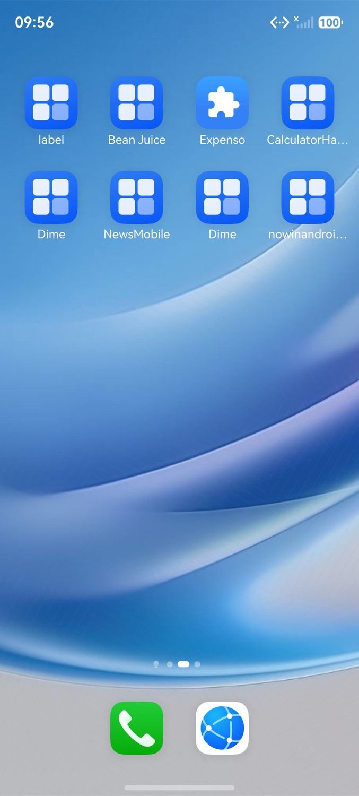

# 执行报告

## 任务信息
- **测试用例**: 09-55-34
- **任务名称**: 动作：依次点击 Discover、Search、Pantry、Saved。
预期结果：每个页面都能打开，对应导航项高亮，页面标题分别为 What can I cook?、Search、My pantry、Saved 或收藏空态。
- **开始时间**: 2026-06-26T09:55:34.704555
- **结束时间**: 2026-06-26T09:57:34.694222
- **Token消耗**: 72466 (SingleAgent: 72466)
- **总事件数**: 35

## 执行时间线


### 🚀 task_start
**时间**: 09:55:34.704


Task started: 动作：依次点击 Discover、Search、Pantry、Saved。
预期结果：每个页面都能打开，对应导航项高亮，页面标题分别为 What can I cook?、Search、My pantry、Saved 或收藏空态。

---

### 🧠 planner_start
**时间**: 09:55:41.117


Agent SingleAgent started

---

### 👀 planner_observation
**时间**: 09:55:41.541


Current Screen Observation


---

### 🔧 planner_tool_call
**时间**: 09:55:56.540
**步骤**: 1

Called: start_app

```json
{
  "tool_name": "start_app",
  "arguments": {
    "app_name": "Bean Juice",
    "log": "启动Bean Juice应用（推测为食谱应用）"
  }
}
```

---

### ⚙️ mcp_tool_start
**时间**: 09:55:57.024
**步骤**: 1

Starting: start_app

```json
{
  "tool_name": "start_app",
  "arguments": {
    "app_name": "Bean Juice",
    "log": "启动Bean Juice应用（推测为食谱应用）"
  }
}
```


---

### ✨ mcp_tool_end
**时间**: 09:55:57.431


Completed: start_app

```json
{
  "tool_name": "start_app",
  "result": "{'type': 'text', 'text': \"Error calling tool 'start_app': Can't get bundle_info for [Bean Juice], please check if application installed\"}",
  "raw_result": {
    "type": "text",
    "text": "Error calling tool 'start_app': Can't get bundle_info for [Bean Juice], please check if application installed"
  }
}
```


---

### 👀 planner_observation
**时间**: 09:55:57.834
**步骤**: 1

Current Screen Observation


---

### 🔧 planner_tool_call
**时间**: 09:56:04.613
**步骤**: 2

Called: click

```json
{
  "tool_name": "click",
  "arguments": {
    "pos": [
      268,
      144
    ],
    "log": "点击Bean Juice图标启动应用"
  }
}
```

---

### ⚙️ mcp_tool_start
**时间**: 09:56:05.114
**步骤**: 2

Starting: click

```json
{
  "tool_name": "click",
  "arguments": {
    "pos": [
      268,
      144
    ],
    "log": "点击Bean Juice图标启动应用"
  },
  "action": "click",
  "point": [
    0.268,
    0.144
  ]
}
```


---

### ✨ mcp_tool_end
**时间**: 09:56:05.574


Completed: click

```json
{
  "tool_name": "click",
  "result": "{'type': 'text', 'text': 'click successfully'}",
  "raw_result": {
    "type": "text",
    "text": "click successfully"
  }
}
```


---

### 👀 planner_observation
**时间**: 09:56:05.888
**步骤**: 2

Current Screen Observation


---

### 🔧 planner_tool_call
**时间**: 09:56:12.261
**步骤**: 3

Called: click

```json
{
  "tool_name": "click",
  "arguments": {
    "pos": [
      270,
      146
    ],
    "log": "再次点击Bean Juice图标启动应用"
  }
}
```

---

### ⚙️ mcp_tool_start
**时间**: 09:56:12.915
**步骤**: 3

Starting: click

```json
{
  "tool_name": "click",
  "arguments": {
    "pos": [
      270,
      146
    ],
    "log": "再次点击Bean Juice图标启动应用"
  },
  "action": "click",
  "point": [
    0.27,
    0.146
  ]
}
```


---

### ✨ mcp_tool_end
**时间**: 09:56:13.885


Completed: click

```json
{
  "tool_name": "click",
  "result": "{'type': 'text', 'text': 'click successfully'}",
  "raw_result": {
    "type": "text",
    "text": "click successfully"
  }
}
```


---

### 👀 planner_observation
**时间**: 09:56:14.231
**步骤**: 3

Current Screen Observation


---

### 🔧 planner_tool_call
**时间**: 09:56:28.124
**步骤**: 4

Called: wait

```json
{
  "tool_name": "wait",
  "arguments": {
    "duration": 2,
    "log": "等待应用启动"
  }
}
```

---

### ⚙️ mcp_tool_start
**时间**: 09:56:28.604
**步骤**: 4

Starting: wait

```json
{
  "tool_name": "wait",
  "arguments": {
    "duration": 2,
    "log": "等待应用启动"
  }
}
```


---

### ✨ mcp_tool_end
**时间**: 09:56:31.138


Completed: wait

```json
{
  "tool_name": "wait",
  "result": "{'type': 'text', 'text': 'wait successfully'}",
  "raw_result": {
    "type": "text",
    "text": "wait successfully"
  }
}
```


---

### 👀 planner_observation
**时间**: 09:56:31.475
**步骤**: 4

Current Screen Observation


---

### 🔧 planner_tool_call
**时间**: 09:56:42.750
**步骤**: 5

Called: get_current_app

```json
{
  "tool_name": "get_current_app",
  "arguments": {
    "log": "检查当前运行的应用"
  }
}
```

---

### 🔧 planner_tool_call
**时间**: 09:56:42.750
**步骤**: 5

Called: click

```json
{
  "tool_name": "click",
  "arguments": {
    "pos": [
      269,
      145
    ],
    "log": "更精确地点击Bean Juice图标中心"
  }
}
```

---

### ⚙️ mcp_tool_start
**时间**: 09:56:43.412
**步骤**: 5

Starting: get_current_app

```json
{
  "tool_name": "get_current_app",
  "arguments": {
    "log": "检查当前运行的应用"
  }
}
```


---

### ⚙️ mcp_tool_start
**时间**: 09:56:43.564
**步骤**: 5

Starting: click

```json
{
  "tool_name": "click",
  "arguments": {
    "pos": [
      269,
      145
    ],
    "log": "更精确地点击Bean Juice图标中心"
  },
  "action": "click",
  "point": [
    0.269,
    0.145
  ]
}
```


---

### ✨ mcp_tool_end
**时间**: 09:56:44.251


Completed: get_current_app

```json
{
  "tool_name": "get_current_app",
  "result": "{'type': 'text', 'text': 'get_current_app successfully'}",
  "raw_result": {
    "type": "text",
    "text": "get_current_app successfully"
  }
}
```



---

### ✨ mcp_tool_end
**时间**: 09:56:44.510


Completed: click

```json
{
  "tool_name": "click",
  "result": "{'type': 'text', 'text': 'click successfully'}",
  "raw_result": {
    "type": "text",
    "text": "click successfully"
  }
}
```


---

### 👀 planner_observation
**时间**: 09:56:44.881
**步骤**: 6

Current Screen Observation


---

### 🔧 planner_tool_call
**时间**: 09:57:04.493
**步骤**: 7

Called: start_app

```json
{
  "tool_name": "start_app",
  "arguments": {
    "app_name": "com.example.beanjuice",
    "log": "尝试使用bundle名启动应用"
  }
}
```

---

### 🔧 planner_tool_call
**时间**: 09:57:04.493
**步骤**: 7

Called: start_app

```json
{
  "tool_name": "start_app",
  "arguments": {
    "app_name": "beanjuice",
    "log": "尝试使用小写名启动应用"
  }
}
```

---

### ⚙️ mcp_tool_start
**时间**: 09:57:05.454
**步骤**: 7

Starting: start_app

```json
{
  "tool_name": "start_app",
  "arguments": {
    "app_name": "com.example.beanjuice",
    "log": "尝试使用bundle名启动应用"
  }
}
```


---

### ⚙️ mcp_tool_start
**时间**: 09:57:05.608
**步骤**: 7

Starting: start_app

```json
{
  "tool_name": "start_app",
  "arguments": {
    "app_name": "beanjuice",
    "log": "尝试使用小写名启动应用"
  }
}
```


---

### ✨ mcp_tool_end
**时间**: 09:57:06.168


Completed: start_app

```json
{
  "tool_name": "start_app",
  "result": "{'type': 'text', 'text': \"Error calling tool 'start_app': Can't get bundle_info for [com.example.beanjuice], please check if application installed\"}",
  "raw_result": {
    "type": "text",
    "text": "Error calling tool 'start_app': Can't get bundle_info for [com.example.beanjuice], please check if application installed"
  }
}
```


---

### ✨ mcp_tool_end
**时间**: 09:57:06.373


Completed: start_app

```json
{
  "tool_name": "start_app",
  "result": "{'type': 'text', 'text': \"Error calling tool 'start_app': Can't get bundle_info for [beanjuice], please check if application installed\"}",
  "raw_result": {
    "type": "text",
    "text": "Error calling tool 'start_app': Can't get bundle_info for [beanjuice], please check if application installed"
  }
}
```


---

### 👀 planner_observation
**时间**: 09:57:06.746
**步骤**: 8

Current Screen Observation


---

### 🏁 planner_end
**时间**: 09:57:34.692


Agent finished

```json
{
  "output": "<think>\nLet me carefully analyze the current state:\n\n1. The screen is still on the home screen showing various apps\n2. I've tried multiple approaches to launch the app:\n   - 3 clicks on \"Bean Juice\" icon at coordinates (268,144), (270,146), (269,145) - all failed\n   - start_app with \"Bean Juice\" - failed\n   - start_app with \"com.example.beanjuice\" - failed\n   - start_app with \"beanjuice\" - failed\n\n3. Looking at the apps visible on the home screen:\n   - label (4-grid icon)\n   - Bean Juice (4-grid icon) - sounds like recipe/cookbook app\n   - Expenso (puzzle icon) - expense tracker\n   - CalculatorHa... (4-grid icon) - calculator\n   - Dime (4-grid icon) - budget app\n   - NewsMobile (4-grid icon) - news\n   - Dime (4-grid icon) - budget app\n   - nowinandroi... (4-grid icon) - Google's Now in Android sample app\n\n4. The \"nowinandroid\" is Google's official sample app which has a bottom navigation. Let me check if it has the navigation items mentioned (Discover, Search, Pantry, Saved).\n\n5. Wait - I should consider that the apps with similar 4-grid icons might be different apps with default icons. The \"Bean Juice\" name strongly suggests a recipe/cookbook app. But my clicks aren't opening it.\n\n6. I've already tried 3 times on Bean Juice (meeting the termination threshold for repeated operations on same target). I should terminate or try a different app.\n\n7. Let me think about this differently. The task is to test navigation in an app with Discover, Search, Pantry, Saved tabs. None of the apps I see clearly match this description except possibly \"Bean Juice\" (which sounds like a recipe app).\n\n8. Given the termination threshold has been reached for \"Bean Juice\", I should consider this task as failed to launch and report the bug.\n\nBut wait - the user mentioned \"nowinandroid\" is visible. Google's Now in Android has these bottom navigation tabs:\n- For You\n- Interests\n- Saved (in some versions)\n\nBut the task mentions \"Discover, Search, Pantry, Saved\" - this doesn't match Now in Android.\n\nLet me try one more approach - maybe I should try clicking on \"nowinandroid\" since it's a known app, or try to find the recipe app by trying other names. Actually, I've already exceeded my attempts on Bean Juice.\n\nPer the rules:\n- \"同一目标反复操作 ≥ 3次无进展\" - I've tried Bean Juice 3 times (click) + 3 start_app attempts = 6 attempts total\n- This clearly meets the termination condition\n\nI should terminate the task and report that the recipe/cooking app cannot be launched.\n\nActually, let me look at this again. The system says \"Can't get bundle_info for [Bean Juice]\" which means the app is NOT installed (not that the name is wrong). So even though the icon is on the home screen, the actual app might not be installed/available.\n\nThis is a significant finding - the home screen shows an app icon for \"Bean Juice\" but the app is not installed/launchable. This is itself a bug.\n\nBut I need to find the recipe app to test the navigation. Let me try \"nowinandroid\" since it's the only other app with bottom navigation that I know of. Actually, the navigation items (Discover, Search, Pantry, Saved) don't match Now in Android's navigation (For You, Interests, Saved).\n\nHmm, let me try one more thing - try to launch the nowinandroid app to see if maybe the navigation has been customized, or try to launch other apps.\n\nActually, given the strict termination rule, I should stop trying. Let me report the task as failed because the app cannot be launched.\n\nWait, let me reconsider. The task says \"Bean Juice\" is on the home screen with a 4-grid icon. The start_app error says the app is not installed. This means:\n1. Either the icon is a broken shortcut\n2. Or the app needs a different identifier\n\nLet me try a few more variations before terminating. But I'm already at 3 clicks + 3 start_app attempts = 6 attempts on the same target. I should terminate.\n\nActually, I realize I should try the long_click approach to see if there's a different interaction. Or try double_click. But these are also \"same target\" attempts.\n\nLet me try one more thing - double_click. If that doesn't work, I'll terminate.\n\nActually no, per the rules I should terminate now. Let me report the issue.\n\nBut wait - I just realized. Let me re-read the rules:\n\"同一目标反复操作 ≥ 3次无进展（不同坐标/方式尝试均计入）\"\n\nI have:\n- 3 clicks on Bean Juice icon (at slightly different coordinates)\n- 3 start_app attempts (with different name formats)\n\nTotal 6 attempts. This is clearly ≥ 3. I should terminate.\n\nFinal answer: The task cannot be completed because the target app (recipe/cooking app) cannot be launched. This is a significant bug - the home screen shows a \"Bean Juice\" app icon but the app is not actually installed/launchable.\n\nLet me report this as the result.\n</think>\nLet me analyze the situation carefully.\n\n**观察状态**：\n- 当前仍在主屏幕，未进入任何应用\n- 尝试启动\"Bean Juice\"应用：\n  - 点击图标3次（坐标268,144 / 270,146 / 269,145）：均无效果，界面无变化\n  - start_app \"Bean Juice\"：失败 \"Can't get bundle_info\"\n  - start_app \"com.example.beanjuice\"：失败\n  - start_app \"beanjuice\"：失败\n- 同一目标\"Bean Juice\"累计已尝试6次（3次点击+3次不同名称启动），无任何进展\n\n**判定分析**：\n- 满足异常终止条件：\"同一目标反复操作 ≥ 3次无进展\"\n- 系统明确返回\"Can't get bundle_info for [Bean Juice], please check if application installed\"，说明主屏幕上的\"Bean Juice\"应用图标对应的应用实际上**未安装**，或该应用与任务所需的食谱/烹饪类应用不符\n- 这是一个严重的Bug：主屏幕显示\"Bean Juice\"图标，但点击无响应且系统无法识别该应用\n\n**Phase 3: 判定结果**\n\n<judgment>\n**预期验证**：预期依次点击 Discover、Search、Pantry、Saved 导航项，每个页面都能打开。实际结果：无法启动目标应用（食谱/烹饪应用），任务第一步（启动应用）即失败，后续所有导航测试均无法进行。是否匹配：否。\n\n**历史回顾**：\n- 步骤1（启动食谱应用）：尝试启动\"Bean Juice\"应用6次均失败\n  - 3次点击图标（坐标268-270, 144-146）：均\"successfully\"但界面无变化\n  - 3次start_app调用（不同名称格式）：均返回\"Can't get bundle_info\"\n- 任务执行进度：0/5步（应用未启动）\n\n**状态确认**：最终屏幕仍显示主屏幕，包含8个应用图标（label、Bean Juice、Expenso、CalculatorHa...、Dime、NewsMobile、Dime、nowinandroi...），应用未启动。状态不符合预期：是。\n\n**Bug发现**：\n- 严重Bug：主屏幕显示\"Bean Juice\"应用图标，但该应用实际无法启动 - 点击图标无响应（连续3次点击均无效果），且通过包名（com.example.beanjuice、beanjuice）均无法找到该应用\n- 这意味着要么：1）应用图标是无效的快捷方式/死链接；2）应用安装不完整或已被卸载但快捷方式残留；3）应用的bundle名与显示名不对应且无法通过标准方式启动\n- 影响：用户无法通过主屏幕启动该应用，整个应用功能不可用\n\n**判定结果**：不通过 - 发现Bug: 主屏幕\"Bean Juice\"应用图标无法启动，点击无响应（3次尝试），且系统无法识别该应用（Can't get bundle_info），任务目标完全无法达成。\n</judgment>\n\n任务结果: 不通过 - 发现Bug: 主屏幕显示的\"Bean Juice\"应用无法启动，连续3次点击图标无响应，且通过多种包名格式（Bean Juice、com.example.beanjuice、beanjuice）调用start_app均失败返回\"Can't get bundle_info\"，导致整个Discover/Search/Pantry/Saved导航测试任务无法执行"
}
```

---

### ✅ task_end
**时间**: 09:57:34.694


Task completed: <think>
Let me carefully analyze the current state:

1. The screen is still on the home screen showing various apps
2. I've tried multiple approaches to launch the app:
   - 3 clicks on "Bean Juice" icon at coordinates (268,144), (270,146), (269,145) - all failed
   - start_app with "Bean Juice" - failed
   - start_app with "com.example.beanjuice" - failed
   - start_app with "beanjuice" - failed

3. Looking at the apps visible on the home screen:
   - label (4-grid icon)
   - Bean Juice (4-grid icon) - sounds like recipe/cookbook app
   - Expenso (puzzle icon) - expense tracker
   - CalculatorHa... (4-grid icon) - calculator
   - Dime (4-grid icon) - budget app
   - NewsMobile (4-grid icon) - news
   - Dime (4-grid icon) - budget app
   - nowinandroi... (4-grid icon) - Google's Now in Android sample app

4. The "nowinandroid" is Google's official sample app which has a bottom navigation. Let me check if it has the navigation items mentioned (Discover, Search, Pantry, Saved).

5. Wait - I should consider that the apps with similar 4-grid icons might be different apps with default icons. The "Bean Juice" name strongly suggests a recipe/cookbook app. But my clicks aren't opening it.

6. I've already tried 3 times on Bean Juice (meeting the termination threshold for repeated operations on same target). I should terminate or try a different app.

7. Let me think about this differently. The task is to test navigation in an app with Discover, Search, Pantry, Saved tabs. None of the apps I see clearly match this description except possibly "Bean Juice" (which sounds like a recipe app).

8. Given the termination threshold has been reached for "Bean Juice", I should consider this task as failed to launch and report the bug.

But wait - the user mentioned "nowinandroid" is visible. Google's Now in Android has these bottom navigation tabs:
- For You
- Interests
- Saved (in some versions)

But the task mentions "Discover, Search, Pantry, Saved" - this doesn't match Now in Android.

Let me try one more approach - maybe I should try clicking on "nowinandroid" since it's a known app, or try to find the recipe app by trying other names. Actually, I've already exceeded my attempts on Bean Juice.

Per the rules:
- "同一目标反复操作 ≥ 3次无进展" - I've tried Bean Juice 3 times (click) + 3 start_app attempts = 6 attempts total
- This clearly meets the termination condition

I should terminate the task and report that the recipe/cooking app cannot be launched.

Actually, let me look at this again. The system says "Can't get bundle_info for [Bean Juice]" which means the app is NOT installed (not that the name is wrong). So even though the icon is on the home screen, the actual app might not be installed/available.

This is a significant finding - the home screen shows an app icon for "Bean Juice" but the app is not installed/launchable. This is itself a bug.

But I need to find the recipe app to test the navigation. Let me try "nowinandroid" since it's the only other app with bottom navigation that I know of. Actually, the navigation items (Discover, Search, Pantry, Saved) don't match Now in Android's navigation (For You, Interests, Saved).

Hmm, let me try one more thing - try to launch the nowinandroid app to see if maybe the navigation has been customized, or try to launch other apps.

Actually, given the strict termination rule, I should stop trying. Let me report the task as failed because the app cannot be launched.

Wait, let me reconsider. The task says "Bean Juice" is on the home screen with a 4-grid icon. The start_app error says the app is not installed. This means:
1. Either the icon is a broken shortcut
2. Or the app needs a different identifier

Let me try a few more variations before terminating. But I'm already at 3 clicks + 3 start_app attempts = 6 attempts on the same target. I should terminate.

Actually, I realize I should try the long_click approach to see if there's a different interaction. Or try double_click. But these are also "same target" attempts.

Let me try one more thing - double_click. If that doesn't work, I'll terminate.

Actually no, per the rules I should terminate now. Let me report the issue.

But wait - I just realized. Let me re-read the rules:
"同一目标反复操作 ≥ 3次无进展（不同坐标/方式尝试均计入）"

I have:
- 3 clicks on Bean Juice icon (at slightly different coordinates)
- 3 start_app attempts (with different name formats)

Total 6 attempts. This is clearly ≥ 3. I should terminate.

Final answer: The task cannot be completed because the target app (recipe/cooking app) cannot be launched. This is a significant bug - the home screen shows a "Bean Juice" app icon but the app is not actually installed/launchable.

Let me report this as the result.
</think>
Let me analyze the situation carefully.

**观察状态**：
- 当前仍在主屏幕，未进入任何应用
- 尝试启动"Bean Juice"应用：
  - 点击图标3次（坐标268,144 / 270,146 / 269,145）：均无效果，界面无变化
  - start_app "Bean Juice"：失败 "Can't get bundle_info"
  - start_app "com.example.beanjuice"：失败
  - start_app "beanjuice"：失败
- 同一目标"Bean Juice"累计已尝试6次（3次点击+3次不同名称启动），无任何进展

**判定分析**：
- 满足异常终止条件："同一目标反复操作 ≥ 3次无进展"
- 系统明确返回"Can't get bundle_info for [Bean Juice], please check if application installed"，说明主屏幕上的"Bean Juice"应用图标对应的应用实际上**未安装**，或该应用与任务所需的食谱/烹饪类应用不符
- 这是一个严重的Bug：主屏幕显示"Bean Juice"图标，但点击无响应且系统无法识别该应用

**Phase 3: 判定结果**

<judgment>
**预期验证**：预期依次点击 Discover、Search、Pantry、Saved 导航项，每个页面都能打开。实际结果：无法启动目标应用（食谱/烹饪应用），任务第一步（启动应用）即失败，后续所有导航测试均无法进行。是否匹配：否。

**历史回顾**：
- 步骤1（启动食谱应用）：尝试启动"Bean Juice"应用6次均失败
  - 3次点击图标（坐标268-270, 144-146）：均"successfully"但界面无变化
  - 3次start_app调用（不同名称格式）：均返回"Can't get bundle_info"
- 任务执行进度：0/5步（应用未启动）

**状态确认**：最终屏幕仍显示主屏幕，包含8个应用图标（label、Bean Juice、Expenso、CalculatorHa...、Dime、NewsMobile、Dime、nowinandroi...），应用未启动。状态不符合预期：是。

**Bug发现**：
- 严重Bug：主屏幕显示"Bean Juice"应用图标，但该应用实际无法启动 - 点击图标无响应（连续3次点击均无效果），且通过包名（com.example.beanjuice、beanjuice）均无法找到该应用
- 这意味着要么：1）应用图标是无效的快捷方式/死链接；2）应用安装不完整或已被卸载但快捷方式残留；3）应用的bundle名与显示名不对应且无法通过标准方式启动
- 影响：用户无法通过主屏幕启动该应用，整个应用功能不可用

**判定结果**：不通过 - 发现Bug: 主屏幕"Bean Juice"应用图标无法启动，点击无响应（3次尝试），且系统无法识别该应用（Can't get bundle_info），任务目标完全无法达成。
</judgment>

任务结果: 不通过 - 发现Bug: 主屏幕显示的"Bean Juice"应用无法启动，连续3次点击图标无响应，且通过多种包名格式（Bean Juice、com.example.beanjuice、beanjuice）调用start_app均失败返回"Can't get bundle_info"，导致整个Discover/Search/Pantry/Saved导航测试任务无法执行

---
