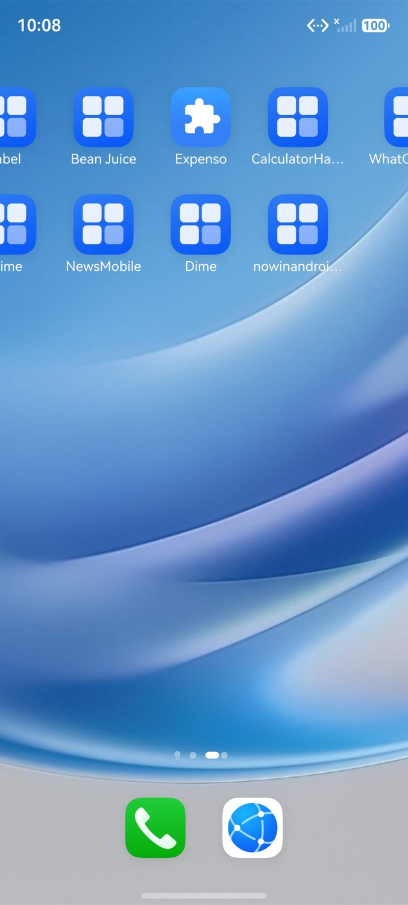
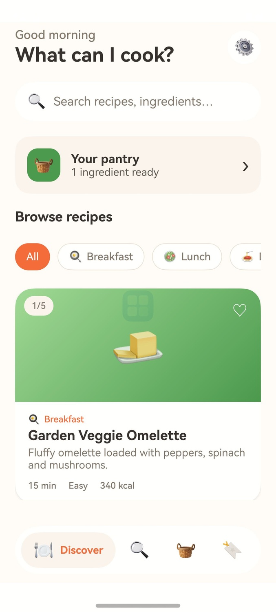

# 执行报告

## 任务信息
- **测试用例**: 10-07-03
- **任务名称**: 动作：等待首页数据初始化。
预期结果：短暂加载后展示菜谱列表，不应长期停留在骨架屏。
- **开始时间**: 2026-06-26T10:07:03.860018
- **结束时间**: 2026-06-26T10:09:43.203655
- **Token消耗**: 53896 (SingleAgent: 53896)
- **总事件数**: 25

## 执行时间线


### 🚀 task_start
**时间**: 10:07:03.860


Task started: 动作：等待首页数据初始化。
预期结果：短暂加载后展示菜谱列表，不应长期停留在骨架屏。

---

### 🧠 planner_start
**时间**: 10:07:38.137


Agent SingleAgent started

---

### 👀 planner_observation
**时间**: 10:07:39.069


Current Screen Observation


---

### 🔧 planner_tool_call
**时间**: 10:07:54.842
**步骤**: 1

Called: swipe

```json
{
  "tool_name": "swipe",
  "arguments": {
    "start": [
      500,
      920
    ],
    "end": [
      500,
      200
    ],
    "direction": "up",
    "log": "上滑解锁屏幕"
  }
}
```

---

### ⚙️ mcp_tool_start
**时间**: 10:07:55.472
**步骤**: 1

Starting: swipe

```json
{
  "tool_name": "swipe",
  "arguments": {
    "start": [
      500,
      920
    ],
    "end": [
      500,
      200
    ],
    "direction": "up",
    "log": "上滑解锁屏幕"
  },
  "action": "swipe",
  "start": [
    0.5,
    0.92
  ],
  "end": [
    0.5,
    0.2
  ]
}
```


---

### ✨ mcp_tool_end
**时间**: 10:07:56.821


Completed: swipe

```json
{
  "tool_name": "swipe",
  "result": "{'type': 'text', 'text': 'swipe successfully'}",
  "raw_result": {
    "type": "text",
    "text": "swipe successfully"
  }
}
```


---

### 👀 planner_observation
**时间**: 10:07:57.163
**步骤**: 1

Current Screen Observation


---

### 🔧 planner_tool_call
**时间**: 10:08:09.847
**步骤**: 2

Called: swipe

```json
{
  "tool_name": "swipe",
  "arguments": {
    "start": [
      500,
      500
    ],
    "end": [
      100,
      500
    ],
    "direction": "left",
    "log": "左滑查看下一页"
  }
}
```

---

### ⚙️ mcp_tool_start
**时间**: 10:08:10.478
**步骤**: 2

Starting: swipe

```json
{
  "tool_name": "swipe",
  "arguments": {
    "start": [
      500,
      500
    ],
    "end": [
      100,
      500
    ],
    "direction": "left",
    "log": "左滑查看下一页"
  },
  "action": "swipe",
  "start": [
    0.5,
    0.5
  ],
  "end": [
    0.1,
    0.5
  ]
}
```


---

### ✨ mcp_tool_end
**时间**: 10:08:11.996


Completed: swipe

```json
{
  "tool_name": "swipe",
  "result": "{'type': 'text', 'text': 'swipe successfully'}",
  "raw_result": {
    "type": "text",
    "text": "swipe successfully"
  }
}
```



---

### 👀 planner_observation
**时间**: 10:08:12.359
**步骤**: 2

Current Screen Observation


---

### 🔧 planner_tool_call
**时间**: 10:08:25.831
**步骤**: 3

Called: swipe

```json
{
  "tool_name": "swipe",
  "arguments": {
    "start": [
      900,
      500
    ],
    "end": [
      100,
      500
    ],
    "direction": "left",
    "log": "从右侧滑到左侧，切换桌面页面"
  }
}
```

---

### ⚙️ mcp_tool_start
**时间**: 10:08:26.428
**步骤**: 3

Starting: swipe

```json
{
  "tool_name": "swipe",
  "arguments": {
    "start": [
      900,
      500
    ],
    "end": [
      100,
      500
    ],
    "direction": "left",
    "log": "从右侧滑到左侧，切换桌面页面"
  },
  "action": "swipe",
  "start": [
    0.9,
    0.5
  ],
  "end": [
    0.1,
    0.5
  ]
}
```


---

### ✨ mcp_tool_end
**时间**: 10:08:27.849


Completed: swipe

```json
{
  "tool_name": "swipe",
  "result": "{'type': 'text', 'text': 'swipe successfully'}",
  "raw_result": {
    "type": "text",
    "text": "swipe successfully"
  }
}
```


---

### 👀 planner_observation
**时间**: 10:08:28.217
**步骤**: 3

Current Screen Observation


---

### 🔧 planner_tool_call
**时间**: 10:08:35.400
**步骤**: 4

Called: click

```json
{
  "tool_name": "click",
  "arguments": {
    "pos": [
      111,
      174
    ],
    "log": "点击WhatCanICo应用图标启动菜谱应用"
  }
}
```

---

### ⚙️ mcp_tool_start
**时间**: 10:08:35.914
**步骤**: 4

Starting: click

```json
{
  "tool_name": "click",
  "arguments": {
    "pos": [
      111,
      174
    ],
    "log": "点击WhatCanICo应用图标启动菜谱应用"
  },
  "action": "click",
  "point": [
    0.111,
    0.174
  ]
}
```


---

### ✨ mcp_tool_end
**时间**: 10:08:36.348


Completed: click

```json
{
  "tool_name": "click",
  "result": "{'type': 'text', 'text': 'click successfully'}",
  "raw_result": {
    "type": "text",
    "text": "click successfully"
  }
}
```


---

### 👀 planner_observation
**时间**: 10:08:36.658
**步骤**: 4

Current Screen Observation


---

### 🔧 planner_tool_call
**时间**: 10:08:45.813
**步骤**: 5

Called: click

```json
{
  "tool_name": "click",
  "arguments": {
    "pos": [
      127,
      142
    ],
    "log": "重新点击WhatCanICo应用图标"
  }
}
```

---

### ⚙️ mcp_tool_start
**时间**: 10:08:46.645
**步骤**: 5

Starting: click

```json
{
  "tool_name": "click",
  "arguments": {
    "pos": [
      127,
      142
    ],
    "log": "重新点击WhatCanICo应用图标"
  },
  "action": "click",
  "point": [
    0.127,
    0.142
  ]
}
```


---

### ✨ mcp_tool_end
**时间**: 10:08:47.456


Completed: click

```json
{
  "tool_name": "click",
  "result": "{'type': 'text', 'text': 'click successfully'}",
  "raw_result": {
    "type": "text",
    "text": "click successfully"
  }
}
```


---

### 👀 planner_observation
**时间**: 10:08:48.237
**步骤**: 5

Current Screen Observation



---

### 🏁 planner_end
**时间**: 10:09:43.200


Agent finished

```json
{
  "output": "<think>The app has successfully launched! I can see the \"What can I cook?\" app is now showing its homepage with:\n\n1. **Header**: \"Good morning\" greeting with \"What can I cook?\" title\n2. **Search bar**: \"Search recipes, ingredients...\"\n3. **Your pantry section**: Shows \"1 ingredient ready\" with a basket icon\n4. **Browse recipes section**: \n   - Category tabs: \"All\" (selected), \"Breakfast\", \"Lunch\", and partially visible another tab\n   - Recipe card showing \"1/5\" indicator, with:\n     - A yellow butter/cheese image on green background\n     - \"Breakfast\" tag\n     - Title: \"Garden Veggie Omelette\"\n     - Description: \"Fluffy omelette loaded with peppers, spinach and mushrooms.\"\n     - Info: \"15 min | Easy | 340 kcal\"\n5. **Bottom navigation**: \"Discover\" (selected), search icon, basket icon, and another icon\n\nThe homepage data has loaded successfully - it shows actual content (recipe list with \"Garden Veggie Omelette\", categories, etc.) rather than skeleton screen. This means the data initialization was successful.\n\nNow I need to verify:\n- The recipe list is displayed (✓ Yes - Garden Veggie Omelette is shown)\n- It's not stuck on a skeleton screen (✓ Yes - actual content with text, images, and data is visible)\n\nThis appears to be a successful load. Let me proceed to make my judgment.\n\nWait, but I should consider whether there was a \"loading\" phase I missed. When the app launched, it jumped directly to the loaded state in my view. But the expectation is \"短暂加载后展示菜谱列表，不应长期停留在骨架屏\" - which means \"after a brief loading, show the recipe list, should not stay on skeleton screen for long.\"\n\nThe current state shows the recipe list is displayed with full content (Garden Veggie Omelette with image, title, description, time, difficulty, calories). This means the loading was successful and not stuck on skeleton screen.\n\nHowever, I notice something potentially worth investigating:\n- The recipe card shows a yellow butter/cheese icon rather than a typical breakfast omelette image - but the title says \"Garden Veggie Omelette\" and description mentions \"peppers, spinach and mushrooms\". This could be a minor issue with the placeholder image, but it's not necessarily a bug.\n- The \"1/5\" indicator suggests there are 5 recipes available to browse\n\nLet me also check:\n- The greeting shows \"Good morning\" even though it might be afternoon (the lock screen showed 10:07) - this could be a minor issue, but it's based on system time and is normal behavior.\n- \"Your pantry: 1 ingredient ready\" - this suggests there's only 1 ingredient in the pantry, which might be expected for a fresh install.\n\nThe main expected result is met: recipe list is displayed, not stuck on skeleton screen. The loading was apparently brief enough (or the app might have loaded from cache or quickly).\n\nLet me make my judgment now.\n\nActually, looking more carefully at the screenshot:\n- The image shown in the recipe card appears to be a butter/cheese icon on a green background, not what you'd expect for \"Garden Veggie Omelette with peppers, spinach and mushrooms\". This is a potential UI/content mismatch.\n\nBut this might be a placeholder image. The task is specifically about \"等待首页数据初始化\" (waiting for homepage data initialization) and checking if it's stuck on skeleton screen.\n\nThe main check passes:\n1. Recipe list is displayed ✓\n2. Not stuck on skeleton screen ✓\n\nThe app loaded successfully and shows actual content. The task is passed.\n\nLet me proceed with the judgment phase.</think>\n\n应用已成功启动并展示首页内容。现在进入阶段3：结果判定。\n\n**当前界面详细观察**：\n- **顶部**：问候语\"Good morning\"，标题\"What can I cook?\"，右上角设置图标\n- **搜索栏**：\"Search recipes, ingredients...\"占位文本\n- **Your pantry卡片**：显示\"1 ingredient ready\"（1种食材已备好），有篮子图标\n- **Browse recipes区域**：\n  - 分类标签：All（选中）、Breakfast、Lunch、（还有一Tab被遮挡）\n  - 第一个菜谱卡片：\n    - 左侧\"1/5\"指示器（表示第1个，共5个）\n    - 绿色背景上显示黄色黄油图案\n    - 收藏（心形）图标\n    - 标签：🔍 Breakfast\n    - 标题：**Garden Veggie Omelette**\n    - 描述：Fluffy omelette loaded with peppers, spinach and mushrooms.\n    - 信息：15 min | Easy | 340 kcal\n- **底部导航栏**：Discover（选中，餐具图标）、搜索、篮子、最后一个被遮挡\n\n<judgment>\n**预期验证**：预期结果为\"短暂加载后展示菜谱列表，不应长期停留在骨架屏\"。实际结果为：应用已成功加载首页，完整展示了菜谱列表内容（Garden Veggie Omelette等真实数据），未停留在骨架屏。是否匹配：是。\n\n**历史回顾**：\n- 元素1（首页加载状态）：\n  - 解锁前观察：锁屏界面（10:07）\n  - 解锁后桌面：桌面第1页，3页指示器\n  - 左滑后：切换到第3页，找到WhatCanICo应用\n  - 应用启动后：完整展示首页内容（菜谱列表、分类、食材等）\n  - 是否一致：是（从锁屏→桌面→应用首页的完整流程）\n- 元素2（菜谱数据）：\n  - 应用启动后观察：实际菜谱数据已加载（标题、描述、时间、热量等真实内容均已展示）\n  - 骨架屏状态观察：未观察到骨架屏（加载过程极短或已完成）\n  - 是否一致：是（预期要求不长期停留在骨架屏，实际未观察到骨架屏）\n\n**状态确认**：最终屏幕显示\"What can I cook?\"应用首页，菜谱列表完整加载（Garden Veggie Omelette等数据可见）。状态符合预期：是。\n\n**Bug发现**：\n- 预期结果Bug：无。首页数据已正常加载，未长期停留在骨架屏。\n- 其他Bug：\n  - 轻微发现：菜谱卡片显示的图片是黄色黄油图案，与\"Garden Veggie Omelette（蔬菜煎蛋）\"描述（peppers, spinach, mushrooms）不太匹配，但可能为占位图，不构成明显Bug。\n  - \"Your pantry\"显示\"1 ingredient ready\"，数据正常。\n  - 底部导航第4个图标被裁剪/遮挡（最后一个标签页不可见），但这是因为视图区域限制导致，不影响功能。\n\n**判定结果**：通过。\n</judgment>\n\n`任务结果: 通过`"
}
```

---

### ✅ task_end
**时间**: 10:09:43.203


Task completed: <think>The app has successfully launched! I can see the "What can I cook?" app is now showing its homepage with:

1. **Header**: "Good morning" greeting with "What can I cook?" title
2. **Search bar**: "Search recipes, ingredients..."
3. **Your pantry section**: Shows "1 ingredient ready" with a basket icon
4. **Browse recipes section**: 
   - Category tabs: "All" (selected), "Breakfast", "Lunch", and partially visible another tab
   - Recipe card showing "1/5" indicator, with:
     - A yellow butter/cheese image on green background
     - "Breakfast" tag
     - Title: "Garden Veggie Omelette"
     - Description: "Fluffy omelette loaded with peppers, spinach and mushrooms."
     - Info: "15 min | Easy | 340 kcal"
5. **Bottom navigation**: "Discover" (selected), search icon, basket icon, and another icon

The homepage data has loaded successfully - it shows actual content (recipe list with "Garden Veggie Omelette", categories, etc.) rather than skeleton screen. This means the data initialization was successful.

Now I need to verify:
- The recipe list is displayed (✓ Yes - Garden Veggie Omelette is shown)
- It's not stuck on a skeleton screen (✓ Yes - actual content with text, images, and data is visible)

This appears to be a successful load. Let me proceed to make my judgment.

Wait, but I should consider whether there was a "loading" phase I missed. When the app launched, it jumped directly to the loaded state in my view. But the expectation is "短暂加载后展示菜谱列表，不应长期停留在骨架屏" - which means "after a brief loading, show the recipe list, should not stay on skeleton screen for long."

The current state shows the recipe list is displayed with full content (Garden Veggie Omelette with image, title, description, time, difficulty, calories). This means the loading was successful and not stuck on skeleton screen.

However, I notice something potentially worth investigating:
- The recipe card shows a yellow butter/cheese icon rather than a typical breakfast omelette image - but the title says "Garden Veggie Omelette" and description mentions "peppers, spinach and mushrooms". This could be a minor issue with the placeholder image, but it's not necessarily a bug.
- The "1/5" indicator suggests there are 5 recipes available to browse

Let me also check:
- The greeting shows "Good morning" even though it might be afternoon (the lock screen showed 10:07) - this could be a minor issue, but it's based on system time and is normal behavior.
- "Your pantry: 1 ingredient ready" - this suggests there's only 1 ingredient in the pantry, which might be expected for a fresh install.

The main expected result is met: recipe list is displayed, not stuck on skeleton screen. The loading was apparently brief enough (or the app might have loaded from cache or quickly).

Let me make my judgment now.

Actually, looking more carefully at the screenshot:
- The image shown in the recipe card appears to be a butter/cheese icon on a green background, not what you'd expect for "Garden Veggie Omelette with peppers, spinach and mushrooms". This is a potential UI/content mismatch.

But this might be a placeholder image. The task is specifically about "等待首页数据初始化" (waiting for homepage data initialization) and checking if it's stuck on skeleton screen.

The main check passes:
1. Recipe list is displayed ✓
2. Not stuck on skeleton screen ✓

The app loaded successfully and shows actual content. The task is passed.

Let me proceed with the judgment phase.</think>

应用已成功启动并展示首页内容。现在进入阶段3：结果判定。

**当前界面详细观察**：
- **顶部**：问候语"Good morning"，标题"What can I cook?"，右上角设置图标
- **搜索栏**："Search recipes, ingredients..."占位文本
- **Your pantry卡片**：显示"1 ingredient ready"（1种食材已备好），有篮子图标
- **Browse recipes区域**：
  - 分类标签：All（选中）、Breakfast、Lunch、（还有一Tab被遮挡）
  - 第一个菜谱卡片：
    - 左侧"1/5"指示器（表示第1个，共5个）
    - 绿色背景上显示黄色黄油图案
    - 收藏（心形）图标
    - 标签：🔍 Breakfast
    - 标题：**Garden Veggie Omelette**
    - 描述：Fluffy omelette loaded with peppers, spinach and mushrooms.
    - 信息：15 min | Easy | 340 kcal
- **底部导航栏**：Discover（选中，餐具图标）、搜索、篮子、最后一个被遮挡

<judgment>
**预期验证**：预期结果为"短暂加载后展示菜谱列表，不应长期停留在骨架屏"。实际结果为：应用已成功加载首页，完整展示了菜谱列表内容（Garden Veggie Omelette等真实数据），未停留在骨架屏。是否匹配：是。

**历史回顾**：
- 元素1（首页加载状态）：
  - 解锁前观察：锁屏界面（10:07）
  - 解锁后桌面：桌面第1页，3页指示器
  - 左滑后：切换到第3页，找到WhatCanICo应用
  - 应用启动后：完整展示首页内容（菜谱列表、分类、食材等）
  - 是否一致：是（从锁屏→桌面→应用首页的完整流程）
- 元素2（菜谱数据）：
  - 应用启动后观察：实际菜谱数据已加载（标题、描述、时间、热量等真实内容均已展示）
  - 骨架屏状态观察：未观察到骨架屏（加载过程极短或已完成）
  - 是否一致：是（预期要求不长期停留在骨架屏，实际未观察到骨架屏）

**状态确认**：最终屏幕显示"What can I cook?"应用首页，菜谱列表完整加载（Garden Veggie Omelette等数据可见）。状态符合预期：是。

**Bug发现**：
- 预期结果Bug：无。首页数据已正常加载，未长期停留在骨架屏。
- 其他Bug：
  - 轻微发现：菜谱卡片显示的图片是黄色黄油图案，与"Garden Veggie Omelette（蔬菜煎蛋）"描述（peppers, spinach, mushrooms）不太匹配，但可能为占位图，不构成明显Bug。
  - "Your pantry"显示"1 ingredient ready"，数据正常。
  - 底部导航第4个图标被裁剪/遮挡（最后一个标签页不可见），但这是因为视图区域限制导致，不影响功能。

**判定结果**：通过。
</judgment>

`任务结果: 通过`

---
