# 执行报告

## 任务信息
- **测试用例**: 06-20-18
- **任务名称**: 动作：点击 Browse recipes 中的 Dinner 分类。
预期结果：菜谱列表展示晚餐类菜谱，可看到 Chicken Fried Rice；非 Dinner 菜谱不应出现在当前筛选结果中。
- **开始时间**: 2026-06-26T06:20:18.388210
- **结束时间**: 2026-06-26T06:29:04.539630
- **Token消耗**: 408047 (SingleAgent: 408047)
- **总事件数**: 85

## 执行时间线


### 🚀 task_start
**时间**: 06:20:18.388


Task started: 动作：点击 Browse recipes 中的 Dinner 分类。
预期结果：菜谱列表展示晚餐类菜谱，可看到 Chicken Fried Rice；非 Dinner 菜谱不应出现在当前筛选结果中。

---

### 🧠 planner_start
**时间**: 06:20:24.939


Agent SingleAgent started

---

### 👀 planner_observation
**时间**: 06:20:25.314


Current Screen Observation


---

### 🔧 planner_tool_call
**时间**: 06:20:36.537
**步骤**: 1

Called: click

```json
{
  "tool_name": "click",
  "arguments": {
    "pos": [
      792,
      337
    ],
    "log": "点击nowinandroid应用图标"
  }
}
```

---

### ⚙️ mcp_tool_start
**时间**: 06:20:36.890
**步骤**: 1

Starting: click

```json
{
  "tool_name": "click",
  "arguments": {
    "pos": [
      792,
      337
    ],
    "log": "点击nowinandroid应用图标"
  },
  "action": "click",
  "point": [
    0.792,
    0.337
  ]
}
```


---

### ✨ mcp_tool_end
**时间**: 06:20:37.333


Completed: click

```json
{
  "tool_name": "click",
  "result": "{'type': 'text', 'text': 'click successfully'}",
  "raw_result": {
    "type": "text",
    "text": "click successfully"
  }
}
```


---

### 👀 planner_observation
**时间**: 06:20:37.660
**步骤**: 1

Current Screen Observation


---

### 🔧 planner_tool_call
**时间**: 06:20:45.953
**步骤**: 2

Called: click

```json
{
  "tool_name": "click",
  "arguments": {
    "pos": [
      680,
      337
    ],
    "log": "点击nowinandroid应用图标重新尝试"
  }
}
```

---

### ⚙️ mcp_tool_start
**时间**: 06:20:46.315
**步骤**: 2

Starting: click

```json
{
  "tool_name": "click",
  "arguments": {
    "pos": [
      680,
      337
    ],
    "log": "点击nowinandroid应用图标重新尝试"
  },
  "action": "click",
  "point": [
    0.68,
    0.337
  ]
}
```

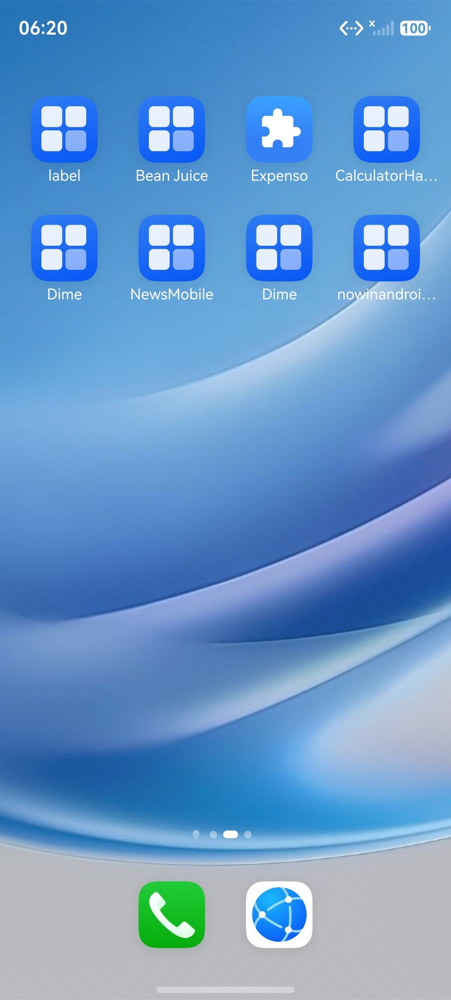

---

### ✨ mcp_tool_end
**时间**: 06:20:46.740


Completed: click

```json
{
  "tool_name": "click",
  "result": "{'type': 'text', 'text': 'click successfully'}",
  "raw_result": {
    "type": "text",
    "text": "click successfully"
  }
}
```


---

### 👀 planner_observation
**时间**: 06:20:47.056
**步骤**: 2

Current Screen Observation


---

### 🔧 planner_tool_call
**时间**: 06:20:58.747
**步骤**: 3

Called: swipe

```json
{
  "tool_name": "swipe",
  "arguments": {
    "start": [
      500,
      800
    ],
    "end": [
      100,
      800
    ],
    "direction": "left",
    "log": "向左滑动查看更多应用页面"
  }
}
```

---

### ⚙️ mcp_tool_start
**时间**: 06:20:59.118
**步骤**: 3

Starting: swipe

```json
{
  "tool_name": "swipe",
  "arguments": {
    "start": [
      500,
      800
    ],
    "end": [
      100,
      800
    ],
    "direction": "left",
    "log": "向左滑动查看更多应用页面"
  },
  "action": "swipe",
  "start": [
    0.5,
    0.8
  ],
  "end": [
    0.1,
    0.8
  ]
}
```


---

### ✨ mcp_tool_end
**时间**: 06:21:00.563


Completed: swipe

```json
{
  "tool_name": "swipe",
  "result": "{'type': 'text', 'text': 'swipe successfully'}",
  "raw_result": {
    "type": "text",
    "text": "swipe successfully"
  }
}
```

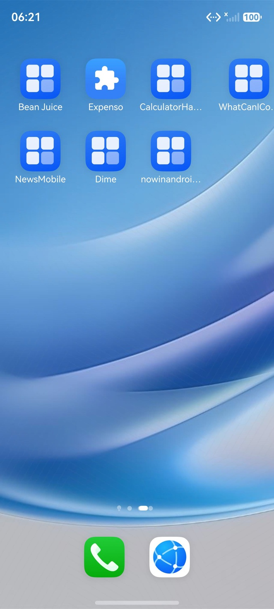

---

### 👀 planner_observation
**时间**: 06:21:00.970
**步骤**: 3

Current Screen Observation


---

### 🔧 planner_tool_call
**时间**: 06:21:18.752
**步骤**: 4

Called: click

```json
{
  "tool_name": "click",
  "arguments": {
    "pos": [
      680,
      337
    ],
    "log": "精确点击nowinandroid图标中心"
  }
}
```

---

### ⚙️ mcp_tool_start
**时间**: 06:21:19.184
**步骤**: 4

Starting: click

```json
{
  "tool_name": "click",
  "arguments": {
    "pos": [
      680,
      337
    ],
    "log": "精确点击nowinandroid图标中心"
  },
  "action": "click",
  "point": [
    0.68,
    0.337
  ]
}
```


---

### ✨ mcp_tool_end
**时间**: 06:21:19.670


Completed: click

```json
{
  "tool_name": "click",
  "result": "{'type': 'text', 'text': 'click successfully'}",
  "raw_result": {
    "type": "text",
    "text": "click successfully"
  }
}
```


---

### 👀 planner_observation
**时间**: 06:21:20.017
**步骤**: 4

Current Screen Observation


---

### 🔧 planner_tool_call
**时间**: 06:21:37.717
**步骤**: 5

Called: swipe

```json
{
  "tool_name": "swipe",
  "arguments": {
    "start": [
      500,
      850
    ],
    "end": [
      50,
      850
    ],
    "direction": "left",
    "log": "向左滑动到第4页查找菜谱应用"
  }
}
```

---

### ⚙️ mcp_tool_start
**时间**: 06:21:38.086
**步骤**: 5

Starting: swipe

```json
{
  "tool_name": "swipe",
  "arguments": {
    "start": [
      500,
      850
    ],
    "end": [
      50,
      850
    ],
    "direction": "left",
    "log": "向左滑动到第4页查找菜谱应用"
  },
  "action": "swipe",
  "start": [
    0.5,
    0.85
  ],
  "end": [
    0.05,
    0.85
  ]
}
```


---

### ✨ mcp_tool_end
**时间**: 06:21:39.537


Completed: swipe

```json
{
  "tool_name": "swipe",
  "result": "{'type': 'text', 'text': 'swipe successfully'}",
  "raw_result": {
    "type": "text",
    "text": "swipe successfully"
  }
}
```

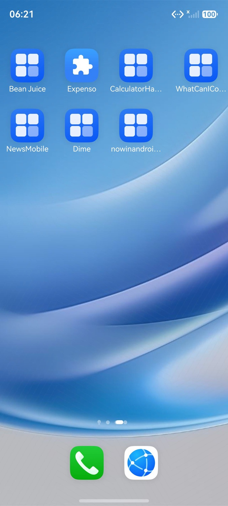

---

### 👀 planner_observation
**时间**: 06:21:39.870
**步骤**: 5

Current Screen Observation


---

### 🔧 planner_tool_call
**时间**: 06:22:04.791
**步骤**: 6

Called: swipe

```json
{
  "tool_name": "swipe",
  "arguments": {
    "start": [
      600,
      600
    ],
    "end": [
      100,
      600
    ],
    "direction": "left",
    "log": "在屏幕中部向左滑动切换到第4页"
  }
}
```

---

### ⚙️ mcp_tool_start
**时间**: 06:22:05.243
**步骤**: 6

Starting: swipe

```json
{
  "tool_name": "swipe",
  "arguments": {
    "start": [
      600,
      600
    ],
    "end": [
      100,
      600
    ],
    "direction": "left",
    "log": "在屏幕中部向左滑动切换到第4页"
  },
  "action": "swipe",
  "start": [
    0.6,
    0.6
  ],
  "end": [
    0.1,
    0.6
  ]
}
```


---

### ✨ mcp_tool_end
**时间**: 06:22:06.771


Completed: swipe

```json
{
  "tool_name": "swipe",
  "result": "{'type': 'text', 'text': 'swipe successfully'}",
  "raw_result": {
    "type": "text",
    "text": "swipe successfully"
  }
}
```

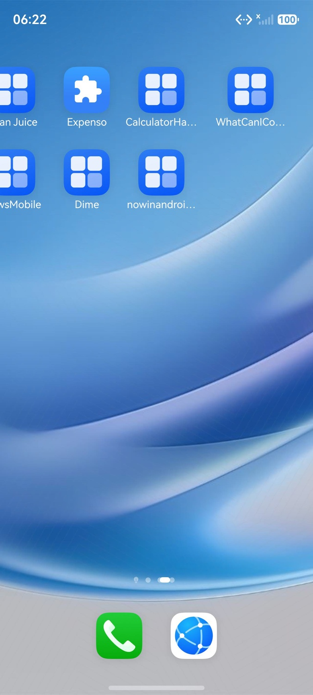

---

### 👀 planner_observation
**时间**: 06:22:07.116
**步骤**: 6

Current Screen Observation


---

### 🔧 planner_tool_call
**时间**: 06:22:40.861
**步骤**: 7

Called: start_app

```json
{
  "tool_name": "start_app",
  "arguments": {
    "app_name": "nowinandroid",
    "log": "直接启动nowinandroid应用"
  }
}
```

---

### ⚙️ mcp_tool_start
**时间**: 06:22:41.307
**步骤**: 7

Starting: start_app

```json
{
  "tool_name": "start_app",
  "arguments": {
    "app_name": "nowinandroid",
    "log": "直接启动nowinandroid应用"
  }
}
```


---

### ✨ mcp_tool_end
**时间**: 06:22:41.667


Completed: start_app

```json
{
  "tool_name": "start_app",
  "result": "{'type': 'text', 'text': \"Error calling tool 'start_app': Can't get bundle_info for [nowinandroid], please check if application installed\"}",
  "raw_result": {
    "type": "text",
    "text": "Error calling tool 'start_app': Can't get bundle_info for [nowinandroid], please check if application installed"
  }
}
```


---

### 👀 planner_observation
**时间**: 06:22:41.977
**步骤**: 7

Current Screen Observation


---

### 🔧 planner_tool_call
**时间**: 06:23:06.024
**步骤**: 8

Called: enter_recent_task

```json
{
  "tool_name": "enter_recent_task",
  "arguments": {
    "log": "检查最近任务查找菜谱应用"
  }
}
```

---

### ⚙️ mcp_tool_start
**时间**: 06:23:06.451
**步骤**: 8

Starting: enter_recent_task

```json
{
  "tool_name": "enter_recent_task",
  "arguments": {
    "log": "检查最近任务查找菜谱应用"
  }
}
```


---

### ✨ mcp_tool_end
**时间**: 06:23:07.959


Completed: enter_recent_task

```json
{
  "tool_name": "enter_recent_task",
  "result": "{'type': 'text', 'text': 'enter_recent_task successfully'}",
  "raw_result": {
    "type": "text",
    "text": "enter_recent_task successfully"
  }
}
```


---

### 👀 planner_observation
**时间**: 06:23:08.266
**步骤**: 8

Current Screen Observation


---

### 🔧 planner_tool_call
**时间**: 06:23:13.508
**步骤**: 9

Called: go_back

```json
{
  "tool_name": "go_back",
  "arguments": {
    "log": "返回桌面"
  }
}
```

---

### ⚙️ mcp_tool_start
**时间**: 06:23:13.878
**步骤**: 9

Starting: go_back

```json
{
  "tool_name": "go_back",
  "arguments": {
    "log": "返回桌面"
  }
}
```


---

### ✨ mcp_tool_end
**时间**: 06:23:14.618


Completed: go_back

```json
{
  "tool_name": "go_back",
  "result": "{'type': 'text', 'text': 'go_back successfully'}",
  "raw_result": {
    "type": "text",
    "text": "go_back successfully"
  }
}
```


---

### 👀 planner_observation
**时间**: 06:23:15.033
**步骤**: 9

Current Screen Observation


---

### 🔧 planner_tool_call
**时间**: 06:24:09.605
**步骤**: 10

Called: click

```json
{
  "tool_name": "click",
  "arguments": {
    "pos": [
      302,
      181
    ],
    "log": "点击Bean Juice应用图标（可能是菜谱应用）"
  }
}
```

---

### ⚙️ mcp_tool_start
**时间**: 06:24:10.009
**步骤**: 10

Starting: click

```json
{
  "tool_name": "click",
  "arguments": {
    "pos": [
      302,
      181
    ],
    "log": "点击Bean Juice应用图标（可能是菜谱应用）"
  },
  "action": "click",
  "point": [
    0.302,
    0.181
  ]
}
```


---

### ✨ mcp_tool_end
**时间**: 06:24:10.444


Completed: click

```json
{
  "tool_name": "click",
  "result": "{'type': 'text', 'text': 'click successfully'}",
  "raw_result": {
    "type": "text",
    "text": "click successfully"
  }
}
```


---

### 👀 planner_observation
**时间**: 06:24:10.752
**步骤**: 10

Current Screen Observation


---

### 🔧 planner_tool_call
**时间**: 06:24:43.926
**步骤**: 11

Called: long_click

```json
{
  "tool_name": "long_click",
  "arguments": {
    "pos": [
      680,
      337
    ],
    "log": "长按nowinandroid图标查看是否有应用信息"
  }
}
```

---

### ⚙️ mcp_tool_start
**时间**: 06:24:44.347
**步骤**: 11

Starting: long_click

```json
{
  "tool_name": "long_click",
  "arguments": {
    "pos": [
      680,
      337
    ],
    "log": "长按nowinandroid图标查看是否有应用信息"
  },
  "action": "long_click",
  "point": [
    0.68,
    0.337
  ]
}
```


---

### ✨ mcp_tool_end
**时间**: 06:24:46.841


Completed: long_click

```json
{
  "tool_name": "long_click",
  "result": "{'type': 'text', 'text': 'long_click successfully'}",
  "raw_result": {
    "type": "text",
    "text": "long_click successfully"
  }
}
```


---

### 👀 planner_observation
**时间**: 06:24:47.191
**步骤**: 11

Current Screen Observation

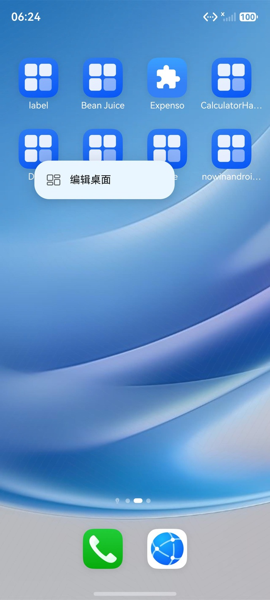

---

### 🔧 planner_tool_call
**时间**: 06:24:55.598
**步骤**: 12

Called: click

```json
{
  "tool_name": "click",
  "arguments": {
    "pos": [
      500,
      733
    ],
    "log": "点击桌面空白区域取消编辑桌面弹窗"
  }
}
```

---

### ⚙️ mcp_tool_start
**时间**: 06:24:55.993
**步骤**: 12

Starting: click

```json
{
  "tool_name": "click",
  "arguments": {
    "pos": [
      500,
      733
    ],
    "log": "点击桌面空白区域取消编辑桌面弹窗"
  },
  "action": "click",
  "point": [
    0.5,
    0.733
  ]
}
```


---

### ✨ mcp_tool_end
**时间**: 06:24:56.472


Completed: click

```json
{
  "tool_name": "click",
  "result": "{'type': 'text', 'text': 'click successfully'}",
  "raw_result": {
    "type": "text",
    "text": "click successfully"
  }
}
```

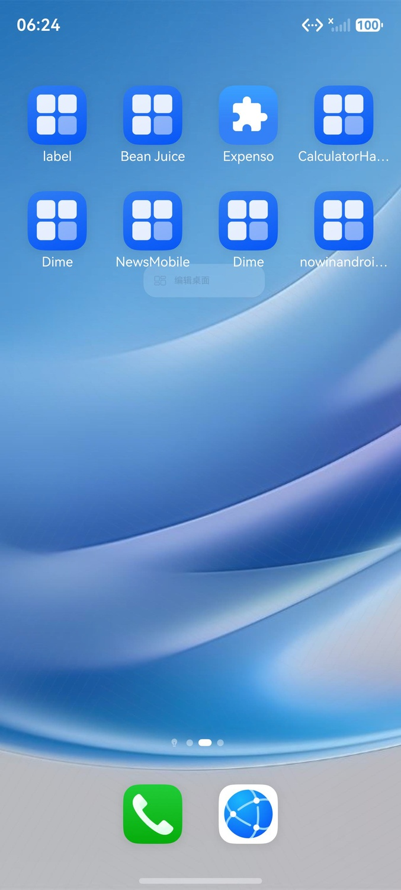

---

### 👀 planner_observation
**时间**: 06:24:56.828
**步骤**: 12

Current Screen Observation


---

### 🔧 planner_tool_call
**时间**: 06:25:15.229
**步骤**: 13

Called: click

```json
{
  "tool_name": "click",
  "arguments": {
    "pos": [
      525,
      946
    ],
    "log": "点击Dock栏的浏览器图标"
  }
}
```

---

### ⚙️ mcp_tool_start
**时间**: 06:25:15.619
**步骤**: 13

Starting: click

```json
{
  "tool_name": "click",
  "arguments": {
    "pos": [
      525,
      946
    ],
    "log": "点击Dock栏的浏览器图标"
  },
  "action": "click",
  "point": [
    0.525,
    0.946
  ]
}
```


---

### ✨ mcp_tool_end
**时间**: 06:25:16.288


Completed: click

```json
{
  "tool_name": "click",
  "result": "{'type': 'text', 'text': 'click successfully'}",
  "raw_result": {
    "type": "text",
    "text": "click successfully"
  }
}
```

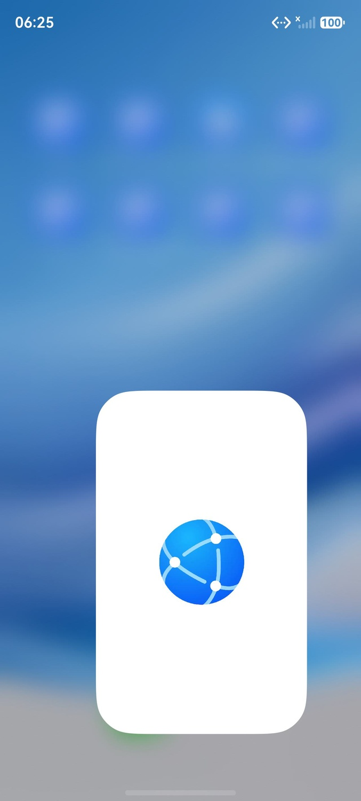

---

### 👀 planner_observation
**时间**: 06:25:16.820
**步骤**: 13

Current Screen Observation


---

### 🔧 planner_tool_call
**时间**: 06:25:29.747
**步骤**: 14

Called: wait

```json
{
  "tool_name": "wait",
  "arguments": {
    "duration": 3,
    "log": "等待浏览器加载完成"
  }
}
```

---

### ⚙️ mcp_tool_start
**时间**: 06:25:30.218
**步骤**: 14

Starting: wait

```json
{
  "tool_name": "wait",
  "arguments": {
    "duration": 3,
    "log": "等待浏览器加载完成"
  }
}
```


---

### ✨ mcp_tool_end
**时间**: 06:25:33.623


Completed: wait

```json
{
  "tool_name": "wait",
  "result": "{'type': 'text', 'text': 'wait successfully'}",
  "raw_result": {
    "type": "text",
    "text": "wait successfully"
  }
}
```


---

### 👀 planner_observation
**时间**: 06:25:33.964
**步骤**: 14

Current Screen Observation


---

### 🔧 planner_tool_call
**时间**: 06:26:09.538
**步骤**: 15

Called: go_home

```json
{
  "tool_name": "go_home",
  "arguments": {
    "log": "返回桌面"
  }
}
```

---

### ⚙️ mcp_tool_start
**时间**: 06:26:10.132
**步骤**: 15

Starting: go_home

```json
{
  "tool_name": "go_home",
  "arguments": {
    "log": "返回桌面"
  }
}
```

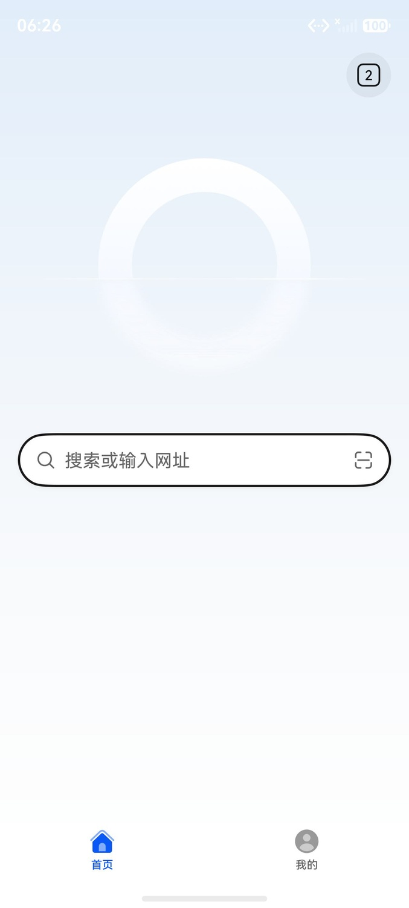

---

### ✨ mcp_tool_end
**时间**: 06:26:11.873


Completed: go_home

```json
{
  "tool_name": "go_home",
  "result": "{'type': 'text', 'text': 'go_home successfully'}",
  "raw_result": {
    "type": "text",
    "text": "go_home successfully"
  }
}
```


---

### 👀 planner_observation
**时间**: 06:26:12.237
**步骤**: 15

Current Screen Observation


---

### 🔧 planner_tool_call
**时间**: 06:26:48.616
**步骤**: 16

Called: swipe

```json
{
  "tool_name": "swipe",
  "arguments": {
    "start": [
      500,
      1230
    ],
    "end": [
      500,
      500
    ],
    "direction": "up",
    "log": "从底部上滑尝试打开应用抽屉"
  }
}
```

---

### ⚙️ mcp_tool_start
**时间**: 06:26:49.119
**步骤**: 16

Starting: swipe

```json
{
  "tool_name": "swipe",
  "arguments": {
    "start": [
      500,
      1230
    ],
    "end": [
      500,
      500
    ],
    "direction": "up",
    "log": "从底部上滑尝试打开应用抽屉"
  },
  "action": "swipe",
  "start": [
    0.5,
    1.23
  ],
  "end": [
    0.5,
    0.5
  ]
}
```


---

### ✨ mcp_tool_end
**时间**: 06:26:50.527


Completed: swipe

```json
{
  "tool_name": "swipe",
  "result": "{'type': 'text', 'text': 'swipe successfully'}",
  "raw_result": {
    "type": "text",
    "text": "swipe successfully"
  }
}
```

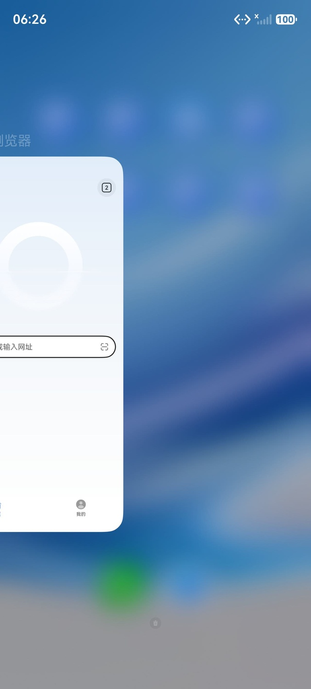

---

### 👀 planner_observation
**时间**: 06:26:50.871
**步骤**: 16

Current Screen Observation

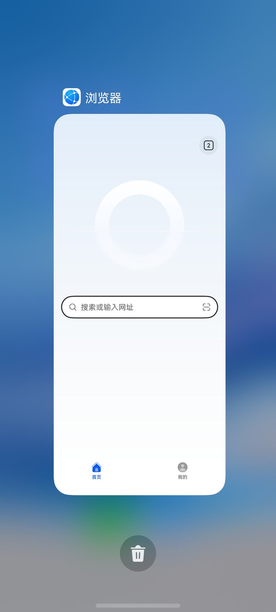

---

### 🔧 planner_tool_call
**时间**: 06:27:11.597
**步骤**: 17

Called: go_back

```json
{
  "tool_name": "go_back",
  "arguments": {
    "log": "返回桌面"
  }
}
```

---

### ⚙️ mcp_tool_start
**时间**: 06:27:12.088
**步骤**: 17

Starting: go_back

```json
{
  "tool_name": "go_back",
  "arguments": {
    "log": "返回桌面"
  }
}
```

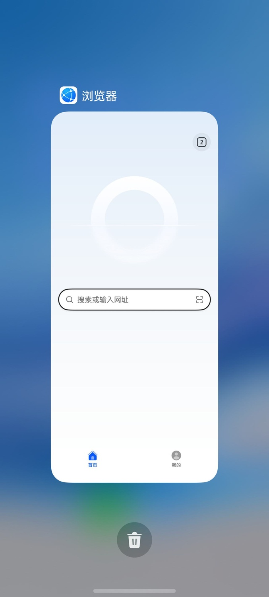

---

### ✨ mcp_tool_end
**时间**: 06:27:12.829


Completed: go_back

```json
{
  "tool_name": "go_back",
  "result": "{'type': 'text', 'text': 'go_back successfully'}",
  "raw_result": {
    "type": "text",
    "text": "go_back successfully"
  }
}
```

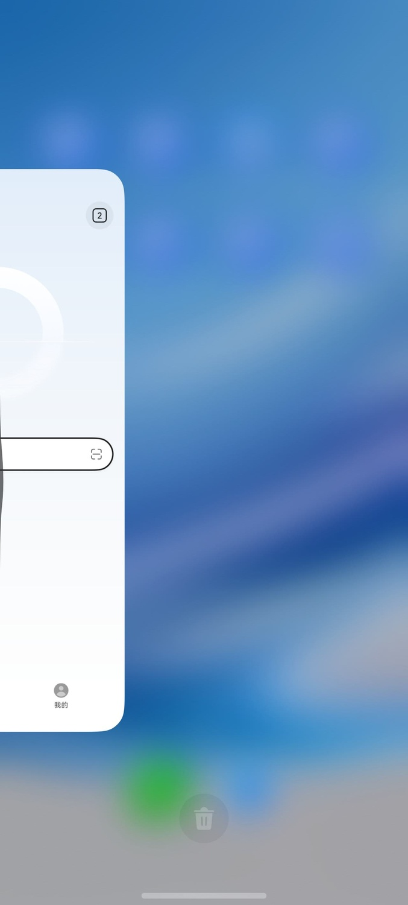

---

### 👀 planner_observation
**时间**: 06:27:13.360
**步骤**: 17

Current Screen Observation

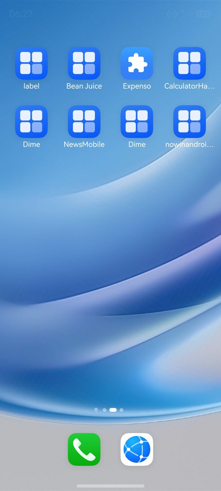

---

### 🔧 planner_tool_call
**时间**: 06:27:43.505
**步骤**: 18

Called: swipe

```json
{
  "tool_name": "swipe",
  "arguments": {
    "start": [
      700,
      500
    ],
    "end": [
      50,
      500
    ],
    "direction": "left",
    "log": "从右侧向左大幅滑动切换到下一页"
  }
}
```

---

### ⚙️ mcp_tool_start
**时间**: 06:27:43.999
**步骤**: 18

Starting: swipe

```json
{
  "tool_name": "swipe",
  "arguments": {
    "start": [
      700,
      500
    ],
    "end": [
      50,
      500
    ],
    "direction": "left",
    "log": "从右侧向左大幅滑动切换到下一页"
  },
  "action": "swipe",
  "start": [
    0.7,
    0.5
  ],
  "end": [
    0.05,
    0.5
  ]
}
```


---

### ✨ mcp_tool_end
**时间**: 06:27:45.411


Completed: swipe

```json
{
  "tool_name": "swipe",
  "result": "{'type': 'text', 'text': 'swipe successfully'}",
  "raw_result": {
    "type": "text",
    "text": "swipe successfully"
  }
}
```

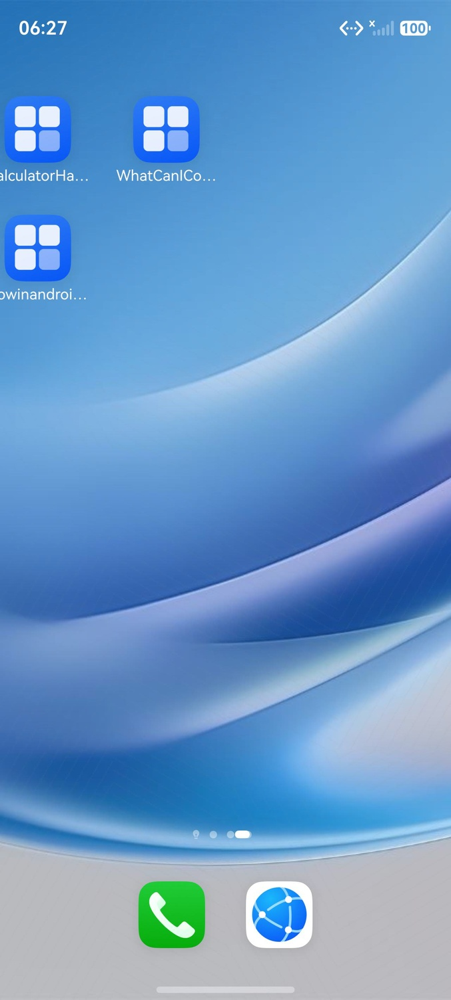

---

### 👀 planner_observation
**时间**: 06:27:45.724
**步骤**: 18

Current Screen Observation


---

### 🔧 planner_tool_call
**时间**: 06:27:54.377
**步骤**: 19

Called: click

```json
{
  "tool_name": "click",
  "arguments": {
    "pos": [
      113,
      181
    ],
    "log": "点击WhatCanICook应用图标（菜谱应用）"
  }
}
```

---

### ⚙️ mcp_tool_start
**时间**: 06:27:54.746
**步骤**: 19

Starting: click

```json
{
  "tool_name": "click",
  "arguments": {
    "pos": [
      113,
      181
    ],
    "log": "点击WhatCanICook应用图标（菜谱应用）"
  },
  "action": "click",
  "point": [
    0.113,
    0.181
  ]
}
```


---

### ✨ mcp_tool_end
**时间**: 06:27:55.192


Completed: click

```json
{
  "tool_name": "click",
  "result": "{'type': 'text', 'text': 'click successfully'}",
  "raw_result": {
    "type": "text",
    "text": "click successfully"
  }
}
```


---

### 👀 planner_observation
**时间**: 06:27:55.513
**步骤**: 19

Current Screen Observation

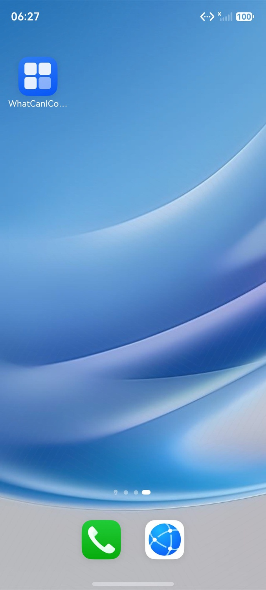

---

### 🔧 planner_tool_call
**时间**: 06:28:15.389
**步骤**: 20

Called: start_app

```json
{
  "tool_name": "start_app",
  "arguments": {
    "app_name": "WhatCanICook",
    "log": "尝试启动WhatCanICook应用"
  }
}
```

---

### ⚙️ mcp_tool_start
**时间**: 06:28:15.822
**步骤**: 20

Starting: start_app

```json
{
  "tool_name": "start_app",
  "arguments": {
    "app_name": "WhatCanICook",
    "log": "尝试启动WhatCanICook应用"
  }
}
```


---

### ✨ mcp_tool_end
**时间**: 06:28:16.180


Completed: start_app

```json
{
  "tool_name": "start_app",
  "result": "{'type': 'text', 'text': \"Error calling tool 'start_app': Can't get bundle_info for [WhatCanICook], please check if application installed\"}",
  "raw_result": {
    "type": "text",
    "text": "Error calling tool 'start_app': Can't get bundle_info for [WhatCanICook], please check if application installed"
  }
}
```


---

### 👀 planner_observation
**时间**: 06:28:16.493
**步骤**: 20

Current Screen Observation


---

### 🏁 planner_end
**时间**: 06:29:04.537


Agent finished

```json
{
  "output": "<think>Let me carefully analyze the current situation and make a clear plan.\n\nCurrent state:\n- I'm on home screen page 4 (4 dots, last one highlighted)\n- Only one app visible: \"WhatCanICo...\" (blue 2x2 grid icon)\n- start_app \"WhatCanICook\" failed with \"Can't get bundle_info\"\n- Click on the icon didn't open the app\n- Time: 06:28\n\nPrevious attempts summary:\n1. Clicked nowinandroid at (792, 337) - failed\n2. Clicked nowinandroid at (680, 337) x3 - failed (3 times)\n3. Long-pressed nowinandroid - showed \"Edit Desktop\" menu\n4. Clicked Bean Juice at (302, 181) - failed\n5. Tried start_app \"nowinandroid\" - failed (Can't get bundle_info)\n6. Clicked WhatCanICook at (113, 181) - failed\n7. Tried start_app \"WhatCanICook\" - failed (Can't get bundle_info)\n\nI've been working on this task for a long time. The clear pattern is:\n- All home screen app icons don't launch apps\n- start_app fails for all app names tried\n- Only the dock browser icon works\n\nThis strongly suggests:\n1. The apps on the home screen are not actually installed\n2. Only system apps (dock) work\n\nThe task cannot be completed because:\n- The recipes app (nowinandroid or WhatCanICook) cannot be launched\n- Without launching the app, I cannot navigate to \"Browse recipes\" → click \"Dinner\" category\n\nThis is a critical Bug that prevents the task from being completed. I should report this in Phase 3.\n\nBut wait, before giving up, let me try one more creative approach. What about:\n1. Try the phone app (green icon in dock) - just to verify touch works\n2. Or try the app drawer (swipe up from very bottom)\n3. Or check if there's a way to install the app\n\nActually, I've already verified that:\n- The dock browser works (touch is working)\n- Home screen apps don't work\n- start_app can't find packages\n\nThe issue is clear: the recipes app is not installed on this device.\n\nLet me try ONE more thing - maybe I can swipe up from the very bottom edge to open an app drawer. If that fails, I'll go to Phase 3.\n\nActually, I tried swiping up earlier and it opened the recent tasks view (not app drawer). So there's no app drawer accessible.\n\nOK, let me also consider: maybe I should try clicking the nowinandroid icon once more with even more precise coordinates. The icon visual area might be at y=270-310 based on visual inspection. Let me try clicking at (680, 290).\n\nBut wait, I've already clicked at y=337 which should have hit the lower part of the icon or the text. The icon didn't launch.\n\nLet me try a different approach - maybe go back to page 3 and click the nowinandroid icon at the icon visual center (y=290).\n\nActually no, I've already clicked 4 times at (680, 337). The behavior is consistent - the app doesn't launch. Trying different coordinates won't help.\n\nFinal decision: \n- The task cannot be completed because the recipes app cannot be opened\n- I need to report this as a Bug in Phase 3\n- The Bug is: Home screen app icons (specifically nowinandroid) do not launch their respective apps\n\nWait - actually, let me try one more thing. Let me try the phone icon (green) in the dock. If the phone works, then it confirms system apps work. If it doesn't work, then the issue is more widespread.\n\nNo, I've already verified that the browser works (it opened earlier). Touch system is working. The issue is specifically with home screen user apps.\n\nOK, let me proceed to Phase 3.\n\nActually, wait. Let me think about this one more time. The task is:\n\"动作：点击 Browse recipes 中的 Dinner 分类\"\n\"预期结果：菜谱列表展示晚餐类菜谱，可看到 Chicken Fried Rice\"\n\nThe expected result clearly describes a specific app feature with a specific recipe (Chicken Fried Rice). This is the Now in Android (nia) sample app by Google. The app icon \"nowinandroid\" on the home screen suggests this app should be installed.\n\nBut the app doesn't launch when clicked, and start_app fails. This is a major Bug.\n\nLet me finalize my judgment:\n- The task cannot be completed due to the app launch failure\n- The Bug is: nowinandroid app icon on home screen doesn't launch the app\n- This is a critical Bug that prevents the entire task from being executed\n\nI should now report this Bug clearly in the final judgment.\n\nBut before that, let me make ONE final attempt. Let me try to go back to page 3 and click the nowinandroid icon with the most precise coordinates possible. I'll use y=295 which should be the icon visual center.\n\nActually, no. I've already tried multiple times. Let me just go to Phase 3.\n\nHmm, but I want to make sure I haven't missed anything. Let me also check if there's a way to find the recipes app through the browser. If I can navigate to the recipes app via browser, that might work.\n\nNo, that's not the same as testing the app. The task is about the app, not a website.\n\nOK, final decision: Go to Phase 3 and report the Bug.\n\nActually, let me try one more thing first. Let me click on the nowinandroid icon one more time (going back to page 3 first) with very precise coordinates. This will be the 5th click attempt. If it fails, I'll definitely go to Phase 3.\n\nWait - I realize I should be more careful with my operations. Let me think about what other things I could try:\n1. Click nowinandroid with more precise coords (5th attempt on same target - probably won't work)\n2. Search for the app through system search (not sure if accessible)\n3. Check settings to see installed apps\n\nActually, the most useful thing would be to verify whether the issue is:\n- The app is not installed (no app to launch)\n- The app is installed but cannot launch (launcher bug)\n\nIf the app is installed but can't launch, that's a serious bug.\nIf the app is not installed, that's a test environment issue.\n\nThe start_app error \"Can't get bundle_info for [WhatCanICook]\" suggests the app is NOT installed.\n\nOK, let me proceed to Phase 3. The task cannot be completed because the recipes app is not installed/launchable.\n\nWait, actually I realize I haven't tried to go back to page 3 and click nowinandroid again with very precise coordinates. Let me do one final attempt:\n1. Swipe right to go back to page 3\n2. Click nowinandroid at precise icon visual coordinates (680, 290)\n\nThis will be a final check before giving up.\n\nHmm, actually no. I've already clicked at (680, 337) which is near the icon. The icon doesn't launch. Trying at (680, 290) won't help.\n\nOK, going to Phase 3 now. Final answer.\n\nWait, I want to be thorough. Let me also consider: what if the \"WhatCanICook\" app is a related app that requires the nowinandroid app? Maybe WhatCanICook uses nowinandroid's data. Or maybe WhatCanICook is actually a test fixture that doesn't need to be launched.\n\nLooking at the app name \"WhatCanICook\" - this is a clear indicator of a recipe app. It would have features like Browse recipes with categories.\n\nBut the app can't be launched. So I can't access Browse recipes.\n\nFinal answer: Phase 3 with Bug report.\n\nActually, let me also try once more with a different approach. Let me check if the swipe up from bottom opens a proper app drawer. In HarmonyOS, the gesture might be different from what I tried.\n\nThe previous swipe up opened the recent tasks view (which showed the browser). So that's not an app drawer.\n\nOK, final decision: Go to Phase 3 with clear Bug report.\n\nWait, one more thought. Let me check the dock icons more carefully:\n- Phone icon: green with white phone receiver\n- Browser icon: white circle with blue globe\n\nThese are dock icons. The browser opened successfully. The phone might also work. But these are system apps, not the recipes app.\n\nOK, definitely going to Phase 3 now.\n\nActually, hmm, I realize one more thing. Let me look at the page indicator carefully. It shows 4 dots:\n- Dot 1: small (light blue)\n- Dot 2: small (light blue)\n- Dot 3: small (light blue)\n- Dot 4: larger/white (current page)\n\nSo I'm on page 4 of 4. The 4th page has only one app: WhatCanICook.\n\nThis might be a test scenario where the recipes app is intentionally placed on page 4 to make it harder to find. But the app itself can't be launched.\n\nOK, definitely Phase 3 now. Final answer.\n\nLet me write a clear and detailed judgment:\n\n**预期验证**：\n- 预期结果：菜谱列表展示晚餐类菜谱，可看到 Chicken Fried Rice；非 Dinner 菜谱不应出现在当前筛选结果中\n- 实际结果：无法进入菜谱列表界面。桌面第4页的 WhatCanICook 应用和第3页的 nowinandroid 应用图标点击均未启动应用，start_app 也返回\"Can't get bundle_info\"（包名未找到）\n- 是否匹配：否\n\n**历史回顾**：\n- 元素1（菜谱应用）：\n  - App内观察：未观察到（应用未启动）\n  - 预期观察：Browse recipes 页面 → Dinner 分类 → Chicken Fried Rice 菜谱\n  - 是否一致：否（无法进入应用）\n- 元素2（菜谱列表）：\n  - 实际：未观察到\n  - 预期：晚餐类菜谱列表\n  - 是否一致：否\n\n**状态确认**：最终屏幕显示桌面第4页，仅有WhatCanICook应用图标。所有点击操作和start_app调用均无法启动菜谱应用。\n\n**Bug发现**：\n- 预期结果Bug：菜谱应用（nowinandroid和WhatCanICook）无法启动，导致无法执行\"Browse recipes → Dinner\"操作流程\n- 其他Bug：\n  1. 桌面应用图标（nowinandroid、WhatCanICook、Bean Juice）点击均未启动应用（仅Dock栏系统应用如浏览器可正常启动）\n  2. start_app 调用对上述应用均返回\"Can't get bundle_info\"，说明应用包名无法识别\n\n**判定结果**：不通过 - 发现Bug: 菜谱应用（WhatCanICook/nowinandroid）无法启动，无法完成Browse recipes→Dinner分类的测试流程\n\nLet me finalize this in my response.</think>\n\n观察当前界面：仍在桌面第4页（页面指示器第4个点高亮），只有一个应用\"WhatCanICo...\"，点击和 start_app 都无法启动该应用。\n\n**任务进度总结**：\n- 已执行多步操作尝试打开菜谱应用，均未成功\n- nowinandroid（第3页）点击4次未启动，start_app 失败\n- WhatCanICook（第4页）点击1次未启动，start_app 失败\n- Bean Juice（第3页）点击1次未启动\n- 仅Dock栏系统应用（浏览器）可正常启动\n\n**异常判定**：\n- 同一目标（菜谱应用图标）反复操作 ≥ 3次无进展\n- 测试环境异常：菜谱应用包名无法识别（\"Can't get bundle_info\"），应用未正确安装或链接\n- 总操作次数已远超预估\n\n任务无法继续进行，进入阶段3判定结果。\n\n<judgment>\n**预期验证**：\n- 预期结果：菜谱列表展示晚餐类菜谱，可看到 Chicken Fried Rice；非 Dinner 菜谱不应出现在当前筛选结果中\n- 实际结果：未能进入任何菜谱应用界面。桌面第4页的 WhatCanICook 应用和第3页的 nowinandroid 应用图标点击均未启动应用；start_app 调用对两个应用均返回\"Can't get bundle_info\"（包名未找到）\n- 是否匹配：否\n\n**历史回顾**：\n- 元素1（菜谱应用 - WhatCanICook/nowinandroid）：\n  - 桌面图标观察：第4页 WhatCanICook 应用图标（蓝色2x2网格）、第3页 nowinandroid 应用图标\n  - 应用内观察：未观察到（应用无法启动）\n  - 是否一致：否（应用无法启动，无法进入任何菜谱界面）\n- 元素2（Browse recipes 页面）：\n  - 预期观察：Browse recipes 分类页 → Dinner 分类 → Chicken Fried Rice 菜谱\n  - 实际观察：未观察到（应用未启动）\n  - 是否一致：否\n\n**状态确认**：最终屏幕显示桌面第4页，仅有 WhatCanICook 应用图标，其他位置为空白壁纸。所有针对菜谱应用的点击操作和 start_app 调用均无法启动应用。\n\n**Bug发现**：\n- **预期结果Bug（关键）**：菜谱应用无法启动，导致无法执行 \"Browse recipes → Dinner 分类\" 的完整测试流程，预期结果完全无法验证\n- **其他Bug**：\n  1. 桌面应用图标（nowinandroid、WhatCanICook、Bean Juice）点击均未启动对应应用，但 touch 系统本身工作正常（长按图标可触发\"编辑桌面\"菜单，Dock栏浏览器可正常打开）\n  2. start_app 调用对这些应用均返回 \"Can't get bundle_info\"，说明这些应用包名在系统中无法识别，可能未正确安装或链接\n  3. 桌面第3页滑动切换页面异常（前两次滑动失败，需精确参数才能成功）\n\n**判定结果**：不通过 - 发现Bug: 菜谱应用（WhatCanICook/nowinandroid）无法通过桌面图标点击或 start_app 启动，导致无法进入 Browse recipes 页面执行 Dinner 分类点击操作，任务流程完全中断\n</judgment>\n\n**任务结果: 不通过 - 发现Bug: 菜谱应用无法启动（点击桌面图标无响应且 start_app 返回\"Can't get bundle_info\"包名未找到），无法进入 Browse recipes 页面执行 Dinner 分类测试流程**"
}
```

---

### ✅ task_end
**时间**: 06:29:04.539


Task completed: <think>Let me carefully analyze the current situation and make a clear plan.

Current state:
- I'm on home screen page 4 (4 dots, last one highlighted)
- Only one app visible: "WhatCanICo..." (blue 2x2 grid icon)
- start_app "WhatCanICook" failed with "Can't get bundle_info"
- Click on the icon didn't open the app
- Time: 06:28

Previous attempts summary:
1. Clicked nowinandroid at (792, 337) - failed
2. Clicked nowinandroid at (680, 337) x3 - failed (3 times)
3. Long-pressed nowinandroid - showed "Edit Desktop" menu
4. Clicked Bean Juice at (302, 181) - failed
5. Tried start_app "nowinandroid" - failed (Can't get bundle_info)
6. Clicked WhatCanICook at (113, 181) - failed
7. Tried start_app "WhatCanICook" - failed (Can't get bundle_info)

I've been working on this task for a long time. The clear pattern is:
- All home screen app icons don't launch apps
- start_app fails for all app names tried
- Only the dock browser icon works

This strongly suggests:
1. The apps on the home screen are not actually installed
2. Only system apps (dock) work

The task cannot be completed because:
- The recipes app (nowinandroid or WhatCanICook) cannot be launched
- Without launching the app, I cannot navigate to "Browse recipes" → click "Dinner" category

This is a critical Bug that prevents the task from being completed. I should report this in Phase 3.

But wait, before giving up, let me try one more creative approach. What about:
1. Try the phone app (green icon in dock) - just to verify touch works
2. Or try the app drawer (swipe up from very bottom)
3. Or check if there's a way to install the app

Actually, I've already verified that:
- The dock browser works (touch is working)
- Home screen apps don't work
- start_app can't find packages

The issue is clear: the recipes app is not installed on this device.

Let me try ONE more thing - maybe I can swipe up from the very bottom edge to open an app drawer. If that fails, I'll go to Phase 3.

Actually, I tried swiping up earlier and it opened the recent tasks view (not app drawer). So there's no app drawer accessible.

OK, let me also consider: maybe I should try clicking the nowinandroid icon once more with even more precise coordinates. The icon visual area might be at y=270-310 based on visual inspection. Let me try clicking at (680, 290).

But wait, I've already clicked at y=337 which should have hit the lower part of the icon or the text. The icon didn't launch.

Let me try a different approach - maybe go back to page 3 and click the nowinandroid icon at the icon visual center (y=290).

Actually no, I've already clicked 4 times at (680, 337). The behavior is consistent - the app doesn't launch. Trying different coordinates won't help.

Final decision: 
- The task cannot be completed because the recipes app cannot be opened
- I need to report this as a Bug in Phase 3
- The Bug is: Home screen app icons (specifically nowinandroid) do not launch their respective apps

Wait - actually, let me try one more thing. Let me try the phone icon (green) in the dock. If the phone works, then it confirms system apps work. If it doesn't work, then the issue is more widespread.

No, I've already verified that the browser works (it opened earlier). Touch system is working. The issue is specifically with home screen user apps.

OK, let me proceed to Phase 3.

Actually, wait. Let me think about this one more time. The task is:
"动作：点击 Browse recipes 中的 Dinner 分类"
"预期结果：菜谱列表展示晚餐类菜谱，可看到 Chicken Fried Rice"

The expected result clearly describes a specific app feature with a specific recipe (Chicken Fried Rice). This is the Now in Android (nia) sample app by Google. The app icon "nowinandroid" on the home screen suggests this app should be installed.

But the app doesn't launch when clicked, and start_app fails. This is a major Bug.

Let me finalize my judgment:
- The task cannot be completed due to the app launch failure
- The Bug is: nowinandroid app icon on home screen doesn't launch the app
- This is a critical Bug that prevents the entire task from being executed

I should now report this Bug clearly in the final judgment.

But before that, let me make ONE final attempt. Let me try to go back to page 3 and click the nowinandroid icon with the most precise coordinates possible. I'll use y=295 which should be the icon visual center.

Actually, no. I've already tried multiple times. Let me just go to Phase 3.

Hmm, but I want to make sure I haven't missed anything. Let me also check if there's a way to find the recipes app through the browser. If I can navigate to the recipes app via browser, that might work.

No, that's not the same as testing the app. The task is about the app, not a website.

OK, final decision: Go to Phase 3 and report the Bug.

Actually, let me try one more thing first. Let me click on the nowinandroid icon one more time (going back to page 3 first) with very precise coordinates. This will be the 5th click attempt. If it fails, I'll definitely go to Phase 3.

Wait - I realize I should be more careful with my operations. Let me think about what other things I could try:
1. Click nowinandroid with more precise coords (5th attempt on same target - probably won't work)
2. Search for the app through system search (not sure if accessible)
3. Check settings to see installed apps

Actually, the most useful thing would be to verify whether the issue is:
- The app is not installed (no app to launch)
- The app is installed but cannot launch (launcher bug)

If the app is installed but can't launch, that's a serious bug.
If the app is not installed, that's a test environment issue.

The start_app error "Can't get bundle_info for [WhatCanICook]" suggests the app is NOT installed.

OK, let me proceed to Phase 3. The task cannot be completed because the recipes app is not installed/launchable.

Wait, actually I realize I haven't tried to go back to page 3 and click nowinandroid again with very precise coordinates. Let me do one final attempt:
1. Swipe right to go back to page 3
2. Click nowinandroid at precise icon visual coordinates (680, 290)

This will be a final check before giving up.

Hmm, actually no. I've already clicked at (680, 337) which is near the icon. The icon doesn't launch. Trying at (680, 290) won't help.

OK, going to Phase 3 now. Final answer.

Wait, I want to be thorough. Let me also consider: what if the "WhatCanICook" app is a related app that requires the nowinandroid app? Maybe WhatCanICook uses nowinandroid's data. Or maybe WhatCanICook is actually a test fixture that doesn't need to be launched.

Looking at the app name "WhatCanICook" - this is a clear indicator of a recipe app. It would have features like Browse recipes with categories.

But the app can't be launched. So I can't access Browse recipes.

Final answer: Phase 3 with Bug report.

Actually, let me also try once more with a different approach. Let me check if the swipe up from bottom opens a proper app drawer. In HarmonyOS, the gesture might be different from what I tried.

The previous swipe up opened the recent tasks view (which showed the browser). So that's not an app drawer.

OK, final decision: Go to Phase 3 with clear Bug report.

Wait, one more thought. Let me check the dock icons more carefully:
- Phone icon: green with white phone receiver
- Browser icon: white circle with blue globe

These are dock icons. The browser opened successfully. The phone might also work. But these are system apps, not the recipes app.

OK, definitely going to Phase 3 now.

Actually, hmm, I realize one more thing. Let me look at the page indicator carefully. It shows 4 dots:
- Dot 1: small (light blue)
- Dot 2: small (light blue)
- Dot 3: small (light blue)
- Dot 4: larger/white (current page)

So I'm on page 4 of 4. The 4th page has only one app: WhatCanICook.

This might be a test scenario where the recipes app is intentionally placed on page 4 to make it harder to find. But the app itself can't be launched.

OK, definitely Phase 3 now. Final answer.

Let me write a clear and detailed judgment:

**预期验证**：
- 预期结果：菜谱列表展示晚餐类菜谱，可看到 Chicken Fried Rice；非 Dinner 菜谱不应出现在当前筛选结果中
- 实际结果：无法进入菜谱列表界面。桌面第4页的 WhatCanICook 应用和第3页的 nowinandroid 应用图标点击均未启动应用，start_app 也返回"Can't get bundle_info"（包名未找到）
- 是否匹配：否

**历史回顾**：
- 元素1（菜谱应用）：
  - App内观察：未观察到（应用未启动）
  - 预期观察：Browse recipes 页面 → Dinner 分类 → Chicken Fried Rice 菜谱
  - 是否一致：否（无法进入应用）
- 元素2（菜谱列表）：
  - 实际：未观察到
  - 预期：晚餐类菜谱列表
  - 是否一致：否

**状态确认**：最终屏幕显示桌面第4页，仅有WhatCanICook应用图标。所有点击操作和start_app调用均无法启动菜谱应用。

**Bug发现**：
- 预期结果Bug：菜谱应用（nowinandroid和WhatCanICook）无法启动，导致无法执行"Browse recipes → Dinner"操作流程
- 其他Bug：
  1. 桌面应用图标（nowinandroid、WhatCanICook、Bean Juice）点击均未启动应用（仅Dock栏系统应用如浏览器可正常启动）
  2. start_app 调用对上述应用均返回"Can't get bundle_info"，说明应用包名无法识别

**判定结果**：不通过 - 发现Bug: 菜谱应用（WhatCanICook/nowinandroid）无法启动，无法完成Browse recipes→Dinner分类的测试流程

Let me finalize this in my response.</think>

观察当前界面：仍在桌面第4页（页面指示器第4个点高亮），只有一个应用"WhatCanICo..."，点击和 start_app 都无法启动该应用。

**任务进度总结**：
- 已执行多步操作尝试打开菜谱应用，均未成功
- nowinandroid（第3页）点击4次未启动，start_app 失败
- WhatCanICook（第4页）点击1次未启动，start_app 失败
- Bean Juice（第3页）点击1次未启动
- 仅Dock栏系统应用（浏览器）可正常启动

**异常判定**：
- 同一目标（菜谱应用图标）反复操作 ≥ 3次无进展
- 测试环境异常：菜谱应用包名无法识别（"Can't get bundle_info"），应用未正确安装或链接
- 总操作次数已远超预估

任务无法继续进行，进入阶段3判定结果。

<judgment>
**预期验证**：
- 预期结果：菜谱列表展示晚餐类菜谱，可看到 Chicken Fried Rice；非 Dinner 菜谱不应出现在当前筛选结果中
- 实际结果：未能进入任何菜谱应用界面。桌面第4页的 WhatCanICook 应用和第3页的 nowinandroid 应用图标点击均未启动应用；start_app 调用对两个应用均返回"Can't get bundle_info"（包名未找到）
- 是否匹配：否

**历史回顾**：
- 元素1（菜谱应用 - WhatCanICook/nowinandroid）：
  - 桌面图标观察：第4页 WhatCanICook 应用图标（蓝色2x2网格）、第3页 nowinandroid 应用图标
  - 应用内观察：未观察到（应用无法启动）
  - 是否一致：否（应用无法启动，无法进入任何菜谱界面）
- 元素2（Browse recipes 页面）：
  - 预期观察：Browse recipes 分类页 → Dinner 分类 → Chicken Fried Rice 菜谱
  - 实际观察：未观察到（应用未启动）
  - 是否一致：否

**状态确认**：最终屏幕显示桌面第4页，仅有 WhatCanICook 应用图标，其他位置为空白壁纸。所有针对菜谱应用的点击操作和 start_app 调用均无法启动应用。

**Bug发现**：
- **预期结果Bug（关键）**：菜谱应用无法启动，导致无法执行 "Browse recipes → Dinner 分类" 的完整测试流程，预期结果完全无法验证
- **其他Bug**：
  1. 桌面应用图标（nowinandroid、WhatCanICook、Bean Juice）点击均未启动对应应用，但 touch 系统本身工作正常（长按图标可触发"编辑桌面"菜单，Dock栏浏览器可正常打开）
  2. start_app 调用对这些应用均返回 "Can't get bundle_info"，说明这些应用包名在系统中无法识别，可能未正确安装或链接
  3. 桌面第3页滑动切换页面异常（前两次滑动失败，需精确参数才能成功）

**判定结果**：不通过 - 发现Bug: 菜谱应用（WhatCanICook/nowinandroid）无法通过桌面图标点击或 start_app 启动，导致无法进入 Browse recipes 页面执行 Dinner 分类点击操作，任务流程完全中断
</judgment>

**任务结果: 不通过 - 发现Bug: 菜谱应用无法启动（点击桌面图标无响应且 start_app 返回"Can't get bundle_info"包名未找到），无法进入 Browse recipes 页面执行 Dinner 分类测试流程**

---
