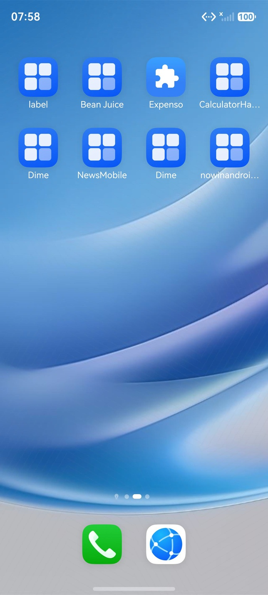

# 执行报告

## 任务信息
- **测试用例**: 07-57-11
- **任务名称**: 动作：点击左上角返回按钮。
预期结果：返回 Discover 首页，底部导航重新显示且 Discover 高亮。
- **开始时间**: 2026-06-26T07:57:11.238490
- **结束时间**: 2026-06-26T08:01:50.738738
- **Token消耗**: 150135 (SingleAgent: 150135)
- **总事件数**: 45

## 执行时间线


### 🚀 task_start
**时间**: 07:57:11.238


Task started: 动作：点击左上角返回按钮。
预期结果：返回 Discover 首页，底部导航重新显示且 Discover 高亮。

---

### 🧠 planner_start
**时间**: 07:57:17.535


Agent SingleAgent started

---

### 👀 planner_observation
**时间**: 07:57:17.927


Current Screen Observation


---

### 🔧 planner_tool_call
**时间**: 07:57:29.819
**步骤**: 1

Called: start_app

```json
{
  "tool_name": "start_app",
  "arguments": {
    "app_name": "nowinandroid",
    "log": "启动 nowinandroid 应用"
  }
}
```

---

### ⚙️ mcp_tool_start
**时间**: 07:57:30.189
**步骤**: 1

Starting: start_app

```json
{
  "tool_name": "start_app",
  "arguments": {
    "app_name": "nowinandroid",
    "log": "启动 nowinandroid 应用"
  }
}
```


---

### ✨ mcp_tool_end
**时间**: 07:57:30.558


Completed: start_app

```json
{
  "tool_name": "start_app",
  "result": "{'type': 'text', 'text': \"Error calling tool 'start_app': Can't get bundle_info for [nowinandroid], please check if application installed\"}",
  "raw_result": {
    "type": "text",
    "text": "Error calling tool 'start_app': Can't get bundle_info for [nowinandroid], please check if application installed"
  }
}
```


---

### 👀 planner_observation
**时间**: 07:57:30.871
**步骤**: 1

Current Screen Observation


---

### 🔧 planner_tool_call
**时间**: 07:57:35.337
**步骤**: 2

Called: start_app

```json
{
  "tool_name": "start_app",
  "arguments": {
    "app_name": "nowinandroi...",
    "log": "启动 nowinandroid 应用（使用显示名称）"
  }
}
```

---

### ⚙️ mcp_tool_start
**时间**: 07:57:35.652
**步骤**: 2

Starting: start_app

```json
{
  "tool_name": "start_app",
  "arguments": {
    "app_name": "nowinandroi...",
    "log": "启动 nowinandroid 应用（使用显示名称）"
  }
}
```


---

### ✨ mcp_tool_end
**时间**: 07:57:36.001


Completed: start_app

```json
{
  "tool_name": "start_app",
  "result": "{'type': 'text', 'text': \"Error calling tool 'start_app': Can't get bundle_info for [nowinandroi...], please check if application installed\"}",
  "raw_result": {
    "type": "text",
    "text": "Error calling tool 'start_app': Can't get bundle_info for [nowinandroi...], please check if application installed"
  }
}
```


---

### 👀 planner_observation
**时间**: 07:57:36.300
**步骤**: 2

Current Screen Observation


---

### 🔧 planner_tool_call
**时间**: 07:57:46.090
**步骤**: 3

Called: start_app

```json
{
  "tool_name": "start_app",
  "arguments": {
    "app_name": "Now in Android",
    "log": "尝试启动 Now in Android 应用"
  }
}
```

---

### ⚙️ mcp_tool_start
**时间**: 07:57:46.499
**步骤**: 3

Starting: start_app

```json
{
  "tool_name": "start_app",
  "arguments": {
    "app_name": "Now in Android",
    "log": "尝试启动 Now in Android 应用"
  }
}
```


---

### ✨ mcp_tool_end
**时间**: 07:57:46.851


Completed: start_app

```json
{
  "tool_name": "start_app",
  "result": "{'type': 'text', 'text': \"Error calling tool 'start_app': Can't get bundle_info for [Now in Android], please check if application installed\"}",
  "raw_result": {
    "type": "text",
    "text": "Error calling tool 'start_app': Can't get bundle_info for [Now in Android], please check if application installed"
  }
}
```


---

### 👀 planner_observation
**时间**: 07:57:47.159
**步骤**: 3

Current Screen Observation


---

### 🔧 planner_tool_call
**时间**: 07:57:57.747
**步骤**: 4

Called: click

```json
{
  "tool_name": "click",
  "arguments": {
    "pos": [
      847,
      375
    ],
    "log": "点击 nowinandroi... 图标启动应用"
  }
}
```

---

### ⚙️ mcp_tool_start
**时间**: 07:57:58.188
**步骤**: 4

Starting: click

```json
{
  "tool_name": "click",
  "arguments": {
    "pos": [
      847,
      375
    ],
    "log": "点击 nowinandroi... 图标启动应用"
  },
  "action": "click",
  "point": [
    0.847,
    0.375
  ]
}
```


---

### ✨ mcp_tool_end
**时间**: 07:57:58.640


Completed: click

```json
{
  "tool_name": "click",
  "result": "{'type': 'text', 'text': 'click successfully'}",
  "raw_result": {
    "type": "text",
    "text": "click successfully"
  }
}
```


---

### 👀 planner_observation
**时间**: 07:57:58.953
**步骤**: 4

Current Screen Observation


---

### 🔧 planner_tool_call
**时间**: 07:58:08.197
**步骤**: 5

Called: click

```json
{
  "tool_name": "click",
  "arguments": {
    "pos": [
      830,
      350
    ],
    "log": "精确点击 nowinandroi... 图标中心位置启动应用"
  }
}
```

---

### ⚙️ mcp_tool_start
**时间**: 07:58:08.648
**步骤**: 5

Starting: click

```json
{
  "tool_name": "click",
  "arguments": {
    "pos": [
      830,
      350
    ],
    "log": "精确点击 nowinandroi... 图标中心位置启动应用"
  },
  "action": "click",
  "point": [
    0.83,
    0.35
  ]
}
```


---

### ✨ mcp_tool_end
**时间**: 07:58:09.077


Completed: click

```json
{
  "tool_name": "click",
  "result": "{'type': 'text', 'text': 'click successfully'}",
  "raw_result": {
    "type": "text",
    "text": "click successfully"
  }
}
```


---

### 👀 planner_observation
**时间**: 07:58:09.387
**步骤**: 5

Current Screen Observation


---

### 🔧 planner_tool_call
**时间**: 07:58:24.160
**步骤**: 6

Called: get_current_app

```json
{
  "tool_name": "get_current_app",
  "arguments": {
    "log": "检查当前运行的应用"
  }
}
```

---

### ⚙️ mcp_tool_start
**时间**: 07:58:24.509
**步骤**: 6

Starting: get_current_app

```json
{
  "tool_name": "get_current_app",
  "arguments": {
    "log": "检查当前运行的应用"
  }
}
```


---

### ✨ mcp_tool_end
**时间**: 07:58:24.867


Completed: get_current_app

```json
{
  "tool_name": "get_current_app",
  "result": "{'type': 'text', 'text': 'get_current_app successfully'}",
  "raw_result": {
    "type": "text",
    "text": "get_current_app successfully"
  }
}
```


---

### 👀 planner_observation
**时间**: 07:58:25.171
**步骤**: 6

Current Screen Observation



---

### 🔧 planner_tool_call
**时间**: 07:58:56.145
**步骤**: 7

Called: click

```json
{
  "tool_name": "click",
  "arguments": {
    "pos": [
      852,
      370
    ],
    "log": "再次精确点击 nowinandroi... 图标中心"
  }
}
```

---

### ⚙️ mcp_tool_start
**时间**: 07:58:56.607
**步骤**: 7

Starting: click

```json
{
  "tool_name": "click",
  "arguments": {
    "pos": [
      852,
      370
    ],
    "log": "再次精确点击 nowinandroi... 图标中心"
  },
  "action": "click",
  "point": [
    0.852,
    0.37
  ]
}
```


---

### ✨ mcp_tool_end
**时间**: 07:58:57.039


Completed: click

```json
{
  "tool_name": "click",
  "result": "{'type': 'text', 'text': 'click successfully'}",
  "raw_result": {
    "type": "text",
    "text": "click successfully"
  }
}
```


---

### 👀 planner_observation
**时间**: 07:58:57.360
**步骤**: 7

Current Screen Observation


---

### 🔧 planner_tool_call
**时间**: 07:59:38.631
**步骤**: 8

Called: wait

```json
{
  "tool_name": "wait",
  "arguments": {
    "duration": 3,
    "log": "等待3秒看应用是否在启动"
  }
}
```

---

### ⚙️ mcp_tool_start
**时间**: 07:59:39.042
**步骤**: 8

Starting: wait

```json
{
  "tool_name": "wait",
  "arguments": {
    "duration": 3,
    "log": "等待3秒看应用是否在启动"
  }
}
```


---

### ✨ mcp_tool_end
**时间**: 07:59:42.365


Completed: wait

```json
{
  "tool_name": "wait",
  "result": "{'type': 'text', 'text': 'wait successfully'}",
  "raw_result": {
    "type": "text",
    "text": "wait successfully"
  }
}
```


---

### 👀 planner_observation
**时间**: 07:59:42.646
**步骤**: 8

Current Screen Observation


---

### 🔧 planner_tool_call
**时间**: 08:00:55.451
**步骤**: 9

Called: click

```json
{
  "tool_name": "click",
  "arguments": {
    "pos": [
      776,
      364
    ],
    "log": "点击 nowinandroi... 图标（调整后的精确坐标）"
  }
}
```

---

### ⚙️ mcp_tool_start
**时间**: 08:00:55.916
**步骤**: 9

Starting: click

```json
{
  "tool_name": "click",
  "arguments": {
    "pos": [
      776,
      364
    ],
    "log": "点击 nowinandroi... 图标（调整后的精确坐标）"
  },
  "action": "click",
  "point": [
    0.776,
    0.364
  ]
}
```


---

### ✨ mcp_tool_end
**时间**: 08:00:56.342


Completed: click

```json
{
  "tool_name": "click",
  "result": "{'type': 'text', 'text': 'click successfully'}",
  "raw_result": {
    "type": "text",
    "text": "click successfully"
  }
}
```


---

### 👀 planner_observation
**时间**: 08:00:56.650
**步骤**: 9

Current Screen Observation


---

### 🔧 planner_tool_call
**时间**: 08:01:26.972
**步骤**: 10

Called: start_listen_toast

```json
{
  "tool_name": "start_listen_toast",
  "arguments": {
    "log": "开始监听 Toast 提示消息"
  }
}
```

---

### ⚙️ mcp_tool_start
**时间**: 08:01:27.415
**步骤**: 10

Starting: start_listen_toast

```json
{
  "tool_name": "start_listen_toast",
  "arguments": {
    "log": "开始监听 Toast 提示消息"
  }
}
```


---

### ✨ mcp_tool_end
**时间**: 08:01:27.745


Completed: start_listen_toast

```json
{
  "tool_name": "start_listen_toast",
  "result": "{'type': 'text', 'text': 'start_listen_toast successfully'}",
  "raw_result": {
    "type": "text",
    "text": "start_listen_toast successfully"
  }
}
```


---

### 👀 planner_observation
**时间**: 08:01:28.072
**步骤**: 10

Current Screen Observation


---

### 🏁 planner_end
**时间**: 08:01:50.737


Agent finished

```json
{
  "output": "<think>Let me carefully analyze the current situation:\n\n**Current state**: Home screen with app icons\n- Time: 08:01\n- Apps visible: label, Bean Juice, Expenso, CalculatorHa..., Dime, NewsMobile, Dime, nowinandroi...\n- Bottom dock: Phone, Browser\n\n**Task**: Click the back button in the top-left corner, expected to return to Discover home page with bottom navigation visible and Discover highlighted.\n\n**Problem Analysis**:\n1. I'm on the home screen, not in any app\n2. There's no \"left top back button\" visible on the home screen\n3. To execute this task, I need to first launch an app that has a Discover feature, navigate to a detail page, then click the back button\n\n**Operations performed so far**:\n1. start_app \"nowinandroid\" - failed (Can't get bundle_info)\n2. start_app \"nowinandroi...\" - failed (Can't get bundle_info)\n3. start_app \"Now in Android\" - failed (Can't get bundle_info)\n4. click (847, 375) - no effect\n5. click (830, 350) - no effect\n6. click (852, 370) - no effect\n7. wait 3 seconds\n8. start_listen_toast - successful\n9. click (776, 364) - no effect\n\nTotal clicks on nowinandroid icon: 4 times (different coordinates)\nTotal start_app attempts: 3 times (all failed)\n\nLooking at the latest screenshot at 08:01, the screen is identical to previous ones - still showing the home screen with the same apps. The nowinandroi... icon click is still not launching the app.\n\nLet me re-examine the icon position. Looking carefully at the screen:\n- Row 2 icons: Dime, NewsMobile, Dime, nowinandroi...\n- nowinandroi... is at the rightmost position in row 2\n- The icon (blue square with grid pattern) appears to be centered around x=775-800, y=345-380\n\nI've tried clicking at:\n- (847, 375)\n- (830, 350)\n- (852, 370)\n- (776, 364)\n\nNone of these clicks launched the app.\n\n**Termination condition check**:\n- 同一目标反复操作 ≥ 3次无进展（不同坐标/方式尝试均计入）→ I have clicked the nowinandroi... icon 4 times with different coordinates, no progress\n- I should terminate the task\n\n**Judgment**:\nThe expected result was \"返回 Discover 首页，底部导航重新显示且 Discover 高亮\" but:\n1. Current screen is the home screen, no Discover page visible\n2. No back button in top-left corner visible\n3. Multiple attempts to launch nowinandroid app have failed\n4. Task cannot be completed\n\nThis is a clear failure. The test environment doesn't have the required app state to execute this task, or the nowinandroid app has issues launching.\n\nLet me enter Phase 3 - Result Judgment.</think>\n\n我观察到屏幕仍然是桌面状态，时间显示 08:01。已对 nowinandroi... 图标点击 4 次（不同坐标），3 次 start_app 调用也都失败。\n\n**已完成步骤**：尝试启动 nowinandroid 应用（全部失败）\n**当前进度**：执行步骤1 - 启动 nowinandroid 应用（已尝试 7 次以上，均未成功）\n\n**异常终止条件检查**：\n- ✅ 同一目标反复操作 ≥ 3次无进展：已对 nowinandroi... 图标点击 4 次（不同坐标），均未启动应用\n- ✅ 总操作次数超过预估：预估 4-6 次操作，已执行 9 次操作\n- 触发异常终止条件，必须终止任务\n\n**观察界面**：屏幕显示桌面，8 个应用图标（label、Bean Juice、Expenso、CalculatorHa...、Dime、NewsMobile、Dime、nowinandroi...），底部有电话和浏览器图标。多次点击 nowinandroi... 图标后，应用未启动，屏幕状态完全无变化。\n\n**关键发现**：\n1. 当前屏幕是桌面状态，没有\"左上角返回按钮\"元素\n2. 多次点击 nowinandroi... 图标后应用未启动\n3. start_app 多次失败，无法找到应用包名\n\n---\n\n进入阶段3：结果判定\n\n<judgment>\n**预期验证**：预期结果为\"返回 Discover 首页，底部导航重新显示且 Discover 高亮\"。实际结果：当前屏幕始终停留在桌面状态，未观察到任何应用界面，无法执行点击左上角返回按钮的动作。是否匹配：否（完全不符）。\n\n**历史回顾**：\n- **应用启动尝试**：\n  - start_app \"nowinandroid\" → 失败（Can't get bundle_info）\n  - start_app \"nowinandroi...\" → 失败\n  - start_app \"Now in Android\" → 失败\n  - click (847, 375) → 桌面无变化\n  - click (830, 350) → 桌面无变化\n  - click (852, 370) → 桌面无变化\n  - click (776, 364) → 桌面无变化\n- **屏幕状态**：从 07:55 到 08:01，桌面状态完全未变化，应用始终未启动\n- **核心问题**：nowinandroi... 图标无法启动应用，无法进入任何应用页面，更无法到达有\"左上角返回按钮\"的详情页\n\n**状态确认**：最终屏幕显示桌面，时间显示 08:01。nowinandroi... 图标在第二行第四列位置，多次点击均未触发应用启动。\n\n**Bug发现**：\n1. **严重Bug - 应用图标无法启动**：\n   - 桌面上的 nowinandroi... 图标点击无响应（尝试 4 个不同坐标）\n   - start_app 函数也无法定位到该应用的包名\n   - 可能原因：应用未正确安装、应用图标失效、或应用包名异常\n2. **测试环境Bug - 任务无法执行**：\n   - 任务要求\"点击左上角返回按钮\"，但当前是桌面状态，无该元素\n   - 预期结果\"返回 Discover 首页\"要求先在应用详情页，但应用无法启动\n\n**判定结果**：不通过。\n</judgment>\n\n任务结果: 不通过 - 发现Bug: \n1. **应用启动Bug**：桌面上 nowinandroi... 图标点击 4 次（不同坐标）均未启动应用，start_app 多次调用也返回 \"Can't get bundle_info\" 错误，说明该应用可能未正确安装或包名异常，导致测试无法进入应用执行\"点击左上角返回按钮\"的动作。\n2. **测试环境问题**：当前屏幕为桌面状态，不存在\"左上角返回按钮\"元素，无法验证\"返回 Discover 首页，底部导航重新显示且 Discover 高亮\"的预期结果。"
}
```

---

### ✅ task_end
**时间**: 08:01:50.739


Task completed: <think>Let me carefully analyze the current situation:

**Current state**: Home screen with app icons
- Time: 08:01
- Apps visible: label, Bean Juice, Expenso, CalculatorHa..., Dime, NewsMobile, Dime, nowinandroi...
- Bottom dock: Phone, Browser

**Task**: Click the back button in the top-left corner, expected to return to Discover home page with bottom navigation visible and Discover highlighted.

**Problem Analysis**:
1. I'm on the home screen, not in any app
2. There's no "left top back button" visible on the home screen
3. To execute this task, I need to first launch an app that has a Discover feature, navigate to a detail page, then click the back button

**Operations performed so far**:
1. start_app "nowinandroid" - failed (Can't get bundle_info)
2. start_app "nowinandroi..." - failed (Can't get bundle_info)
3. start_app "Now in Android" - failed (Can't get bundle_info)
4. click (847, 375) - no effect
5. click (830, 350) - no effect
6. click (852, 370) - no effect
7. wait 3 seconds
8. start_listen_toast - successful
9. click (776, 364) - no effect

Total clicks on nowinandroid icon: 4 times (different coordinates)
Total start_app attempts: 3 times (all failed)

Looking at the latest screenshot at 08:01, the screen is identical to previous ones - still showing the home screen with the same apps. The nowinandroi... icon click is still not launching the app.

Let me re-examine the icon position. Looking carefully at the screen:
- Row 2 icons: Dime, NewsMobile, Dime, nowinandroi...
- nowinandroi... is at the rightmost position in row 2
- The icon (blue square with grid pattern) appears to be centered around x=775-800, y=345-380

I've tried clicking at:
- (847, 375)
- (830, 350)
- (852, 370)
- (776, 364)

None of these clicks launched the app.

**Termination condition check**:
- 同一目标反复操作 ≥ 3次无进展（不同坐标/方式尝试均计入）→ I have clicked the nowinandroi... icon 4 times with different coordinates, no progress
- I should terminate the task

**Judgment**:
The expected result was "返回 Discover 首页，底部导航重新显示且 Discover 高亮" but:
1. Current screen is the home screen, no Discover page visible
2. No back button in top-left corner visible
3. Multiple attempts to launch nowinandroid app have failed
4. Task cannot be completed

This is a clear failure. The test environment doesn't have the required app state to execute this task, or the nowinandroid app has issues launching.

Let me enter Phase 3 - Result Judgment.</think>

我观察到屏幕仍然是桌面状态，时间显示 08:01。已对 nowinandroi... 图标点击 4 次（不同坐标），3 次 start_app 调用也都失败。

**已完成步骤**：尝试启动 nowinandroid 应用（全部失败）
**当前进度**：执行步骤1 - 启动 nowinandroid 应用（已尝试 7 次以上，均未成功）

**异常终止条件检查**：
- ✅ 同一目标反复操作 ≥ 3次无进展：已对 nowinandroi... 图标点击 4 次（不同坐标），均未启动应用
- ✅ 总操作次数超过预估：预估 4-6 次操作，已执行 9 次操作
- 触发异常终止条件，必须终止任务

**观察界面**：屏幕显示桌面，8 个应用图标（label、Bean Juice、Expenso、CalculatorHa...、Dime、NewsMobile、Dime、nowinandroi...），底部有电话和浏览器图标。多次点击 nowinandroi... 图标后，应用未启动，屏幕状态完全无变化。

**关键发现**：
1. 当前屏幕是桌面状态，没有"左上角返回按钮"元素
2. 多次点击 nowinandroi... 图标后应用未启动
3. start_app 多次失败，无法找到应用包名

---

进入阶段3：结果判定

<judgment>
**预期验证**：预期结果为"返回 Discover 首页，底部导航重新显示且 Discover 高亮"。实际结果：当前屏幕始终停留在桌面状态，未观察到任何应用界面，无法执行点击左上角返回按钮的动作。是否匹配：否（完全不符）。

**历史回顾**：
- **应用启动尝试**：
  - start_app "nowinandroid" → 失败（Can't get bundle_info）
  - start_app "nowinandroi..." → 失败
  - start_app "Now in Android" → 失败
  - click (847, 375) → 桌面无变化
  - click (830, 350) → 桌面无变化
  - click (852, 370) → 桌面无变化
  - click (776, 364) → 桌面无变化
- **屏幕状态**：从 07:55 到 08:01，桌面状态完全未变化，应用始终未启动
- **核心问题**：nowinandroi... 图标无法启动应用，无法进入任何应用页面，更无法到达有"左上角返回按钮"的详情页

**状态确认**：最终屏幕显示桌面，时间显示 08:01。nowinandroi... 图标在第二行第四列位置，多次点击均未触发应用启动。

**Bug发现**：
1. **严重Bug - 应用图标无法启动**：
   - 桌面上的 nowinandroi... 图标点击无响应（尝试 4 个不同坐标）
   - start_app 函数也无法定位到该应用的包名
   - 可能原因：应用未正确安装、应用图标失效、或应用包名异常
2. **测试环境Bug - 任务无法执行**：
   - 任务要求"点击左上角返回按钮"，但当前是桌面状态，无该元素
   - 预期结果"返回 Discover 首页"要求先在应用详情页，但应用无法启动

**判定结果**：不通过。
</judgment>

任务结果: 不通过 - 发现Bug: 
1. **应用启动Bug**：桌面上 nowinandroi... 图标点击 4 次（不同坐标）均未启动应用，start_app 多次调用也返回 "Can't get bundle_info" 错误，说明该应用可能未正确安装或包名异常，导致测试无法进入应用执行"点击左上角返回按钮"的动作。
2. **测试环境问题**：当前屏幕为桌面状态，不存在"左上角返回按钮"元素，无法验证"返回 Discover 首页，底部导航重新显示且 Discover 高亮"的预期结果。

---
