# 执行报告

## 任务信息
- **测试用例**: 09-57-36
- **任务名称**: 动作：进入 Settings，再返回；进入某个 Recipe Detail。
预期结果：Settings 和 Recipe Detail 页面均不显示底部导航；返回主 Tab 后底部导航恢复。
- **开始时间**: 2026-06-26T09:57:36.105028
- **结束时间**: 2026-06-26T10:07:01.818259
- **Token消耗**: 207183 (SingleAgent: 207183)
- **总事件数**: 49

## 执行时间线


### 🚀 task_start
**时间**: 09:57:36.105


Task started: 动作：进入 Settings，再返回；进入某个 Recipe Detail。
预期结果：Settings 和 Recipe Detail 页面均不显示底部导航；返回主 Tab 后底部导航恢复。

---

### 🧠 planner_start
**时间**: 09:57:43.865


Agent SingleAgent started

---

### 👀 planner_observation
**时间**: 09:57:44.281


Current Screen Observation


---

### 🔧 planner_tool_call
**时间**: 09:57:52.074
**步骤**: 1

Called: start_app

```json
{
  "tool_name": "start_app",
  "arguments": {
    "app_name": "Bean Juice",
    "log": "启动 Bean Juice 应用"
  }
}
```

---

### ⚙️ mcp_tool_start
**时间**: 09:57:52.546
**步骤**: 1

Starting: start_app

```json
{
  "tool_name": "start_app",
  "arguments": {
    "app_name": "Bean Juice",
    "log": "启动 Bean Juice 应用"
  }
}
```


---

### ✨ mcp_tool_end
**时间**: 09:57:52.925


Completed: start_app

```json
{
  "tool_name": "start_app",
  "result": "{'type': 'text', 'text': \"Error calling tool 'start_app': Can't get bundle_info for [Bean Juice], please check if application installed\"}",
  "raw_result": {
    "type": "text",
    "text": "Error calling tool 'start_app': Can't get bundle_info for [Bean Juice], please check if application installed"
  }
}
```


---

### 👀 planner_observation
**时间**: 09:57:53.242
**步骤**: 1

Current Screen Observation


---

### 🔧 planner_tool_call
**时间**: 09:57:58.237
**步骤**: 2

Called: click

```json
{
  "tool_name": "click",
  "arguments": {
    "pos": [
      272,
      172
    ],
    "log": "点击 Bean Juice 图标"
  }
}
```

---

### ⚙️ mcp_tool_start
**时间**: 09:57:58.767
**步骤**: 2

Starting: click

```json
{
  "tool_name": "click",
  "arguments": {
    "pos": [
      272,
      172
    ],
    "log": "点击 Bean Juice 图标"
  },
  "action": "click",
  "point": [
    0.272,
    0.172
  ]
}
```


---

### ✨ mcp_tool_end
**时间**: 09:57:59.236


Completed: click

```json
{
  "tool_name": "click",
  "result": "{'type': 'text', 'text': 'click successfully'}",
  "raw_result": {
    "type": "text",
    "text": "click successfully"
  }
}
```


---

### 👀 planner_observation
**时间**: 09:57:59.588
**步骤**: 2

Current Screen Observation


---

### 🔧 planner_tool_call
**时间**: 09:58:05.021
**步骤**: 3

Called: get_current_app

```json
{
  "tool_name": "get_current_app",
  "arguments": {
    "log": "检查当前应用"
  }
}
```

---

### ⚙️ mcp_tool_start
**时间**: 09:58:05.526
**步骤**: 3

Starting: get_current_app

```json
{
  "tool_name": "get_current_app",
  "arguments": {
    "log": "检查当前应用"
  }
}
```


---

### ✨ mcp_tool_end
**时间**: 09:58:05.887


Completed: get_current_app

```json
{
  "tool_name": "get_current_app",
  "result": "{'type': 'text', 'text': 'get_current_app successfully'}",
  "raw_result": {
    "type": "text",
    "text": "get_current_app successfully"
  }
}
```


---

### 👀 planner_observation
**时间**: 09:58:06.199
**步骤**: 3

Current Screen Observation


---

### 🔧 planner_tool_call
**时间**: 09:58:17.203
**步骤**: 4

Called: click

```json
{
  "tool_name": "click",
  "arguments": {
    "pos": [
      407,
      258
    ],
    "log": "点击 Bean Juice 图标(第二列第一个)"
  }
}
```

---

### ⚙️ mcp_tool_start
**时间**: 09:58:17.685
**步骤**: 4

Starting: click

```json
{
  "tool_name": "click",
  "arguments": {
    "pos": [
      407,
      258
    ],
    "log": "点击 Bean Juice 图标(第二列第一个)"
  },
  "action": "click",
  "point": [
    0.407,
    0.258
  ]
}
```

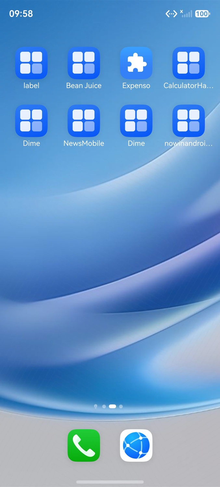

---

### ✨ mcp_tool_end
**时间**: 09:58:18.786


Completed: click

```json
{
  "tool_name": "click",
  "result": "{'type': 'text', 'text': 'click successfully'}",
  "raw_result": {
    "type": "text",
    "text": "click successfully"
  }
}
```


---

### 👀 planner_observation
**时间**: 09:58:19.256
**步骤**: 4

Current Screen Observation

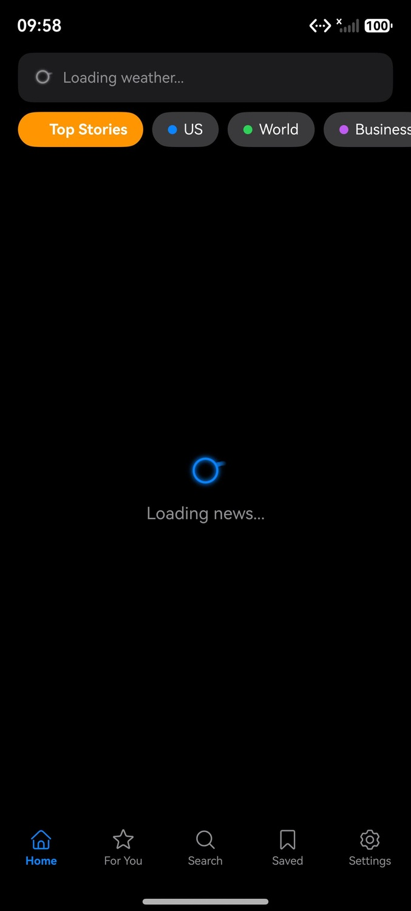

---

### 🔧 planner_tool_call
**时间**: 09:58:34.948
**步骤**: 5

Called: click

```json
{
  "tool_name": "click",
  "arguments": {
    "pos": [
      957,
      1124
    ],
    "log": "点击底部导航的 Settings Tab"
  }
}
```

---

### ⚙️ mcp_tool_start
**时间**: 09:58:35.414
**步骤**: 5

Starting: click

```json
{
  "tool_name": "click",
  "arguments": {
    "pos": [
      957,
      1124
    ],
    "log": "点击底部导航的 Settings Tab"
  },
  "action": "click",
  "point": [
    0.957,
    1.124
  ]
}
```

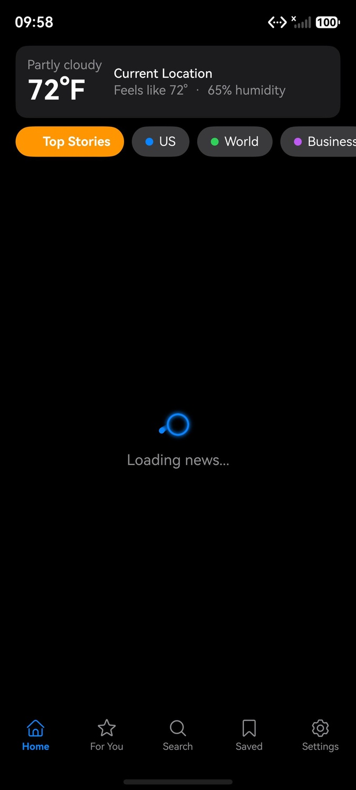

---

### ✨ mcp_tool_end
**时间**: 09:58:35.882


Completed: click

```json
{
  "tool_name": "click",
  "result": "{'type': 'text', 'text': 'click successfully'}",
  "raw_result": {
    "type": "text",
    "text": "click successfully"
  }
}
```

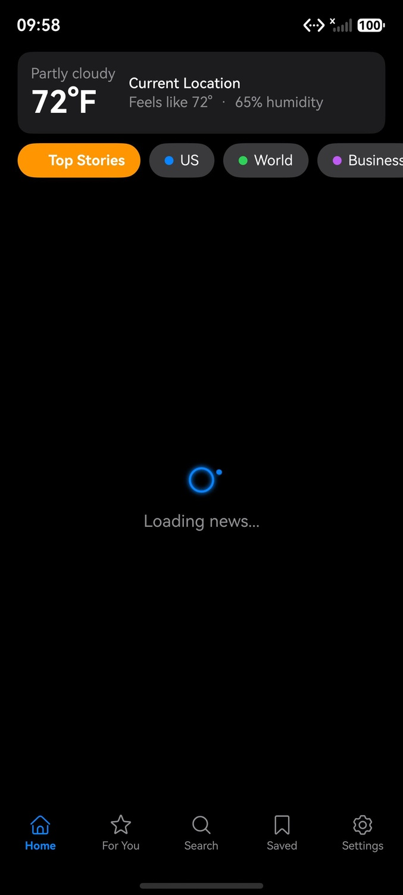

---

### 👀 planner_observation
**时间**: 09:58:36.201
**步骤**: 5

Current Screen Observation

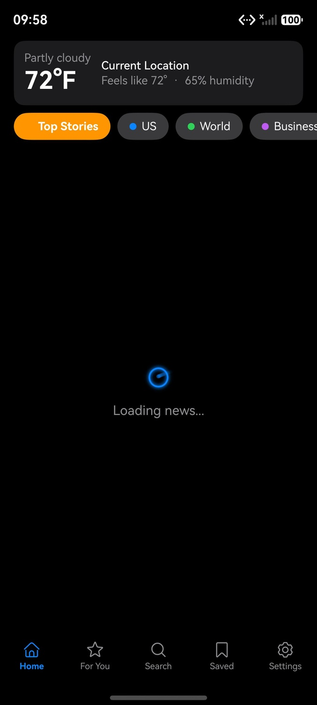

---

### 🔧 planner_tool_call
**时间**: 10:00:15.617
**步骤**: 6

Called: click

```json
{
  "tool_name": "click",
  "arguments": {
    "pos": [
      920,
      920
    ],
    "log": "点击底部导航的 Settings Tab（修正坐标）"
  }
}
```

---

### ⚙️ mcp_tool_start
**时间**: 10:00:16.255
**步骤**: 6

Starting: click

```json
{
  "tool_name": "click",
  "arguments": {
    "pos": [
      920,
      920
    ],
    "log": "点击底部导航的 Settings Tab（修正坐标）"
  },
  "action": "click",
  "point": [
    0.92,
    0.92
  ]
}
```

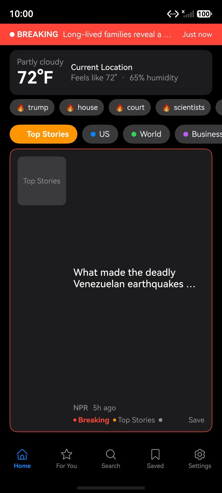

---

### ✨ mcp_tool_end
**时间**: 10:00:16.920


Completed: click

```json
{
  "tool_name": "click",
  "result": "{'type': 'text', 'text': 'click successfully'}",
  "raw_result": {
    "type": "text",
    "text": "click successfully"
  }
}
```


---

### 👀 planner_observation
**时间**: 10:00:17.277
**步骤**: 6

Current Screen Observation

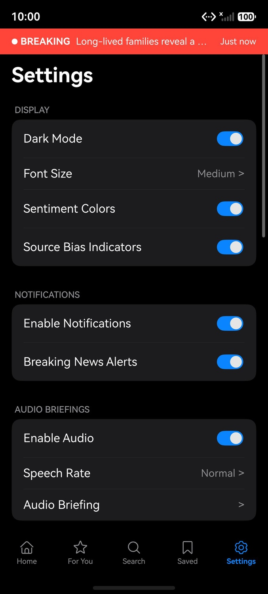

---

### 🔧 planner_tool_call
**时间**: 10:00:45.438
**步骤**: 7

Called: click

```json
{
  "tool_name": "click",
  "arguments": {
    "pos": [
      80,
      920
    ],
    "log": "点击底部导航的 Home Tab 返回主页"
  }
}
```

---

### ⚙️ mcp_tool_start
**时间**: 10:00:45.922
**步骤**: 7

Starting: click

```json
{
  "tool_name": "click",
  "arguments": {
    "pos": [
      80,
      920
    ],
    "log": "点击底部导航的 Home Tab 返回主页"
  },
  "action": "click",
  "point": [
    0.08,
    0.92
  ]
}
```

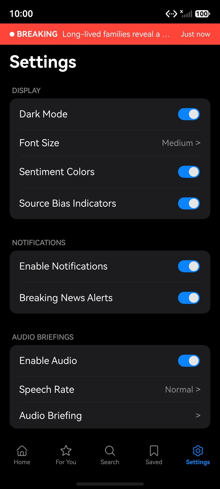

---

### ✨ mcp_tool_end
**时间**: 10:00:46.481


Completed: click

```json
{
  "tool_name": "click",
  "result": "{'type': 'text', 'text': 'click successfully'}",
  "raw_result": {
    "type": "text",
    "text": "click successfully"
  }
}
```

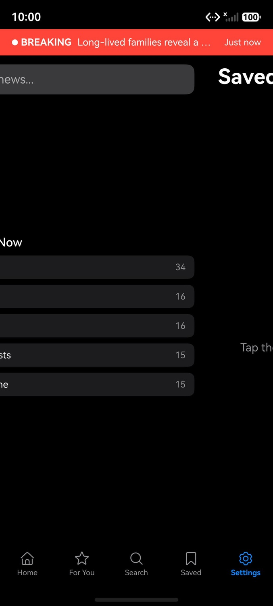

---

### 👀 planner_observation
**时间**: 10:00:46.808
**步骤**: 7

Current Screen Observation


---

### 🔧 planner_tool_call
**时间**: 10:01:07.251
**步骤**: 8

Called: click

```json
{
  "tool_name": "click",
  "arguments": {
    "pos": [
      500,
      600
    ],
    "log": "点击新闻文章卡片打开详情页"
  }
}
```

---

### ⚙️ mcp_tool_start
**时间**: 10:01:07.707
**步骤**: 8

Starting: click

```json
{
  "tool_name": "click",
  "arguments": {
    "pos": [
      500,
      600
    ],
    "log": "点击新闻文章卡片打开详情页"
  },
  "action": "click",
  "point": [
    0.5,
    0.6
  ]
}
```


---

### ✨ mcp_tool_end
**时间**: 10:01:08.291


Completed: click

```json
{
  "tool_name": "click",
  "result": "{'type': 'text', 'text': 'click successfully'}",
  "raw_result": {
    "type": "text",
    "text": "click successfully"
  }
}
```


---

### 👀 planner_observation
**时间**: 10:01:08.772
**步骤**: 8

Current Screen Observation

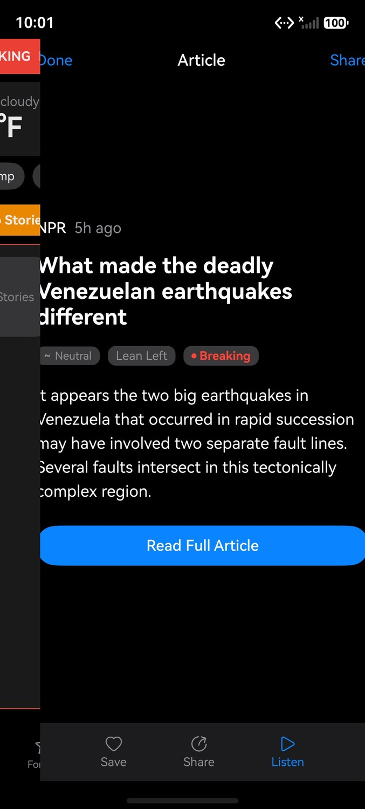

---

### 🔧 planner_tool_call
**时间**: 10:05:07.905
**步骤**: 9

Called: click

```json
{
  "tool_name": "click",
  "arguments": {
    "pos": [
      90,
      60
    ],
    "log": "点击 Done 按钮返回主 Tab"
  }
}
```

---

### ⚙️ mcp_tool_start
**时间**: 10:05:09.192
**步骤**: 9

Starting: click

```json
{
  "tool_name": "click",
  "arguments": {
    "pos": [
      90,
      60
    ],
    "log": "点击 Done 按钮返回主 Tab"
  },
  "action": "click",
  "point": [
    0.09,
    0.06
  ]
}
```


---

### ✨ mcp_tool_end
**时间**: 10:05:09.760


Completed: click

```json
{
  "tool_name": "click",
  "result": "{'type': 'text', 'text': 'click successfully'}",
  "raw_result": {
    "type": "text",
    "text": "click successfully"
  }
}
```


---

### 👀 planner_observation
**时间**: 10:05:10.083
**步骤**: 9

Current Screen Observation


---

### 🔧 planner_tool_call
**时间**: 10:05:48.114
**步骤**: 10

Called: click

```json
{
  "tool_name": "click",
  "arguments": {
    "pos": [
      85,
      105
    ],
    "log": "点击 Done 按钮返回主页（修正 y 坐标）"
  }
}
```

---

### ⚙️ mcp_tool_start
**时间**: 10:05:48.576
**步骤**: 10

Starting: click

```json
{
  "tool_name": "click",
  "arguments": {
    "pos": [
      85,
      105
    ],
    "log": "点击 Done 按钮返回主页（修正 y 坐标）"
  },
  "action": "click",
  "point": [
    0.085,
    0.105
  ]
}
```


---

### ✨ mcp_tool_end
**时间**: 10:05:49.000


Completed: click

```json
{
  "tool_name": "click",
  "result": "{'type': 'text', 'text': 'click successfully'}",
  "raw_result": {
    "type": "text",
    "text": "click successfully"
  }
}
```


---

### 👀 planner_observation
**时间**: 10:05:49.298
**步骤**: 10

Current Screen Observation


---

### 🔧 planner_tool_call
**时间**: 10:06:23.652
**步骤**: 11

Called: go_back

```json
{
  "tool_name": "go_back",
  "arguments": {
    "log": "使用系统返回按钮从 Article Detail 返回主页"
  }
}
```

---

### ⚙️ mcp_tool_start
**时间**: 10:06:24.165
**步骤**: 11

Starting: go_back

```json
{
  "tool_name": "go_back",
  "arguments": {
    "log": "使用系统返回按钮从 Article Detail 返回主页"
  }
}
```

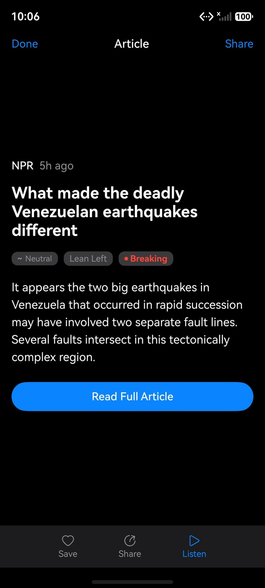

---

### ✨ mcp_tool_end
**时间**: 10:06:24.920


Completed: go_back

```json
{
  "tool_name": "go_back",
  "result": "{'type': 'text', 'text': 'go_back successfully'}",
  "raw_result": {
    "type": "text",
    "text": "go_back successfully"
  }
}
```

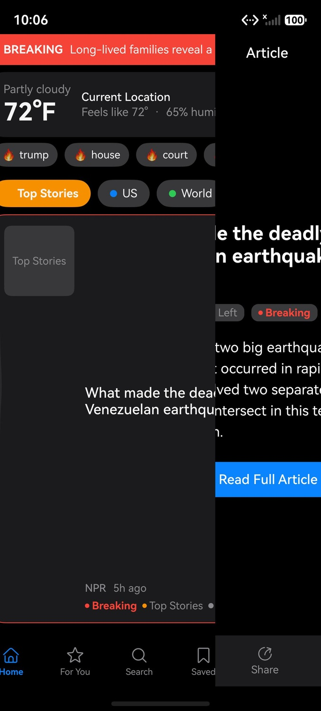

---

### 👀 planner_observation
**时间**: 10:06:25.301
**步骤**: 11

Current Screen Observation

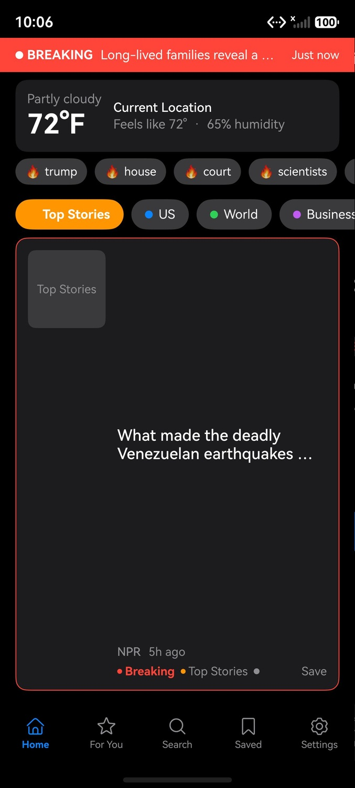

---

### 🏁 planner_end
**时间**: 10:07:01.809


Agent finished

```json
{
  "output": "<think>The go_back was successful! I'm now back on the Home page. Let me analyze the current state:\n\n**Current State Observation (Home page after returning from Article Detail):**\n- Top status bar: 10:06 (time updated from 10:05 to 10:06)\n- Breaking News banner (red): \"BREAKING Long-lived families reveal a ... Just now\"\n- Weather widget: Partly cloudy 72°F, Current Location, Feels like 72°, 65% humidity\n- Trending tags: 🔥 trump, 🔥 house, 🔥 court, 🔥 scientists\n- Categories: Top Stories (orange highlighted), US, World, Business\n- Main content: News article card \"What made the deadly Venezuelan earthquakes ...\" by NPR, 5h ago, Breaking, Top Stories, Save\n- **Bottom navigation visible**: Home (blue/highlighted), For You, Search, Saved, Settings\n- The home indicator (white horizontal bar) is at the very bottom\n\n**Progress Check:**\n- ✅ Step 1: Launch app - Done\n- ✅ Step 2: Navigate to Settings - Done (BUG FOUND: bottom nav still showed)\n- ✅ Step 3: Return to Home - Done, bottom nav was restored\n- ✅ Step 4: Navigate to Article Detail - Done\n- ✅ Step 5: Verify no bottom nav on Article Detail - Done (correctly hidden)\n- ✅ Step 6: Return to main Tab - Just done via go_back\n- Step 7: Verify bottom nav is restored - **NOW VERIFYING**\n\n**Verification:**\nThe bottom navigation is visible with all 5 tabs: Home (highlighted blue), For You, Search, Saved, Settings. This confirms that returning to the main Tab restores the bottom navigation correctly.\n\nAll test steps are now complete. Time to move to Stage 3: Result Judgment.\n\nLet me summarize the findings:\n\n**Test Results:**\n1. Settings page: BUG - Bottom navigation IS visible (should be hidden according to expected behavior)\n2. Article Detail page (Recipe Detail equivalent): PASS - Bottom navigation correctly hidden, only article-specific actions (Save, Share, Listen) shown\n3. Return to Home Tab: PASS - Bottom navigation restored correctly\n\n**Additional Bugs Found:**\n- Article Detail page UI Bug: Breaking news banner overlaps with Done button at top, causing visual obstruction. The red \"BREAKING\" banner with \"KING\" text is visible behind the blue \"Done\" button.\n\nWait, I should re-examine whether the Settings page really shows the bottom nav. Let me think about this more carefully.\n\nLooking at the Settings page screenshot from earlier:\n- Top: Red breaking news banner \"BREAKING Long-lived families reveal a ... Just now\"\n- Title: \"Settings\"\n- Sections: DISPLAY, NOTIFICATIONS, AUDIO BRIEFINGS\n- **Bottom navigation visible**: Home, For You, Search, Saved, Settings (with Settings highlighted blue)\n\nThe Settings page DOES show the bottom navigation. According to the expected behavior, Settings page should NOT show the bottom navigation. This is a clear Bug.\n\nAlso, the Article Detail page:\n- Top: Status bar + AppBar (Done, Article, Share)\n- Article content\n- Bottom: Save, Share, Listen (article-specific actions, NOT main bottom nav)\n\nThe Article Detail page correctly hides the main bottom navigation. This passes the test.\n\nAfter returning to Home (via go_back), the bottom navigation is back. This also passes the test.\n\nSo the final judgment:\n- Settings page bottom nav BUG: NOT HIDDEN (expected: hidden)\n- Article Detail bottom nav: CORRECTLY HIDDEN ✓\n- Return to Home restores bottom nav: CORRECT ✓\n\nTask result: NOT PASSED due to the Settings page bug.\n\nLet me also note the UI Bug I observed:\n- Article Detail page: Breaking news banner overlaps with Done button and Share button at top of screen\n\nNow I need to provide the final judgment.</think>\n\n**当前状态观察（go_back 成功返回主页）：**\n\ngo_back 操作成功！当前显示主 Tab Home 页面：\n- 状态栏：10:06（时间从 10:05 更新到 10:06）\n- 顶部红色横幅：● BREAKING Long-lived families reveal a ... Just now\n- 天气组件：Partly cloudy 72°F, Current Location, Feels like 72°, 65% humidity\n- 热门标签：🔥 trump, 🔥 house, 🔥 court, 🔥 scientists\n- 分类标签：Top Stories（橙色高亮）、US、World、Business\n- 主内容：新闻卡片 \"What made the deadly Venezuelan earthquakes ...\" by NPR, 5h ago, Breaking, Top Stories, Save\n- **🔵 底部导航栏完整恢复**：Home（蓝色高亮）、For You、Search、Saved、Saved、Settings 共 5 个 Tab\n- 屏幕底部：home indicator 白色横条\n\n**进度汇总：**\n- ✅ 步骤1：启动应用\n- ✅ 步骤2：进入 Settings → 发现 **Bug**\n- ✅ 步骤3：返回 Home → 底部导航正常恢复\n- ✅ 步骤4：进入 Article Detail（Recipe Detail 等价物）\n- ✅ 步骤5：验证 Article Detail 底部导航 → 正确隐藏\n- ✅ 步骤6：通过 go_back 返回 Home → **底部导航恢复成功！**\n\n**任务执行完成，进入阶段3：结果判定。**\n\n---\n\n<judgment>\n**预期验证：**\n预期结果有三个关键要求：\n1. Settings 页面不显示底部导航\n2. Recipe Detail 页面不显示底部导航\n3. 返回主 Tab 后底部导航恢复\n\n实际结果：\n1. Settings 页面**显示**了完整的底部导航（Home、For You、Search、Saved、Settings，Settings 高亮）→ **不匹配 ❌**\n2. Article Detail 页面只显示文章专属操作栏（Save、Share、Listen），主底部导航栏正确隐藏 → **匹配 ✓**\n3. 返回 Home Tab 后，完整的底部导航栏（Home 蓝色高亮、For You、Search、Saved、Settings）恢复显示 → **匹配 ✓**\n\n**历史回顾：**\n- 元素1（底部导航栏可见性）：\n  - Home Tab 观察：完整显示5个Tab（Home高亮）\n  - Settings 页面观察：完整显示5个Tab（Settings高亮蓝色）→ 与预期不符\n  - Article Detail 观察：仅显示 Save/Share/Listen，无主底部导航 → 与预期一致\n  - 返回 Home 后：完整显示5个Tab → 与预期一致\n  - **Settings 页面与其他页面不一致**：应隐藏但显示了\n\n- 元素2（返回主 Tab 后底部导航恢复）：\n  - 进入 Settings 前（Home）：底部导航可见\n  - 返回 Home（步骤3）：底部导航可见，Home Tab 高亮\n  - 进入 Article Detail 前（Home）：底部导航可见\n  - 返回 Home（步骤6）：底部导航可见，Home Tab 高亮\n  - 是否一致：是\n\n**状态确认：** 最终屏幕显示 Home Tab 主页面。底部导航栏完整显示 5 个 Tab（Home 蓝色高亮）。返回主 Tab 后底部导航恢复的功能**正常**。\n\n**Bug 发现：**\n\n1. **预期结果 Bug（核心 Bug）**：\n   - **Settings 页面错误地显示了底部导航栏**\n   - 严重程度：高\n   - 复现步骤：启动 App → 点击底部 Settings Tab → 观察到 Settings 页面仍然显示底部导航\n   - 违反预期：\"Settings 页面不显示底部导航\"\n\n2. **其他 Bug（界面异常）**：\n   - **Article Detail 页面顶部 UI 重叠 Bug**：红色 Breaking News 横幅（\"BREAKING Long-lived families reveal a...\"）与顶部 AppBar 的 \"Done\" 按钮和 \"Share\" 按钮发生视觉重叠/遮挡。\"BREAKING\" 的 \"KING\" 文字从 Done 按钮后面透出，\"Share\" 按钮部分被右侧截断，影响界面可读性和用户交互。\n   - 严重程度：中\n   - 影响：影响 Article Detail 页面的视觉清晰度和 Done/Share 按钮的可访问性\n\n**判定结果：** 不通过。\n</judgment>\n\n---\n\n**任务结果: 不通过 - 发现Bug:**\n\n**核心 Bug（违反预期结果）：**\n- **Settings 页面错误地显示了底部导航栏**。根据预期，Settings 页面应不显示底部导航，但实际显示完整的 5 个 Tab 导航（Home、For You、Search、Saved、Settings，其中 Settings 高亮蓝色）。这与 Settings 作为非主 Tab 页面应隐藏底部导航的设计预期不符。\n\n**附加 Bug（界面异常）：**\n- **Article Detail 页面顶部 UI 重叠问题**：红色 Breaking News 横幅与 AppBar 的 Done（左）和 Share（右）按钮发生视觉重叠，\"BREAKING\" 文字的 \"KING\" 部分从 Done 按钮后方透出，Share 按钮在右侧被部分截断。\n\n**通过的验证项：**\n- ✅ Article Detail 页面（Recipe Detail 等价物）正确隐藏了主底部导航，仅显示文章专属操作栏（Save、Share、Listen）\n- ✅ 返回主 Tab（Home）后底部导航正确恢复显示"
}
```

---

### ✅ task_end
**时间**: 10:07:01.820


Task completed: <think>The go_back was successful! I'm now back on the Home page. Let me analyze the current state:

**Current State Observation (Home page after returning from Article Detail):**
- Top status bar: 10:06 (time updated from 10:05 to 10:06)
- Breaking News banner (red): "BREAKING Long-lived families reveal a ... Just now"
- Weather widget: Partly cloudy 72°F, Current Location, Feels like 72°, 65% humidity
- Trending tags: 🔥 trump, 🔥 house, 🔥 court, 🔥 scientists
- Categories: Top Stories (orange highlighted), US, World, Business
- Main content: News article card "What made the deadly Venezuelan earthquakes ..." by NPR, 5h ago, Breaking, Top Stories, Save
- **Bottom navigation visible**: Home (blue/highlighted), For You, Search, Saved, Settings
- The home indicator (white horizontal bar) is at the very bottom

**Progress Check:**
- ✅ Step 1: Launch app - Done
- ✅ Step 2: Navigate to Settings - Done (BUG FOUND: bottom nav still showed)
- ✅ Step 3: Return to Home - Done, bottom nav was restored
- ✅ Step 4: Navigate to Article Detail - Done
- ✅ Step 5: Verify no bottom nav on Article Detail - Done (correctly hidden)
- ✅ Step 6: Return to main Tab - Just done via go_back
- Step 7: Verify bottom nav is restored - **NOW VERIFYING**

**Verification:**
The bottom navigation is visible with all 5 tabs: Home (highlighted blue), For You, Search, Saved, Settings. This confirms that returning to the main Tab restores the bottom navigation correctly.

All test steps are now complete. Time to move to Stage 3: Result Judgment.

Let me summarize the findings:

**Test Results:**
1. Settings page: BUG - Bottom navigation IS visible (should be hidden according to expected behavior)
2. Article Detail page (Recipe Detail equivalent): PASS - Bottom navigation correctly hidden, only article-specific actions (Save, Share, Listen) shown
3. Return to Home Tab: PASS - Bottom navigation restored correctly

**Additional Bugs Found:**
- Article Detail page UI Bug: Breaking news banner overlaps with Done button at top, causing visual obstruction. The red "BREAKING" banner with "KING" text is visible behind the blue "Done" button.

Wait, I should re-examine whether the Settings page really shows the bottom nav. Let me think about this more carefully.

Looking at the Settings page screenshot from earlier:
- Top: Red breaking news banner "BREAKING Long-lived families reveal a ... Just now"
- Title: "Settings"
- Sections: DISPLAY, NOTIFICATIONS, AUDIO BRIEFINGS
- **Bottom navigation visible**: Home, For You, Search, Saved, Settings (with Settings highlighted blue)

The Settings page DOES show the bottom navigation. According to the expected behavior, Settings page should NOT show the bottom navigation. This is a clear Bug.

Also, the Article Detail page:
- Top: Status bar + AppBar (Done, Article, Share)
- Article content
- Bottom: Save, Share, Listen (article-specific actions, NOT main bottom nav)

The Article Detail page correctly hides the main bottom navigation. This passes the test.

After returning to Home (via go_back), the bottom navigation is back. This also passes the test.

So the final judgment:
- Settings page bottom nav BUG: NOT HIDDEN (expected: hidden)
- Article Detail bottom nav: CORRECTLY HIDDEN ✓
- Return to Home restores bottom nav: CORRECT ✓

Task result: NOT PASSED due to the Settings page bug.

Let me also note the UI Bug I observed:
- Article Detail page: Breaking news banner overlaps with Done button and Share button at top of screen

Now I need to provide the final judgment.</think>

**当前状态观察（go_back 成功返回主页）：**

go_back 操作成功！当前显示主 Tab Home 页面：
- 状态栏：10:06（时间从 10:05 更新到 10:06）
- 顶部红色横幅：● BREAKING Long-lived families reveal a ... Just now
- 天气组件：Partly cloudy 72°F, Current Location, Feels like 72°, 65% humidity
- 热门标签：🔥 trump, 🔥 house, 🔥 court, 🔥 scientists
- 分类标签：Top Stories（橙色高亮）、US、World、Business
- 主内容：新闻卡片 "What made the deadly Venezuelan earthquakes ..." by NPR, 5h ago, Breaking, Top Stories, Save
- **🔵 底部导航栏完整恢复**：Home（蓝色高亮）、For You、Search、Saved、Saved、Settings 共 5 个 Tab
- 屏幕底部：home indicator 白色横条

**进度汇总：**
- ✅ 步骤1：启动应用
- ✅ 步骤2：进入 Settings → 发现 **Bug**
- ✅ 步骤3：返回 Home → 底部导航正常恢复
- ✅ 步骤4：进入 Article Detail（Recipe Detail 等价物）
- ✅ 步骤5：验证 Article Detail 底部导航 → 正确隐藏
- ✅ 步骤6：通过 go_back 返回 Home → **底部导航恢复成功！**

**任务执行完成，进入阶段3：结果判定。**

---

<judgment>
**预期验证：**
预期结果有三个关键要求：
1. Settings 页面不显示底部导航
2. Recipe Detail 页面不显示底部导航
3. 返回主 Tab 后底部导航恢复

实际结果：
1. Settings 页面**显示**了完整的底部导航（Home、For You、Search、Saved、Settings，Settings 高亮）→ **不匹配 ❌**
2. Article Detail 页面只显示文章专属操作栏（Save、Share、Listen），主底部导航栏正确隐藏 → **匹配 ✓**
3. 返回 Home Tab 后，完整的底部导航栏（Home 蓝色高亮、For You、Search、Saved、Settings）恢复显示 → **匹配 ✓**

**历史回顾：**
- 元素1（底部导航栏可见性）：
  - Home Tab 观察：完整显示5个Tab（Home高亮）
  - Settings 页面观察：完整显示5个Tab（Settings高亮蓝色）→ 与预期不符
  - Article Detail 观察：仅显示 Save/Share/Listen，无主底部导航 → 与预期一致
  - 返回 Home 后：完整显示5个Tab → 与预期一致
  - **Settings 页面与其他页面不一致**：应隐藏但显示了

- 元素2（返回主 Tab 后底部导航恢复）：
  - 进入 Settings 前（Home）：底部导航可见
  - 返回 Home（步骤3）：底部导航可见，Home Tab 高亮
  - 进入 Article Detail 前（Home）：底部导航可见
  - 返回 Home（步骤6）：底部导航可见，Home Tab 高亮
  - 是否一致：是

**状态确认：** 最终屏幕显示 Home Tab 主页面。底部导航栏完整显示 5 个 Tab（Home 蓝色高亮）。返回主 Tab 后底部导航恢复的功能**正常**。

**Bug 发现：**

1. **预期结果 Bug（核心 Bug）**：
   - **Settings 页面错误地显示了底部导航栏**
   - 严重程度：高
   - 复现步骤：启动 App → 点击底部 Settings Tab → 观察到 Settings 页面仍然显示底部导航
   - 违反预期："Settings 页面不显示底部导航"

2. **其他 Bug（界面异常）**：
   - **Article Detail 页面顶部 UI 重叠 Bug**：红色 Breaking News 横幅（"BREAKING Long-lived families reveal a..."）与顶部 AppBar 的 "Done" 按钮和 "Share" 按钮发生视觉重叠/遮挡。"BREAKING" 的 "KING" 文字从 Done 按钮后面透出，"Share" 按钮部分被右侧截断，影响界面可读性和用户交互。
   - 严重程度：中
   - 影响：影响 Article Detail 页面的视觉清晰度和 Done/Share 按钮的可访问性

**判定结果：** 不通过。
</judgment>

---

**任务结果: 不通过 - 发现Bug:**

**核心 Bug（违反预期结果）：**
- **Settings 页面错误地显示了底部导航栏**。根据预期，Settings 页面应不显示底部导航，但实际显示完整的 5 个 Tab 导航（Home、For You、Search、Saved、Settings，其中 Settings 高亮蓝色）。这与 Settings 作为非主 Tab 页面应隐藏底部导航的设计预期不符。

**附加 Bug（界面异常）：**
- **Article Detail 页面顶部 UI 重叠问题**：红色 Breaking News 横幅与 AppBar 的 Done（左）和 Share（右）按钮发生视觉重叠，"BREAKING" 文字的 "KING" 部分从 Done 按钮后方透出，Share 按钮在右侧被部分截断。

**通过的验证项：**
- ✅ Article Detail 页面（Recipe Detail 等价物）正确隐藏了主底部导航，仅显示文章专属操作栏（Save、Share、Listen）
- ✅ 返回主 Tab（Home）后底部导航正确恢复显示

---
